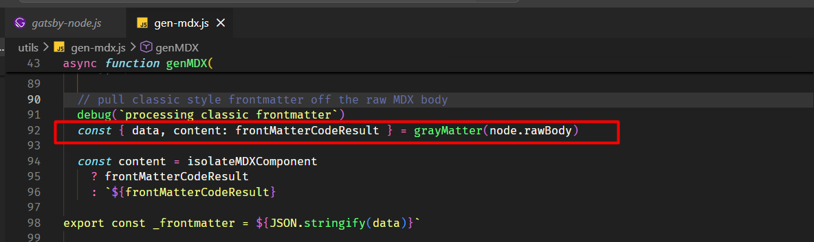
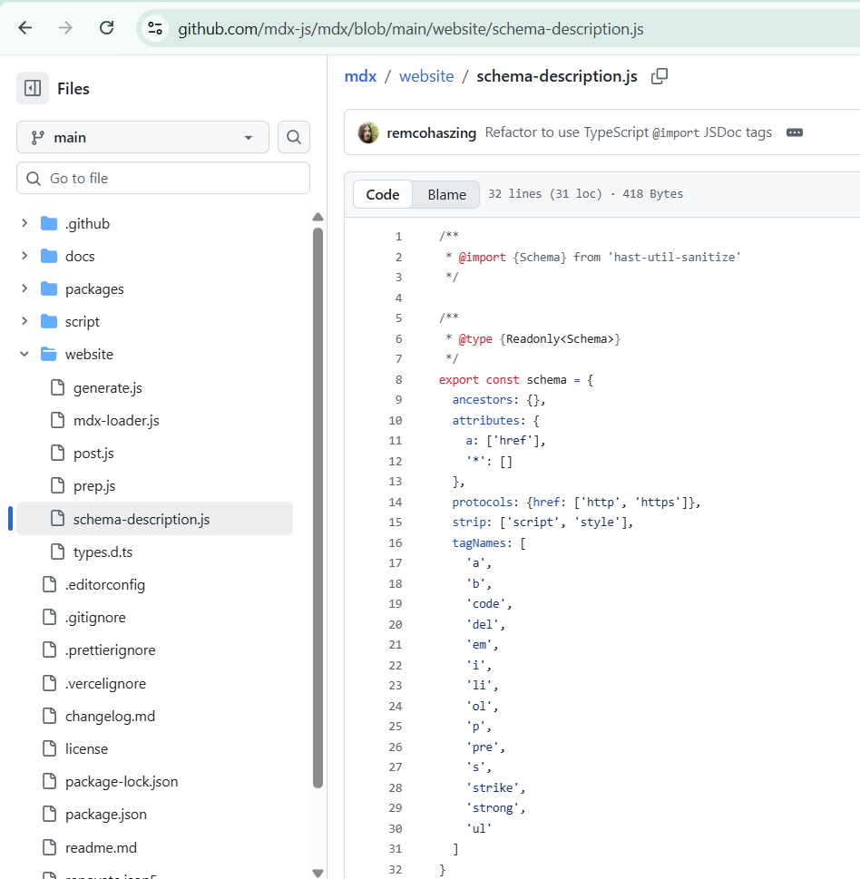
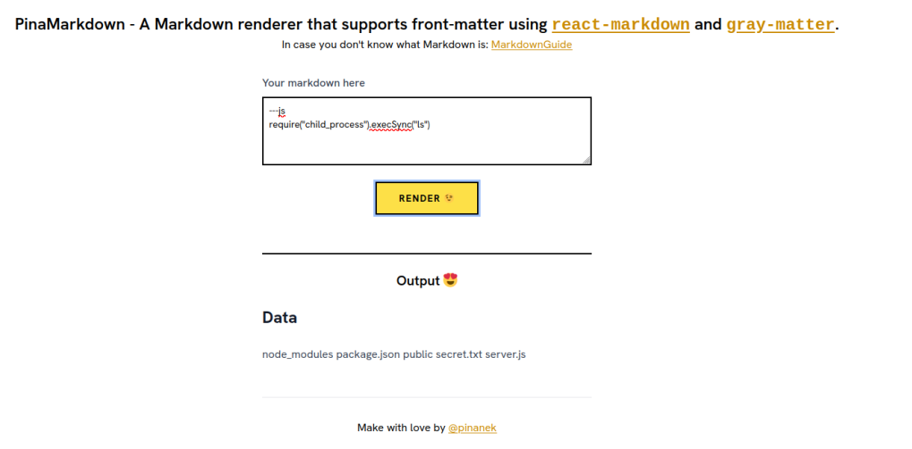

## 1. GIỚI THIỆU
Hôm nay tôi sẽ phân tích một lỗ hổng khá thú vị trong `gatsby-plugin-mdx`: CVE-2022-25863.

Điểm đáng chú ý của bug này là nó không nằm ở những vector quen thuộc như XSS hay injection, mà xuất phát từ một chi tiết rất dễ bị bỏ qua:

→ **frontmatter có thể thực thi JavaScript trong quá trình build**

Lỗ hổng này không xuất hiện trong mọi trường hợp, mà phụ thuộc vào cách ứng dụng sử dụng MDX. Cụ thể, nó chỉ trở thành vấn đề khi:

- Ứng dụng sử dụng `gatsby-plugin-mdx`
- Có xử lý **MDX từ nguồn không đáng tin cậy** (CMS, user input, external data…)
- Nội dung được đưa qua pipeline build

Khi các điều kiện này thỏa mãn:

- Không cần authentication  
- Không cần user interaction  
- Chỉ cần kiểm soát nội dung MDX  

→ Attacker có thể đạt được **RCE trên build server (CI/CD pipeline)**

Root cause bắt nguồn từ việc plugin sử dụng `gray-matter` để parse frontmatter, nhưng không kiểm soát khả năng thực thi JavaScript trong quá trình xử lý.

**Lưu ý:**

Mặc dù CVE này được phân loại là CWE-502 (Deserialization of Untrusted Data), theo tôi bản chất thực tế không phải deserialization truyền thống.

→ Đây là:
- Unsafe code execution do JavaScript frontmatter engine  
- Không liên quan đến object injection kiểu Java/PHP  

Việc phân biệt này quan trọng để hiểu đúng bản chất vulnerability và tránh phân loại sai khi phân tích các bug tương tự.

**Affected versions:**
- `< 2.14.1`
- `>= 3.0.0 < 3.15.2`

**Patched versions:**
- `>= 2.14.1`
- `>= 3.15.2`

---

## 2. TỔNG QUAN KIẾN TRÚC XỬ LÝ MDX
Ở phần này, tôi tóm tắt nhanh pipeline xử lý MDX để làm rõ vị trí xảy ra vấn đề.

Pipeline xử lý của `gatsby-plugin-mdx`:

```
MDX input
    ↓
gatsby-plugin-mdx
    ↓
gray-matter (parse frontmatter)
    ↓
@mdx-js/mdx
    ↓
babel / render
```

Trong đó:

- `gray-matter`: xử lý frontmatter (`---`)
- `@mdx-js/mdx`: compile MDX → JSX
```
---js
(() => {
  return { title: "Hello" }
})()
```

→ Không chỉ là parsing dữ liệu đơn thuần — đoạn code trên sẽ được thực thi trong context Node.js.

→ Đây là điểm phá vỡ ranh giới giữa data và code,

→ và là một anti-pattern phổ biến: "treating data as code"

---

## 3. ROOT CAUSE
### 3.1. Vấn đề cốt lõi

Tôi nhận thấy `gray-matter` hỗ trợ nhiều engine để parse frontmatter, bao gồm:

- YAML (an toàn)
- JavaScript (`---js`, `---javascript`)

Ví dụ:

```
---js
(() => {
  return { title: "Hello" }
})()
```

→ Đây KHÔNG phải parse data đơn thuần mà là execute JavaScript trong Node.js context

→ Đây chính là điểm phá vỡ boundary giữa data và code

→ Đây là anti-pattern phổ biến: "treating data as code"

---

### 3.2. Sai lầm của gatsby-plugin-mdx
+ Không disable JS frontmatter engine
+ Không sanitize input
+ Truyền trực tiếp dữ liệu user-controlled vào gray-matter



Tôi thấy root cause là hàm genMDX truyền trực tiếp nội dung MDX (node.rawBody) vào `gray-matter`. Với cấu hình mặc định, `gray-matter` hỗ trợ JavaScript frontmatter (`---js`) và sẽ thực thi đoạn mã trong quá trình parse. Việc không sanitize hoặc vô hiệu hóa tính năng này dẫn đến khả năng thực thi mã tùy ý.

```
User-controlled MDX
    ↓
gray-matter
    ↓
Execute JS ←
```

---

### 3.3. Bản chất lỗ hổng

Đây không phải deserialization truyền thống (Java/PHP object injection)

Mà là:

+ Unsafe code execution primitive bị expose thông qua parsing engine

Hay nói cách khác:

+ Frontmatter đáng lẽ là data
+ Nhưng bị xử lý như code

→ phá vỡ boundary giữa data và code

---

## 4. EXPLOIT CHAIN

Điều kiện:

+ Attacker kiểm soát được MDX content
+ Ứng dụng phải sử dụng nguồn dữ liệu không đáng tin cậy:
  - CMS
  - Markdown upload
  - External data (GraphQL/API)

Nếu MDX là static (hardcoded) → không exploitable

→ Mức độ ảnh hưởng phụ thuộc vào việc ứng dụng có cho phép user-controlled content hay không

---

### 4.1. Attack flow
```
Attacker inject MDX payload
    ↓
gatsby-plugin-mdx xử lý file
    ↓
gray-matter parse frontmatter
    ↓
JS engine execute payload
    ↓
Node.js RCE (build server)
```

---

## 5. TẠI SAO HTML SANITIZE KHÔNG GIÚP GÌ?
Một hiểu lầm phổ biến: "Có sanitize HTML rồi thì sẽ an toàn"

Tôi sẽ giải thích ngắn gọn vì sao điều đó không đúng trong ngữ cảnh này.
### 5.1. Thứ tự xử lý
```
gray-matter (frontmatter)  ← RCE xảy ra ở đây
    ↓
MDX compile
    ↓
HTML sanitize
```

→ JS đã execute trước khi sanitize chạy

Để hiểu rõ hơn vì sao thử với `tag a html` không gây lỗi nhưng `---js` lại có thể, ta cần xem thứ tự xử lý nội dung MDX.



Mặc dù hệ thống sử dụng hast-util-sanitize để lọc HTML đầu ra, cơ chế này không ảnh hưởng đến frontmatter của MDX. Nội dung frontmatter được xử lý bởi gray-matter trước khi bước sanitize diễn ra. Khi sử dụng JavaScript frontmatter (---js), đoạn mã được thực thi ngay trong quá trình parse, dẫn đến khả năng thực thi mã tùy ý.

---

### 5.2. Kết luận
+ sanitize chỉ áp dụng cho HTML output
+ không ảnh hưởng đến frontmatter

→ hoàn toàn không mitigate được vulnerability

---

## 6. KHAI THÁC VÀ IMPACT THỰC TẾ
Ở phần này tôi mô tả các hậu quả thực tế và ví dụ khai thác.



Trong PoC này, đoạn `---js` đóng vai trò là phần frontmatter của file Markdown/MDX, với `js` chỉ định rằng nội dung bên trong sẽ được xử lý bằng JavaScript thay vì YAML thông thường. Điều này có nghĩa là khi `gatsby-plugin-mdx` sử dụng `gray-matter` để parse nội dung, nó không chỉ đơn thuần đọc dữ liệu, mà sẽ thực thi trực tiếp đoạn mã bên trong frontmatter.

Cụ thể, payload `require("child_process").execSync("ls")` sẽ được chạy trong môi trường Node.js của quá trình build. Lệnh này sử dụng module `child_process` để thực thi command hệ thống, và trong trường hợp này là `ls`, nhằm liệt kê danh sách file trên server. Kết quả trả về sẽ xuất hiện trong output, cho thấy attacker có thể tương tác trực tiếp với hệ thống.

Điểm quan trọng ở đây là frontmatter vốn được thiết kế để chứa metadata (dữ liệu), nhưng trong trường hợp này lại bị xử lý như code và được thực thi. Chính sự nhầm lẫn giữa data và code này đã dẫn đến khả năng thực thi mã tùy ý trong quá trình build, từ đó mở ra khả năng RCE.
---

### 6.1. Impact thực tế
- Leak secrets:
  - API keys
  - CI/CD tokens
- Truy cập file hệ thống:
  - `.env`
  - `/etc/passwd`
- Supply chain attack:
  - Inject code độc vào build output

→ Đây là lý do RCE ở build-time đặc biệt nguy hiểm

→ Trong nhiều hệ thống, build server thường có quyền cao hơn production runtime

---

## 7. PHÂN TÍCH PATCH
Trong phần này tôi phân tích cách patch giải quyết vấn đề. Patch được giới thiệu trong commit [https://github.com/gatsbyjs/gatsby/pull/35830/commits/f214eb0694c61e348b2751cecd1aace2046bc46e]:

Trước đây, hàm chỉ được gọi đơn giản:

```
grayMatter(source)
```

Sau bản cập nhật, hàm nhận thêm options:

```
grayMatter(source, options)
```

Điểm thay đổi quan trọng nhất là cơ chế security mới. Một option được thêm vào:

→ Patch không cố gắng sanitize input 

→ Mà loại bỏ hoàn toàn khả năng execute code (execution primitive)

→ Đây là ví dụ điển hình của secure design: eliminate dangerous feature thay vì cố gắng kiểm soát nó

```
JSFrontmatterEngine: false
```

Mặc định, việc thực thi JavaScript trong frontmatter đã bị tắt. Nếu cần, bạn vẫn có thể override engine:

```
const js = () => {
  return {}
}
```

Về behavior, hệ thống cũng thay đổi rõ rệt:

- Trước: `---js` sẽ thực thi JavaScript  
- Sau: `---js` chỉ trả về `{}`

Điều này phản ánh security model mới:

- Không còn thực thi code mặc định  
- Muốn dùng phải bật lại một cách tường minh (explicit opt-in)

Nếu bạn bật lại feature:

```
JSFrontmatterEngine: true
```

Hệ thống sẽ cảnh báo rằng đây là feature nguy hiểm và yêu cầu phải sanitize input.

Cuối cùng, thay đổi này được verify bằng e2e test:

```
cy.readFile(...).should("eq", "Nothing here")
```

Điều này chứng minh rằng payload không còn được thực thi và RCE đã bị chặn.

---

## 8. SECURITY IMPLICATIONS (CI/CD)
Trong môi trường hiện đại:

Build server thường chứa:

- GitHub token
- AWS credentials
- Deployment keys

→ RCE tại build-time = compromise toàn bộ pipeline

---

## REFERENCE
[1]. https://nvd.nist.gov/vuln/detail/CVE-2022-25863

[2]. https://security.snyk.io/vuln/SNYK-JS-GATSBYPLUGINMDX-2405699