# Hướng 1: Classic DFA Attack trên AES-128 trong gem5 RISC-V

> `Stack dùng trong pipeline cuối:` gem5 · tiny-AES-c · PhoenixAES · riscv64-linux-gnu-gcc  
> `Mục tiêu:` gây lỗi tại AES Round 9, thu faulty ciphertexts, dùng PhoenixAES recover last round key, rồi kiểm tra Lockstep Defense có chặn ciphertext lỗi trước khi output ra ngoài hay không.  
> `Lưu ý về GemFI:` GemFI/hardware-level injection là hướng ban đầu, nhưng trong log không đi được đến pipeline chạy ổn định. Phần attack cuối cùng dùng source-level fault hook trong `aes.c`, sau đó compile thành RISC-V binary và chạy trong gem5 để sinh ciphertext lỗi.

---

## Mục lục

1. [Tổng quan về DFA Attack](#1-tổng-quan-về-dfa-attack)
2. [Setup môi trường gem5](#2-setup-môi-trường-gem5)
3. [Compile AES cho RISC-V](#3-compile-aes-cho-risc-v)
4. [Chạy AES trong gem5 SE Mode](#4-chạy-aes-trong-gem5-se-mode)
5. [Phân tích disassembly  - tìm fault window](#5-phân-tích-disassembly--tìm-fault-window)
6. [Xác định cycle range của round 9](#6-xác-định-cycle-range-của-round-9)
7. [Approach 1: Checkpoint-based fault injection](#7-approach-1-checkpoint-based-fault-injection)
8. [Vấn đề với checkpoint approach  - debug quá trình](#8-vấn-đề-với-checkpoint-approach--debug-quá-trình)
9. [Approach 2: Source-level fault injection](#9-approach-2-source-level-fault-injection)
10. [Collect 128 faulty ciphertexts](#10-collect-128-faulty-ciphertexts)
11. [PhoenixAES recover round 10 key](#11-phoenixaes-recover-round-10-key)
12. [Recover master key bằng reverse key schedule](#12-recover-master-key-bằng-reverse-key-schedule)
13. [Lockstep Defense  - implement và verify](#13-lockstep-defense--implement-và-verify)
14. [Tổng kết và bài học](#14-tổng-kết-và-bài-học)

---

## 1. Tổng quan về DFA Attack

Differential Fault Analysis (DFA) là một kỹ thuật `active side-channel attack`, trong đó kẻ tấn công `chủ động gây lỗi (fault)` trong quá trình thực thi của thuật toán mật mã thay vì chỉ quan sát hành vi của hệ thống như các tấn công `Power Analysis` hay `Timing Attack`.

Ý tưởng của DFA khá đơn giản:

- Chạy thuật toán bình thường để thu được `ciphertext đúng`.
- Gây một lỗi nhỏ tại một thời điểm xác định trong quá trình mã hóa để tạo ra `ciphertext lỗi`.
- So sánh hai ciphertext này để suy luận thông tin về khóa bí mật.

Đối với AES-128, DFA nổi tiếng của `Piret & Quisquater` tận dụng cách mà sai khác (*difference*) lan truyền qua các vòng mã hóa để khôi phục `Round 10 Key (Last Round Key)`, sau đó sử dụng `Reverse Key Schedule` để tính ngược về `Master Key`.

---

AES-128 gồm `10 rounds`. Mỗi round thực hiện bốn phép biến đổi theo thứ tự:

```text
SubBytes
    ↓
ShiftRows
    ↓
MixColumns
    ↓
AddRoundKey
```

Riêng `Round 10` không thực hiện bước `MixColumns`.

Trong classic DFA, lỗi được chèn `ngay trước SubBytes của Round 9` (hay nói cách khác là sau khi kết thúc Round 8). Khi đó, sai khác chỉ còn đi qua:

- Round 9 (đầy đủ bốn phép biến đổi)
- Round 10 (không có MixColumns)

Điều này tạo ra một mẫu sai khác (*difference pattern*) đặc trưng trên ciphertext cuối cùng. Mẫu sai khác này phụ thuộc trực tiếp vào `Round 10 Key`, vì vậy chỉ cần thu thập đủ số lượng cặp:

```text
(Correct Ciphertext, Faulty Ciphertext)
```

PhoenixAES sẽ khai thác các quan hệ toán học của DFA để khôi phục `Round 10 Key (Last Round Key)`. Sau khi thu được khóa của vòng cuối, chỉ cần thực hiện `Reverse Key Schedule` là có thể tính ngược về `Master Key` của AES-128.

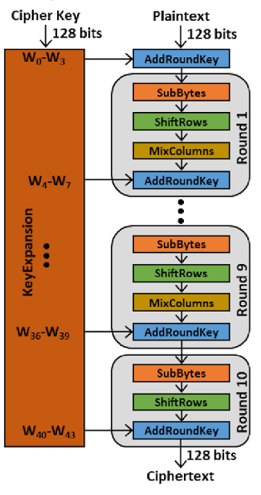

---

## Tại sao lại chọn Round 9?

Đây là câu hỏi quan trọng nhất trong DFA.

Thời điểm gây lỗi quyết định trực tiếp khả năng thành công của cuộc tấn công.

### Gây lỗi quá sớm (Round 1–8)

Nếu fault được đưa vào từ các vòng đầu, sai khác sẽ phải đi qua nhiều lần `MixColumns`.

Do MixColumns có tính chất `diffusion`, một lỗi rất nhỏ ban đầu sẽ nhanh chóng lan ra toàn bộ trạng thái AES.

Ví dụ:

- Ban đầu chỉ có `1 byte` bị lỗi.
- Sau một lần `MixColumns`, lỗi lan sang `4 byte` trong cùng một cột.
- Sau nhiều rounds tiếp theo, gần như toàn bộ `16 byte` của state đều bị ảnh hưởng.

Khi sai khác lan truyền quá rộng, cấu trúc toán học mà DFA dựa vào gần như biến mất, khiến việc khôi phục khóa trở nên rất khó hoặc không còn khả thi.

### Gây lỗi quá muộn (Round 10)

Ngược lại, nếu fault được chèn vào `Round 10` thì ciphertext gần như chỉ bị ảnh hưởng bởi đúng byte bị lỗi.

Do Round 10 `không có MixColumns`, sai khác không được khuếch tán sang các byte khác.

Kết quả là ciphertext chỉ chứa rất ít thông tin về cấu trúc lan truyền của lỗi, không đáp ứng được giả định của thuật toán DFA cổ điển.

### Round 9 là vị trí "vừa đủ"

Round 9 chính là điểm cân bằng giữa hai trường hợp trên.

Lỗi chỉ phải đi qua `một lần MixColumns` trước khi tạo ciphertext cuối cùng.

Nhờ đó:

- Sai khác được khuếch tán vừa đủ để tạo thành mẫu gồm `4 byte liên quan`.
- Mẫu sai khác vẫn giữ được cấu trúc toán học mà thuật toán DFA có thể khai thác.
- Thông tin thu được đủ để PhoenixAES suy luận từng byte của `Round 10 Key`.

Chính vì vậy, phần lớn các nghiên cứu DFA trên AES-128 đều lựa chọn `fault injection tại đầu Round 9`.

---

## Điều kiện để DFA thành công

Để cuộc tấn công hoạt động, cần thỏa mãn ba điều kiện chính:

- Attacker phải đưa fault vào `đúng thời điểm`, tương ứng với `Round 9` của thuật toán.
- Có thể thu thập được cả `ciphertext đúng` và `ciphertext lỗi`.
- Fault model đủ "sạch", thông thường là `single-byte fault` hoặc `single-bit fault` trong trạng thái AES.

Nếu fault quá mạnh hoặc xuất hiện ở vị trí không mong muốn, cấu trúc sai khác sẽ không còn phù hợp với mô hình phân tích của PhoenixAES.

---

## Tại sao sử dụng gem5?

Đây cũng chính là lý do `gem5` được lựa chọn trong bài viết này.

Mặc dù DFA thường được nghiên cứu trên phần cứng thực, gem5 cho phép mô phỏng toàn bộ quá trình thực thi của chương trình trên kiến trúc `RISC-V`, đồng thời cung cấp `instruction trace` và thông tin về số chu kỳ thực thi.

Nhờ đó có thể:

- Xác định chính xác khoảng thời gian tương ứng với từng vòng AES.
- Tiêm lỗi tại đúng vị trí mong muốn.
- Thu thập ciphertext lỗi một cách có kiểm soát.
- Kiểm chứng khả năng khôi phục khóa của PhoenixAES.
- Đánh giá xem cơ chế `Lockstep Defense` có ngăn được việc ciphertext lỗi bị xuất ra ngoài hay không.

Trong bài viết này, fault sẽ được chèn tại `Round 9` của AES thông qua `source-level fault injection`, sau đó chương trình được biên dịch thành `RISC-V binary` và chạy trên `gem5` để sinh ra các faulty ciphertext phục vụ quá trình phân tích bằng `PhoenixAES`.

---

## 2. Setup môi trường gem5

### gem5 là gì?

gem5 là một architectural simulator: nó cho phép chạy binary của một kiến trúc như RISC-V, ARM hoặc x86 trên máy host mà không cần phần cứng thật. Tùy CPU model, gem5 có thể mô phỏng ở các mức chi tiết khác nhau.

Trong bài này, ta dùng `RiscvTimingSimpleCPU`. Đây không phải mô hình vi kiến trúc cycle-accurate tuyệt đối như một CPU thật, nhưng đủ tốt cho mục tiêu của bài: chạy AES RISC-V binary, lấy execution trace ổn định, xác định marker của Round 9, rồi kiểm chứng fault model.

Trong project này, ta dùng gem5 phiên bản 25.1.0.1 với RISC-V backend.

### Verify gem5 đã compile xong

```bash
┌──(clap㉿clap)-[~/Desktop/gem5]
└─$ ./build/RISCV/gem5.opt --version
Usage
=====
  gem5.opt [gem5 options] script.py [script options]

gem5.opt: error: no such option: --version
```

Đây là output bình thường trong log. `gem5.opt` không nhận `--version` như một option hợp lệ, nhưng việc nó in được usage message cho thấy binary đã khởi động được. Bước này chỉ xác nhận gem5 executable không bị lỗi cơ bản; workload AES vẫn cần được kiểm chứng riêng ở các bước sau.

### Cấu trúc gem5 RISC-V build

```
build/RISCV/gem5.opt   ← optimized build, dùng cho production run
build/RISCV/gem5.debug ← debug build, slower nhưng có thêm assertions
build/RISCV/gem5.fast  ← fastest build, bỏ hết assertions
```

Trong log này ta dùng `gem5.opt` vì nó cân bằng giữa tốc độ và khả năng debug. Khi phải chạy hàng trăm lần để thu faulty ciphertexts, dùng bản optimized sẽ thực tế hơn `gem5.debug`.

---

## 3. Compile AES cho RISC-V

### Chọn AES implementation

Ta dùng [tiny-AES-c](https://github.com/kokke/tiny-AES-c)  - một AES implementation thuần C, single-file, không dependency. Lý do:

- Code đơn giản, dễ audit và patch
- Không có hardware acceleration (AES-NI)  - quan trọng vì ta cần AES chạy như software thật, không phải opcode đặc biệt
- Compile sạch trên cross-compiler RISC-V
- Được dùng rộng rãi trong embedded/IoT research

### Clone và chuẩn bị

```bash
cd ~/Desktop
git clone https://github.com/kokke/tiny-AES-c
cd tiny-AES-c
```

### Tạo wrapper với NIST test vector

Trước khi inject fault, cần có một baseline đúng. Nếu AES implementation hoặc cross-compile đã sai từ đầu, mọi ciphertext lỗi thu được sau đó sẽ không còn ý nghĩa. Vì vậy bước đầu tiên là chạy AES với một test vector chuẩn của NIST FIPS 197 Appendix B.

```
Key:       2B7E151628AED2A6ABF7158809CF4F3C
Plaintext: 6BC1BEE22E409F96E93D7E117393172A
Expected:  3AD77BB40D7A3660A89ECAF32466EF97
```

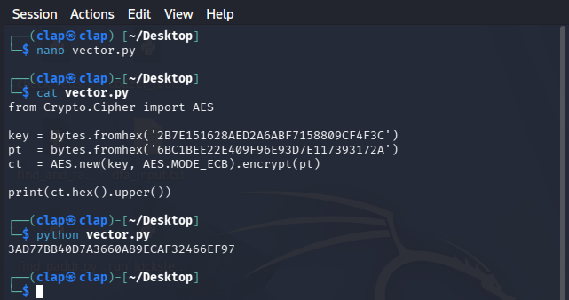

Để xác nhận giá trị tham chiếu, cùng một cặp khóa và bản rõ được kiểm tra bằng thư viện PyCryptodome trong Python:

```python
from Crypto.Cipher import AES

key = bytes.fromhex('2B7E151628AED2A6ABF7158809CF4F3C')
pt  = bytes.fromhex('6BC1BEE22E409F96E93D7E117393172A')
ct  = AES.new(key, AES.MODE_ECB).encrypt(pt)

print(ct.hex().upper())
# 3AD77BB40D7A3660A89ECAF32466EF97
```

Kết quả này là ground truth của toàn bộ thí nghiệm: ciphertext đúng phải là `3ad77bb40d7a3660a89ecaf32466ef97`.

Tiếp theo, ta tạo wrapper tối giản (`aes_main.c`) để gọi trực tiếp `AES_ECB_encrypt()` của tiny-AES-c. Chương trình này chỉ mã hóa đúng một block 16 byte, in ciphertext ra stdout, và được dùng làm workload cho gem5.

```c
cat > aes_main.c << 'EOF'
#include <stdio.h>
#include <string.h>
#include "aes.h"

int main() {
    uint8_t key[16] = {
        0x2b, 0x7e, 0x15, 0x16, 0x28, 0xae, 0xd2, 0xa6,
        0xab, 0xf7, 0x15, 0x88, 0x09, 0xcf, 0x4f, 0x3c
    };
    uint8_t plaintext[16] = {
        0x6b, 0xc1, 0xbe, 0xe2, 0x2e, 0x40, 0x9f, 0x96,
        0xe9, 0x3d, 0x7e, 0x11, 0x73, 0x93, 0x17, 0x2a
    };

    struct AES_ctx ctx;
    AES_init_ctx(&ctx, key);

    uint8_t buf[16];
    memcpy(buf, plaintext, 16);
    AES_ECB_encrypt(&ctx, buf);

    printf("Ciphertext: ");
    for (int i = 0; i < 16; i++) printf("%02x", buf[i]);
    printf("\n");

    return 0;
}
EOF
```

Tiêu chí xác nhận tính đúng đắn là ciphertext được sinh ra phải hoàn toàn trùng khớp với giá trị tham chiếu của NIST:

```
3ad77bb40d7a3660a89ecaf32466ef97
```

Nếu ciphertext khác giá trị này, phải dừng lại để sửa AES wrapper hoặc toolchain trước khi làm fault injection. DFA cần so sánh giữa correct output và faulty output; correct output sai thì toàn bộ phân tích phía sau sai theo.

### Biên dịch chương trình AES cho kiến trúc RISC-V

Sau khi có wrapper, bước tiếp theo là biên dịch chương trình sang RISC-V để gem5 có thể chạy được.

Ban đầu, chương trình được biên dịch bằng bộ công cụ cross-compiler RISC-V:

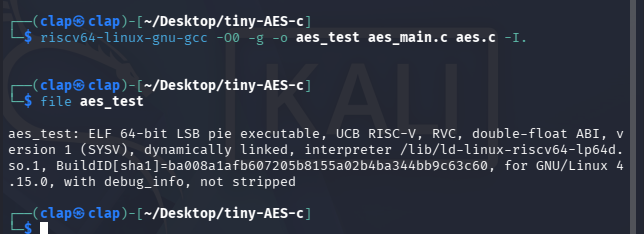

```bash
riscv64-linux-gnu-gcc -O0 -g -o aes_test aes_main.c aes.c -I.
```

Tùy chọn `-O0` được dùng để hạn chế compiler tối ưu hóa quá mạnh. Điều này giúp disassembly giữ được cấu trúc gần với source hơn: `Cipher()`, `SubBytes()`, `ShiftRows()`, `MixColumns()` và `AddRoundKey()` vẫn hiện rõ, thuận tiện cho việc tìm fault window. Nếu dùng `-O2` hoặc `-O3`, compiler có thể inline hoặc sắp xếp lại code, làm trace khó đọc hơn.

Sau khi biên dịch, loại binary được kiểm tra bằng lệnh:

```bash
file aes_test
```

Kết quả cho thấy:

```text
aes_test: ELF 64-bit LSB pie executable, UCB RISC-V,
dynamically linked,
interpreter /lib/ld-linux-riscv64-lp64d.so.1
...
```

Thông tin này xác nhận binary đúng kiến trúc RISC-V. Nhưng nó cũng cho thấy một vấn đề: file đang là `dynamically linked executable`.

### Vấn đề với dynamic linking trong gem5 SE mode

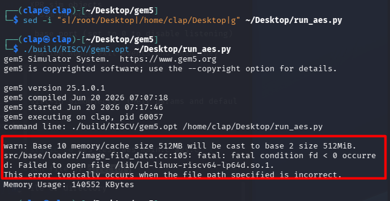

gem5 hỗ trợ hai chế độ mô phỏng chính:

* `Full System (FS) mode`: mô phỏng toàn bộ hệ thống bao gồm hệ điều hành, trình điều khiển thiết bị và các thành phần phần cứng liên quan.
* `Syscall Emulation (SE) mode`: chỉ mô phỏng tiến trình người dùng và các lời gọi hệ thống (system calls), không mô phỏng toàn bộ hệ điều hành.

Trong log này, ta dùng `SE mode` vì workload chỉ là một userspace program nhỏ. SE mode nhẹ hơn Full System mode và phù hợp khi cần chạy lại workload nhiều lần để collect faulty ciphertexts.

Tuy nhiên, SE mode không cung cấp đầy đủ môi trường thực thi của hệ điều hành Linux, đặc biệt là không hỗ trợ cơ chế nạp thư viện động (dynamic linking). Do đó, khi chạy binary được liên kết động, gem5 báo lỗi:

```text
fatal: Failed to open file /lib/ld-linux-riscv64-lp64d.so.1
```

Lỗi này không phải do AES sai. Binary RISC-V được compile dạng dynamic nên khi chạy nó cần dynamic linker `ld-linux-riscv64-lp64d.so.1`. Trong SE mode hiện tại, gem5 không có root filesystem RISC-V đầy đủ để tìm file đó, nên simulator dừng trước khi chương trình AES chạy.

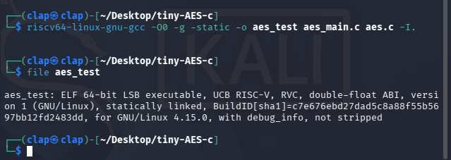

Để khắc phục, chương trình được biên dịch lại dưới dạng `statically linked executable`:

```bash
riscv64-linux-gnu-gcc -O0 -g -static -o aes_test aes_main.c aes.c -I.
```

Sau khi biên dịch lại, kiểm tra bằng lệnh:

```bash
file aes_test
```

thu được kết quả:

```text
aes_test: ELF 64-bit LSB executable, UCB RISC-V,
statically linked,
...
```

Thuộc tính *statically linked* cho thấy các thư viện cần thiết đã được liên kết trực tiếp vào binary. Nhờ đó, gem5 SE mode không cần tìm dynamic linker nữa và có thể chạy workload AES trực tiếp.

---

## 4. Chạy AES trong gem5 SE Mode

### Config script cho gem5

gem5 dùng Python script để mô tả system cần mô phỏng: clock, CPU model, memory, bus, workload và process arguments. Với workload AES nhỏ này, cấu hình tối giản là đủ:

```python
# run_aes.py
import m5
from m5.objects import *

# Khởi tạo system
system = System()
system.clk_domain = SrcClockDomain()
system.clk_domain.clock = '1GHz'
system.clk_domain.voltage_domain = VoltageDomain()

system.mem_mode = 'timing'
system.mem_ranges = [AddrRange('512MB')]

# CPU: TimingSimpleCPU
system.cpu = RiscvTimingSimpleCPU()

# Memory bus
system.membus = SystemXBar()
system.cpu.icache_port = system.membus.cpu_side_ports
system.cpu.dcache_port = system.membus.cpu_side_ports
system.cpu.createInterruptController()

# DDR3 memory controller
system.mem_ctrl = MemCtrl()
system.mem_ctrl.dram = DDR3_1600_8x8()
system.mem_ctrl.dram.range = system.mem_ranges[0]
system.mem_ctrl.port = system.membus.mem_side_ports
system.system_port = system.membus.cpu_side_ports

# Load binary
binary = '/home/clap/Desktop/tiny-AES-c/aes_test'
system.workload = SEWorkload.init_compatible(binary)

process = Process()
process.cmd = [binary]

system.cpu.workload = process
system.cpu.createThreads()

root = Root(full_system=False, system=system)

m5.instantiate()

print("=== Starting AES simulation ===")
exit_event = m5.simulate()

print(f"Exited at tick {m5.curTick()}  - reason: {exit_event.getCause()}")
```

Trong log, lần chạy đầu tiên dùng nhầm path `/root/Desktop/tiny-AES-c/aes_test`, trong khi user thật là `clap`. gem5 báo:

```text
Failed to open file /root/Desktop/tiny-AES-c/aes_test
```

Đây là lỗi path, không phải lỗi simulator. Sau khi sửa binary path thành `/home/clap/Desktop/tiny-AES-c/aes_test`, chương trình mới đi tiếp đến lỗi dynamic linker đã xử lý ở phần trước.

### Tại sao sử dụng TimingSimpleCPU?

gem5 cung cấp nhiều CPU model với các mức độ chi tiết khác nhau:

* `AtomicSimpleCPU`: thực thi nhanh nhất, không mô hình hóa timing của memory accesses.
* `TimingSimpleCPU`: mô hình hóa timing của hệ thống nhớ và thực thi tuần tự từng instruction.
* `O3CPU`: mô hình out-of-order chi tiết, hỗ trợ pipeline, speculation và nhiều đặc điểm vi kiến trúc khác.

Trong nghiên cứu này, `TimingSimpleCPU` được chọn vì cân bằng giữa tốc độ và khả năng quan sát timing. So với O3CPU, nó đơn giản hơn và chạy nhanh hơn, phù hợp khi phải lặp lại mô phỏng nhiều lần. Đồng thời execution trace của nó đủ ổn định để đếm các lần gọi `SubBytes` và xác định Round 9.

Điểm cần nói rõ: TimingSimpleCPU không chứng minh một glitch vật lý ở mức silicon. Nó được dùng ở đây để tạo môi trường RISC-V có timing trace nhất quán, phục vụ việc dựng và kiểm chứng fault model.

### Chạy chương trình AES trong gem5

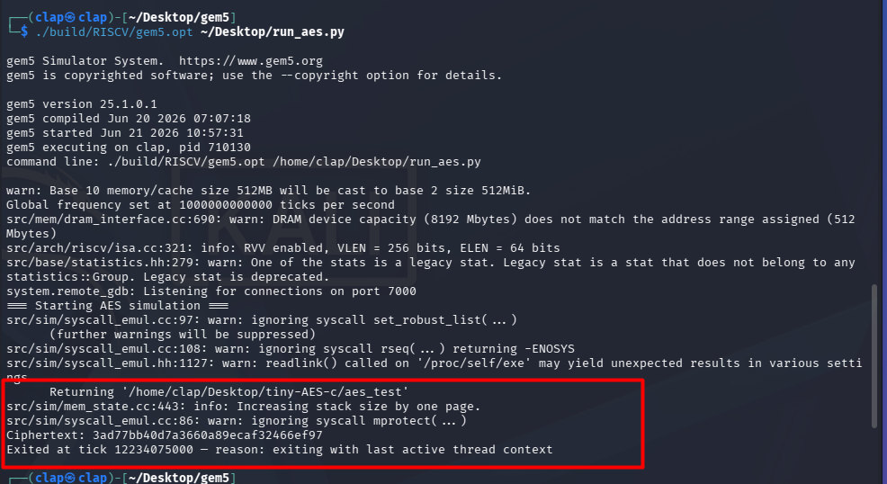

Sau khi biên dịch chương trình AES thành binary RISC-V, mô phỏng được thực thi bằng lệnh:

```bash
./build/RISCV/gem5.opt ~/Desktop/run_aes.py
```

### Kiểm tra kết quả mã hóa

Ciphertext thu được là:

```text
3ad77bb40d7a3660a89ecaf32466ef97
```

Giá trị này trùng khớp với AES-128 Known Answer Test (KAT) của NIST đối với plaintext và khóa đang dùng.

Kết quả này xác nhận rằng:

* Mã nguồn tiny-AES-c được biên dịch chính xác sang kiến trúc RISC-V.
* Binary RISC-V được thực thi đúng trong môi trường gem5.
* gem5 SE mode chạy được workload AES đến khi chương trình exit bình thường.
* Ta có correct ciphertext để làm reference cho DFA.

#### Remote GDB Stub

```text
system.remote_gdb: Listening for connections on port 7000
```

gem5 tự động khởi tạo GDB stub tại cổng 7000.

Người dùng có thể kết nối GDB tới simulator để:

* Đặt breakpoint.
* Theo dõi giá trị thanh ghi.
* Quan sát bộ nhớ.
* Debug chương trình trong quá trình mô phỏng.

#### Stack Growth

```text
Increasing stack size by one page.
```

Thông báo này cho biết gem5 tự động mở rộng vùng stack của tiến trình khi chương trình yêu cầu thêm không gian bộ nhớ ngăn xếp.

Đây là hành vi bình thường trong chế độ Syscall Emulation.

### Thời gian mô phỏng

Theo log thực nghiệm, mô phỏng kết thúc tại:

```text
12184470000 ticks
```

Trong gem5, mặc định:

```text
1 tick = 1 picosecond (ps)
```

Do đó:

```text
12184470000 ticks
≈ 12.18 ms simulated time
```

Cần lưu ý rằng đây là thời gian của hệ thống mô phỏng theo thang thời gian nội bộ của gem5, không phải thời gian thực thi thực tế trên máy host.

Đến đây baseline đã sạch: AES chạy đúng trong gem5, binary là RISC-V static executable, và output khớp NIST vector. Từ baseline này mới bắt đầu xác định fault window, thử checkpoint-based injection, rồi pivot sang source-level hook khi checkpoint path không tạo được fault model đủ sạch.

---

## 5. Phân tích Disassembly  - Xác định Fault Window

Sau khi AES chạy đúng trong gem5, câu hỏi tiếp theo là: `Round 9 nằm ở đâu trong execution?` Muốn trả lời câu này, ta cần nhìn xuống disassembly của RISC-V binary.

### Dump Disassembly

Binary được disassemble bằng `objdump`:

```bash
riscv64-linux-gnu-objdump -d ~/Desktop/tiny-AES-c/aes_test > ~/Desktop/aes_disasm.txt
```

### Tìm các hàm AES quan trọng

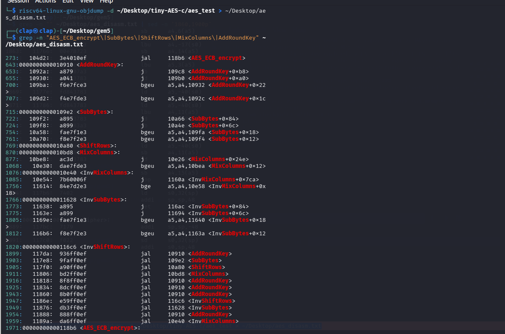

Bước đầu tiên là xác định vị trí các hàm chính của thuật toán AES trong file disassembly.

```bash
grep -n "AES_ECB_encrypt\|SubBytes\|ShiftRows\|MixColumns\|AddRoundKey" ~/Desktop/aes_disasm.txt
```

> `Lưu ý:` Bổ sung `Cipher` vào biểu thức tìm kiếm để xác định trực tiếp vị trí của hàm này trong file disassembly.

Kết quả:

```text
273:   104d2: jal     118b6 <AES_ECB_encrypt>

643: 0000000000010910 <AddRoundKey>:
715: 00000000000109e2 <SubBytes>:
769: 0000000000010a80 <ShiftRows>:
870: 0000000000010bd8 <MixColumns>:

1899:   117da: jal     10910 <AddRoundKey>
1903:   117e8: jal     109e2 <SubBytes>
1905:   117f0: jal     10a80 <ShiftRows>
1911:   11806: jal     10bd8 <MixColumns>
1916:   11818: jal     10910 <AddRoundKey>

1971: 00000000000118b6 <AES_ECB_encrypt>:
```

Từ kết quả trên có thể xác định được địa chỉ của các hàm thực hiện các phép biến đổi trong AES cũng như hàm `AES_ECB_encrypt()`. Tuy nhiên, `việc biết địa chỉ của các hàm vẫn chưa đủ để xác định vị trí fault injection`. Điều quan trọng hơn là phải hiểu `luồng thực thi (control flow)` của chương trình: hàm nào gọi hàm nào và các vòng AES thực sự được thực hiện ở đâu.

Có một điểm rất dễ nhầm trong kết quả trên.

Dòng:

```text
273: 104d2: jal 118b6 <AES_ECB_encrypt>
```

không phải là phần thân của `AES_ECB_encrypt()`. Đây chỉ là lệnh `jal` (*Jump And Link*), tức là vị trí mà `main()` gọi sang hàm `AES_ECB_encrypt()`.

Trong khi đó:

```text
1971: 00000000000118b6 <AES_ECB_encrypt>:
```

mới là nhãn đánh dấu điểm bắt đầu của thân hàm `AES_ECB_encrypt()` trong file disassembly.

Vì vậy, thay vì phân tích tại vị trí gọi hàm, ta cần đi vào bên trong `AES_ECB_encrypt()` để xác định hàm nào thực sự thực hiện các vòng mã hóa AES.

---

## Phân tích hàm AES_ECB_encrypt
```
grep -n "" ~/Desktop/aes_disasm.txt | sed -n '1971,2100p'
```

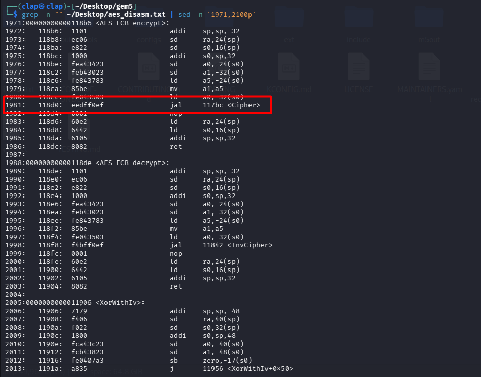

Lệnh jal (Jump And Link) chuyển luồng thực thi sang hàm Cipher(). Điều này cho thấy AES_ECB_encrypt() không trực tiếp thực hiện các phép biến đổi như SubBytes, ShiftRows, MixColumns hay AddRoundKey, mà chỉ đóng vai trò là hàm bao (wrapper) để gọi Cipher(). Vì vậy, muốn xác định vị trí thích hợp để fault injection, ta cần tiếp tục phân tích hàm Cipher().

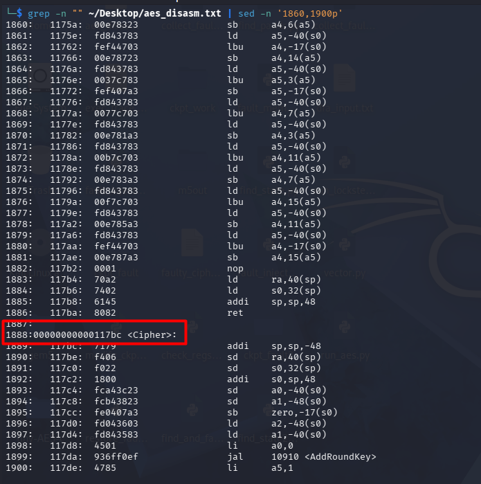

Kết quả cho thấy:

```assembly
118d0: jal 117bc <Cipher>
```

Điều này cho thấy `AES_ECB_encrypt()` không trực tiếp thực hiện các phép biến đổi của AES mà chỉ chuẩn bị tham số rồi chuyển việc mã hóa sang hàm `Cipher()`.

Luồng gọi hàm có thể được biểu diễn như sau:

```text
main()
    │
    ▼
AES_ECB_encrypt()
    │
    │  jal 117bc
    ▼
Cipher()
```

Do đó, nếu muốn xác định chính xác thời điểm diễn ra từng AES round để thực hiện fault injection, ta cần tiếp tục phân tích hàm `Cipher()`, vì đây mới là nơi chứa toàn bộ vòng lặp mã hóa của AES.

---

### Phân tích hàm `Cipher`

```bash
grep -n "" ~/Desktop/aes_disasm.txt | sed -n '1888,1930p'
```

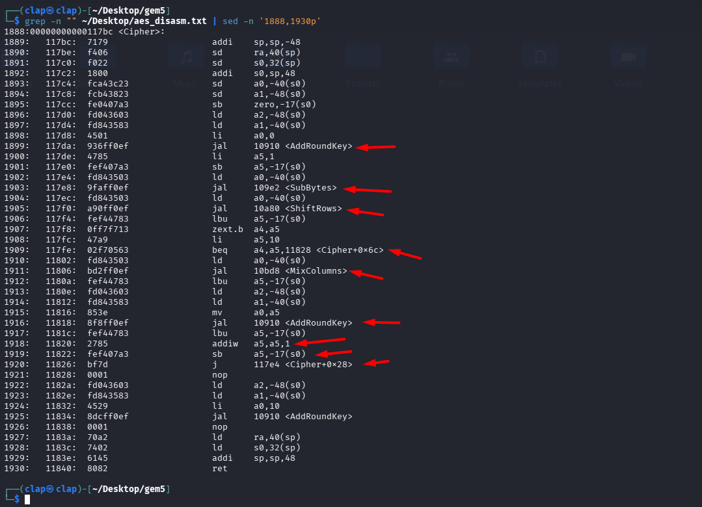

Để dễ quan sát, phần kết quả được rút gọn và chú thích như sau:

```assembly
00000000000117bc <Cipher>:

117da: jal AddRoundKey      ; Initial AddRoundKey

117de: li  a5,1
117e0: sb  a5,-17(s0)       ; round counter = 1

; ─── Main AES Loop ─────────────────────────────

117e8: jal SubBytes
117f0: jal ShiftRows

117fe: beq round,10,11828   ; nếu round == 10 thì chuyển sang Final Round

11806: jal MixColumns
11818: jal AddRoundKey

11820: round++
11826: j 117e4              ; quay lại đầu vòng lặp

; ─── Final Round ──────────────────────────────

11828: ...
11834: jal AddRoundKey
11840: ret
```

Quan sát disassembly có thể thấy `Cipher()` được triển khai bằng `một vòng lặp duy nhất`, thay vì unroll thành 10 đoạn mã riêng biệt.

Cụ thể:

- `0x117da` thực hiện `Initial AddRoundKey` trước khi bắt đầu các AES round.
- Một biến đếm vòng lặp được khởi tạo với giá trị `1` và được cập nhật sau mỗi lần lặp.
- Mỗi vòng lặp lần lượt gọi `SubBytes`, `ShiftRows`, `MixColumns` và `AddRoundKey`.
- Tại địa chỉ `0x117fe`, chương trình kiểm tra biến đếm. Khi giá trị đạt `10`, nhánh `beq` được thực hiện để bỏ qua `MixColumns` và chuyển sang `AddRoundKey` của vòng cuối tại `0x11834`, đúng với đặc tả của AES-128.

Luồng thực thi của `Cipher()` tương ứng với đặc tả AES-128 như sau:

```text
Initial AddRoundKey

Rounds 1 → 9
    SubBytes
    ShiftRows
    MixColumns
    AddRoundKey

Round 10
    SubBytes
    ShiftRows
    AddRoundKey
```

Điều quan trọng rút ra từ disassembly là compiler `không sinh 10 đoạn mã khác nhau cho 10 AES round`. Thay vào đó, cùng một nhóm instruction được thực thi lặp lại trong mỗi vòng của `Cipher()`. Ví dụ, instruction:

```assembly
117e8: jal 109e2 <SubBytes>
```

luôn nằm ở đầu vòng lặp và sẽ được thực thi nhiều lần trong suốt quá trình mã hóa.

Tuy nhiên, `disassembly chỉ cho biết instruction này nằm trong vòng lặp`, chứ chưa thể xác định đó là lần thực thi thứ mấy. Để biết một lần thực thi cụ thể của `0x117e8` tương ứng với Round 1, Round 9 hay Round 10, cần phân tích execution trace do gem5 sinh ra.

### Xác định Fault Window

Theo mô hình DFA được PhoenixAES sử dụng, lỗi cần được đưa vào `state của Round 9` (vòng áp chót). Khi đó, dữ liệu lỗi vẫn tiếp tục đi qua Round 10 và tạo ra các faulty ciphertext có cấu trúc phù hợp để PhoenixAES khôi phục khóa.

Do `Cipher()` được triển khai bằng một vòng lặp, instruction:

```assembly
117e8: jal 109e2 <SubBytes>
```

sẽ xuất hiện nhiều lần trong execution trace. Vì vậy, nhiệm vụ tiếp theo là xác định `lần xuất hiện tương ứng với Round 9`, sau đó thực hiện fault injection ngay trước instruction này.

Quá trình thực hiện fault injection có thể được mô tả như sau:

```text
Round 8 kết thúc
        │
        ▼
 Fault Injection
        │
        ▼
Round 9
    SubBytes
    ShiftRows
    MixColumns
    AddRoundKey
        │
        ▼
Round 10
        │
        ▼
Faulty Ciphertext
```

Ở bước tiếp theo, execution trace của gem5 sẽ được sử dụng để xác định chính xác lần thực thi của `0x117e8` tương ứng với Round 9

---

## 6. Xác định Cycle Range của Round 9
### Liên hệ Execution Trace với AES Round

Ở bước trước, disassembly của `Cipher()` cho thấy:

```assembly
117e8: jal SubBytes
117f0: jal ShiftRows
11806: jal MixColumns
11818: jal AddRoundKey

11820: round_counter++
11826: j 117e4
```

Các instruction trên nằm bên trong vòng lặp AES chính. Mỗi lần vòng lặp được thực thi, chương trình sẽ lần lượt gọi:

```text
SubBytes
↓
ShiftRows
↓
MixColumns
↓
AddRoundKey
```

sau đó tăng `round_counter` và quay lại đầu vòng lặp để xử lý round tiếp theo.

Do đó, nếu theo dõi các địa chỉ:

```text
0x117e8
0x117f0
0x11806
0x11818
```

trong execution trace, ta sẽ thấy một mẫu lặp lại nhiều lần:

```text
0x117e8  (SubBytes)
↓
0x117f0  (ShiftRows)
↓
0x11806  (MixColumns)
↓
0x11818  (AddRoundKey)
```

Mỗi lần xuất hiện đầy đủ chuỗi này tương ứng với một AES round hoàn chỉnh.

Ví dụ, trong execution trace:

Round 1:

```text
9029861000 : 0x117e8
9080545000 : 0x117f0
9087100000 : 0x11806
9188518000 : 0x11818
```

Round 2:

```text
9252774000 : 0x117e8
9303089000 : 0x117f0
9309643000 : 0x11806
9411108000 : 0x11818
```

Round 3:

```text
9475351000 : 0x117e8
9526013000 : 0x117f0
9532537000 : 0x11806
9633992000 : 0x11818
```

Có thể thấy sau khi hoàn thành chuỗi:

```text
SubBytes → ShiftRows → MixColumns → AddRoundKey
```

chương trình lại quay về `0x117e8`, tức bắt đầu một vòng AES mới.

Điều này khớp với cấu trúc vòng lặp đã quan sát được trong disassembly của `Cipher()`.

Vì AES-128 có tổng cộng 10 rounds và `0x117e8` là lệnh gọi `SubBytes()` nằm ở đầu vòng lặp, nên lần xuất hiện thứ nhất của `0x117e8` tương ứng Round 1, lần thứ hai tương ứng Round 2, ..., lần thứ chín tương ứng Round 9 và lần thứ mười tương ứng Round 10.

Do đó, thay vì phải phân tích toàn bộ execution trace, chỉ cần theo dõi các lần xuất hiện của địa chỉ `0x117e8` là có thể xác định chính xác thời điểm bắt đầu từng AES round.

### Thu thập Execution Trace

gem5 hỗ trợ theo dõi từng instruction thông qua debug flag `Exec`.

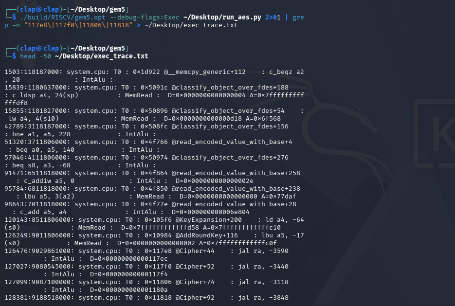

Execution trace được thu thập bằng:

```bash
./build/RISCV/gem5.opt \
    --debug-flags=Exec \
    ~/Desktop/run_aes.py \
    2>&1 | grep -n "117e8\|117f0\|11806\|11818" \
    > ~/Desktop/exec_trace.txt
```

output:

```
──(clap㉿clap)-[~/Desktop/gem5]
└─$ head -50 ~/Desktop/exec_trace.txt

1503:118187000: system.cpu: T0 : 0x1d922 @__memcpy_generic+112    : c_beqz a2, 20              : IntAlu : 
15839:1180637000: system.cpu: T0 : 0x5091c @classify_object_over_fdes+188    : c_ldsp a4, 24(sp)          : MemRead :  D=0x0000000000000004 A=0x7ffffffffffffdf8
15855:1181827000: system.cpu: T0 : 0x50896 @classify_object_over_fdes+54    : lw a4, 4(s10)              : MemRead :  D=0x0000000000000d18 A=0x6f568
42789:3118187000: system.cpu: T0 : 0x508fc @classify_object_over_fdes+156    : bne a1, a5, 228            : IntAlu : 
51320:3711806000: system.cpu: T0 : 0x4f766 @read_encoded_value_with_base+4    : beq a0, a5, 140            : IntAlu : 
57046:4111806000: system.cpu: T0 : 0x50974 @classify_object_over_fdes+276    : beq s8, a3, -68            : IntAlu : 
91471:6511818000: system.cpu: T0 : 0x4f864 @read_encoded_value_with_base+258    : c_addiw a5, 0              : IntAlu :  D=0x000000000000002e
95784:6811818000: system.cpu: T0 : 0x4f850 @read_encoded_value_with_base+238    : lbu a5, 3(a2)              : MemRead :  D=0x0000000000000000 A=0x77daf
98643:7011818000: system.cpu: T0 : 0x4f77e @read_encoded_value_with_base+28    : c_add a5, a4               : IntAlu :  D=0x000000000006e804
120143:8511806000: system.cpu: T0 : 0x105f6 @KeyExpansion+200    : ld a4, -64(s0)             : MemRead :  D=0x7ffffffffffffd58 A=0x7ffffffffffffc10
126249:9011806000: system.cpu: T0 : 0x10984 @AddRoundKey+116    : lbu a5, -17(s0)            : MemRead :  D=0x0000000000000002 A=0x7ffffffffffffc0f
126476:9029861000: system.cpu: T0 : 0x117e8 @Cipher+44    : jal ra, -3590              : IntAlu :  D=0x00000000000117ec
127027:9080545000: system.cpu: T0 : 0x117f0 @Cipher+52    : jal ra, -3440              : IntAlu :  D=0x00000000000117f4
127099:9087100000: system.cpu: T0 : 0x11806 @Cipher+74    : jal ra, -3118              : IntAlu :  D=0x000000000001180a
128381:9188518000: system.cpu: T0 : 0x11818 @Cipher+92    : jal ra, -3848              : IntAlu :  D=0x000000000001181c
129179:9252774000: system.cpu: T0 : 0x117e8 @Cipher+44    : jal ra, -3590              : IntAlu :  D=0x00000000000117ec
129730:9303089000: system.cpu: T0 : 0x117f0 @Cipher+52    : jal ra, -3440              : IntAlu :  D=0x00000000000117f4
129802:9309643000: system.cpu: T0 : 0x11806 @Cipher+74    : jal ra, -3118              : IntAlu :  D=0x000000000001180a
131084:9411108000: system.cpu: T0 : 0x11818 @Cipher+92    : jal ra, -3848              : IntAlu :  D=0x000000000001181c
131882:9475351000: system.cpu: T0 : 0x117e8 @Cipher+44    : jal ra, -3590              : IntAlu :  D=0x00000000000117ec
132433:9526013000: system.cpu: T0 : 0x117f0 @Cipher+52    : jal ra, -3440              : IntAlu :  D=0x00000000000117f4
132505:9532537000: system.cpu: T0 : 0x11806 @Cipher+74    : jal ra, -3118              : IntAlu :  D=0x000000000001180a
133787:9633992000: system.cpu: T0 : 0x11818 @Cipher+92    : jal ra, -3848              : IntAlu :  D=0x000000000001181c
134585:9698381000: system.cpu: T0 : 0x117e8 @Cipher+44    : jal ra, -3590              : IntAlu :  D=0x00000000000117ec
135136:9749030000: system.cpu: T0 : 0x117f0 @Cipher+52    : jal ra, -3440              : IntAlu :  D=0x00000000000117f4
135208:9755315000: system.cpu: T0 : 0x11806 @Cipher+74    : jal ra, -3118              : IntAlu :  D=0x000000000001180a
136490:9856760000: system.cpu: T0 : 0x11818 @Cipher+92    : jal ra, -3848              : IntAlu :  D=0x000000000001181c
137288:9921481000: system.cpu: T0 : 0x117e8 @Cipher+44    : jal ra, -3590              : IntAlu :  D=0x00000000000117ec
137839:9971860000: system.cpu: T0 : 0x117f0 @Cipher+52    : jal ra, -3440              : IntAlu :  D=0x00000000000117f4
137911:9978372000: system.cpu: T0 : 0x11806 @Cipher+74    : jal ra, -3118              : IntAlu :  D=0x000000000001180a
139193:10079866000: system.cpu: T0 : 0x11818 @Cipher+92    : jal ra, -3848              : IntAlu :  D=0x000000000001181c
139991:10144134000: system.cpu: T0 : 0x117e8 @Cipher+44    : jal ra, -3590              : IntAlu :  D=0x00000000000117ec
140542:10194692000: system.cpu: T0 : 0x117f0 @Cipher+52    : jal ra, -3440              : IntAlu :  D=0x00000000000117f4
140614:10201261000: system.cpu: T0 : 0x11806 @Cipher+74    : jal ra, -3118              : IntAlu :  D=0x000000000001180a
141896:10302720000: system.cpu: T0 : 0x11818 @Cipher+92    : jal ra, -3848              : IntAlu :  D=0x000000000001181c
142694:10367004000: system.cpu: T0 : 0x117e8 @Cipher+44    : jal ra, -3590              : IntAlu :  D=0x00000000000117ec
143180:10411806000: system.cpu: T0 : 0x10a16 @SubBytes+52    : addiw a4, a5, 0            : IntAlu :  D=0x00000000000000ff
143245:10417370000: system.cpu: T0 : 0x117f0 @Cipher+52    : jal ra, -3440              : IntAlu :  D=0x00000000000117f4
143317:10423966000: system.cpu: T0 : 0x11806 @Cipher+74    : jal ra, -3118              : IntAlu :  D=0x000000000001180a
144599:10525466000: system.cpu: T0 : 0x11818 @Cipher+92    : jal ra, -3848              : IntAlu :  D=0x000000000001181c
145397:10590015000: system.cpu: T0 : 0x117e8 @Cipher+44    : jal ra, -3590              : IntAlu :  D=0x00000000000117ec
145948:10640441000: system.cpu: T0 : 0x117f0 @Cipher+52    : jal ra, -3440              : IntAlu :  D=0x00000000000117f4
146020:10647009000: system.cpu: T0 : 0x11806 @Cipher+74    : jal ra, -3118              : IntAlu :  D=0x000000000001180a
147302:10748427000: system.cpu: T0 : 0x11818 @Cipher+92    : jal ra, -3848              : IntAlu :  D=0x000000000001181c
148100:10812745000: system.cpu: T0 : 0x117e8 @Cipher+44    : jal ra, -3590              : IntAlu :  D=0x00000000000117ec
148651:10863351000: system.cpu: T0 : 0x117f0 @Cipher+52    : jal ra, -3440              : IntAlu :  D=0x00000000000117f4
148723:10869636000: system.cpu: T0 : 0x11806 @Cipher+74    : jal ra, -3118              : IntAlu :  D=0x000000000001180a
150005:10971373000: system.cpu: T0 : 0x11818 @Cipher+92    : jal ra, -3848              : IntAlu :  D=0x000000000001181c
150803:11035659000: system.cpu: T0 : 0x117e8 @Cipher+44    : jal ra, -3590              : IntAlu :  D=0x00000000000117ec
151354:11085998000: system.cpu: T0 : 0x117f0 @Cipher+52    : jal ra, -3440              : IntAlu :  D=0x00000000000117f4
```

Các địa chỉ được theo dõi không phải là địa chỉ bắt đầu của các hàm AES, mà là các lệnh gọi (call site) nằm bên trong vòng lặp của Cipher():

| Address | Ý nghĩa |
|----------|----------|
| 0x117e8 | gọi SubBytes() |
| 0x117f0 | gọi ShiftRows() |
| 0x11806 | gọi MixColumns() |
| 0x11818 | gọi AddRoundKey() |

Những địa chỉ này được lựa chọn vì chúng xuất hiện đúng một lần trong mỗi vòng lặp AES, giúp việc nhận diện từng round trong execution trace trở nên dễ dàng hơn.

Trích đoạn execution trace:

```text
9029861000   : 0x117e8  ← Round 1
9252774000   : 0x117e8  ← Round 2
9475351000   : 0x117e8  ← Round 3
9698381000   : 0x117e8  ← Round 4
9921481000   : 0x117e8  ← Round 5
10144134000  : 0x117e8  ← Round 6
10367004000  : 0x117e8  ← Round 7
10590015000  : 0x117e8  ← Round 8
10812745000  : 0x117e8  ← Round 9
11035659000  : 0x117e8  ← Round 10
```

Do 0x117e8 là lệnh gọi SubBytes() nằm ở đầu vòng lặp AES, mỗi lần địa chỉ này được thực thi tương ứng với việc bắt đầu một AES round mới.

Từ trace có thể xác định:

```text
Round 9 bắt đầu tại tick:
10,812,745,000
```

### Mapping Tick sang Cycle

CPU được cấu hình ở tần số:

```text
1 GHz
```

Trong gem5:

```text
1 tick = 1 ps
1 cycle = 1 ns = 1000 ticks
```

Do đó:

```text
10,812,745,000 ticks
≈ 10,812,745 cycles
```

Bảng timing của các vòng AES:

| Round | Tick bắt đầu SubBytes |          Cycle |
| ----- | --------------------: | -------------: |
| 1     |         9,029,861,000 |      9,029,861 |
| 2     |         9,252,774,000 |      9,252,774 |
| 3     |         9,475,351,000 |      9,475,351 |
| 4     |         9,698,381,000 |      9,698,381 |
| 5     |         9,921,481,000 |      9,921,481 |
| 6     |        10,144,134,000 |     10,144,134 |
| 7     |        10,367,004,000 |     10,367,004 |
| 8     |        10,590,015,000 |     10,590,015 |
| `9` |    `10,812,745,000` | `10,812,745` |
| 10    |        11,035,659,000 |     11,035,659 |

Khoảng cách giữa các vòng tương đối ổn định, cho phép sử dụng execution trace để xác định chính xác thời điểm bắt đầu Round 9.

Kết quả này cung cấp mốc thời gian cần thiết để triển khai fault injection trong các bước tiếp theo.

Trong implementation cuối cùng của nghiên cứu này, fault được chèn trực tiếp vào state AES thông qua source-level fault hook để tạo tập faulty ciphertext phục vụ DFA. Do đó execution trace không được sử dụng để kích hoạt fault injection. Thay vào đó, trace được dùng để xác minh vị trí fault tương ứng với Round 9 và làm cơ sở cho các fault model ở mức simulator trong các nghiên cứu mở rộng sau này.

---

## 7. Approach 1: Exploring Checkpoint-based Fault Injection

Ở phần trước, execution trace đã được phân tích để xác định thời điểm bắt đầu của từng vòng AES. 

Theo fault model của PhoenixAES, fault cần được đưa vào `ngay trước `SubBytes` của Round 9`. Vì vậy, tick `10,812,745,000` được chọn làm `fault boundary` cho toàn bộ các thử nghiệm checkpoint trong phần này.

Ý tưởng của phương pháp là tạo checkpoint đúng tại fault boundary, sau đó chỉnh sửa trạng thái thực thi trước khi khôi phục chương trình.

Pipeline dự kiến:

```text
Run AES trong gem5
        │
        ▼
Checkpoint tại Round 9
(tick = 10,812,745,000)
        │
        ▼
Modify Execution State
        │
        ▼
Restore Checkpoint
        │
        ▼
Collect Faulty Ciphertext
```

Nếu thành công, fault sẽ được đưa vào quá trình thực thi mà không cần sửa đổi mã nguồn của AES.

---

### 7.1 Thách thức

Checkpoint của gem5 lưu lại toàn bộ trạng thái thực thi của hệ thống tại một thời điểm, bao gồm:

```text
CPU registers
Memory pages
Cache state
Pipeline state
```

Tuy nhiên, checkpoint không lưu thông tin ở mức ngữ nghĩa của chương trình, chẳng hạn như:

```text
AES state
Round number
SubBytes input
Round key
```

Do đó, mặc dù có thể chỉnh sửa bất kỳ byte nào trong checkpoint, nhưng không thể biết byte nào thực sự tương ứng với `AES state của Round 9`.

Để kiểm chứng khả năng này, ba hướng tiếp cận khác nhau đã được thử nghiệm.

---

## 7.2 Attempt 1 – Modify Register `x10`

### Giả thuyết

Checkpoint được tạo tại tick `10,812,745,000`, tương ứng với thời điểm chương trình chuẩn bị thực thi `SubBytes` của Round 9.

Theo RISC-V Calling Convention, thanh ghi `x10` (`a0`) được dùng để truyền đối số đầu tiên khi gọi hàm. Giả thuyết đầu tiên là `x10` có thể chứa hoặc tham chiếu trực tiếp tới AES state.

Nếu đúng, chỉ cần sửa giá trị của `x10` trong checkpoint là có thể tạo ra faulty ciphertext.

### Thực nghiệm

```python
# modify_ckpt.py

reg_idx = 10 * 8

x10_bytes = bytes(vals[reg_idx:reg_idx+8])
x10_val = struct.unpack('<Q', x10_bytes)[0]

print(f"[PRE-FAULT] x10 = 0x{x10_val:016x}")

x10_faulty = x10_val ^ 0x01
```

Kết quả:

```text
[PRE-FAULT]  x10 = 0x7ffffffffffffc78
[POST-FAULT] x10 = 0x7ffffffffffffc79
```

Restore checkpoint và tiếp tục thực thi:

```text
Ciphertext:
e6d77bb40d7a36c7a89e67f324dcef97
```

### Phân tích

Kết quả trên chứng minh:

- Checkpoint được chỉnh sửa thành công.
- Chương trình vẫn tiếp tục chạy sau khi restore.
- Việc sửa `x10` có thể làm ciphertext thay đổi.

Tuy nhiên, khi thử nhiều bit khác nhau của `x10`, chỉ bit thấp nhất tạo ra khác biệt.

Điều này cho thấy `x10` nhiều khả năng đang chứa `địa chỉ (pointer)` thay vì dữ liệu AES state. Việc thay đổi bit thấp nhất chỉ làm địa chỉ bị lệch sang byte kế tiếp và khiến chương trình đọc dữ liệu khác.

Do đó, mặc dù fault đã ảnh hưởng tới quá trình thực thi, nhưng `chưa có bằng chứng rằng fault được đưa trực tiếp vào AES state của Round 9`.

---

## 7.3 Attempt 2 – Modify Physical Memory

### Giả thuyết

Nếu `x10` là pointer tới AES state trên stack, có thể suy ngược từ virtual address sang physical address trong checkpoint rồi chỉnh sửa trực tiếp dữ liệu tại đó.

Checkpoint vẫn được tạo tại tick:

```text
10,812,745,000
```

### Thực nghiệm

Đọc các thanh ghi:

```text
x10 = 0x7ffffffffffffc79
x11 = 0x7ffffffffffffc78
x12 = 0x7ffffffffffffc78
```

Thực hiện virtual-to-physical mapping:

```python
VADDR = 0x7ffffffffffffc78

PAGE_SIZE = 4096
vpage = (VADDR // PAGE_SIZE) * PAGE_SIZE
offset = VADDR % PAGE_SIZE
```

Kết quả:

```text
0x7ffffffffffff000
        ↓
Physical: 0x76000
```

Địa chỉ vật lý ứng viên:

```text
0x76000 + 0xc78 = 0x76c78
```

Đọc 16 byte:

```text
aa aa aa aa aa aa aa aa
aa aa aa aa aa aa aa aa
```

### Phân tích

Việc toàn bộ 16 byte đều mang giá trị `0xaa` không đủ để kết luận đây chắc chắn không phải AES state.

Tuy nhiên, đối với trạng thái trung gian của AES tại Round 9, việc toàn bộ 16 byte đều có cùng giá trị là rất khó xảy ra.

Điều này cho thấy địa chỉ vật lý vừa tìm được nhiều khả năng `không phải vùng dữ liệu mà `Cipher()` đang sử dụng tại fault boundary`.

Do đó, attempt này vẫn chưa xác định được vị trí của AES state trong checkpoint.

---

## 7.4 Attempt 3 – Save Checkpoint Later

### Giả thuyết

Hai attempt trước đều sử dụng checkpoint tại đúng fault boundary (`10,812,745,000`).

Một giả thuyết khác là checkpoint có thể được tạo quá sớm, khi trạng thái AES chưa ổn định trong bộ nhớ.

Do đó checkpoint được dịch muộn hơn `50,000 ticks`, đi sâu hơn vào bên trong `SubBytes()`.

### Thực nghiệm

```python
FAULT_TICK = 10812745000 + 50000
```

Checkpoint được tạo tại:

```text
10,812,795,000
```

Đọc lại vùng nhớ:

```text
55 55 55 55 55 55 55 55
55 55 55 55 55 55 55 55
```

### Phân tích

Pattern thay đổi từ `0xaa` sang `0x55`, cho thấy thời điểm tạo checkpoint thực sự ảnh hưởng tới dữ liệu được quan sát.

Tuy nhiên, toàn bộ 16 byte vẫn có cùng một giá trị và không có bằng chứng nào cho thấy vùng nhớ này chính là AES state mà `SubBytes()` đang xử lý.

Điều này cho thấy việc dịch checkpoint muộn hơn `không giải quyết được bài toán ánh xạ giữa execution state và AES state`.

---

## 7.5 Tổng kết

Ba hướng tiếp cận được tóm tắt như sau:

| Attempt | Checkpoint Tick | Giả thuyết | Kết quả |
|----------|----------------:|------------|----------|
| Modify Register | 10,812,745,000 | `x10` chứa AES state | `x10` nhiều khả năng là pointer |
| Modify Physical Memory | 10,812,745,000 | Mapping tới AES state | Chỉ đọc được pattern `0xaa` |
| Save Checkpoint Later | 10,812,795,000 | Checkpoint được tạo quá sớm | Pattern chuyển thành `0x55`, vẫn chưa xác định được AES state |

Các thử nghiệm trên chứng minh rằng checkpoint có thể được `tạo`, `chỉnh sửa` và `khôi phục` thành công, đồng thời chương trình vẫn tiếp tục thực thi bình thường sau khi restore.

Tuy nhiên, `không có bằng chứng đủ mạnh để khẳng định byte được chỉnh sửa chính là AES state tại Round 9`. Khó khăn của phương pháp này không nằm ở việc thao tác với checkpoint, mà nằm ở việc ánh xạ dữ liệu mức thấp của checkpoint sang trạng thái logic của thuật toán AES.

Do không thể đảm bảo fault được đưa vào đúng vị trí theo fault model của PhoenixAES, hướng tiếp cận này không được sử dụng để tạo tập faulty ciphertext cuối cùng.

Thay vào đó, nghiên cứu chuyển sang `source-level fault hook`, trong đó fault được chèn trực tiếp vào AES state ngay trước `SubBytes()` của Round 9.

---

## 9. Approach 2: Source-level Fault Hook

Phần trước đã cho thấy checkpoint có thể được tạo và chỉnh sửa thành công, tuy nhiên chưa thể xác định một cách đáng tin cậy byte nào trong checkpoint tương ứng với `AES state tại Round 9`. Vì vậy, mặc dù fault có thể được đưa vào trạng thái thực thi của hệ thống, vẫn chưa có đủ bằng chứng để khẳng định fault được đặt đúng vị trí mà mô hình DFA yêu cầu.

Để tiếp tục quá trình thực nghiệm, nghiên cứu chuyển sang một hướng tiếp cận khác: `đưa fault hook trực tiếp vào hàm `Cipher()` của tiny-AES-c`.

Điểm cần lưu ý là mục tiêu của bước này `không thay đổi`. Fault vẫn được đưa vào đúng `logical boundary` đã xác định từ các phần trước, tức `ngay trước `SubBytes()` của Round 9`. Khác biệt duy nhất là thay vì phải suy luận vị trí của AES state từ dữ liệu trong checkpoint, vị trí fault giờ đây được xác định trực tiếp trong mã nguồn của thuật toán.

Sau khi thêm fault hook, chương trình được biên dịch lại thành `RISC-V binary` và tiếp tục chạy trên `gem5` giống như các phần trước. Do đó, toàn bộ faulty ciphertext vẫn được sinh ra từ quá trình thực thi thực tế của binary trên mô hình hệ thống mô phỏng, thay vì được tạo thủ công.

Pipeline của phương pháp này như sau:

```text
Patch Cipher()
        │
        ▼
Compile thành RISC-V binary
        │
        ▼
Run trên gem5
        │
        ▼
Fault tại Round 9
        │
        ▼
Collect Faulty Ciphertexts
```

Ưu điểm của cách tiếp cận này là vị trí fault được kiểm soát chính xác theo fault model của DFA, đồng thời vẫn giữ nguyên toàn bộ quá trình thực thi của chương trình trong gem5.

### Patch `aes.c` - Thêm Fault Hook

Đọc source của hàm `Cipher()` trong `aes.c`:

```c
static void Cipher(state_t* state, const uint8_t* RoundKey)
{
  uint8_t round = 0;
  AddRoundKey(0, state, RoundKey);

  for (round = 1; ; ++round)
  {
    SubBytes(state);
    ShiftRows(state);
    if (round == Nr) {
      break;
    }
    MixColumns(state);
    AddRoundKey(round, state, RoundKey);
  }
  AddRoundKey(Nr, state, RoundKey);
}
```

Fault hook được chèn `ngay trước lời gọi `SubBytes()` của Round 9` trong hàm `Cipher()`. Vị trí này được lựa chọn dựa trên kết quả phân tích `disassembly` và `execution trace` ở các phần trước, nơi đã xác định đây là `fault boundary` phù hợp với mô hình DFA của PhoenixAES.

```c
for (round = 1; ; ++round)
{
    // DFA fault injection hook
    if (round == 9 && fault_byte >= 0 && fault_byte < 16) {
        uint8_t* s = (uint8_t*)state;
        s[fault_byte] ^= (1 << fault_bit);  // flip 1 bit
    }

    SubBytes(state);
    ShiftRows(state);

    ...
}
```

Trong đoạn mã trên:

- `round == 9` đảm bảo fault chỉ được đưa vào ở Round 9.
- `fault_byte` xác định byte của AES state sẽ bị tác động.
- `fault_bit` xác định bit cần lật trong byte đó.

Nhờ vậy, mỗi lần thực thi chỉ tạo ra `một single-bit fault` đúng với fault model được sử dụng trong Differential Fault Analysis.

---

### Compile và Verify

Khai báo các biến toàn cục trong `aes.c`:

```c
extern int fault_byte;
extern int fault_bit;
```

Định nghĩa trong `aes_main.c`:

```c
int fault_byte = -1;  // -1 = no fault
int fault_bit  = 0;
```

Đọc giá trị từ environment variables:

```c
char *fb = getenv("FAULT_BYTE");
char *fi = getenv("FAULT_BIT");

if (fb)
    fault_byte = atoi(fb);

if (fi)
    fault_bit = atoi(fi);
```

Sau đó biên dịch lại chương trình:

```bash
riscv64-linux-gnu-gcc -O0 -g -static \
    -o aes_test aes_main.c aes.c -I.
```

---

### Truyền Fault Parameters vào gem5

Để không phải biên dịch lại chương trình sau mỗi lần thay đổi vị trí fault, hai environment variables được truyền trực tiếp từ script chạy gem5:

```python
process.env = [
    f"FAULT_BYTE={fault_byte}",
    f"FAULT_BIT={fault_bit}"
]
```

Nhờ cơ chế này, mỗi lần chạy chỉ cần thay đổi giá trị của `FAULT_BYTE` và `FAULT_BIT`, trong khi binary vẫn được giữ nguyên.

Điều này cho phép tự động hóa quá trình sinh faulty ciphertexts cho toàn bộ các vị trí fault cần khảo sát.

---

## 10. Collecting Faulty Ciphertexts

Sau khi fault hook được tích hợp vào `Cipher()`, bước tiếp theo là sinh tập `faulty ciphertexts` để phục vụ cho quá trình Differential Fault Analysis.

Trong nghiên cứu này, fault model được sử dụng là `single-bit fault`: mỗi lần thực thi chỉ lật `một bit` của `một byte` trong AES state ngay trước `SubBytes()` của Round 9.

AES state gồm 16 byte, mỗi byte có 8 bit. Vì vậy toàn bộ không gian fault của mô hình này gồm:

```text
16 bytes × 8 bits = 128 fault positions
```

Để bao phủ toàn bộ fault space, chương trình được thực thi `128 lần`, mỗi lần thay đổi một cặp (`FAULT_BYTE`, `FAULT_BIT`). Mỗi lần chạy chỉ sinh ra `một faulty ciphertext`, sau đó chuyển sang vị trí fault tiếp theo.

Pipeline thu thập dữ liệu như sau:

```text
Select (FAULT_BYTE, FAULT_BIT)
            │
            ▼
Run AES trên gem5
            │
            ▼
Inject fault tại Round 9
            │
            ▼
Sinh Faulty Ciphertext
            │
            ▼
Lưu kết quả
            │
            ▼
Lặp lại cho 128 vị trí fault
```

---

### Automation Script

Quá trình trên được tự động hóa bằng Python.

```python
# collect_faults2.py

import subprocess

GEM5 = '/home/clap/Desktop/gem5/build/RISCV/gem5.opt'

correct = '3ad77bb40d7a3660a89ecaf32466ef97'
faulty_set = set()

def run_gem5(fault_byte=-1, fault_bit=0):

    script = f"""
import m5
from m5.objects import *

...

process.env = [
    'FAULT_BYTE={fault_byte}',
    'FAULT_BIT={fault_bit}'
]

...
"""

    with open('/tmp/gem5_run.py', 'w') as f:
        f.write(script)

    result = subprocess.run(
        [GEM5, '/tmp/gem5_run.py'],
        capture_output=True,
        text=True
    )

    for line in result.stdout.split('\n'):
        if 'Ciphertext:' in line:
            return line.split('Ciphertext:')[1].strip()

    return None

for byte_idx in range(16):
    for bit in range(8):

        ct = run_gem5(byte_idx, bit)

        if ct and ct != correct and ct not in faulty_set:
            faulty_set.add(ct)
            print(f"byte={byte_idx} bit={bit}: {ct}")
```

Script trên thực hiện hai vòng lặp lồng nhau qua toàn bộ 16 byte và 8 bit của AES state. Với mỗi cặp (`FAULT_BYTE`, `FAULT_BIT`), script khởi động một phiên thực thi gem5 mới, truyền vị trí fault thông qua environment variables, sau đó trích xuất ciphertext từ output của chương trình.

---

### Kết quả

Sau 128 lần thực thi, chương trình thu được 128 faulty ciphertexts.

Một phần kết quả được trình bày dưới đây:

```text
byte=0 bit=0: 5dd77bb40d7a3616a89eeff32406ef97
byte=0 bit=1: 9fd77bb40d7a36b0a89e54f3241aef97
byte=0 bit=2: 0ad77bb40d7a364fa89ee9f324daef97
byte=0 bit=3: a0d77bb40d7a368ea89edef3247aef97
...
byte=15 bit=7: b3d77bb40d7a36cda89e8ef3243eef97
```

Trong tập thực nghiệm này:

- Cả 128 vị trí fault đều sinh ra ciphertext khác với ciphertext đúng.
- Không xuất hiện hai faulty ciphertext trùng nhau.
- Mỗi vị trí fault tạo ra một mẫu sai khác riêng biệt.

Điều này cho thấy fault hook hoạt động ổn định và tạo được tập dữ liệu đa dạng để phục vụ bước DFA tiếp theo.

---

### Kiểm chứng Fault Model

Ngoài việc thu được 128 faulty ciphertexts, cần kiểm tra xem các ciphertext này có phù hợp với fault model của DFA hay không.

Đối với AES-128, khi một lỗi được đưa vào state ngay trước `SubBytes()` của Round 9, sai khác sẽ tiếp tục lan truyền qua các bước còn lại của Round 9 và Round 10 trước khi tạo ciphertext cuối cùng. Do đó, ciphertext thu được không thay đổi ngẫu nhiên mà phải thể hiện đúng quy luật lan truyền của thuật toán AES.

Các ciphertext thu được trong thực nghiệm đều thể hiện đặc điểm này. Sai khác luôn xuất hiện theo các nhóm byte có cấu trúc thay vì phân bố ngẫu nhiên trên toàn bộ ciphertext. Đây là dấu hiệu quan trọng cho thấy fault đã được đưa vào đúng fault boundary và phù hợp với mô hình mà PhoenixAES sử dụng.

### Phân tích Pattern của Faulty Ciphertexts

Ciphertext đúng:

```text
3a d7 7b b4 0d 7a 36 60 a8 9e ca f3 24 66 ef 97
```

Ví dụ, khi lật bit tại `byte 0` của AES state:

```text
5d d7 7b b4 0d 7a 36 16 a8 9e ef f3 24 06 ef 97
9f d7 7b b4 0d 7a 36 b0 a8 9e 54 f3 24 1a ef 97
```

Có thể quan sát thấy ciphertext không thay đổi ngẫu nhiên trên toàn bộ 16 byte. Thay vào đó, chỉ một nhóm gồm `4 byte` bị ảnh hưởng.

Trong ví dụ này, các byte thay đổi là:

```text
[0, 7, 10, 13]
```

Hiện tượng này xuất phát từ phép biến đổi `MixColumns` của Round 9. Mặc dù fault ban đầu chỉ tác động lên một byte của AES state, sau khi đi qua `MixColumns`, sai khác được khuếch tán sang toàn bộ cột của state. Round 10 sau đó tiếp tục biến đổi các sai khác này thành một nhóm byte thay đổi trong ciphertext cuối cùng.

Tương tự, khi fault được đưa vào `byte 1`:

```text
3a d7 7b 43 0d 7a ff 60 a8 9d ca f3 33 66 ef 97
```

Nhóm byte thay đổi chuyển sang:

```text
[3, 6, 9, 12]
```

Điều này cho thấy vị trí fault khác nhau sẽ tạo ra các nhóm byte sai khác khác nhau, nhưng đều tuân theo cấu trúc lan truyền của AES.

Đây chính là đặc trưng mà các thuật toán DFA trên AES, bao gồm PhoenixAES, khai thác để suy diễn khóa vòng cuối. Việc quan sát được đúng mẫu lan truyền này cũng là bằng chứng cho thấy fault hook đã được đặt đúng tại fault boundary của Round 9 và tạo ra faulty ciphertext phù hợp với fault model mong muốn.

### Thống kê kết quả

Kết quả thu thập được được tổng hợp trong bảng dưới đây:

| Metric | Value |
|---------|------:|
| Fault model | Single-bit fault |
| Fault boundary | Trước `SubBytes()` của Round 9 |
| Fault positions khảo sát | 128 |
| Số lần thực thi gem5 | 128 |
| Faulty ciphertexts thu được | 128 |
| Ciphertexts trùng lặp | 0 |
| Tỷ lệ thực thi thành công | 128 / 128 (100%) |

Có thể thấy toàn bộ 128 lần thực thi đều hoàn thành thành công và sinh ra một faulty ciphertext tương ứng. Không xuất hiện trường hợp chương trình bị crash hoặc hai vị trí fault tạo ra cùng một ciphertext.

Kết quả này cho thấy fault hook hoạt động ổn định trong toàn bộ không gian single-bit fault được khảo sát, đồng thời tạo ra tập dữ liệu đầy đủ cho bước Differential Fault Analysis ở phần tiếp theo.

---

## 11. Recovering the Round 10 Key with PhoenixAES

Sau khi thu thập được tập `128 faulty ciphertexts`, bước tiếp theo là kiểm tra xem các ciphertext này có thực sự chứa đủ thông tin để thực hiện `Differential Fault Analysis (DFA)` hay không.

Theo fault model đã xây dựng ở các phần trước, lỗi được đưa vào `ngay trước `SubBytes()` của Round 9`. Khi đó, sai khác sẽ lan truyền qua các bước còn lại của Round 9 và Round 10 trước khi tạo ciphertext cuối cùng. Những sai khác này mang thông tin về `last round key`, cho phép thực hiện quá trình khôi phục khóa.

Trong nghiên cứu này, công cụ `PhoenixAES` được sử dụng để tự động thực hiện quá trình phân tích và khôi phục `Round 10 Key` từ tập ciphertext thu được.

---

### Tổng quan quá trình Key Recovery

Toàn bộ quá trình có thể được mô tả như sau:

```text
                Plaintext
                    │
                    ▼
            AES-128 Encryption
                    │
        ┌───────────┴───────────┐
        │                       │
        ▼                       ▼
 Correct Ciphertext     Fault Injection
                                │
                                ▼
                    128 Faulty Ciphertexts
                                │
                                ▼
                       PhoenixAES DFA
                                │
                                ▼
                   Recover Round 10 Key
```

Trong pipeline này, PhoenixAES không tương tác trực tiếp với quá trình mã hóa. Công cụ chỉ sử dụng `một ciphertext đúng` và `tập faulty ciphertexts` làm đầu vào để suy luận khóa vòng cuối thông qua các quan hệ toán học của Differential Fault Analysis.

---

### Cài đặt PhoenixAES

```bash
pip3 install phoenixAES --break-system-packages
```

PhoenixAES triển khai thuật toán DFA cho AES-128. Đầu vào của chương trình gồm:

- Một `correct ciphertext`.
- Nhiều `faulty ciphertexts` được sinh ra từ cùng một plaintext và cùng một secret key.

Đầu ra mong muốn là `Round 10 Key (Last Round Key)`.

---

### Chuẩn bị dữ liệu đầu vào

PhoenixAES yêu cầu dữ liệu được lưu trong cùng một file với định dạng:

- Dòng đầu tiên: correct ciphertext.
- Các dòng tiếp theo: faulty ciphertexts.

Ví dụ:

```text
3ad77bb40d7a3660a89ecaf32466ef97
5dd77bb40d7a3616a89eeff32406ef97
9fd77bb40d7a36b0a89e54f3241aef97
...
```

Tạo file:

```bash
echo "3ad77bb40d7a3660a89ecaf32466ef97" > ~/Desktop/dfa_input.txt
cat ~/Desktop/faulty_ciphertexts.txt >> ~/Desktop/dfa_input.txt
```

Trong quá trình thực nghiệm, đây là cách sử dụng ổn định nhất vì `crack_file()` đọc trực tiếp toàn bộ dataset từ một file duy nhất.

---

### Thực hiện Key Recovery

PhoenixAES được gọi trực tiếp từ Python:

```python
import phoenixAES

result = phoenixAES.crack_file(
    "/home/clap/Desktop/dfa_input.txt",
    verbose=True
)

print(result)
```

Output:

```text
Last round key #N found:

D014F9A8C9EE2589E13F0CC8B6630CA6
```

Round 10 Key thu được:

```text
D014F9A8C9EE2589E13F0CC8B6630CA6
```

---

### Thống kê quá trình Key Recovery

| Metric | Value |
|---------|------:|
| Correct ciphertext | 1 |
| Faulty ciphertexts | 128 |
| Fault model | Single-bit fault |
| Fault location | Before `SubBytes()` of Round 9 |
| PhoenixAES result | Success |
| Round 10 key recovered | 16 / 16 bytes |

Kết quả trên cho thấy PhoenixAES đã hội tụ về `một Round 10 Key duy nhất` thay vì trả về nhiều khóa ứng viên.

Đây là một dấu hiệu quan trọng vì quá trình DFA chỉ thành công khi các faulty ciphertext tuân theo đúng fault model mà thuật toán giả định. Nếu fault được đưa vào sai thời điểm hoặc không tạo ra đúng cấu trúc lan truyền của AES, PhoenixAES sẽ không thể loại bỏ hết các khóa ứng viên và quá trình khôi phục sẽ thất bại.

---

### Kiểm chứng kết quả

Việc PhoenixAES khôi phục thành công `toàn bộ 16 byte của Round 10 Key` là bằng chứng quan trọng cho thấy fault model được sử dụng trong nghiên cứu là phù hợp.

Nếu fault được đưa vào:

- sai thời điểm,
- sai vị trí,
- hoặc không tuân theo giả định của DFA,

thì các faulty ciphertext sẽ không còn thỏa mãn các quan hệ toán học mà PhoenixAES sử dụng. Khi đó, quá trình lọc candidate sẽ không hội tụ và chương trình sẽ không thể khôi phục được một Round 10 Key duy nhất.

Ngược lại, việc thu được đúng một khóa vòng cuối cho thấy:

- Fault được đưa vào đúng `Round 9`.
- Faulty ciphertexts mang đúng cấu trúc mà DFA yêu cầu.
- Dataset sinh ra từ gem5 đủ chất lượng để phục vụ quá trình key recovery.

---

### Ý nghĩa của kết quả

Việc khôi phục thành công Round 10 Key không chỉ chứng minh PhoenixAES hoạt động đúng mà còn gián tiếp xác nhận toàn bộ pipeline thực nghiệm trước đó.

Cụ thể:

- Fault được đưa vào đúng fault boundary đã xác định từ disassembly và execution trace.
- Fault hook tạo ra đúng loại faulty ciphertext mà DFA yêu cầu.
- Các ciphertext thu được vẫn bảo toàn cấu trúc lan truyền lỗi của AES.
- Dataset sinh ra từ gem5 đủ chất lượng để thực hiện key recovery.

Nói cách khác, thành công của PhoenixAES đồng thời xác nhận rằng phương pháp fault injection được xây dựng trong nghiên cứu đã tạo ra đúng fault model mong muốn.

---

### PhoenixAES hoạt động như thế nào?

AES-128 có một đặc điểm quan trọng là `Round 10 không còn thực hiện MixColumns`. Do đó, cấu trúc sai khác do fault tạo ra ở Round 9 vẫn được bảo toàn đến ciphertext cuối cùng.

Round 10 gồm:

```text
SubBytes
    ↓
ShiftRows
    ↓
AddRoundKey
```

Giả sử tại đầu Round 9 xuất hiện một lỗi:

```text
Statefault = Statecorrect ⊕ Δ
```

Sai khác này sẽ tiếp tục lan truyền qua:

```text
Round 9
SubBytes
    ↓
ShiftRows
    ↓
MixColumns
    ↓
AddRoundKey

↓

Round 10
SubBytes
    ↓
ShiftRows
    ↓
AddRoundKey

↓

Faulty Ciphertext
```

Ý tưởng của PhoenixAES là `đoán Round 10 Key`, sau đó đảo ngược các phép biến đổi của vòng cuối.

```text
Ciphertext
        │
        ▼
XOR Round10Key
        │
        ▼
InvShiftRows
        │
        ▼
InvSubBytes
```

Nếu khóa được đoán đúng, trạng thái thu được sẽ khớp với cấu trúc sai khác mà MixColumns của Round 9 tạo ra.

Nếu khóa được đoán sai, các quan hệ này sẽ không còn nhất quán trên toàn bộ tập faulty ciphertexts và candidate đó sẽ bị loại bỏ.

Về mặt toán học, PhoenixAES kiểm tra:

```text
InvShiftRows(InvSubBytes(CT ⊕ RK10))
⊕

InvShiftRows(InvSubBytes(CTfault ⊕ RK10))
```

để xác định xem sai khác thu được có phù hợp với mô hình lan truyền lỗi của AES hay không.

Đối với mỗi byte của Round 10 Key, PhoenixAES ban đầu phải xét toàn bộ:

```text
256 Candidate Keys
```

Sau khi kiểm tra trên nhiều faulty ciphertext:

```text
256
 │
 ▼
120
 │
 ▼
25
 │
 ▼
4
 │
 ▼
1 Candidate
```

Quá trình trên được thực hiện độc lập cho từng byte của Round 10 Key. Khi số lượng faulty ciphertext đủ lớn, các khóa ứng viên không thỏa mãn quan hệ DFA sẽ lần lượt bị loại bỏ cho đến khi chỉ còn một nghiệm duy nhất.

Trong thực nghiệm này, tập `128 faulty ciphertexts` đã cung cấp đủ thông tin để PhoenixAES khôi phục thành công toàn bộ `16 byte của Round 10 Key`.
---

## 12. Recovering the Master Key

PhoenixAES chỉ khôi phục được `Round 10 Key`, trong khi khóa bí mật mà hệ thống thực sự sử dụng là `AES-128 Master Key`.

Tuy nhiên, điều này không làm giảm giá trị của cuộc tấn công. Trong AES-128, tất cả các round key đều được sinh ra từ cùng một `master key` thông qua thuật toán `Key Expansion`. Vì quá trình này là khả nghịch, attacker có thể đảo ngược key schedule để tính lại toàn bộ khóa ban đầu.

Do đó, việc thu được `Round 10 Key` đồng nghĩa với việc có thể khôi phục hoàn chỉnh `Master Key` mà không cần truy cập trực tiếp vào bộ nhớ lưu khóa.

---

### Reverse AES Key Schedule

Trong AES-128, quá trình mở rộng khóa sinh ra tổng cộng `44 words (176 bytes)`:

```text
w[0] ─────── w[3]     : Master Key

        │
        ▼

AES Key Expansion

        │
        ▼

w[40] ──── w[43]      : Round 10 Key
```

Ở bước trước, PhoenixAES đã khôi phục được:

```text
Round 10 Key

D014F9A8C9EE2589E13F0CC8B6630CA6
```

Mục tiêu tiếp theo là tính ngược từ `w[40]...w[43]` về `w[0]...w[3]`.

Trong AES-128, quy tắc mở rộng khóa được định nghĩa như sau:

```text
w[i] = w[i-4] ⊕ temp

if i mod 4 == 0
    temp = SubWord(RotWord(w[i-1])) ⊕ Rcon
else
    temp = w[i-1]
```

Do phép XOR là khả nghịch nên có thể tính ngược:

```text
w[i-4] = w[i] ⊕ temp
```

Dựa trên quan hệ này, chương trình lần lượt tính ngược từ `w[43]` về `w[0]`.

---

### Cài đặt Reverse Key Schedule

```python
def xor_w(a, b):
    return [x ^ y for x, y in zip(a, b)]

def rot_word(w):
    return w[1:] + w[:1]

def sub_word(w):
    ...

def reverse_aes128_key_schedule(round10_hex):
    ...
```

(Phần mã nguồn đầy đủ được trình bày trong repository.)

---

### Kết quả

Sử dụng Round 10 Key do PhoenixAES khôi phục:

```text
D014F9A8C9EE2589E13F0CC8B6630CA6
```

thu được:

```text
Recovered Master Key

2B7E151628AED2A6ABF7158809CF4F3C
```

Đối chiếu với khóa của NIST AES Known Answer Test:

```text
Expected Master Key

2B7E151628AED2A6ABF7158809CF4F3C
```

```text
Match: True
```

Điều này cho thấy Round 10 Key được PhoenixAES khôi phục hoàn toàn chính xác và có thể đảo ngược về đúng khóa bí mật ban đầu.

---

### Verify bằng Forward Key Expansion

Để kiểm chứng thêm, Master Key vừa thu được được mở rộng lại bằng thuật toán AES Key Expansion.

```python
master = bytes.fromhex(
    "2B7E151628AED2A6ABF7158809CF4F3C"
)

w = expand_key(master)

r10 = bytes(
    b
    for word in w[40:44]
    for b in word
)
```

Kết quả:

```text
Round 10 Key from Expansion

D014F9A8C9EE2589E13F0CC8B6630CA6

PhoenixAES

D014F9A8C9EE2589E13F0CC8B6630CA6

Match: True
```

Việc mở rộng khóa theo chiều thuận thu được đúng Round 10 Key đã được PhoenixAES khôi phục là một bước kiểm chứng độc lập cho toàn bộ quá trình reverse key schedule.

---

### End-to-End Verification

Cuối cùng, Master Key vừa khôi phục được sử dụng để mã hóa lại plaintext ban đầu.

```python
from Crypto.Cipher import AES

master = bytes.fromhex(
    "2B7E151628AED2A6ABF7158809CF4F3C"
)

cipher = AES.new(master, AES.MODE_ECB)

cipher.encrypt(plaintext)
```

Kết quả:

```text
Recovered Key Encryption

3ad77bb40d7a3660a89ecaf32466ef97

Expected Ciphertext

3ad77bb40d7a3660a89ecaf32466ef97

Match: True
```

Việc ciphertext thu được hoàn toàn trùng khớp với ciphertext đúng của NIST AES Known Answer Test xác nhận rằng Master Key đã được khôi phục chính xác.

---

### Kết quả của toàn bộ Attack Chain

Toàn bộ chuỗi tấn công có thể được tóm tắt như sau:

```text
                Plaintext
                     │
                     ▼
           AES-128 trên gem5
                     │
                     ▼
      Fault Injection @ Round 9
                     │
                     ▼
      128 Faulty Ciphertexts
                     │
                     ▼
             PhoenixAES DFA
                     │
                     ▼
         Recover Round 10 Key
                     │
                     ▼
      Reverse AES Key Schedule
                     │
                     ▼
        Recover Master Key
                     │
                     ▼
     Verify bằng AES Encryption
                     │
                     ▼
      Correct Ciphertext ✓
```

Kết quả cuối cùng của thực nghiệm được tổng hợp trong bảng dưới đây:

| Thành phần | Kết quả |
|------------|----------|
| Correct Ciphertext | `3ad77bb40d7a3660a89ecaf32466ef97` |
| Faulty Ciphertexts | 128 |
| Round 10 Key | `D014F9A8C9EE2589E13F0CC8B6630CA6` |
| Master Key | `2B7E151628AED2A6ABF7158809CF4F3C` |
| Reverse Key Schedule | ✓ |
| Forward Expansion Verify | ✓ |
| AES Encryption Verify | ✓ |

Toàn bộ chuỗi thực nghiệm cho thấy một fault được đưa vào `đầu Round 9` có thể tạo ra tập faulty ciphertext phù hợp cho Differential Fault Analysis. Từ các ciphertext này, PhoenixAES khôi phục thành công `Round 10 Key`, sau đó khóa này được đảo ngược về đúng `AES-128 Master Key` và được kiểm chứng độc lập bằng cả quá trình `Key Expansion` lẫn `AES Encryption`.

Như vậy, mục tiêu của nghiên cứu đã được hoàn thành: chỉ từ các ciphertext lỗi sinh ra bởi fault injection trong quá trình thực thi, có thể khôi phục thành công khóa bí mật của AES-128 mà không cần truy cập trực tiếp vào vùng nhớ lưu trữ khóa.

---

# 13. Lockstep Defense - Thiết kế và đánh giá

Đến đây, chuỗi tấn công đã hoàn chỉnh:

```text
Fault Injection
        ↓
Faulty Ciphertexts
        ↓
PhoenixAES
        ↓
Round 10 Key
        ↓
Reverse Key Schedule
        ↓
Master Key
```

Quan sát toàn bộ attack chain cho thấy điểm mấu chốt không nằm ở PhoenixAES mà nằm ở `faulty ciphertext`. PhoenixAES chỉ hoạt động khi attacker thu thập được các ciphertext lỗi có cấu trúc phù hợp với mô hình DFA.

Do đó, nếu hệ thống có thể phát hiện lỗi và ngăn không cho ciphertext lỗi được xuất ra ngoài, toàn bộ chuỗi tấn công sẽ dừng lại ngay từ bước đầu tiên.

Đây chính là ý tưởng của `Lockstep Execution`.

---

## Nguyên lý của Lockstep

Lockstep là một cơ chế được sử dụng rộng rãi trong các hệ thống yêu cầu độ tin cậy cao và khả năng chống fault injection.

Ý tưởng rất đơn giản:

- Hai execution lane thực hiện cùng một phép tính với cùng đầu vào.
- Sau khi hoàn thành, kết quả của hai lane được so sánh.
- Nếu kết quả khác nhau, hệ thống kết luận đã xảy ra fault và từ chối sử dụng kết quả.

```text
           Plaintext
               │
        ┌──────┴──────┐
        ▼             ▼

     Lane A        Lane B

        │             │

        └──────┬──────┘
               ▼

         Comparator

      Same ?      Different ?
        │              │
        ▼              ▼

 Output Ciphertext   Abort
```

Trong phần cứng thực tế, hai lane thường được thực hiện bởi hai execution unit hoặc hai CPU core độc lập. Bộ so sánh (Comparator) sẽ kiểm tra architectural state hoặc kết quả cuối cùng tùy từng kiến trúc.

---

## Thiết kế Lockstep trong nghiên cứu

Trong phạm vi nghiên cứu này, mục tiêu không phải xây dựng một kiến trúc dual-core hoàn chỉnh trong gem5 mà là kiểm chứng `nguyên lý hoạt động của Lockstep` đối với fault model đã xây dựng.

Vì vậy, hai execution lane được mô phỏng bằng hai lần thực thi AES trong cùng một chương trình:

- `Lane A` thực hiện mã hóa với khả năng xuất hiện fault tại Round 9 (thông qua fault hook).
- `Lane B` thực hiện cùng phép mã hóa nhưng không bật fault hook, đóng vai trò lane tham chiếu.

Sau khi cả hai lane hoàn thành, chương trình sử dụng `memcmp()` để so sánh hai ciphertext trước khi quyết định có trả kết quả ra ngoài hay không.

Điểm cần nhấn mạnh là mục tiêu của mô hình này không phải mô phỏng chi tiết kiến trúc Lockstep ở mức phần cứng, mà là đánh giá liệu cơ chế so sánh kép có đủ khả năng chặn tập faulty ciphertext mà DFA cần hay không.

---

## Cài đặt Comparator

```c
if (memcmp(buf_a, buf_b, 16) != 0) {
    printf("[LOCKSTEP] FAULT DETECTED\n");
    return 1;
}
```

Nếu hai ciphertext khác nhau, chương trình dừng ngay và không xuất ciphertext.

Chỉ khi cả hai lane tạo ra cùng một kết quả thì ciphertext mới được trả về.

---

## Thực nghiệm

Ba kịch bản được kiểm tra trong gem5.

### Scenario 1 - Không có fault

```
Ciphertext:

3ad77bb40d7a3660a89ecaf32466ef97
```

Hai lane tạo cùng ciphertext nên comparator cho phép chương trình tiếp tục.

---

### Scenario 2 - Fault tại byte 0, bit 0

```
[LOCKSTEP] FAULT DETECTED

CPU A:
5dd77bb40d7a3616a89eeff32406ef97

CPU B:
3ad77bb40d7a3660a89ecaf32466ef97

Execution ABORTED
```

Fault chỉ xuất hiện trên Lane A nên hai ciphertext không còn giống nhau.

Comparator phát hiện sự sai khác và dừng chương trình trước khi ciphertext lỗi được trả về.

---

### Scenario 3 - Fault tại byte 5, bit 3

```
[LOCKSTEP] FAULT DETECTED

CPU A:
2bd77bb40d7a3646a89e6ef324ddef97

CPU B:
3ad77bb40d7a3660a89ecaf32466ef97

Execution ABORTED
```

Thay đổi vị trí fault vẫn dẫn tới cùng kết quả: comparator luôn phát hiện sự khác biệt giữa hai lane và từ chối xuất ciphertext.

---

## Phân tích

Ba kịch bản trên cho thấy hành vi của hệ thống phù hợp với nguyên lý của Lockstep:

| Trường hợp | Kết quả |
|------------|----------|
| Không có fault | Hai lane tạo cùng ciphertext |
| Có fault | Hai lane tạo ciphertext khác nhau |
| Comparator | Phát hiện divergence và dừng chương trình |

Quan trọng hơn, trong cả hai trường hợp có fault, `faulty ciphertext không còn được xuất ra ngoài`.

Điều này tác động trực tiếp tới chuỗi DFA:

```text
Fault Injection
        │
        ▼
Lockstep Comparator
        │
        ├── Match
        │      │
        │      ▼
        │  Correct Ciphertext
        │
        └── Mismatch
               │
               ▼
            Abort
```

Vì attacker không còn thu được các faulty ciphertext dùng làm đầu vào cho PhoenixAES, quá trình khôi phục khóa không thể tiếp tục.

---

## Kết luận

Trong phạm vi fault model của nghiên cứu, Lockstep đã phát hiện thành công mọi fault được đưa vào tại Round 9 và ngăn không cho faulty ciphertext được trả ra ngoài.

Kết quả này cho thấy mặc dù Lockstep không ngăn cản việc fault xảy ra, cơ chế này vẫn có thể vô hiệu hóa chuỗi Differential Fault Analysis bằng cách loại bỏ đầu vào mà cuộc tấn công cần để thực hiện quá trình khôi phục khóa.

---

### Limitations của Lockstep Defense

Kết quả trên được đánh giá trong phạm vi fault model và kiến trúc của nghiên cứu. Một số trường hợp vẫn chưa được xem xét:

`1. Coordinated Double-Fault`

Nếu attacker có khả năng gây cùng một fault trên cả hai execution lane theo cùng một thời điểm và cùng một mẫu lỗi, comparator có thể không phát hiện được sự sai khác vì cả hai lane đều tạo ra cùng một kết quả sai.

Trong thực tế, đây là một kịch bản khó hơn đáng kể do yêu cầu đồng bộ hóa fault trên nhiều execution unit.

`2. Comparator Fault`

Lockstep giả định comparator hoạt động chính xác.

Nếu comparator trở thành mục tiêu của fault injection thì bản thân cơ chế phát hiện lỗi cũng có thể bị ảnh hưởng. Trong các thiết kế thực tế, comparator thường cần được bảo vệ hoặc nhân bản để tránh trở thành điểm lỗi đơn lẻ (single point of failure).

`3. Các Side-channel khác`

Lockstep chỉ hướng tới việc phát hiện lỗi trong quá trình thực thi.

Các kỹ thuật như Power Analysis, Electromagnetic Analysis hoặc Cache Side-channel nằm ngoài phạm vi bảo vệ của cơ chế này.

`4. Performance Overhead`

Lockstep yêu cầu thực hiện cùng một phép tính trên hai execution lane, dẫn tới chi phí tính toán và năng lượng cao hơn so với thực thi thông thường.

Đây là đánh đổi phổ biến giữa hiệu năng và khả năng chống fault injection.

`5. Software Lockstep`

Implementation trong nghiên cứu mô phỏng nguyên lý Lockstep bằng hai lần thực thi AES trong cùng một chương trình.

Cách tiếp cận này giúp đánh giá hiệu quả của cơ chế phát hiện lỗi, nhưng chưa phản ánh đầy đủ các đặc điểm của một hệ thống Lockstep phần cứng với hai execution lane độc lập.

---

# 14. Tổng kết

Mục tiêu của nghiên cứu là xây dựng và đánh giá một chuỗi tấn công Differential Fault Analysis trên AES-128 trong môi trường gem5, đồng thời kiểm chứng khả năng phòng vệ của cơ chế Lockstep.

Kết quả thực nghiệm cho thấy cả hai mục tiêu đều đạt được:

- Fault injection tại Round 9 tạo ra tập faulty ciphertext phù hợp với mô hình DFA.
- PhoenixAES khôi phục thành công Round 10 Key.
- Reverse Key Schedule đưa ngược về đúng AES-128 Master Key.
- Lockstep phát hiện sự sai khác giữa hai execution lane và ngăn không cho faulty ciphertext bị lộ ra ngoài.

---

## Summary of Results

| Thành phần | Kết quả |
|------------|----------|
| gem5 Platform | gem5 v25.1.0.1 (RISC-V, SE Mode) |
| AES Implementation | tiny-AES-c (Static Binary) |
| Correct Ciphertext | `3ad77bb40d7a3660a89ecaf32466ef97` |
| Fault Injection Point | Round 9 - trước SubBytes |
| Fault Window | Tick `10,812,745,000` |
| Fault Dataset | 128 Faulty Ciphertexts |
| PhoenixAES | Recover thành công Round 10 Key |
| Reverse Key Schedule | Recover đúng Master Key |
| End-to-End Verification | ✓ Thành công |
| Lockstep Defense | Phát hiện fault và dừng chương trình trước khi ciphertext lỗi được xuất ra |

---

## Những bài học rút ra

Quá trình thực nghiệm cho thấy một số điểm quan trọng khi nghiên cứu fault injection trên AES:

- Việc xác định đúng `fault window` quan trọng hơn bản thân cơ chế inject fault.
- Chỉ cần fault xuất hiện tại đúng boundary của Round 9 là đã đủ để tạo ra faulty ciphertext phục vụ cho DFA.
- Faulty ciphertext cần được kiểm chứng bằng quá trình key recovery thay vì chỉ quan sát sự thay đổi của ciphertext.
- Reverse Key Schedule và quá trình mã hóa lại bằng Master Key là hai bước xác minh độc lập giúp tăng độ tin cậy của kết quả.
- Đối với cơ chế phòng vệ, việc ngăn attacker thu được faulty ciphertext có hiệu quả hơn việc cố gắng ngăn hoàn toàn fault xảy ra.

---

## Hướng phát triển

### Về tấn công

- Nghiên cứu Multi-Fault DFA với nhiều fault trong cùng một lần mã hóa.
- Mở rộng sang AES-192 và AES-256 với key schedule phức tạp hơn.
- Áp dụng fault injection cho các primitive khác như SHA hoặc HMAC.

### Về phòng vệ

- Xây dựng mô hình Lockstep trên hai CPU core thực trong gem5.
- Kết hợp Lockstep với Temporal Redundancy hoặc Triple Modular Redundancy.
- Kết hợp với các kỹ thuật Masking nhằm chống đồng thời Fault Analysis và Side-channel Analysis.

### Về hệ thống mô phỏng

- Phát triển module fault injection trực tiếp trong gem5 thay vì chèn fault hook vào chương trình.
- Hỗ trợ nhiều fault model hơn như instruction fault, register fault hoặc timing fault.
- Tự động hóa quá trình thu thập fault dataset và đánh giá hiệu quả của các countermeasure.

---

## Kết luận cuối cùng

Nghiên cứu đã xây dựng thành công một chuỗi thực nghiệm hoàn chỉnh từ fault injection, thu thập faulty ciphertext, khôi phục Round 10 Key bằng PhoenixAES, đảo ngược AES Key Schedule để thu được Master Key và đánh giá hiệu quả của cơ chế Lockstep Defense.

Các kết quả thực nghiệm cho thấy một fault được đưa vào đúng vị trí trong quá trình thực thi có thể dẫn tới việc khôi phục hoàn toàn khóa bí mật của AES-128. Đồng thời, nghiên cứu cũng minh họa rằng một cơ chế dự phòng như Lockstep có thể làm gián đoạn toàn bộ chuỗi tấn công bằng cách phát hiện sai lệch và ngăn không cho faulty ciphertext được sử dụng trong quá trình Differential Fault Analysis.