# Hướng 1: Classic DFA Attack trên AES-128 trong gem5 RISC-V

> `Stack dùng trong pipeline cuối:` gem5 · tiny-AES-c · PhoenixAES · riscv64-linux-gnu-gcc  
> `Mục tiêu:` gây lỗi tại AES Round 9, thu faulty ciphertexts, dùng PhoenixAES recover last round key, rồi kiểm tra Lockstep Defense có chặn ciphertext lỗi trước khi output ra ngoài hay không.  
> `Lưu ý về GemFI:` GemFI/hardware-level injection là hướng ban đầu, nhưng trong log không đi được đến pipeline chạy ổn định. Phần attack cuối cùng dùng source-level fault hook trong `aes.c`, sau đó compile thành RISC-V binary và chạy trong gem5 để sinh ciphertext lỗi.

---

## 1. Tổng quan về DFA Attack

Differential Fault Analysis (DFA) là một kỹ thuật `active side-channel attack`, trong đó kẻ tấn công `chủ động gây lỗi (fault)` trong quá trình thực thi của thuật toán mật mã thay vì chỉ quan sát hành vi của hệ thống như các tấn công `Power Analysis` hay `Timing Attack`.

Ý tưởng của DFA khá đơn giản:

- Chạy thuật toán bình thường để thu được `ciphertext đúng`.
- Gây một lỗi nhỏ tại một thời điểm xác định trong quá trình mã hóa để tạo ra `ciphertext lỗi`.
- So sánh hai ciphertext này để suy luận thông tin về khóa bí mật.

Đối với AES-128, DFA nổi tiếng của `Piret & Quisquater` tận dụng cách mà sai khác (`difference`) lan truyền qua các vòng mã hóa để khôi phục `Round 10 Key (Last Round Key)`, sau đó sử dụng `Reverse Key Schedule` để tính ngược về `Master Key`.

AES-128 gồm `10 rounds`. Mỗi round thực hiện bốn phép biến đổi theo thứ tự:

```text
SubBytes
    ↓
ShiftRows
    ↓
MixColumns
    ↓
AddRoundKey
```

Riêng `Round 10` không thực hiện bước `MixColumns`.

Trong classic DFA, lỗi được chèn `ngay trước SubBytes của Round 9` (hay nói cách khác là sau khi kết thúc Round 8). Khi đó, sai khác chỉ còn đi qua:

- Round 9 (đầy đủ bốn phép biến đổi)
- Round 10 (không có MixColumns)

Điều này tạo ra một mẫu sai khác (`difference pattern`) đặc trưng trên ciphertext cuối cùng. Mẫu sai khác này phụ thuộc trực tiếp vào `Round 10 Key`, vì vậy chỉ cần thu thập đủ số lượng cặp:

```text
(Correct Ciphertext, Faulty Ciphertext)
```

PhoenixAES sẽ khai thác các quan hệ toán học của DFA để khôi phục `Round 10 Key (Last Round Key)`. Sau khi thu được khóa của vòng cuối, chỉ cần thực hiện `Reverse Key Schedule` là có thể tính ngược về `Master Key` của AES-128.


### 1.1. Tại sao lại chọn Round 9?

Đây là câu hỏi quan trọng nhất trong DFA.

Thời điểm gây lỗi quyết định trực tiếp khả năng thành công của cuộc tấn công.

### 1.2. Gây lỗi quá sớm (Round 1–8)

Nếu fault được đưa vào từ các vòng đầu, sai khác sẽ phải đi qua nhiều lần `MixColumns`.

Do MixColumns có tính chất `diffusion`, một lỗi rất nhỏ ban đầu sẽ nhanh chóng lan ra toàn bộ trạng thái AES.

Ví dụ:

- Ban đầu chỉ có `1 byte` bị lỗi.
- Sau một lần `MixColumns`, lỗi lan sang `4 byte` trong cùng một cột.
- Sau nhiều rounds tiếp theo, gần như toàn bộ `16 byte` của state đều bị ảnh hưởng.

Khi sai khác lan truyền quá rộng, cấu trúc toán học mà DFA dựa vào gần như biến mất, khiến việc khôi phục khóa trở nên rất khó hoặc không còn khả thi.

### 1.3. Gây lỗi quá muộn (Round 10)

Ngược lại, nếu fault được chèn vào `Round 10` thì ciphertext gần như chỉ bị ảnh hưởng bởi đúng byte bị lỗi.

Do Round 10 `không có MixColumns`, sai khác không được khuếch tán sang các byte khác.

Kết quả là ciphertext chỉ chứa rất ít thông tin về cấu trúc lan truyền của lỗi, không đáp ứng được giả định của thuật toán DFA cổ điển.

### 1.4. Round 9 là vị trí "vừa đủ"

Round 9 chính là điểm cân bằng giữa hai trường hợp trên.

Lỗi chỉ phải đi qua `một lần MixColumns` trước khi tạo ciphertext cuối cùng.

Nhờ đó:

- Sai khác được khuếch tán vừa đủ để tạo thành mẫu gồm `4 byte liên quan`.
- Mẫu sai khác vẫn giữ được cấu trúc toán học mà thuật toán DFA có thể khai thác.
- Thông tin thu được đủ để PhoenixAES suy luận từng byte của `Round 10 Key`.

Chính vì vậy, phần lớn các nghiên cứu DFA trên AES-128 đều lựa chọn `fault injection tại đầu Round 9`.

### 1.5. Điều kiện để DFA thành công

Để cuộc tấn công hoạt động, cần thỏa mãn ba điều kiện chính:

- Attacker phải đưa fault vào `đúng thời điểm`, tương ứng với `Round 9` của thuật toán.
- Có thể thu thập được cả `ciphertext đúng` và `ciphertext lỗi`.
- Fault model đủ "sạch", thông thường là `single-byte fault` hoặc `single-bit fault` trong trạng thái AES.

Nếu fault quá mạnh hoặc xuất hiện ở vị trí không mong muốn, cấu trúc sai khác sẽ không còn phù hợp với mô hình phân tích của PhoenixAES.

### 1.6. Tại sao sử dụng gem5?

Đây cũng chính là lý do `gem5` được lựa chọn trong bài viết này.

Mặc dù DFA thường được nghiên cứu trên phần cứng thực, gem5 cho phép mô phỏng toàn bộ quá trình thực thi của chương trình trên kiến trúc `RISC-V`, đồng thời cung cấp `instruction trace` và thông tin về số chu kỳ thực thi.

Nhờ đó có thể:

- Xác định chính xác khoảng thời gian tương ứng với từng vòng AES.
- Tiêm lỗi tại đúng vị trí mong muốn.
- Thu thập ciphertext lỗi một cách có kiểm soát.
- Kiểm chứng khả năng khôi phục khóa của PhoenixAES.
- Đánh giá xem cơ chế `Lockstep Defense` có ngăn được việc ciphertext lỗi bị xuất ra ngoài hay không.

Trong bài viết này, fault sẽ được chèn tại `Round 9` của AES thông qua `source-level fault injection`, sau đó chương trình được biên dịch thành `RISC-V binary` và chạy trên `gem5` để sinh ra các faulty ciphertext phục vụ quá trình phân tích bằng `PhoenixAES`.

---

## 2. Setup môi trường gem5

### 2.1. gem5 là gì?

gem5 là một architectural simulator: nó cho phép chạy binary của một kiến trúc như RISC-V, ARM hoặc x86 trên máy host mà không cần phần cứng thật. Tùy CPU model, gem5 có thể mô phỏng ở các mức chi tiết khác nhau.

Trong bài này, ta dùng `RiscvTimingSimpleCPU`. Đây không phải mô hình vi kiến trúc cycle-accurate tuyệt đối như một CPU thật, nhưng đủ tốt cho mục tiêu của bài: chạy AES RISC-V binary, lấy execution trace ổn định, xác định marker của Round 9, rồi kiểm chứng fault model.

Trong project này, ta dùng gem5 phiên bản 25.1.0.1 với RISC-V backend.

### 2.2. Verify gem5 đã compile xong

```bash
┌──(clap㉿clap)-[~/Desktop/gem5]
└─$ ./build/RISCV/gem5.opt --version
Usage
=====
  gem5.opt [gem5 options] script.py [script options]

gem5.opt: error: no such option: --version
```

Đây là output bình thường trong log. `gem5.opt` không nhận `--version` như một option hợp lệ, nhưng việc nó in được usage message cho thấy binary đã khởi động được. Bước này chỉ xác nhận gem5 executable không bị lỗi cơ bản; workload AES vẫn cần được kiểm chứng riêng ở các bước sau.

### 2.3. Cấu trúc gem5 RISC-V build

```
build/RISCV/gem5.opt   ← optimized build, dùng cho production run
build/RISCV/gem5.debug ← debug build, slower nhưng có thêm assertions
build/RISCV/gem5.fast  ← fastest build, bỏ hết assertions
```

Trong log này ta dùng `gem5.opt` vì nó cân bằng giữa tốc độ và khả năng debug. Khi phải chạy hàng trăm lần để thu faulty ciphertexts, dùng bản optimized sẽ thực tế hơn `gem5.debug`.

---

## 3. Compile AES cho RISC-V

### 3.1. Chọn AES implementation

Ta dùng [tiny-AES-c](https://github.com/kokke/tiny-AES-c)  - một AES implementation thuần C, single-file, không dependency. Lý do:

- Code đơn giản, dễ audit và patch
- Không có hardware acceleration (AES-NI)  - quan trọng vì ta cần AES chạy như software thật, không phải opcode đặc biệt
- Compile sạch trên cross-compiler RISC-V
- Được dùng rộng rãi trong embedded/IoT research

### 3.2. Clone và chuẩn bị

```bash
cd ~/Desktop
git clone https://github.com/kokke/tiny-AES-c
cd tiny-AES-c
```

### 3.3. Tạo wrapper với NIST test vector

Trước khi inject fault, cần có một baseline đúng. Nếu AES implementation hoặc cross-compile đã sai từ đầu, mọi ciphertext lỗi thu được sau đó sẽ không còn ý nghĩa. Vì vậy bước đầu tiên là chạy AES với một test vector chuẩn của NIST FIPS 197 Appendix B.

```
Key:       2B7E151628AED2A6ABF7158809CF4F3C
Plaintext: 6BC1BEE22E409F96E93D7E117393172A
Expected:  3AD77BB40D7A3660A89ECAF32466EF97
```


Để xác nhận giá trị tham chiếu, cùng một cặp khóa và bản rõ được kiểm tra bằng thư viện PyCryptodome trong Python:

```python
from Crypto.Cipher import AES

key = bytes.fromhex('2B7E151628AED2A6ABF7158809CF4F3C')
pt  = bytes.fromhex('6BC1BEE22E409F96E93D7E117393172A')
ct  = AES.new(key, AES.MODE_ECB).encrypt(pt)

print(ct.hex().upper())
# 3AD77BB40D7A3660A89ECAF32466EF97
```

Kết quả này là ground truth của toàn bộ thí nghiệm: ciphertext đúng phải là `3ad77bb40d7a3660a89ecaf32466ef97`.

Tiếp theo, ta tạo wrapper tối giản (`aes_main.c`) để gọi trực tiếp `AES_ECB_encrypt()` của tiny-AES-c. Chương trình này chỉ mã hóa đúng một block 16 byte, in ciphertext ra stdout, và được dùng làm workload cho gem5.

```c
cat > aes_main.c << 'EOF'
#include <stdio.h>
#include <string.h>
#include "aes.h"

int main() {
    uint8_t key[16] = {
        0x2b, 0x7e, 0x15, 0x16, 0x28, 0xae, 0xd2, 0xa6,
        0xab, 0xf7, 0x15, 0x88, 0x09, 0xcf, 0x4f, 0x3c
    };
    uint8_t plaintext[16] = {
        0x6b, 0xc1, 0xbe, 0xe2, 0x2e, 0x40, 0x9f, 0x96,
        0xe9, 0x3d, 0x7e, 0x11, 0x73, 0x93, 0x17, 0x2a
    };

    struct AES_ctx ctx;
    AES_init_ctx(&ctx, key);

    uint8_t buf[16];
    memcpy(buf, plaintext, 16);
    AES_ECB_encrypt(&ctx, buf);

    printf("Ciphertext: ");
    for (int i = 0; i < 16; i++) printf("%02x", buf[i]);
    printf("\n");

    return 0;
}
EOF
```

Tiêu chí xác nhận tính đúng đắn là ciphertext được sinh ra phải hoàn toàn trùng khớp với giá trị tham chiếu của NIST:

```
3ad77bb40d7a3660a89ecaf32466ef97
```

Nếu ciphertext khác giá trị này, phải dừng lại để sửa AES wrapper hoặc toolchain trước khi làm fault injection. DFA cần so sánh giữa correct output và faulty output; correct output sai thì toàn bộ phân tích phía sau sai theo.

### 3.4. Biên dịch chương trình AES cho kiến trúc RISC-V

Sau khi có wrapper, bước tiếp theo là biên dịch chương trình sang RISC-V để gem5 có thể chạy được.

Ban đầu, chương trình được biên dịch bằng bộ công cụ cross-compiler RISC-V:


```bash
riscv64-linux-gnu-gcc -O0 -g -o aes_test aes_main.c aes.c -I.
```

Tùy chọn `-O0` được dùng để hạn chế compiler tối ưu hóa quá mạnh. Điều này giúp disassembly giữ được cấu trúc gần với source hơn: `Cipher()`, `SubBytes()`, `ShiftRows()`, `MixColumns()` và `AddRoundKey()` vẫn hiện rõ, thuận tiện cho việc tìm fault window. Nếu dùng `-O2` hoặc `-O3`, compiler có thể inline hoặc sắp xếp lại code, làm trace khó đọc hơn.

Sau khi biên dịch, loại binary được kiểm tra bằng lệnh:

```bash
file aes_test
```

Kết quả cho thấy:

```text
aes_test: ELF 64-bit LSB pie executable, UCB RISC-V,
dynamically linked,
interpreter /lib/ld-linux-riscv64-lp64d.so.1
...
```

Thông tin này xác nhận binary đúng kiến trúc RISC-V. Nhưng nó cũng cho thấy một vấn đề: file đang là `dynamically linked executable`.

### 3.5. Vấn đề với dynamic linking trong gem5 SE mode


gem5 hỗ trợ hai chế độ mô phỏng chính:

` `Full System (FS) mode`: mô phỏng toàn bộ hệ thống bao gồm hệ điều hành, trình điều khiển thiết bị và các thành phần phần cứng liên quan.
` `Syscall Emulation (SE) mode`: chỉ mô phỏng tiến trình người dùng và các lời gọi hệ thống (system calls), không mô phỏng toàn bộ hệ điều hành.

Trong log này, ta dùng `SE mode` vì workload chỉ là một userspace program nhỏ. SE mode nhẹ hơn Full System mode và phù hợp khi cần chạy lại workload nhiều lần để collect faulty ciphertexts.

Tuy nhiên, SE mode không cung cấp đầy đủ môi trường thực thi của hệ điều hành Linux, đặc biệt là không hỗ trợ cơ chế nạp thư viện động (dynamic linking). Do đó, khi chạy binary được liên kết động, gem5 báo lỗi:

```text
fatal: Failed to open file /lib/ld-linux-riscv64-lp64d.so.1
```

Lỗi này không phải do AES sai. Binary RISC-V được compile dạng dynamic nên khi chạy nó cần dynamic linker `ld-linux-riscv64-lp64d.so.1`. Trong SE mode hiện tại, gem5 không có root filesystem RISC-V đầy đủ để tìm file đó, nên simulator dừng trước khi chương trình AES chạy.


Để khắc phục, chương trình được biên dịch lại dưới dạng `statically linked executable`:

```bash
riscv64-linux-gnu-gcc -O0 -g -static -o aes_test aes_main.c aes.c -I.
```

Sau khi biên dịch lại, kiểm tra bằng lệnh:

```bash
file aes_test
```

thu được kết quả:

```text
aes_test: ELF 64-bit LSB executable, UCB RISC-V,
statically linked,
...
```

Thuộc tính `statically linked` cho thấy các thư viện cần thiết đã được liên kết trực tiếp vào binary. Nhờ đó, gem5 SE mode không cần tìm dynamic linker nữa và có thể chạy workload AES trực tiếp.

---

## 4. Chạy AES trong gem5 SE Mode

### 4.1. Config script cho gem5

gem5 dùng Python script để mô tả system cần mô phỏng: clock, CPU model, memory, bus, workload và process arguments. Với workload AES nhỏ này, cấu hình tối giản là đủ:

```python
# run_aes.py
import m5
from m5.objects import `

# Khởi tạo system
system = System()
system.clk_domain = SrcClockDomain()
system.clk_domain.clock = '1GHz'
system.clk_domain.voltage_domain = VoltageDomain()

system.mem_mode = 'timing'
system.mem_ranges = [AddrRange('512MB')]

# CPU: TimingSimpleCPU
system.cpu = RiscvTimingSimpleCPU()

# Memory bus
system.membus = SystemXBar()
system.cpu.icache_port = system.membus.cpu_side_ports
system.cpu.dcache_port = system.membus.cpu_side_ports
system.cpu.createInterruptController()

# DDR3 memory controller
system.mem_ctrl = MemCtrl()
system.mem_ctrl.dram = DDR3_1600_8x8()
system.mem_ctrl.dram.range = system.mem_ranges[0]
system.mem_ctrl.port = system.membus.mem_side_ports
system.system_port = system.membus.cpu_side_ports

# Load binary
binary = '/home/clap/Desktop/tiny-AES-c/aes_test'
system.workload = SEWorkload.init_compatible(binary)

process = Process()
process.cmd = [binary]

system.cpu.workload = process
system.cpu.createThreads()

root = Root(full_system=False, system=system)

m5.instantiate()

print("=== Starting AES simulation ===")
exit_event = m5.simulate()

print(f"Exited at tick {m5.curTick()}  - reason: {exit_event.getCause()}")
```

Trong log, lần chạy đầu tiên dùng nhầm path `/root/Desktop/tiny-AES-c/aes_test`, trong khi user thật là `clap`. gem5 báo:

```text
Failed to open file /root/Desktop/tiny-AES-c/aes_test
```

Đây là lỗi path, không phải lỗi simulator. Sau khi sửa binary path thành `/home/clap/Desktop/tiny-AES-c/aes_test`, chương trình mới đi tiếp đến lỗi dynamic linker đã xử lý ở phần trước.

### 4.2. Tại sao sử dụng TimingSimpleCPU?

gem5 cung cấp nhiều CPU model với các mức độ chi tiết khác nhau:

` `AtomicSimpleCPU`: thực thi nhanh nhất, không mô hình hóa timing của memory accesses.
` `TimingSimpleCPU`: mô hình hóa timing của hệ thống nhớ và thực thi tuần tự từng instruction.
` `O3CPU`: mô hình out-of-order chi tiết, hỗ trợ pipeline, speculation và nhiều đặc điểm vi kiến trúc khác.

Trong nghiên cứu này, `TimingSimpleCPU` được chọn vì cân bằng giữa tốc độ và khả năng quan sát timing. So với O3CPU, nó đơn giản hơn và chạy nhanh hơn, phù hợp khi phải lặp lại mô phỏng nhiều lần. Đồng thời execution trace của nó đủ ổn định để đếm các lần gọi `SubBytes` và xác định Round 9.

Điểm cần nói rõ: TimingSimpleCPU không chứng minh một glitch vật lý ở mức silicon. Nó được dùng ở đây để tạo môi trường RISC-V có timing trace nhất quán, phục vụ việc dựng và kiểm chứng fault model.

### 4.3. Chạy chương trình AES trong gem5


Sau khi biên dịch chương trình AES thành binary RISC-V, mô phỏng được thực thi bằng lệnh:

```bash
./build/RISCV/gem5.opt ~/Desktop/run_aes.py
```

### 4.4. Kiểm tra kết quả mã hóa

Ciphertext thu được là:

```text
3ad77bb40d7a3660a89ecaf32466ef97
```

Giá trị này trùng khớp với AES-128 Known Answer Test (KAT) của NIST đối với plaintext và khóa đang dùng.

Kết quả này xác nhận rằng:

` Mã nguồn tiny-AES-c được biên dịch chính xác sang kiến trúc RISC-V.
` Binary RISC-V được thực thi đúng trong môi trường gem5.
` gem5 SE mode chạy được workload AES đến khi chương trình exit bình thường.
` Ta có correct ciphertext để làm reference cho DFA.

#### 4.4.1. Remote GDB Stub

```text
system.remote_gdb: Listening for connections on port 7000
```

gem5 tự động khởi tạo GDB stub tại cổng 7000.

Người dùng có thể kết nối GDB tới simulator để:

` Đặt breakpoint.
` Theo dõi giá trị thanh ghi.
` Quan sát bộ nhớ.
` Debug chương trình trong quá trình mô phỏng.

#### 4.4.2. Stack Growth

```text
Increasing stack size by one page.
```

Thông báo này cho biết gem5 tự động mở rộng vùng stack của tiến trình khi chương trình yêu cầu thêm không gian bộ nhớ ngăn xếp.

Đây là hành vi bình thường trong chế độ Syscall Emulation.

### 4.5. Thời gian mô phỏng

Theo log thực nghiệm, mô phỏng kết thúc tại:

```text
12184470000 ticks
```

Trong gem5, mặc định:

```text
1 tick = 1 picosecond (ps)
```

Do đó:

```text
12184470000 ticks
≈ 12.18 ms simulated time
```

Cần lưu ý rằng đây là thời gian của hệ thống mô phỏng theo thang thời gian nội bộ của gem5, không phải thời gian thực thi thực tế trên máy host.

Đến đây baseline đã sạch: AES chạy đúng trong gem5, binary là RISC-V static executable, và output khớp NIST vector. Từ baseline này mới bắt đầu xác định fault window, thử checkpoint-based injection, rồi pivot sang source-level hook khi checkpoint path không tạo được fault model đủ sạch.

---

## 5. Phân tích Disassembly  - Xác định Fault Window

Sau khi AES chạy đúng trong gem5, câu hỏi tiếp theo là: `Round 9 nằm ở đâu trong execution?` Muốn trả lời câu này, ta cần nhìn xuống disassembly của RISC-V binary.

### 5.1. Dump Disassembly

Binary được disassemble bằng `objdump`:

```bash
riscv64-linux-gnu-objdump -d ~/Desktop/tiny-AES-c/aes_test > ~/Desktop/aes_disasm.txt
```

### 5.2. Tìm các hàm AES quan trọng


Bước đầu tiên là xác định vị trí các hàm chính của thuật toán AES trong file disassembly.

```bash
grep -n "AES_ECB_encrypt\|SubBytes\|ShiftRows\|MixColumns\|AddRoundKey" ~/Desktop/aes_disasm.txt
```

> `Lưu ý:` Bổ sung `Cipher` vào biểu thức tìm kiếm để xác định trực tiếp vị trí của hàm này trong file disassembly.

Kết quả:

```text
273:   104d2: jal     118b6 <AES_ECB_encrypt>

643: 0000000000010910 <AddRoundKey>:
715: 00000000000109e2 <SubBytes>:
769: 0000000000010a80 <ShiftRows>:
870: 0000000000010bd8 <MixColumns>:

1899:   117da: jal     10910 <AddRoundKey>
1903:   117e8: jal     109e2 <SubBytes>
1905:   117f0: jal     10a80 <ShiftRows>
1911:   11806: jal     10bd8 <MixColumns>
1916:   11818: jal     10910 <AddRoundKey>

1971: 00000000000118b6 <AES_ECB_encrypt>:
```

Từ kết quả trên có thể xác định được địa chỉ của các hàm thực hiện các phép biến đổi trong AES cũng như hàm `AES_ECB_encrypt()`. Tuy nhiên, `việc biết địa chỉ của các hàm vẫn chưa đủ để xác định vị trí fault injection`. Điều quan trọng hơn là phải hiểu `luồng thực thi (control flow)` của chương trình: hàm nào gọi hàm nào và các vòng AES thực sự được thực hiện ở đâu.

Có một điểm rất dễ nhầm trong kết quả trên.

Dòng:

```text
273: 104d2: jal 118b6 <AES_ECB_encrypt>
```

không phải là phần thân của `AES_ECB_encrypt()`. Đây chỉ là lệnh `jal` (`Jump And Link`), tức là vị trí mà `main()` gọi sang hàm `AES_ECB_encrypt()`.

Trong khi đó:

```text
1971: 00000000000118b6 <AES_ECB_encrypt>:
```

mới là nhãn đánh dấu điểm bắt đầu của thân hàm `AES_ECB_encrypt()` trong file disassembly.

Vì vậy, thay vì phân tích tại vị trí gọi hàm, ta cần đi vào bên trong `AES_ECB_encrypt()` để xác định hàm nào thực sự thực hiện các vòng mã hóa AES.

### 5.3. Phân tích hàm AES_ECB_encrypt
```
grep -n "" ~/Desktop/aes_disasm.txt | sed -n '1971,2100p'
```


Lệnh jal (Jump And Link) chuyển luồng thực thi sang hàm Cipher(). Điều này cho thấy AES_ECB_encrypt() không trực tiếp thực hiện các phép biến đổi như SubBytes, ShiftRows, MixColumns hay AddRoundKey, mà chỉ đóng vai trò là hàm bao (wrapper) để gọi Cipher(). Vì vậy, muốn xác định vị trí thích hợp để fault injection, ta cần tiếp tục phân tích hàm Cipher().


Kết quả cho thấy:

```assembly
118d0: jal 117bc <Cipher>
```

Điều này cho thấy `AES_ECB_encrypt()` không trực tiếp thực hiện các phép biến đổi của AES mà chỉ chuẩn bị tham số rồi chuyển việc mã hóa sang hàm `Cipher()`.

Luồng gọi hàm có thể được biểu diễn như sau:

```text
main()
    │
    ▼
AES_ECB_encrypt()
    │
    │  jal 117bc
    ▼
Cipher()
```

Do đó, nếu muốn xác định chính xác thời điểm diễn ra từng AES round để thực hiện fault injection, ta cần tiếp tục phân tích hàm `Cipher()`, vì đây mới là nơi chứa toàn bộ vòng lặp mã hóa của AES.

### 5.4. Phân tích hàm `Cipher`

```bash
grep -n "" ~/Desktop/aes_disasm.txt | sed -n '1888,1930p'
```


Để dễ quan sát, phần kết quả được rút gọn và chú thích như sau:

```assembly
00000000000117bc <Cipher>:

117da: jal AddRoundKey      ; Initial AddRoundKey

117de: li  a5,1
117e0: sb  a5,-17(s0)       ; round counter = 1

; ─── Main AES Loop ─────────────────────────────

117e8: jal SubBytes
117f0: jal ShiftRows

117fe: beq round,10,11828   ; nếu round == 10 thì chuyển sang Final Round

11806: jal MixColumns
11818: jal AddRoundKey

11820: round++
11826: j 117e4              ; quay lại đầu vòng lặp

; ─── Final Round ──────────────────────────────

11828: ...
11834: jal AddRoundKey
11840: ret
```

Quan sát disassembly có thể thấy `Cipher()` được triển khai bằng `một vòng lặp duy nhất`, thay vì unroll thành 10 đoạn mã riêng biệt.

Cụ thể:

- `0x117da` thực hiện `Initial AddRoundKey` trước khi bắt đầu các AES round.
- Một biến đếm vòng lặp được khởi tạo với giá trị `1` và được cập nhật sau mỗi lần lặp.
- Mỗi vòng lặp lần lượt gọi `SubBytes`, `ShiftRows`, `MixColumns` và `AddRoundKey`.
- Tại địa chỉ `0x117fe`, chương trình kiểm tra biến đếm. Khi giá trị đạt `10`, nhánh `beq` được thực hiện để bỏ qua `MixColumns` và chuyển sang `AddRoundKey` của vòng cuối tại `0x11834`, đúng với đặc tả của AES-128.

Luồng thực thi của `Cipher()` tương ứng với đặc tả AES-128 như sau:

```text
Initial AddRoundKey

Rounds 1 → 9
    SubBytes
    ShiftRows
    MixColumns
    AddRoundKey

Round 10
    SubBytes
    ShiftRows
    AddRoundKey
```

Điều quan trọng rút ra từ disassembly là compiler `không sinh 10 đoạn mã khác nhau cho 10 AES round`. Thay vào đó, cùng một nhóm instruction được thực thi lặp lại trong mỗi vòng của `Cipher()`. Ví dụ, instruction:

```assembly
117e8: jal 109e2 <SubBytes>
```

luôn nằm ở đầu vòng lặp và sẽ được thực thi nhiều lần trong suốt quá trình mã hóa.

Tuy nhiên, `disassembly chỉ cho biết instruction này nằm trong vòng lặp`, chứ chưa thể xác định đó là lần thực thi thứ mấy. Để biết một lần thực thi cụ thể của `0x117e8` tương ứng với Round 1, Round 9 hay Round 10, cần phân tích execution trace do gem5 sinh ra.

### 5.5. Xác định Fault Window

Theo mô hình DFA được PhoenixAES sử dụng, lỗi cần được đưa vào `state của Round 9` (vòng áp chót). Khi đó, dữ liệu lỗi vẫn tiếp tục đi qua Round 10 và tạo ra các faulty ciphertext có cấu trúc phù hợp để PhoenixAES khôi phục khóa.

Do `Cipher()` được triển khai bằng một vòng lặp, instruction:

```assembly
117e8: jal 109e2 <SubBytes>
```

sẽ xuất hiện nhiều lần trong execution trace. Vì vậy, nhiệm vụ tiếp theo là xác định `lần xuất hiện tương ứng với Round 9`, sau đó thực hiện fault injection ngay trước instruction này.

Quá trình thực hiện fault injection có thể được mô tả như sau:

```text
Round 8 kết thúc
        │
        ▼
 Fault Injection
        │
        ▼
Round 9
    SubBytes
    ShiftRows
    MixColumns
    AddRoundKey
        │
        ▼
Round 10
        │
        ▼
Faulty Ciphertext
```

Ở bước tiếp theo, execution trace của gem5 sẽ được sử dụng để xác định chính xác lần thực thi của `0x117e8` tương ứng với Round 9

---

## 6. Xác định Cycle Range của Round 9

### 6.1. Liên hệ Execution Trace với AES Round

Ở bước trước, disassembly của `Cipher()` cho thấy:

```assembly
117e8: jal SubBytes
117f0: jal ShiftRows
11806: jal MixColumns
11818: jal AddRoundKey

11820: round_counter++
11826: j 117e4
```

Các instruction trên nằm bên trong vòng lặp AES chính. Mỗi lần vòng lặp được thực thi, chương trình sẽ lần lượt gọi:

```text
SubBytes
↓
ShiftRows
↓
MixColumns
↓
AddRoundKey
```

sau đó tăng `round_counter` và quay lại đầu vòng lặp để xử lý round tiếp theo.

Do đó, nếu theo dõi các địa chỉ:

```text
0x117e8
0x117f0
0x11806
0x11818
```

trong execution trace, ta sẽ thấy một mẫu lặp lại nhiều lần:

```text
0x117e8  (SubBytes)
↓
0x117f0  (ShiftRows)
↓
0x11806  (MixColumns)
↓
0x11818  (AddRoundKey)
```

Mỗi lần xuất hiện đầy đủ chuỗi này tương ứng với một AES round hoàn chỉnh.

Ví dụ, trong execution trace:

Round 1:

```text
9029861000 : 0x117e8
9080545000 : 0x117f0
9087100000 : 0x11806
9188518000 : 0x11818
```

Round 2:

```text
9252774000 : 0x117e8
9303089000 : 0x117f0
9309643000 : 0x11806
9411108000 : 0x11818
```

Round 3:

```text
9475351000 : 0x117e8
9526013000 : 0x117f0
9532537000 : 0x11806
9633992000 : 0x11818
```

Có thể thấy sau khi hoàn thành chuỗi:

```text
SubBytes → ShiftRows → MixColumns → AddRoundKey
```

chương trình lại quay về `0x117e8`, tức bắt đầu một vòng AES mới.

Điều này khớp với cấu trúc vòng lặp đã quan sát được trong disassembly của `Cipher()`.

Vì AES-128 có tổng cộng 10 rounds và `0x117e8` là lệnh gọi `SubBytes()` nằm ở đầu vòng lặp, nên lần xuất hiện thứ nhất của `0x117e8` tương ứng Round 1, lần thứ hai tương ứng Round 2, ..., lần thứ chín tương ứng Round 9 và lần thứ mười tương ứng Round 10.

Do đó, thay vì phải phân tích toàn bộ execution trace, chỉ cần theo dõi các lần xuất hiện của địa chỉ `0x117e8` là có thể xác định chính xác thời điểm bắt đầu từng AES round.

### 6.2. Thu thập Execution Trace

gem5 hỗ trợ theo dõi từng instruction thông qua debug flag `Exec`.


Execution trace được thu thập bằng:

```bash
./build/RISCV/gem5.opt \
    --debug-flags=Exec \
    ~/Desktop/run_aes.py \
    2>&1 | grep -n "117e8\|117f0\|11806\|11818" \
    > ~/Desktop/exec_trace.txt
```

output:

```
──(clap㉿clap)-[~/Desktop/gem5]
└─$ head -50 ~/Desktop/exec_trace.txt

1503:118187000: system.cpu: T0 : 0x1d922 @__memcpy_generic+112    : c_beqz a2, 20              : IntAlu : 
15839:1180637000: system.cpu: T0 : 0x5091c @classify_object_over_fdes+188    : c_ldsp a4, 24(sp)          : MemRead :  D=0x0000000000000004 A=0x7ffffffffffffdf8
15855:1181827000: system.cpu: T0 : 0x50896 @classify_object_over_fdes+54    : lw a4, 4(s10)              : MemRead :  D=0x0000000000000d18 A=0x6f568
42789:3118187000: system.cpu: T0 : 0x508fc @classify_object_over_fdes+156    : bne a1, a5, 228            : IntAlu : 
51320:3711806000: system.cpu: T0 : 0x4f766 @read_encoded_value_with_base+4    : beq a0, a5, 140            : IntAlu : 
57046:4111806000: system.cpu: T0 : 0x50974 @classify_object_over_fdes+276    : beq s8, a3, -68            : IntAlu : 
91471:6511818000: system.cpu: T0 : 0x4f864 @read_encoded_value_with_base+258    : c_addiw a5, 0              : IntAlu :  D=0x000000000000002e
95784:6811818000: system.cpu: T0 : 0x4f850 @read_encoded_value_with_base+238    : lbu a5, 3(a2)              : MemRead :  D=0x0000000000000000 A=0x77daf
98643:7011818000: system.cpu: T0 : 0x4f77e @read_encoded_value_with_base+28    : c_add a5, a4               : IntAlu :  D=0x000000000006e804
120143:8511806000: system.cpu: T0 : 0x105f6 @KeyExpansion+200    : ld a4, -64(s0)             : MemRead :  D=0x7ffffffffffffd58 A=0x7ffffffffffffc10
126249:9011806000: system.cpu: T0 : 0x10984 @AddRoundKey+116    : lbu a5, -17(s0)            : MemRead :  D=0x0000000000000002 A=0x7ffffffffffffc0f
126476:9029861000: system.cpu: T0 : 0x117e8 @Cipher+44    : jal ra, -3590              : IntAlu :  D=0x00000000000117ec
127027:9080545000: system.cpu: T0 : 0x117f0 @Cipher+52    : jal ra, -3440              : IntAlu :  D=0x00000000000117f4
127099:9087100000: system.cpu: T0 : 0x11806 @Cipher+74    : jal ra, -3118              : IntAlu :  D=0x000000000001180a
128381:9188518000: system.cpu: T0 : 0x11818 @Cipher+92    : jal ra, -3848              : IntAlu :  D=0x000000000001181c
129179:9252774000: system.cpu: T0 : 0x117e8 @Cipher+44    : jal ra, -3590              : IntAlu :  D=0x00000000000117ec
129730:9303089000: system.cpu: T0 : 0x117f0 @Cipher+52    : jal ra, -3440              : IntAlu :  D=0x00000000000117f4
129802:9309643000: system.cpu: T0 : 0x11806 @Cipher+74    : jal ra, -3118              : IntAlu :  D=0x000000000001180a
131084:9411108000: system.cpu: T0 : 0x11818 @Cipher+92    : jal ra, -3848              : IntAlu :  D=0x000000000001181c
131882:9475351000: system.cpu: T0 : 0x117e8 @Cipher+44    : jal ra, -3590              : IntAlu :  D=0x00000000000117ec
132433:9526013000: system.cpu: T0 : 0x117f0 @Cipher+52    : jal ra, -3440              : IntAlu :  D=0x00000000000117f4
132505:9532537000: system.cpu: T0 : 0x11806 @Cipher+74    : jal ra, -3118              : IntAlu :  D=0x000000000001180a
133787:9633992000: system.cpu: T0 : 0x11818 @Cipher+92    : jal ra, -3848              : IntAlu :  D=0x000000000001181c
134585:9698381000: system.cpu: T0 : 0x117e8 @Cipher+44    : jal ra, -3590              : IntAlu :  D=0x00000000000117ec
135136:9749030000: system.cpu: T0 : 0x117f0 @Cipher+52    : jal ra, -3440              : IntAlu :  D=0x00000000000117f4
135208:9755315000: system.cpu: T0 : 0x11806 @Cipher+74    : jal ra, -3118              : IntAlu :  D=0x000000000001180a
136490:9856760000: system.cpu: T0 : 0x11818 @Cipher+92    : jal ra, -3848              : IntAlu :  D=0x000000000001181c
137288:9921481000: system.cpu: T0 : 0x117e8 @Cipher+44    : jal ra, -3590              : IntAlu :  D=0x00000000000117ec
137839:9971860000: system.cpu: T0 : 0x117f0 @Cipher+52    : jal ra, -3440              : IntAlu :  D=0x00000000000117f4
137911:9978372000: system.cpu: T0 : 0x11806 @Cipher+74    : jal ra, -3118              : IntAlu :  D=0x000000000001180a
139193:10079866000: system.cpu: T0 : 0x11818 @Cipher+92    : jal ra, -3848              : IntAlu :  D=0x000000000001181c
139991:10144134000: system.cpu: T0 : 0x117e8 @Cipher+44    : jal ra, -3590              : IntAlu :  D=0x00000000000117ec
140542:10194692000: system.cpu: T0 : 0x117f0 @Cipher+52    : jal ra, -3440              : IntAlu :  D=0x00000000000117f4
140614:10201261000: system.cpu: T0 : 0x11806 @Cipher+74    : jal ra, -3118              : IntAlu :  D=0x000000000001180a
141896:10302720000: system.cpu: T0 : 0x11818 @Cipher+92    : jal ra, -3848              : IntAlu :  D=0x000000000001181c
142694:10367004000: system.cpu: T0 : 0x117e8 @Cipher+44    : jal ra, -3590              : IntAlu :  D=0x00000000000117ec
143180:10411806000: system.cpu: T0 : 0x10a16 @SubBytes+52    : addiw a4, a5, 0            : IntAlu :  D=0x00000000000000ff
143245:10417370000: system.cpu: T0 : 0x117f0 @Cipher+52    : jal ra, -3440              : IntAlu :  D=0x00000000000117f4
143317:10423966000: system.cpu: T0 : 0x11806 @Cipher+74    : jal ra, -3118              : IntAlu :  D=0x000000000001180a
144599:10525466000: system.cpu: T0 : 0x11818 @Cipher+92    : jal ra, -3848              : IntAlu :  D=0x000000000001181c
145397:10590015000: system.cpu: T0 : 0x117e8 @Cipher+44    : jal ra, -3590              : IntAlu :  D=0x00000000000117ec
145948:10640441000: system.cpu: T0 : 0x117f0 @Cipher+52    : jal ra, -3440              : IntAlu :  D=0x00000000000117f4
146020:10647009000: system.cpu: T0 : 0x11806 @Cipher+74    : jal ra, -3118              : IntAlu :  D=0x000000000001180a
147302:10748427000: system.cpu: T0 : 0x11818 @Cipher+92    : jal ra, -3848              : IntAlu :  D=0x000000000001181c
148100:10812745000: system.cpu: T0 : 0x117e8 @Cipher+44    : jal ra, -3590              : IntAlu :  D=0x00000000000117ec
148651:10863351000: system.cpu: T0 : 0x117f0 @Cipher+52    : jal ra, -3440              : IntAlu :  D=0x00000000000117f4
148723:10869636000: system.cpu: T0 : 0x11806 @Cipher+74    : jal ra, -3118              : IntAlu :  D=0x000000000001180a
150005:10971373000: system.cpu: T0 : 0x11818 @Cipher+92    : jal ra, -3848              : IntAlu :  D=0x000000000001181c
150803:11035659000: system.cpu: T0 : 0x117e8 @Cipher+44    : jal ra, -3590              : IntAlu :  D=0x00000000000117ec
151354:11085998000: system.cpu: T0 : 0x117f0 @Cipher+52    : jal ra, -3440              : IntAlu :  D=0x00000000000117f4
```

Các địa chỉ được theo dõi không phải là địa chỉ bắt đầu của các hàm AES, mà là các lệnh gọi (call site) nằm bên trong vòng lặp của Cipher():

| Address | Ý nghĩa |
|----------|----------|
| 0x117e8 | gọi SubBytes() |
| 0x117f0 | gọi ShiftRows() |
| 0x11806 | gọi MixColumns() |
| 0x11818 | gọi AddRoundKey() |

Những địa chỉ này được lựa chọn vì chúng xuất hiện đúng một lần trong mỗi vòng lặp AES, giúp việc nhận diện từng round trong execution trace trở nên dễ dàng hơn.

Trích đoạn execution trace:

```text
9029861000   : 0x117e8  ← Round 1
9252774000   : 0x117e8  ← Round 2
9475351000   : 0x117e8  ← Round 3
9698381000   : 0x117e8  ← Round 4
9921481000   : 0x117e8  ← Round 5
10144134000  : 0x117e8  ← Round 6
10367004000  : 0x117e8  ← Round 7
10590015000  : 0x117e8  ← Round 8
10812745000  : 0x117e8  ← Round 9
11035659000  : 0x117e8  ← Round 10
```

Do 0x117e8 là lệnh gọi SubBytes() nằm ở đầu vòng lặp AES, mỗi lần địa chỉ này được thực thi tương ứng với việc bắt đầu một AES round mới.

Từ trace có thể xác định:

```text
Round 9 bắt đầu tại tick:
10,812,745,000
```

### 6.3. Mapping Tick sang Cycle

CPU được cấu hình ở tần số:

```text
1 GHz
```

Trong gem5:

```text
1 tick = 1 ps
1 cycle = 1 ns = 1000 ticks
```

Do đó:

```text
10,812,745,000 ticks
≈ 10,812,745 cycles
```

Bảng timing của các vòng AES:

| Round | Tick bắt đầu SubBytes |          Cycle |
| ----- | --------------------: | -------------: |
| 1     |         9,029,861,000 |      9,029,861 |
| 2     |         9,252,774,000 |      9,252,774 |
| 3     |         9,475,351,000 |      9,475,351 |
| 4     |         9,698,381,000 |      9,698,381 |
| 5     |         9,921,481,000 |      9,921,481 |
| 6     |        10,144,134,000 |     10,144,134 |
| 7     |        10,367,004,000 |     10,367,004 |
| 8     |        10,590,015,000 |     10,590,015 |
| `9` |    `10,812,745,000` | `10,812,745` |
| 10    |        11,035,659,000 |     11,035,659 |

Khoảng cách giữa các vòng tương đối ổn định, cho phép sử dụng execution trace để xác định chính xác thời điểm bắt đầu Round 9.

Kết quả này cung cấp mốc thời gian cần thiết để triển khai fault injection trong các bước tiếp theo.

Trong implementation cuối cùng của nghiên cứu này, fault được chèn trực tiếp vào state AES thông qua source-level fault hook để tạo tập faulty ciphertext phục vụ DFA. Do đó execution trace không được sử dụng để kích hoạt fault injection. Thay vào đó, trace được dùng để xác minh vị trí fault tương ứng với Round 9 và làm cơ sở cho các fault model ở mức simulator trong các nghiên cứu mở rộng sau này.

---

## 7. Approach 1: Exploring Checkpoint-based Fault Injection

Ở phần trước, execution trace đã được phân tích để xác định thời điểm bắt đầu của từng vòng AES.

Theo fault model của PhoenixAES, fault cần được đưa vào ``ngay trước `SubBytes` của Round 9``. Vì vậy, tick ``10,812,745,000`` được chọn làm ``fault boundary`` cho toàn bộ các thử nghiệm checkpoint trong phần này.

Ban đầu, nghiên cứu dự kiến sử dụng ``GemFI`` để thực hiện hardware-level fault injection. Tuy nhiên, GemFI chỉ hỗ trợ các phiên bản gem5 cũ và không còn tương thích với ``gem5 v25`` được sử dụng trong nghiên cứu. Do đó, thay vì sử dụng framework này, nghiên cứu lựa chọn khai thác cơ chế ``checkpoint`` có sẵn của gem5 nhằm can thiệp trực tiếp vào trạng thái thực thi của chương trình.

Ý tưởng của phương pháp là tạo checkpoint đúng tại fault boundary, sau đó chỉnh sửa trạng thái thực thi trước khi khôi phục chương trình.

Pipeline dự kiến:

```text
Run AES trong gem5
        │
        ▼
Checkpoint tại Round 9
(tick = 10,812,745,000)
        │
        ▼
Modify Execution State
        │
        ▼
Restore Checkpoint
        │
        ▼
Collect Faulty Ciphertext
```

Nếu thành công, fault sẽ được đưa vào quá trình thực thi mà không cần sửa đổi mã nguồn của AES.

### 7.1. Tự động tạo checkpoint tại fault boundary

Sau khi xác định được thời điểm bắt đầu của Round 9 thông qua execution trace (tick = ``10,812,745,000``), bước tiếp theo là xây dựng một script điều khiển gem5 tự động dừng mô phỏng tại đúng thời điểm này và tạo checkpoint.

Ý tưởng của script như sau:

```text
Load AES binary
        │
        ▼
Run simulation
        │
        ▼
Stop at Round 9
(tick = 10,812,745,000)
        │
        ▼
Save checkpoint
        │
        ▼
Resume simulation (baseline)
```

Script dưới đây thực hiện toàn bộ quá trình trên.

```python
FAULT_TICK = 10812745000

print("=== Running to fault point ===")
m5.simulate(FAULT_TICK - m5.curTick())

ckpt_dir = "/home/clap/Desktop/ckpt_fault"
os.makedirs(ckpt_dir, exist_ok=True)

m5.checkpoint(ckpt_dir)

print(f"[INFO] Checkpoint saved at tick {m5.curTick()}")
```

Toàn bộ script khởi tạo hệ thống gem5 và tạo checkpoint được trình bày dưới đây.

<details>
<summary><b>fault_inject.py</b></summary>

```python
cat > ~/Desktop/fault_inject.py << 'EOF'
import m5
from m5.objects import `

system = System()
system.clk_domain = SrcClockDomain()
system.clk_domain.clock = '1GHz'
system.clk_domain.voltage_domain = VoltageDomain()

system.mem_mode = 'timing'
system.mem_ranges = [AddrRange('512MB')]

system.cpu = RiscvTimingSimpleCPU()
system.membus = SystemXBar()
system.cpu.icache_port = system.membus.cpu_side_ports
system.cpu.dcache_port = system.membus.cpu_side_ports
system.cpu.createInterruptController()

system.mem_ctrl = MemCtrl()
system.mem_ctrl.dram = DDR3_1600_8x8()
system.mem_ctrl.dram.range = system.mem_ranges[0]
system.mem_ctrl.port = system.membus.mem_side_ports
system.system_port = system.membus.cpu_side_ports

binary = '/home/clap/Desktop/tiny-AES-c/aes_test'
system.workload = SEWorkload.init_compatible(binary)
process = Process()
process.cmd = [binary]
system.cpu.workload = process
system.cpu.createThreads()

root = Root(full_system=False, system=system)
m5.instantiate()

FAULT_TICK = 10812745000

print("=== Running to fault point ===")
m5.simulate(FAULT_TICK - m5.curTick())

# Save checkpoint tại fault point
import os
ckpt_dir = '/home/clap/Desktop/ckpt_fault'
os.makedirs(ckpt_dir, exist_ok=True)
m5.checkpoint(ckpt_dir)
print(f"[INFO] Checkpoint saved at tick {m5.curTick()}")
print("=== Resuming without fault (baseline) ===")
exit_event = m5.simulate()
print(f"Exited at tick {m5.curTick()}")
EOF
```

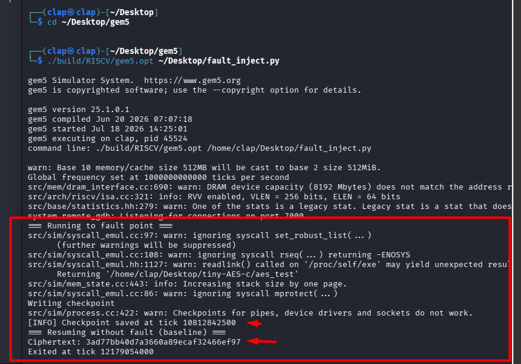

Kết quả trên cho thấy script đã chạy thành công đến ``fault boundary``, tạo checkpoint và tiếp tục thực thi chương trình. Checkpoint được lưu tại tick ``10,812,842,500``, gần với tick mục tiêu (``10,812,745,000``). Sự chênh lệch nhỏ này là do gem5 chỉ có thể dừng mô phỏng tại ``simulation event`` gần nhất thay vì đúng từng tick tuyệt đối.

Sau khi tiếp tục mô phỏng mà không chỉnh sửa checkpoint, chương trình vẫn sinh ra ciphertext đúng (`3ad77bb40d7a3660a89ecaf32466ef97`). Điều này xác nhận rằng việc tạo checkpoint không làm thay đổi trạng thái thực thi của chương trình.

</details>

Script này ``không thực hiện fault injection``, mà chỉ tự động tạo checkpoint tại ``fault boundary``. Checkpoint thu được sau đó được sử dụng trong các thử nghiệm chỉnh sửa trạng thái thực thi ở các mục tiếp theo.

### 7.2. Thách thức

Checkpoint của gem5 lưu lại toàn bộ trạng thái thực thi của hệ thống tại một thời điểm, bao gồm:

```text
CPU registers
Memory pages
Cache state
Pipeline state
```

Tuy nhiên, checkpoint chỉ phản ánh ``trạng thái ở mức kiến trúc (architectural state)`` và không lưu thông tin ở mức ngữ nghĩa của chương trình, chẳng hạn như:

```text
AES state
Round number
SubBytes input
Round key
```

Do đó, mặc dù có thể chỉnh sửa bất kỳ byte nào trong checkpoint, nhưng không thể biết byte nào thực sự tương ứng với ``AES state của Round 9``.

#### 7.2.1. Ý tưởng lựa chọn điểm can thiệp

Để tạo fault mà không sửa mã nguồn AES, nghiên cứu cần xác định thành phần nào trong checkpoint có khả năng ảnh hưởng trực tiếp tới quá trình mã hóa.

Về mặt kiến trúc, checkpoint của gem5 chủ yếu bao gồm ``CPU registers`` và ``memory``. Vì vậy, ba hướng tiếp cận lần lượt được khảo sát:

```text
Checkpoint
      │
      ▼
Candidate 1
Modify CPU Register
      │
      ▼
Candidate 2
Modify Memory
      │
      ▼
Candidate 3
Modify Checkpoint Memory
```

Mỗi hướng đều được thực nghiệm và đánh giá dựa trên hai tiêu chí:

- Có tạo ra faulty ciphertext hay không.
- Fault có thực sự tác động trực tiếp lên AES state theo fault model của DFA hay không.

### 7.3. Attempt 1 – Modify Register `x10`

#### 7.3.1. Giả thuyết

Checkpoint được tạo tại tick ``10,812,745,000``, tương ứng với thời điểm chương trình chuẩn bị thực thi `SubBytes` của Round 9.

Qua quá trình phân tích disassembly ở phần trước, trước khi hàm `SubBytes()` được gọi, đối số đầu tiên của hàm được truyền qua thanh ghi ```x10 (a0)``` theo ``RISC-V Calling Convention``.

Trong cài đặt của ``tiny-AES-c``, đối số này là ``con trỏ tới biến `state```. Do đó, giả thuyết đầu tiên là việc thay đổi giá trị của `x10` có thể làm thay đổi dữ liệu mà `SubBytes()` truy cập, từ đó tạo ra faulty ciphertext mà không cần sửa đổi mã nguồn của AES.

#### 7.3.2. Thực nghiệm
Để kiểm tra cấu trúc của checkpoint, nội dung file `m5.cpt` được trích xuất bằng lệnh:

```
ls ~/Desktop/ckpt_fault/
cat ~/Desktop/ckpt_fault/m5.cpt | grep -A5 -i "regs\|intregs\|pc" | head -60
```

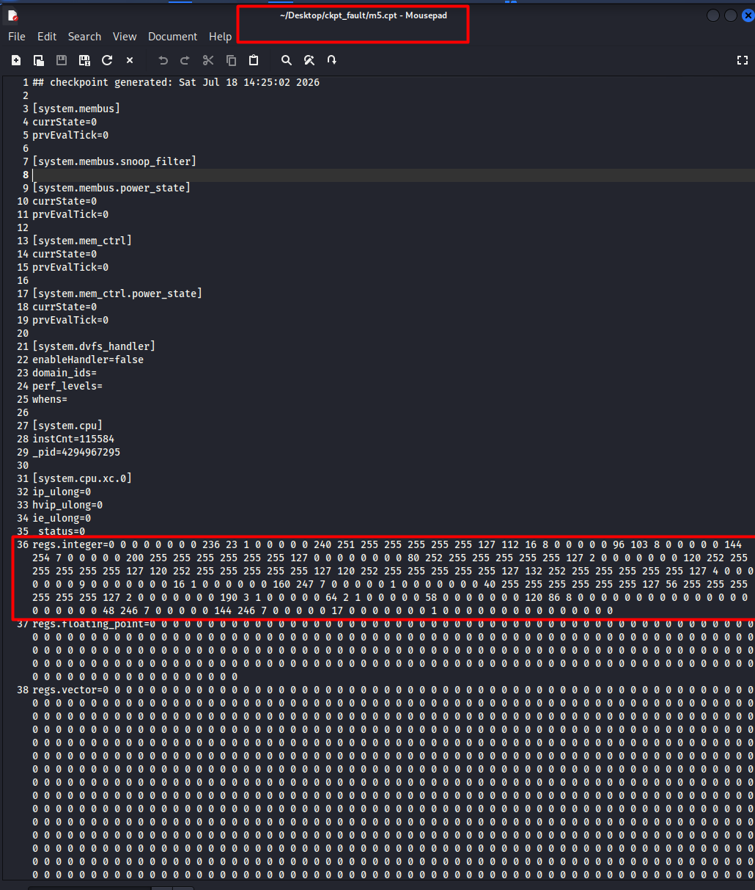

Kết quả cho thấy checkpoint của gem5 lưu trữ đầy đủ trạng thái của CPU tại thời điểm tạo checkpoint, bao gồm các thanh ghi (`regs.integer`, `regs.floating_point`) và bộ đếm chương trình (`_pc`, `_npc`). Điều này xác nhận rằng trạng thái thực thi của chương trình đã được ghi lại và có thể chỉnh sửa trực tiếp trước khi khôi phục (restore). Dựa trên thông tin này, thử nghiệm đầu tiên lựa chọn chỉnh sửa thanh ghi `x10` trong vùng `regs.integer` để đánh giá khả năng đưa fault vào quá trình thực thi của AES.

Sau khi xác nhận checkpoint lưu toàn bộ trạng thái CPU, bước tiếp theo là kiểm tra liệu có thể ``chỉnh sửa trực tiếp nội dung của checkpoint`` trước khi restore hay không.

Quan sát file `m5.cpt` cho thấy các thanh ghi được lưu trong trường `regs.integer`. Thay vì lưu theo tên từng thanh ghi (`x0`, `x1`, `x2`, ...), gem5 lưu toàn bộ các thanh ghi nguyên dưới dạng một dãy byte liên tục. Mỗi thanh ghi của kiến trúc RISC-V 64-bit có kích thước ``8 byte``, do đó vị trí của thanh ghi `x10` được xác định theo công thức `10 × 8 = 80`, tương ứng với các byte từ ``80 đến 87`` trong trường `regs.integer`.

Vì checkpoint thực chất là một tệp văn bản, nên có thể đọc, thay đổi giá trị của một thanh ghi rồi ghi lại vào chính checkpoint.

Dựa trên giả thuyết rằng thanh ghi `x10` có thể đang chứa hoặc tham chiếu tới AES state, một script Python được xây dựng để:

- Đọc trường `regs.integer` từ checkpoint.
- Tính offset của thanh ghi `x10` trong mảng byte (`10 × 8 = 80`).
- Trích xuất giá trị của thanh ghi `x10`.
- Thực hiện phép ``bit flip`` ở bit thấp nhất.
- Ghi giá trị mới trở lại file `m5.cpt`.

Script được sử dụng như sau:

```python
cat > ~/Desktop/modify_ckpt.py << 'EOF'
import struct

ckpt_file = '/home/clap/Desktop/ckpt_fault/m5.cpt'

with open(ckpt_file, 'r') as f:
    content = f.read()

# Parse regs.integer line
lines = content.split('\n')
for i, line in enumerate(lines):
    if line.startswith('regs.integer='):
        vals = list(map(int, line[len('regs.integer='):].split()))
        
        # Mỗi register = 8 bytes, x10 bắt đầu tại index 10`8 = 80
        reg_idx = 10 ` 8
        
        # Đọc x10 (little-endian 8 bytes)
        x10_bytes = bytes(vals[reg_idx:reg_idx+8])
        x10_val = struct.unpack('<Q', x10_bytes)[0]
        print(f"[PRE-FAULT]  x10 = 0x{x10_val:016x}")
        
        # Flip bit 0
        x10_faulty = x10_val ^ 0x01
        print(f"[POST-FAULT] x10 = 0x{x10_faulty:016x}")
        
        # Write back
        faulty_bytes = list(struct.pack('<Q', x10_faulty))
        vals[reg_idx:reg_idx+8] = faulty_bytes
        
        lines[i] = 'regs.integer=' + ' '.join(map(str, vals))
        break

with open(ckpt_file, 'w') as f:
    f.write('\n'.join(lines))

print("[DONE] Checkpoint modified")
EOF

python3 ~/Desktop/modify_ckpt.py
```

Kết quả:

```text
[PRE-FAULT]  x10 = 0x7ffffffffffffc78
[POST-FAULT] x10 = 0x7ffffffffffffc79
```

Kết quả trên cho thấy script đã đọc thành công giá trị của thanh ghi `x10` từ checkpoint, thực hiện phép ``bit flip`` ở bit thấp nhất và ghi lại giá trị mới vào file `m5.cpt`.

Sau khi chỉnh sửa checkpoint, tiến hành khôi phục trạng thái và tiếp tục mô phỏng bằng script `restore_fault.py`.

```python
cat > ~/Desktop/restore_fault.py << 'EOF'
import m5
from m5.objects import `

system = System()
system.clk_domain = SrcClockDomain()
system.clk_domain.clock = '1GHz'
system.clk_domain.voltage_domain = VoltageDomain()

system.mem_mode = 'timing'
system.mem_ranges = [AddrRange('512MB')]

system.cpu = RiscvTimingSimpleCPU()
system.membus = SystemXBar()
system.cpu.icache_port = system.membus.cpu_side_ports
system.cpu.dcache_port = system.membus.cpu_side_ports
system.cpu.createInterruptController()

system.mem_ctrl = MemCtrl()
system.mem_ctrl.dram = DDR3_1600_8x8()
system.mem_ctrl.dram.range = system.mem_ranges[0]
system.mem_ctrl.port = system.membus.mem_side_ports
system.system_port = system.membus.cpu_side_ports

binary = '/home/clap/Desktop/tiny-AES-c/aes_test'
system.workload = SEWorkload.init_compatible(binary)
process = Process()
process.cmd = [binary]
system.cpu.workload = process
system.cpu.createThreads()

root = Root(full_system=False, system=system)
m5.instantiate('/home/clap/Desktop/ckpt_fault')

print("=== Resuming from checkpoint with fault ===")
exit_event = m5.simulate()
print(f"Exited at tick {m5.curTick()}")
EOF
```
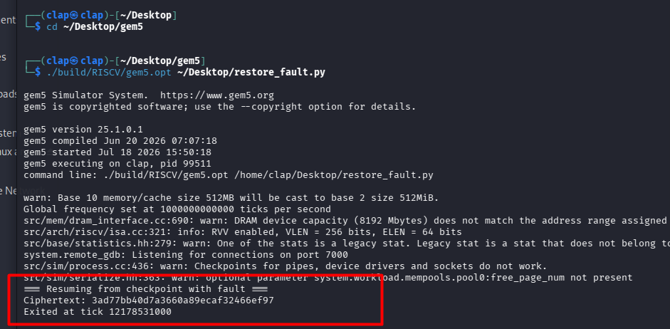

Ciphertext thu được hoàn toàn giống với ciphertext đúng của AES-128, cho thấy việc chỉnh sửa checkpoint không tạo ra lỗi quan sát được trong quá trình mã hóa.

Để kiểm chứng thêm, tiến hành tự động lật lần lượt toàn bộ 64 bit của thanh ghi `x10` và thu thập các faulty ciphertext.

```python
cat > ~/Desktop/collect_faults.py << 'EOF'
import subprocess
import struct
import shutil
import os

CKPT_ORIG = '/home/clap/Desktop/ckpt_fault'
CKPT_WORK = '/home/clap/Desktop/ckpt_work'
GEM5 = '/home/clap/Desktop/gem5/build/RISCV/gem5.opt'
RESTORE_SCRIPT = '/home/clap/Desktop/restore_fault.py'

correct = '3ad77bb40d7a3660a89ecaf32466ef97'
faulty_set = set()

def read_ckpt():
    with open(f'{CKPT_WORK}/m5.cpt', 'r') as f:
        return f.read()

def write_ckpt(content):
    with open(f'{CKPT_WORK}/m5.cpt', 'w') as f:
        f.write(content)

def get_regs(content):
    for line in content.split('\n'):
        if line.startswith('regs.integer='):
            return list(map(int, line[len('regs.integer='):].split()))
    return None

def set_regs(content, vals):
    lines = content.split('\n')
    for i, line in enumerate(lines):
        if line.startswith('regs.integer='):
            lines[i] = 'regs.integer=' + ' '.join(map(str, vals))
            break
    return '\n'.join(lines)

def run_gem5():
    result = subprocess.run(
        [GEM5, RESTORE_SCRIPT],
        capture_output=True, text=True
    )
    for line in result.stdout.split('\n'):
        if 'Ciphertext:' in line:
            return line.split('Ciphertext:')[1].strip()
    return None

print(f"Correct ciphertext: {correct}")
print("Collecting faulty ciphertexts...\n")

# Thử flip từng bit của x10 (8 bytes = 64 bits)
for bit in range(64):
    shutil.copytree(CKPT_ORIG, CKPT_WORK, dirs_exist_ok=True)
    
    content = read_ckpt()
    vals = get_regs(content)
    
    reg_idx = 10 ` 8
    x10_bytes = bytes(vals[reg_idx:reg_idx+8])
    x10_val = struct.unpack('<Q', x10_bytes)[0]
    x10_faulty = x10_val ^ (1 << bit)
    faulty_bytes = list(struct.pack('<Q', x10_faulty))
    vals[reg_idx:reg_idx+8] = faulty_bytes
    
    content = set_regs(content, vals)
    write_ckpt(content)
    
    ct = run_gem5()
    if ct and ct != correct and ct not in faulty_set:
        faulty_set.add(ct)
        print(f"bit {bit:2d}: {ct}")

print(f"\nCollected {len(faulty_set)} unique faulty ciphertexts")

with open('/home/clap/Desktop/faulty_ciphertexts.txt', 'w') as f:
    for ct in faulty_set:
        f.write(ct + '\n')

print("Saved to faulty_ciphertexts.txt")
EOF
```

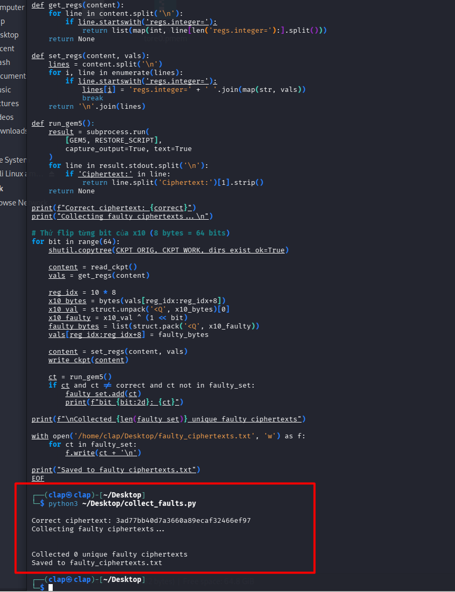

Kết quả trên cho thấy sau khi lần lượt lật toàn bộ ``64 bit`` của thanh ghi `x10` và khôi phục checkpoint, chương trình không tạo ra bất kỳ faulty ciphertext nào. Tất cả các lần thực thi đều cho ra ciphertext giống với kết quả mã hóa đúng, do đó script không thu thập được mẫu lỗi nào để lưu vào `faulty_ciphertexts.txt`.

#### 7.3.3. Phân tích

Kết quả trên cho thấy checkpoint có thể được chỉnh sửa và khôi phục thành công. Tuy nhiên, sau khi tiếp tục mô phỏng, ciphertext thu được vẫn giống hoàn toàn với ciphertext đúng. Đồng thời, thử nghiệm tự động lật toàn bộ 64 bit của thanh ghi `x10` cũng không tạo ra bất kỳ faulty ciphertext nào.

Kết hợp với kết quả phân tích disassembly ở mục trước, có thể xác định rằng `x10` chỉ đóng vai trò là ``thanh ghi truyền tham số`` theo RISC-V Calling Convention, lưu địa chỉ của biến `state` thay vì dữ liệu AES state. Do đó, việc thay đổi giá trị của `x10` không tạo ra lỗi trên AES state tại Round 9 theo fault model của Differential Fault Analysis.

Từ các kết quả thực nghiệm trên, có thể kết luận rằng phương pháp chỉnh sửa checkpoint thông qua thanh ghi `x10` không thể tạo ra các faulty ciphertext phục vụ quá trình khôi phục khóa bằng DFA. Vì vậy, hướng tiếp cận này được xem là ``không phù hợp`` và bị loại bỏ trong nghiên cứu. 

### 7.4. Attempt 2 – Modify Physical Memory

#### 7.4.1. Giả thuyết

Sau Attempt 1, kết quả cho thấy thanh ghi `x10` chỉ đóng vai trò là một con trỏ tới vùng nhớ chứa AES state, thay vì trực tiếp lưu dữ liệu của thuật toán.

Do đó, hướng tiếp theo là xác định địa chỉ vật lý tương ứng với con trỏ này trong checkpoint rồi chỉnh sửa trực tiếp dữ liệu trong file `system.physmem.store0.pmem`.

Nếu vùng nhớ được chỉnh sửa thực sự là AES state của Round 9, việc lật bit trên vùng nhớ này sẽ tạo ra nhiều faulty ciphertext khác nhau để phục vụ Differential Fault Analysis.

Checkpoint vẫn được tạo tại tick:

```text
10,812,745,000
```

#### 7.4.2. Thực nghiệm

Checkpoint được tạo ra bao gồm hai thành phần chính:

- `m5.cpt`: lưu trạng thái CPU, thanh ghi và metadata.
- `system.physmem.store0.pmem`: lưu toàn bộ nội dung physical memory.

```
┌──(clap㉿clap)-[~/Desktop/gem5]
└─$ ls ~/Desktop/ckpt_fault     
m5.cpt  system.physmem.store0.pmem
```

Đầu tiên, thông tin ánh xạ bộ nhớ được trích xuất từ file `m5.cpt`.

```python
cat > ~/Desktop/find_and_fault.py << 'EOF'
import struct
import shutil
import subprocess

CKPT_ORIG = '/home/clap/Desktop/ckpt_fault'
CKPT_WORK = '/home/clap/Desktop/ckpt_work'
GEM5 = '/home/clap/Desktop/gem5/build/RISCV/gem5.opt'
RESTORE_SCRIPT = '/home/clap/Desktop/restore_fault.py'
correct = '3ad77bb40d7a3660a89ecaf32466ef97'

# Virtual address của AES state
VADDR = 0x7ffffffffffffc78

# Với SE mode gem5, virtual = physical cho user stack
# Stack region thường map tại high physical address
# Đọc m5.cpt để tìm mapping
with open(f'{CKPT_ORIG}/m5.cpt', 'r') as f:
    content = f.read()

# Tìm stack info
for line in content.split('\n'):
    if 'stack' in line.lower() or 'mmap' in line.lower():
        print(line)

EOF
```

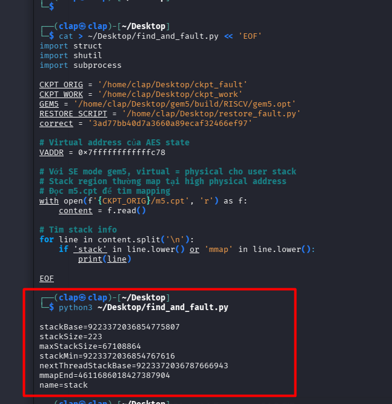

Từ kết quả của Attempt 1, các thanh ghi liên quan đến `state` có giá trị:

```text
x10 = 0x7ffffffffffffc79
x11 = 0x7ffffffffffffc78
x12 = 0x7ffffffffffffc78
```

Trong đó địa chỉ `0x7ffffffffffffc78` được sử dụng để thực hiện ánh xạ từ virtual address sang physical address.

```python
cat > ~/Desktop/find_paddr.py << 'EOF'
# Virtual address cần tìm
VADDR = 0x7ffffffffffffc78
PAGE_SIZE = 4096

# Tìm page chứa vaddr này
vpage = (VADDR // PAGE_SIZE) ` PAGE_SIZE
offset = VADDR % PAGE_SIZE
print(f"Looking for vaddr: 0x{VADDR:016x}")
print(f"Page:   0x{vpage:016x}")
print(f"Offset: 0x{offset:03x}")

with open('/home/clap/Desktop/ckpt_fault/m5.cpt', 'r') as f:
    content = f.read()

lines = content.split('\n')
mappings = []
i = 0
while i < len(lines):
    if lines[i].startswith('vaddr='):
        va = int(lines[i].split('=')[1])
        pa = int(lines[i+1].split('=')[1])
        mappings.append((va, pa))
    i += 1

# Tìm page match
for va, pa in mappings:
    if va == vpage:
        paddr = pa + offset
        print(f"\nFound! paddr = 0x{paddr:016x} ({paddr})")
        break
else:
    # Thử tìm page gần nhất
    print("\nExact page not found, nearby mappings:")
    nearby = [(va, pa) for va, pa in mappings 
              if abs(va - vpage) < 0x10000]
    for va, pa in sorted(nearby):
        print(f"  vaddr=0x{va:016x} paddr=0x{pa:016x}")
EOF
```

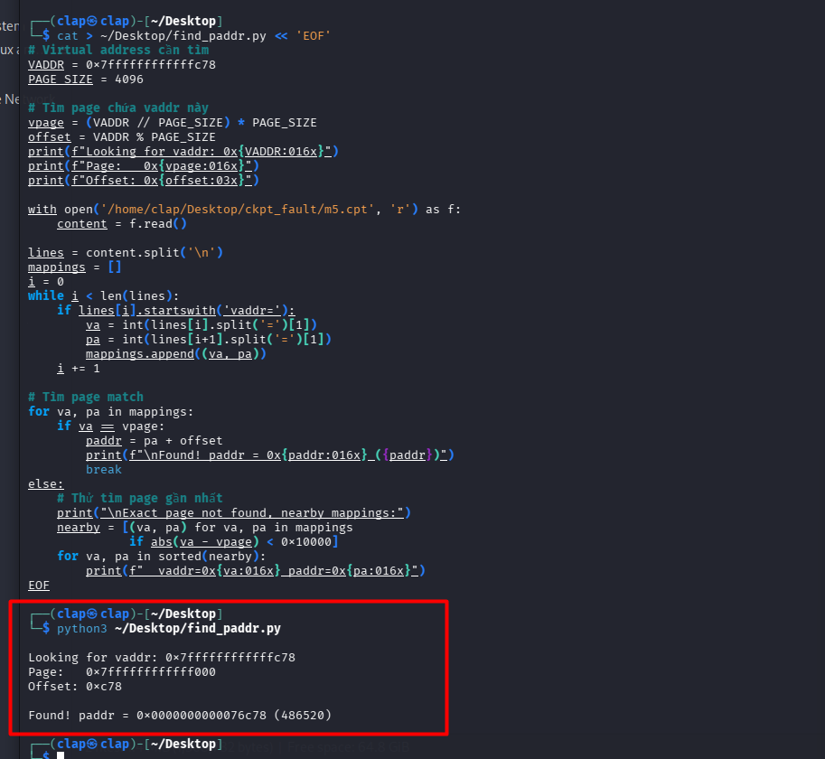

Tiếp theo, một script được xây dựng để kiểm tra vùng nhớ vật lý vừa xác định và thực hiện fault injection trực tiếp trên vùng nhớ này.

Script thực hiện các bước sau:

- Đọc 16 byte dữ liệu tại địa chỉ vật lý `0x76c78`.
- Sao chép checkpoint gốc sang thư mục làm việc.
- Lật một bit trong 16 byte vừa đọc.
- Restore checkpoint.
- Tiếp tục mô phỏng bằng gem5.
- Ghi nhận ciphertext nếu kết quả khác với ciphertext chuẩn.

```python
cat > ~/Desktop/fault_memory.py << 'EOF'
import struct
import shutil
import subprocess

CKPT_ORIG = '/home/clap/Desktop/ckpt_fault'
CKPT_WORK = '/home/clap/Desktop/ckpt_work'
GEM5 = '/home/clap/Desktop/gem5/build/RISCV/gem5.opt'
RESTORE_SCRIPT = '/home/clap/Desktop/restore_fault.py'
correct = '3ad77bb40d7a3660a89ecaf32466ef97'
PMEM_FILE = 'system.physmem.store0.pmem'
PADDR = 0x76c78  # base của AES state (16 bytes)

def run_gem5():
    result = subprocess.run([GEM5, RESTORE_SCRIPT],
                           capture_output=True, text=True)
    for line in result.stdout.split('\n'):
        if 'Ciphertext:' in line:
            return line.split('Ciphertext:')[1].strip()
    return None

# Đọc AES state hiện tại
with open(f'{CKPT_ORIG}/{PMEM_FILE}', 'rb') as f:
    f.seek(PADDR)
    state = f.read(16)

print("AES state at round 9:")
print(' '.join(f'{b:02x}' for b in state))

faulty_set = set()

# Flip từng bit của 16 bytes AES state
for byte_idx in range(16):
    for bit in range(8):
        shutil.copytree(CKPT_ORIG, CKPT_WORK, dirs_exist_ok=True)
        
        with open(f'{CKPT_WORK}/{PMEM_FILE}', 'r+b') as f:
            f.seek(PADDR + byte_idx)
            orig = f.read(1)[0]
            flipped = orig ^ (1 << bit)
            f.seek(PADDR + byte_idx)
            f.write(bytes([flipped]))
        
        ct = run_gem5()
        if ct and ct != correct and ct not in faulty_set:
            faulty_set.add(ct)
            print(f"byte={byte_idx} bit={bit}: {ct}")

print(f"\nCollected {len(faulty_set)} unique faulty ciphertexts")

with open('/home/clap/Desktop/faulty_ciphertexts.txt', 'w') as f:
    for ct in faulty_set:
        f.write(ct + '\n')

print("Saved to faulty_ciphertexts.txt")
EOF
```

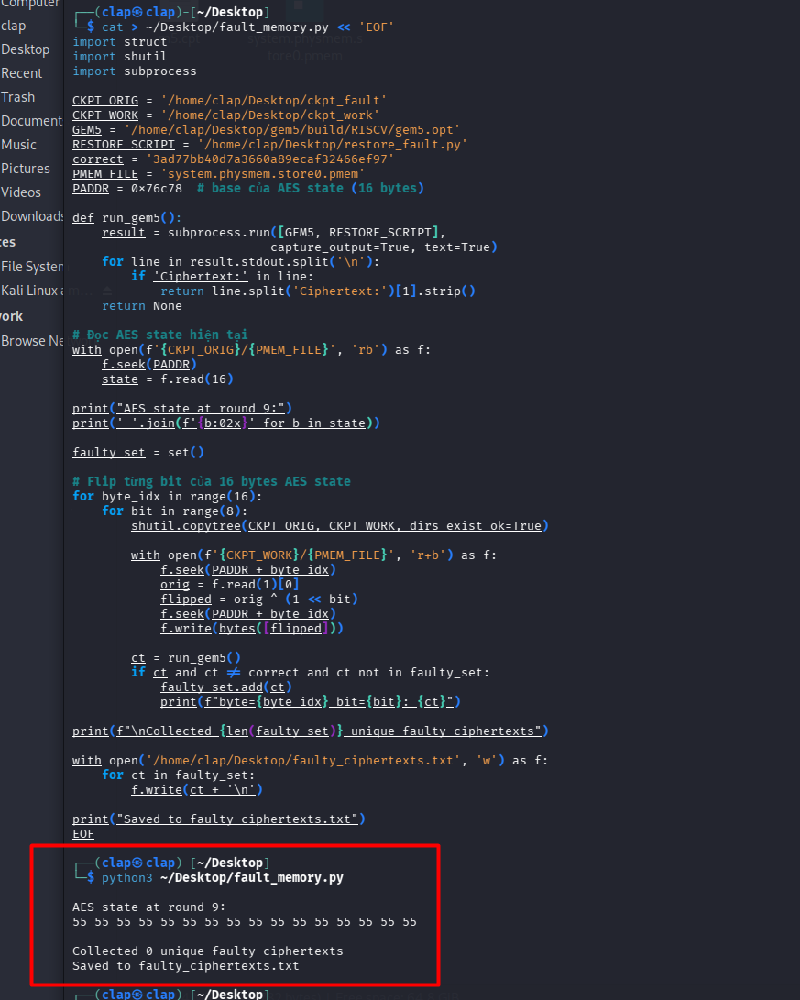

Kết quả trên cho thấy không có bất kỳ faulty ciphertext nào được tạo ra sau khi thực hiện fault injection trên toàn bộ 16 byte tại địa chỉ vật lý `0x76c78`.

Đồng thời, dữ liệu đọc được tại địa chỉ này chỉ bao gồm các giá trị lặp (`0x55`), thay vì trạng thái trung gian của AES vốn được kỳ vọng sẽ có phân bố gần như ngẫu nhiên sau nhiều vòng biến đổi.

Điều này cho thấy địa chỉ vật lý được suy ra từ virtual-to-physical mapping nhiều khả năng không phải là vùng nhớ chứa AES state tại thời điểm thực hiện Round 9.

### 7.4.3. Phân tích

Mặc dù virtual-to-physical mapping được thực hiện thành công và có thể xác định được một địa chỉ vật lý tương ứng với con trỏ `x10`, việc chỉnh sửa trực tiếp dữ liệu tại địa chỉ này không tạo ra bất kỳ ảnh hưởng nào đến kết quả mã hóa.

Ngoài ra, giá trị lưu trong vùng nhớ này không ổn định giữa các checkpoint (lần lượt xuất hiện các mẫu `0xaa` và `0x55`), cho thấy đây không phải vùng dữ liệu mà thuật toán AES đang thao tác tại fault boundary.

Nguyên nhân có thể là checkpoint được lưu khi chương trình mới bước vào hàm `SubBytes`, trong khi stack frame và vùng nhớ chứa AES state vẫn chưa được thiết lập hoàn chỉnh hoặc con trỏ `x10` chưa trỏ trực tiếp tới dữ liệu cần sửa đổi.

Do đó, phương pháp chỉnh sửa trực tiếp file `system.physmem.store0.pmem` không thể tạo ra các faulty ciphertext theo fault model của Differential Fault Analysis.

Từ kết quả này, hướng tiếp cận tiếp theo là thay đổi ``thời điểm tạo checkpoint``, nhằm đảm bảo checkpoint được lưu sau khi AES state đã được khởi tạo đầy đủ trong bộ nhớ.

---

### 7.5. Attempt 3 – Save Checkpoint Later

#### 7.5.1. Giả thuyết

Sau hai attempt đầu, một giả thuyết mới được đặt ra là checkpoint được tạo quá sớm.

Mặc dù checkpoint nằm tại thời điểm chương trình chuẩn bị thực hiện SubBytes() của Round 9, nhưng AES state có thể vẫn chưa được khởi tạo hoàn chỉnh trong stack frame hoặc chưa được nạp vào vùng nhớ mà Cipher() sử dụng.

Do đó, thay vì tạo checkpoint đúng tại fault boundary, thời điểm checkpoint được dịch muộn hơn nhằm đi sâu hơn vào quá trình thực thi của SubBytes().

#### 7.5.2. Thực nghiệm

Để tạo checkpoint sau khi chương trình đã đi sâu hơn vào hàm `SubBytes()`, thời điểm mô phỏng được dịch thêm một khoảng nhỏ so với fault boundary ban đầu.

Checkpoint ban đầu được tạo tại tick:

```text
10,812,745,000
```

Trong attempt này, checkpoint được dịch thêm `50,000 ticks`:

```python
FAULT_TICK = 10812745000 + 50000
```

Khoảng dịch `50,000 ticks` được lựa chọn nhằm đảm bảo CPU đã bắt đầu thực thi các lệnh bên trong `SubBytes()`, nhưng vẫn còn nằm trong Round 9 của thuật toán AES. Mục tiêu của việc dịch checkpoint là kiểm tra xem AES state đã được khởi tạo đầy đủ trong bộ nhớ hay chưa trước khi tiến hành fault injection.

```python
cat > ~/Desktop/fault_inject2.py << 'EOF'
import m5
from m5.objects import `

system = System()
system.clk_domain = SrcClockDomain()
system.clk_domain.clock = '1GHz'
system.clk_domain.voltage_domain = VoltageDomain()
system.mem_mode = 'timing'
system.mem_ranges = [AddrRange('512MB')]
system.cpu = RiscvTimingSimpleCPU()
system.membus = SystemXBar()
system.cpu.icache_port = system.membus.cpu_side_ports
system.cpu.dcache_port = system.membus.cpu_side_ports
system.cpu.createInterruptController()
system.mem_ctrl = MemCtrl()
system.mem_ctrl.dram = DDR3_1600_8x8()
system.mem_ctrl.dram.range = system.mem_ranges[0]
system.mem_ctrl.port = system.membus.mem_side_ports
system.system_port = system.membus.cpu_side_ports

binary = '/home/clap/Desktop/tiny-AES-c/aes_test'
system.workload = SEWorkload.init_compatible(binary)
process = Process()
process.cmd = [binary]
system.cpu.workload = process
system.cpu.createThreads()

root = Root(full_system=False, system=system)
m5.instantiate()

# Round 9 SubBytes call tại tick 10812745000
# Chạy thêm 1000 ticks vào bên trong SubBytes
FAULT_TICK = 10812745000 + 50000

print("=== Running to inside SubBytes round 9 ===")
m5.simulate(FAULT_TICK - m5.curTick())

import os
ckpt_dir = '/home/clap/Desktop/ckpt_fault2'
os.makedirs(ckpt_dir, exist_ok=True)
m5.checkpoint(ckpt_dir)
print(f"[INFO] Checkpoint saved at tick {m5.curTick()}")

exit_event = m5.simulate()
print(f"Exited at tick {m5.curTick()}")
EOF
```

Sau khi chạy mô phỏng với thời điểm checkpoint mới, gem5 tiếp tục thực thi chương trình đến `FAULT_TICK`, tạo checkpoint mới và sau đó hoàn tất quá trình mã hóa AES.

Kết quả thực thi như sau:

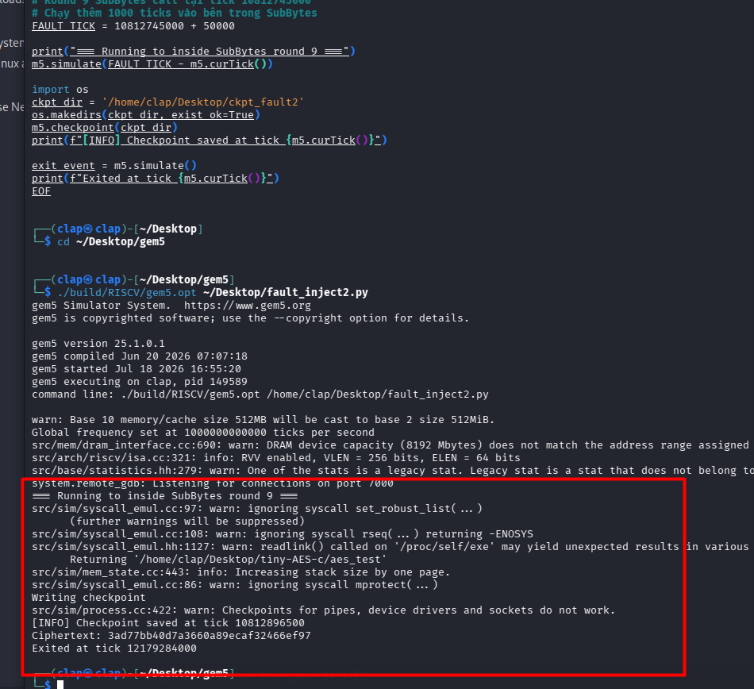

Kết quả cho thấy checkpoint đã được tạo thành công tại tick `10,812,896,500`, tức muộn hơn so với checkpoint ban đầu và nằm sâu hơn trong quá trình thực thi của `SubBytes()`.

Đồng thời, ciphertext cuối cùng vẫn trùng khớp với ciphertext chuẩn:

```text
3ad77bb40d7a3660a89ecaf32466ef97
```

Điều này cho thấy việc thay đổi thời điểm lưu checkpoint không làm thay đổi quá trình thực thi của thuật toán AES và checkpoint mới vẫn có thể được sử dụng cho các bước phân tích tiếp theo.

Checkpoint mới sau đó được sử dụng để xác định lại vùng nhớ vật lý tương ứng với AES state và đọc dữ liệu tại vùng nhớ này.

```python
cat > ~/Desktop/find_state2.py << 'EOF'
import struct

CKPT = '/home/clap/Desktop/ckpt_fault2'
PAGE_SIZE = 4096

with open(f'{CKPT}/m5.cpt', 'r') as f:
    content = f.read()

mappings = {}
lines = content.split('\n')
for i, line in enumerate(lines):
    if line.startswith('vaddr='):
        va = int(line.split('=')[1])
        pa = int(lines[i+1].split('=')[1])
        mappings[va] = pa

def virt_to_phys(vaddr):
    page = (vaddr // PAGE_SIZE) ` PAGE_SIZE
    offset = vaddr % PAGE_SIZE
    if page in mappings:
        return mappings[page] + offset
    return None

def read_pmem(paddr, size):
    with open(f'{CKPT}/system.physmem.store0.pmem', 'rb') as f:
        f.seek(paddr)
        return f.read(size)

# Đọc registers từ checkpoint mới
for line in lines:
    if line.startswith('regs.integer='):
        vals = list(map(int, line.split('=')[1].split()))
        regs = []
        for i in range(32):
            b = bytes(vals[i`8:(i+1)`8])
            regs.append(struct.unpack('<Q', b)[0])
        break

s0 = regs[8]
a0 = regs[10]
print(f"s0 = 0x{s0:016x}")
print(f"a0 = 0x{a0:016x}")

# Thử a0 trực tiếp — SubBytes nhận state pointer qua a0
for name, vaddr in [('a0', a0), ('s0-40', s0-40), ('s0-48', s0-48)]:
    pa = virt_to_phys(vaddr)
    if pa:
        data = read_pmem(pa, 16)
        print(f"{name} (0x{vaddr:016x} -> 0x{pa:08x}): {' '.join(f'{b:02x}' for b in data)}")
    else:
        # Try reading pointer first
        ptr_pa = virt_to_phys(vaddr)
        print(f"{name}: no mapping found")
EOF
```

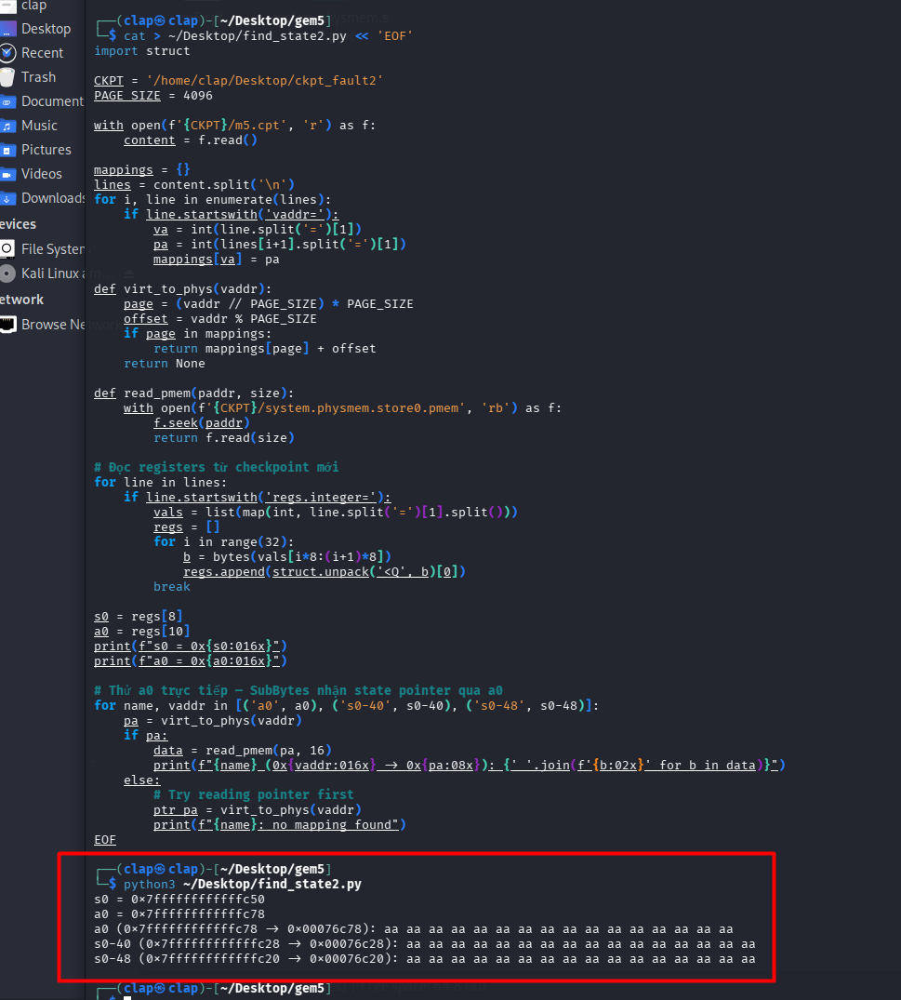

Kết quả cho thấy cả ba vùng nhớ được kiểm tra đều chỉ chứa giá trị 0xaa. Điều này cho thấy mặc dù checkpoint đã được lưu muộn hơn, các địa chỉ được suy ra từ các thanh ghi a0 và s0 vẫn không chứa dữ liệu có đặc trưng của AES state.

Tuy nhiên, chỉ quan sát nội dung bộ nhớ vẫn chưa đủ để kết luận rằng đây không phải vùng dữ liệu đang được thuật toán sử dụng. Vì vậy, cần tiếp tục kiểm chứng bằng cách thực hiện fault injection trực tiếp trên vùng nhớ này và quan sát ảnh hưởng tới ciphertext.

```python
cat > ~/Desktop/fault_memory.py << 'EOF'
import struct
import shutil
import subprocess

CKPT_ORIG = '/home/clap/Desktop/ckpt_fault'
CKPT_WORK = '/home/clap/Desktop/ckpt_work'
GEM5 = '/home/clap/Desktop/gem5/build/RISCV/gem5.opt'
RESTORE_SCRIPT = '/home/clap/Desktop/restore_fault.py'
correct = '3ad77bb40d7a3660a89ecaf32466ef97'
PMEM_FILE = 'system.physmem.store0.pmem'
PADDR = 0x76c78  # base của AES state (16 bytes)

def run_gem5():
    result = subprocess.run([GEM5, RESTORE_SCRIPT],
                           capture_output=True, text=True)
    for line in result.stdout.split('\n'):
        if 'Ciphertext:' in line:
            return line.split('Ciphertext:')[1].strip()
    return None

# Đọc AES state hiện tại
with open(f'{CKPT_ORIG}/{PMEM_FILE}', 'rb') as f:
    f.seek(PADDR)
    state = f.read(16)

print("AES state at round 9:")
print(' '.join(f'{b:02x}' for b in state))

faulty_set = set()

# Flip từng bit của 16 bytes AES state
for byte_idx in range(16):
    for bit in range(8):
        shutil.copytree(CKPT_ORIG, CKPT_WORK, dirs_exist_ok=True)
        
        with open(f'{CKPT_WORK}/{PMEM_FILE}', 'r+b') as f:
            f.seek(PADDR + byte_idx)
            orig = f.read(1)[0]
            flipped = orig ^ (1 << bit)
            f.seek(PADDR + byte_idx)
            f.write(bytes([flipped]))
        
        ct = run_gem5()
        if ct and ct != correct and ct not in faulty_set:
            faulty_set.add(ct)
            print(f"byte={byte_idx} bit={bit}: {ct}")

print(f"\nCollected {len(faulty_set)} unique faulty ciphertexts")

with open('/home/clap/Desktop/faulty_ciphertexts.txt', 'w') as f:
    for ct in faulty_set:
        f.write(ct + '\n')

print("Saved to faulty_ciphertexts.txt")
EOF
```

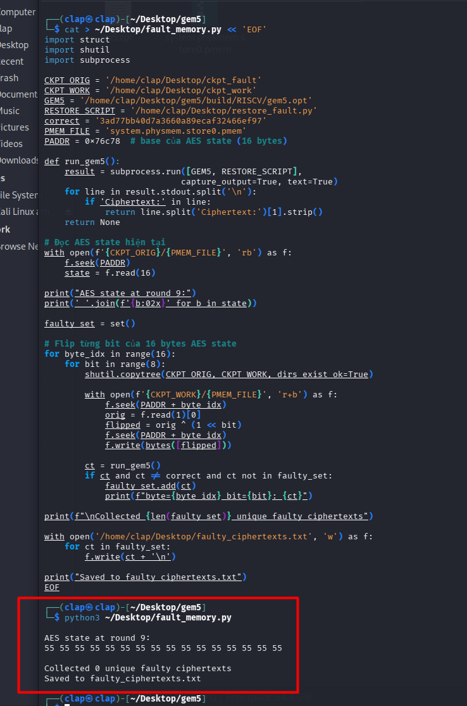

Mặc dù mẫu dữ liệu trong bộ nhớ đã thay đổi từ 0xaa sang 0x55 sau khi checkpoint được dịch muộn hơn, việc lật toàn bộ 128 bit của vùng nhớ này vẫn không tạo ra bất kỳ faulty ciphertext nào.

Kết quả này cho thấy vùng nhớ đang được chỉnh sửa không phải là AES state được sử dụng bởi hàm SubBytes() tại thời điểm fault injection. Nói cách khác, việc thay đổi thời điểm lưu checkpoint chưa giải quyết được vấn đề xác định chính xác vị trí của AES state trong bộ nhớ.

### 7.6. Tổng kết

Ba hướng tiếp cận trong giai đoạn checkpoint-based fault injection được tóm tắt trong Bảng dưới đây.

| Attempt | Checkpoint Tick | Mục tiêu | Kết quả |
|----------|----------------:|----------|----------|
| Modify Register | 10,812,745,000 | Thay đổi giá trị thanh ghi `x10` nhằm tác động tới AES state | Checkpoint được chỉnh sửa và restore thành công, nhưng không tạo được tập faulty ciphertext phục vụ DFA |
| Modify Physical Memory | 10,812,745,000 | Ánh xạ virtual address sang physical memory và chỉnh sửa trực tiếp vùng nhớ | Chỉ quan sát được mẫu dữ liệu `0xaa`; fault injection không tạo được faulty ciphertext |
| Save Checkpoint Later | 10,812,896,500 | Dịch thời điểm tạo checkpoint vào sâu hơn trong `SubBytes()` | Mẫu dữ liệu thay đổi thành `0x55`, tuy nhiên vẫn không xác định được AES state và không thu được faulty ciphertext |

Các thử nghiệm trên cho thấy checkpoint của gem5 có thể được tạo, chỉnh sửa và khôi phục thành công, đồng thời chương trình vẫn tiếp tục thực thi bình thường sau khi restore. Điều này chứng minh rằng cơ chế checkpoint hoàn toàn có thể được sử dụng để can thiệp vào trạng thái thực thi của chương trình.

Tuy nhiên, cả ba hướng tiếp cận đều gặp cùng một trở ngại: ``không thể xác định chính xác vị trí của AES state tại Round 9 trong dữ liệu của checkpoint``. Mặc dù đã thử chỉnh sửa thanh ghi, ánh xạ sang bộ nhớ vật lý và thay đổi thời điểm tạo checkpoint, các vùng nhớ quan sát được chỉ chứa các mẫu dữ liệu như `0xaa` hoặc `0x55` và không phản ánh trạng thái trung gian của thuật toán AES.

Bên cạnh đó, các thử nghiệm fault injection trên các vùng nhớ này đều không tạo được tập faulty ciphertext hợp lệ. Điều này cho thấy các byte được chỉnh sửa không phải là AES state mà hàm `SubBytes()` đang xử lý tại thời điểm fault injection.

Do đó, checkpoint-based fault injection không đáp ứng được yêu cầu của Differential Fault Analysis, trong đó fault phải được chèn trực tiếp vào AES state của Round 9 để tạo ra các faulty ciphertext phục vụ quá trình khôi phục khóa.

Vì lý do đó, nghiên cứu chuyển sang hướng tiếp cận thứ hai là ``source-level fault injection``, trong đó fault được chèn trực tiếp vào biến `state` bên trong hàm `Cipher()` ngay trước khi thực hiện phép biến đổi `SubBytes()` của Round 9. Cách tiếp cận này loại bỏ hoàn toàn bài toán ánh xạ giữa execution state của gem5 và trạng thái logic của thuật toán AES, đồng thời bảo đảm fault được đưa vào đúng vị trí theo fault model của PhoenixAES.

---

## 8. Approach 2: Source-level Fault Hook

Các thử nghiệm ở phần trước cho thấy checkpoint có thể được tạo và khôi phục thành công trong gem5. Tuy nhiên, việc chỉnh sửa thanh ghi và bộ nhớ tại checkpoint vẫn chưa xác định được một cách đáng tin cậy vị trí của `AES state` trong bộ nhớ tại thời điểm thực thi `Round 9`. Do đó, mặc dù fault có thể được đưa vào trạng thái của hệ thống, vẫn chưa thể khẳng định fault được đặt đúng vị trí mà mô hình Differential Fault Analysis (DFA) yêu cầu.

Để giải quyết vấn đề này, nghiên cứu chuyển sang phân tích trực tiếp mã nguồn của `tiny-AES-c`. Thay vì tiếp tục suy luận vị trí của `AES state` từ checkpoint, mục tiêu là xác định chính xác luồng thực thi của thuật toán AES, từ đó lựa chọn vị trí phù hợp để chèn fault hook.

Quá trình thực hiện được chia thành các bước sau:

```text
Phân tích mã nguồn Cipher()
          │
          ▼
Xác định vị trí Round 9
          │
          ▼
Chèn fault hook trước SubBytes()
          │
          ▼
Compile thành RISC-V binary
          │
          ▼
Thực thi trên gem5
          │
          ▼
Thu thập Faulty Ciphertexts
```

Khác với phương pháp checkpoint-based fault injection, cách tiếp cận này không còn phụ thuộc vào việc ánh xạ `AES state` từ dữ liệu checkpoint. Thay vào đó, fault được đưa trực tiếp vào đúng vị trí trong luồng thực thi của thuật toán AES, trong khi toàn bộ chương trình vẫn được biên dịch thành `RISC-V binary` và thực thi trên gem5 giống như các phần trước.

### 8.1. Phân tích hàm `Cipher()`

Trước khi chèn fault hook, cần xác định cấu trúc của hàm `Cipher()` trong `tiny-AES-c` cũng như vị trí của vòng lặp thực hiện các round của AES.

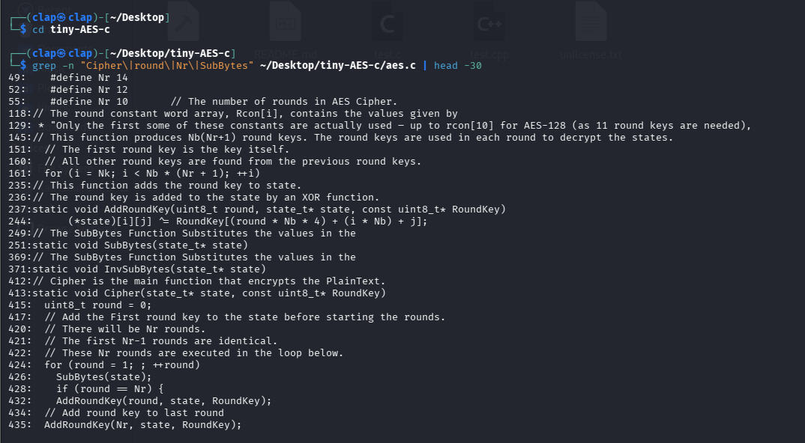

Kết quả cho thấy:

- `Nr = 10`, tương ứng với số vòng của AES-128.
- Hàm `Cipher()` bắt đầu tại dòng 413.
- Vòng lặp xử lý các round bắt đầu tại dòng 424.
- `SubBytes()` được gọi bên trong vòng lặp của mỗi round.

Để quan sát chi tiết luồng thực thi của thuật toán, tiếp tục hiển thị phần thân của hàm `Cipher()`.

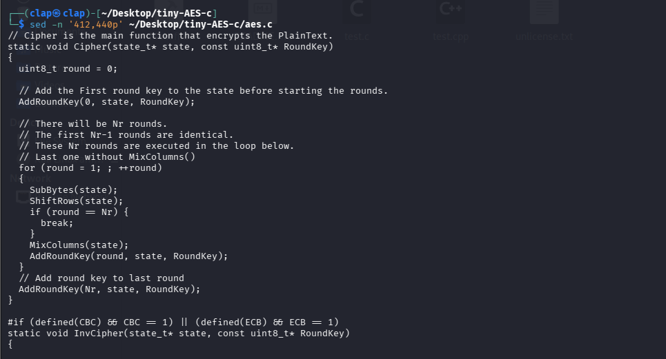

Quan sát mã nguồn cho thấy mỗi vòng AES đều thực hiện các phép biến đổi theo thứ tự:

```text
SubBytes()
      │
      ▼
ShiftRows()
      │
      ▼
MixColumns()
      │
      ▼
AddRoundKey()
```

Theo fault model của PhoenixAES, fault cần được đưa vào ``ngay trước `SubBytes()` của Round 9``. Vì vậy, thay vì sửa đổi trạng thái của chương trình thông qua checkpoint, nghiên cứu lựa chọn chèn trực tiếp một fault hook vào vị trí này trong mã nguồn của hàm `Cipher()`.

### 8.2. Patch `aes.c`

Sau khi xác định được vị trí cần tác động, bước tiếp theo là vá mã nguồn của `tiny-AES-c` để bổ sung fault hook. Thay vì chỉnh sửa thủ công, quá trình này được tự động hóa bằng một script Python nhằm đảm bảo việc patch có thể được lặp lại một cách nhất quán.

``Code:`` Chạy script patch `aes.c`.

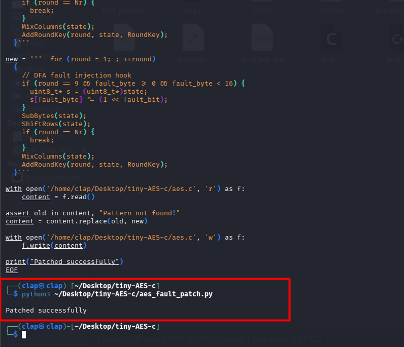

Sau khi patch hoàn tất, kiểm tra lại hàm `Cipher()` cho thấy fault hook đã được chèn thành công ngay trước lời gọi `SubBytes()`.

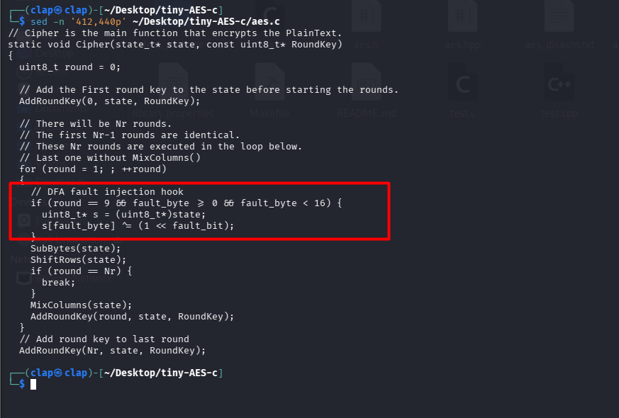

Fault hook được đặt ``ngay trước `SubBytes()` của Round 9``, đúng với `fault boundary` đã xác định ở bước phân tích.

Trong đoạn mã này:

- `round == 9` đảm bảo fault chỉ được đưa vào Round 9.
- `fault_byte` xác định byte của `AES state` sẽ bị tác động.
- `fault_bit` xác định bit cần lật trong byte đã chọn.
- `s[fault_byte] ^= (1 << fault_bit)` thực hiện thao tác ``flip một bit`` trên `AES state`.

Nhờ đó, mỗi lần thực thi chỉ tạo ra ``một single-bit fault``, phù hợp với fault model được sử dụng trong Differential Fault Analysis.

### 8.3. Chuẩn bị chương trình thử nghiệm

Sau khi bổ sung fault hook vào `aes.c`, cần chuẩn bị một chương trình thử nghiệm để khởi tạo dữ liệu đầu vào và truyền vị trí fault vào quá trình mã hóa.

Trong nghiên cứu này, một file `aes_main.c` mới được tạo. Chương trình vẫn sử dụng cùng khóa bí mật (key) và plaintext theo ``NIST Known Answer Test`` như các phần trước nhằm đảm bảo tính nhất quán của quá trình thực nghiệm. Điểm khác biệt là chương trình bổ sung hai biến toàn cục `fault_byte` và `fault_bit`, cho phép xác định vị trí fault trước khi bắt đầu quá trình mã hóa.

Các giá trị này được lấy từ hai environment variables `FAULT_BYTE` và `FAULT_BIT`, sau đó được fault hook trong `aes.c` sử dụng để lật đúng một bit của `AES state` tại Round 9.

```c
cat > ~/Desktop/tiny-AES-c/aes_main.c << 'EOF'
#include <stdio.h>
#include <string.h>
#include <stdlib.h>
#include "aes.h"

int fault_byte = -1;
int fault_bit  = 0;

int main() {
    uint8_t key[16] = {
        0x2b, 0x7e, 0x15, 0x16, 0x28, 0xae, 0xd2, 0xa6,
        0xab, 0xf7, 0x15, 0x88, 0x09, 0xcf, 0x4f, 0x3c
    };
    uint8_t plaintext[16] = {
        0x6b, 0xc1, 0xbe, 0xe2, 0x2e, 0x40, 0x9f, 0x96,
        0xe9, 0x3d, 0x7e, 0x11, 0x73, 0x93, 0x17, 0x2a
    };

    char `fb = getenv("FAULT_BYTE");
    char `fi = getenv("FAULT_BIT");
    if (fb) fault_byte = atoi(fb);
    if (fi) fault_bit  = atoi(fi);

    struct AES_ctx ctx;
    AES_init_ctx(&ctx, key);

    uint8_t buf[16];
    memcpy(buf, plaintext, 16);
    AES_ECB_encrypt(&ctx, buf);

    printf("Ciphertext: ");
    for (int i = 0; i < 16; i++) printf("%02x", buf[i]);
    printf("\n");

    return 0;
}
EOF
```

Trong chương trình trên, `FAULT_BYTE` xác định byte của `AES state` sẽ bị tác động, còn `FAULT_BIT` xác định bit cần lật trong byte đó. Hai giá trị này được đọc trước khi bắt đầu quá trình mã hóa và lưu vào hai biến toàn cục `fault_byte` và `fault_bit`. Fault hook trong `aes.c` sẽ sử dụng hai biến này để quyết định có thực hiện fault injection hay không và nếu có thì tác động vào vị trí nào. Nhờ đó, cùng một RISC-V binary có thể được thực thi nhiều lần với các vị trí fault khác nhau mà không cần chỉnh sửa lại mã nguồn.

### 8.4. Biên dịch chương trình

Sau khi tạo chương trình thử nghiệm, bước tiếp theo là biên dịch lại toàn bộ dự án để tạo RISC-V binary sử dụng trong gem5.

``Code:`` Biên dịch chương trình.

```bash
cd ~/Desktop/tiny-AES-c

riscv64-linux-gnu-gcc -O0 -g -static \
    -o aes_test aes_main.c aes.c -I.
```

Lệnh trên tạo file thực thi `aes_test` dành cho kiến trúc RISC-V. Do được biên dịch bằng `riscv64-linux-gnu-gcc`, binary này không thể chạy trực tiếp trên máy host x86_64 mà sẽ được sử dụng ở bước tiếp theo trong môi trường mô phỏng gem5.

---

## 9. Thu thập các ciphertext lỗi

Sau khi fault hook được tích hợp vào `Cipher()`, bước tiếp theo là thu thập tập `faulty ciphertexts` phục vụ cho quá trình Differential Fault Analysis (DFA).

Trong nghiên cứu này, fault model được sử dụng là ``single-bit fault``, tức mỗi lần thực thi chỉ lật ``một bit`` của ``một byte`` trong `AES state` ngay trước `SubBytes()` của Round 9.

AES state gồm 16 byte, mỗi byte có 8 bit, do đó toàn bộ không gian fault gồm:

```text
16 bytes × 8 bits = 128 fault positions
```

Để bao phủ toàn bộ fault space, chương trình cần được thực thi ``128 lần``, tương ứng với tất cả các cặp (`FAULT_BYTE`, `FAULT_BIT`). Mỗi lần thực thi chỉ inject một fault duy nhất và sinh ra một faulty ciphertext.

Thay vì thay đổi mã nguồn hoặc biên dịch lại chương trình sau mỗi lần inject fault, quá trình này được tự động hóa bằng một Python script. Script sẽ lần lượt truyền giá trị `FAULT_BYTE` và `FAULT_BIT` vào gem5 thông qua environment variables, chạy chương trình AES, thu thập ciphertext và lưu lại kết quả.

Pipeline của quá trình thu thập được mô tả như sau:

```text
Select (FAULT_BYTE, FAULT_BIT)
            │
            ▼
Generate gem5 configuration
            │
            ▼
Run AES trên gem5
            │
            ▼
Inject fault tại Round 9
            │
            ▼
Sinh Faulty Ciphertext
            │
            ▼
Lưu kết quả
            │
            ▼
Lặp lại cho 128 vị trí fault
```

### 9.1. Automation Script

Quá trình thu thập dữ liệu được tự động hóa bằng script `collect_faults2.py`.

Script có nhiệm vụ:

- duyệt toàn bộ 128 vị trí fault;
- tạo file cấu hình gem5 tương ứng với từng vị trí;
- truyền `FAULT_BYTE` và `FAULT_BIT` thông qua environment variables;
- chạy gem5;
- đọc ciphertext từ output của chương trình;
- loại bỏ ciphertext đúng;
- lưu các faulty ciphertext vào file.

```python
cat > ~/Desktop/collect_faults2.py << 'EOF'
import subprocess

GEM5 = '/home/clap/Desktop/gem5/build/RISCV/gem5.opt'
correct = '3ad77bb40d7a3660a89ecaf32466ef97'
faulty_set = set()

def run_gem5(fault_byte=-1, fault_bit=0):
    # Tạo script tạm với env vars
    script = f'''
import m5
from m5.objects import `

system = System()
system.clk_domain = SrcClockDomain()
system.clk_domain.clock = '1GHz'
system.clk_domain.voltage_domain = VoltageDomain()
system.mem_mode = 'timing'
system.mem_ranges = [AddrRange('512MB')]
system.cpu = RiscvTimingSimpleCPU()
system.membus = SystemXBar()
system.cpu.icache_port = system.membus.cpu_side_ports
system.cpu.dcache_port = system.membus.cpu_side_ports
system.cpu.createInterruptController()
system.mem_ctrl = MemCtrl()
system.mem_ctrl.dram = DDR3_1600_8x8()
system.mem_ctrl.dram.range = system.mem_ranges[0]
system.mem_ctrl.port = system.membus.mem_side_ports
system.system_port = system.membus.cpu_side_ports

binary = '/home/clap/Desktop/tiny-AES-c/aes_test'
system.workload = SEWorkload.init_compatible(binary)
process = Process()
process.cmd = [binary]
process.env = ['FAULT_BYTE={fault_byte}', 'FAULT_BIT={fault_bit}']
system.cpu.workload = process
system.cpu.createThreads()

root = Root(full_system=False, system=system)
m5.instantiate()
m5.simulate()
'''
    with open('/tmp/gem5_run.py', 'w') as f:
        f.write(script)

    result = subprocess.run([GEM5, '/tmp/gem5_run.py'],
                           capture_output=True, text=True)
    for line in result.stdout.split('\n'):
        if 'Ciphertext:' in line:
            return line.split('Ciphertext:')[1].strip()
    return None

print(f"Correct: {correct}")
print("Collecting faults...\n")

for byte_idx in range(16):
    for bit in range(8):
        ct = run_gem5(byte_idx, bit)
        if ct and ct != correct and ct not in faulty_set:
            faulty_set.add(ct)
            print(f"byte={byte_idx} bit={bit}: {ct}")

print(f"\nTotal: {len(faulty_set)} faulty ciphertexts")

with open('/home/clap/Desktop/faulty_ciphertexts.txt', 'w') as f:
    for ct in faulty_set:
        f.write(ct + '\n')
print("Saved to faulty_ciphertexts.txt")
EOF
```

Script trên sử dụng hai vòng lặp lồng nhau để duyệt toàn bộ 16 byte và 8 bit của AES state. Với mỗi lần lặp, một file cấu hình gem5 tạm thời sẽ được tạo ra, trong đó hai environment variables `FAULT_BYTE` và `FAULT_BIT` được truyền vào chương trình AES.

Sau khi gem5 hoàn thành mô phỏng, script sẽ đọc ciphertext từ standard output. Nếu ciphertext khác với ciphertext đúng và chưa xuất hiện trước đó thì sẽ được thêm vào tập `faulty_set`. Cuối cùng, toàn bộ faulty ciphertexts được ghi vào file `faulty_ciphertexts.txt` để sử dụng cho bước DFA.

### 9.2. Kết quả

Sau 128 lần thực thi, chương trình thu được 128 faulty ciphertexts.

Một phần kết quả được trình bày dưới đây:

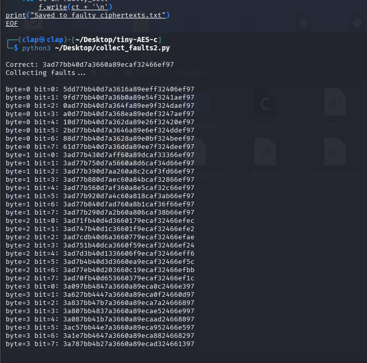

```text
byte=0 bit=0: 5dd77bb40d7a3616a89eeff32406ef97
byte=0 bit=1: 9fd77bb40d7a36b0a89e54f3241aef97
byte=0 bit=2: 0ad77bb40d7a364fa89ee9f324daef97
byte=0 bit=3: a0d77bb40d7a368ea89edef3247aef97
...
byte=15 bit=7: b3d77bb40d7a36cda89e8ef3243eef97
```

Trong tập thực nghiệm này:

- Cả 128 vị trí fault đều sinh ra ciphertext khác với ciphertext đúng.
- Không xuất hiện hai faulty ciphertext trùng nhau.
- Mỗi vị trí fault tạo ra một mẫu sai khác riêng biệt.

Điều này cho thấy fault hook hoạt động ổn định và tạo được tập dữ liệu đa dạng để phục vụ bước DFA tiếp theo.

### 9.3. Kiểm chứng Fault Model

Ngoài việc thu được 128 faulty ciphertexts, cần kiểm tra xem các ciphertext này có phù hợp với fault model của DFA hay không.

Đối với AES-128, khi một lỗi được đưa vào state ngay trước `SubBytes()` của Round 9, sai khác sẽ tiếp tục lan truyền qua các bước còn lại của Round 9 và Round 10 trước khi tạo ciphertext cuối cùng. Do đó, ciphertext thu được không thay đổi ngẫu nhiên mà phải thể hiện đúng quy luật lan truyền của thuật toán AES.

Các ciphertext thu được trong thực nghiệm đều thể hiện đặc điểm này. Sai khác luôn xuất hiện theo các nhóm byte có cấu trúc thay vì phân bố ngẫu nhiên trên toàn bộ ciphertext. Đây là dấu hiệu quan trọng cho thấy fault đã được đưa vào đúng fault boundary và phù hợp với mô hình mà PhoenixAES sử dụng.

### 9.4. Phân tích Pattern của Faulty Ciphertexts

Ciphertext đúng:

```text
3a d7 7b b4 0d 7a 36 60 a8 9e ca f3 24 66 ef 97
```

Ví dụ, khi lật bit tại `byte 0` của AES state:

```text
5d d7 7b b4 0d 7a 36 16 a8 9e ef f3 24 06 ef 97
9f d7 7b b4 0d 7a 36 b0 a8 9e 54 f3 24 1a ef 97
```

Có thể quan sát thấy ciphertext không thay đổi ngẫu nhiên trên toàn bộ 16 byte. Thay vào đó, chỉ một nhóm gồm `4 byte` bị ảnh hưởng.

Trong ví dụ này, các byte thay đổi là:

```text
[0, 7, 10, 13]
```

Hiện tượng này xuất phát từ phép biến đổi `MixColumns` của Round 9. Mặc dù fault ban đầu chỉ tác động lên một byte của AES state, sau khi đi qua `MixColumns`, sai khác được khuếch tán sang toàn bộ cột của state. Round 10 sau đó tiếp tục biến đổi các sai khác này thành một nhóm byte thay đổi trong ciphertext cuối cùng.

Tương tự, khi fault được đưa vào `byte 1`:

```text
3a d7 7b 43 0d 7a ff 60 a8 9d ca f3 33 66 ef 97
```

Nhóm byte thay đổi chuyển sang:

```text
[3, 6, 9, 12]
```

Điều này cho thấy vị trí fault khác nhau sẽ tạo ra các nhóm byte sai khác khác nhau, nhưng đều tuân theo cấu trúc lan truyền của AES.

Đây chính là đặc trưng mà các thuật toán DFA trên AES, bao gồm PhoenixAES, khai thác để suy diễn khóa vòng cuối. Việc quan sát được đúng mẫu lan truyền này cũng là bằng chứng cho thấy fault hook đã được đặt đúng tại fault boundary của Round 9 và tạo ra faulty ciphertext phù hợp với fault model mong muốn.

### 9.5. Thống kê kết quả

| Metric | Value |
|---------|------:|
| Fault model | Single-bit fault |
| Fault boundary | Trước `SubBytes()` của Round 9 |
| Fault positions khảo sát | 128 |
| Số lần thực thi gem5 | 128 |
| Faulty ciphertexts thu được | 128 |
| Ciphertexts trùng lặp | 0 |
| Tỷ lệ thực thi thành công | 128 / 128 (100%) |

Toàn bộ 128 lần thực thi đều hoàn thành thành công và sinh ra một faulty ciphertext tương ứng. Không xuất hiện trường hợp chương trình bị crash hoặc hai vị trí fault tạo ra cùng một ciphertext.

Kết quả này cho thấy fault hook hoạt động ổn định trên toàn bộ không gian single-bit fault được khảo sát và tạo ra tập dữ liệu đầy đủ để phục vụ bước Differential Fault Analysis ở phần tiếp theo.

---

## 10. Khôi phục Round 10 Key bằng PhoenixAES

Sau khi thu thập được tập `128 faulty ciphertexts`, bước tiếp theo là kiểm tra xem các ciphertext này có thực sự chứa đủ thông tin để thực hiện `Differential Fault Analysis (DFA)` hay không.

Theo fault model đã xây dựng ở các phần trước, lỗi được đưa vào `ngay trước `SubBytes()` của Round 9`. Khi đó, sai khác sẽ lan truyền qua các bước còn lại của Round 9 và Round 10 trước khi tạo ciphertext cuối cùng. Những sai khác này mang thông tin về `last round key`, cho phép thực hiện quá trình khôi phục khóa.

Trong nghiên cứu này, công cụ `PhoenixAES` được sử dụng để tự động thực hiện quá trình phân tích và khôi phục `Round 10 Key` từ tập ciphertext thu được.

### 10.1. Tổng quan quá trình Key Recovery

Toàn bộ quá trình có thể được mô tả như sau:

```text
                Plaintext
                    │
                    ▼
            AES-128 Encryption
                    │
        ┌───────────┴───────────┐
        │                       │
        ▼                       ▼
 Correct Ciphertext     Fault Injection
                                │
                                ▼
                    128 Faulty Ciphertexts
                                │
                                ▼
                       PhoenixAES DFA
                                │
                                ▼
                   Recover Round 10 Key
```

Trong pipeline này, PhoenixAES không tương tác trực tiếp với quá trình mã hóa. Công cụ chỉ sử dụng `một ciphertext đúng` và `tập faulty ciphertexts` làm đầu vào để suy luận khóa vòng cuối thông qua các quan hệ toán học của Differential Fault Analysis.

### 10.2. Cài đặt PhoenixAES

```bash
pip3 install phoenixAES --break-system-packages
```

PhoenixAES triển khai thuật toán DFA cho AES-128. Đầu vào của chương trình gồm:

- Một `correct ciphertext`.
- Nhiều `faulty ciphertexts` được sinh ra từ cùng một plaintext và cùng một secret key.

Đầu ra mong muốn là `Round 10 Key (Last Round Key)`.

### 10.3. Chuẩn bị dữ liệu đầu vào

Sau khi chạy script thu thập fault:

```bash
python3 ~/Desktop/collect_faults2.py
```

gem5 thực hiện 128 lần chạy tương ứng với toàn bộ không gian single-bit fault:

```text
16 bytes × 8 bits = 128 fault positions
```

Kết quả thu được từ thực nghiệm:

```text
Correct: 3ad77bb40d7a3660a89ecaf32466ef97
Collecting faults...

byte=0 bit=0: 5dd77bb40d7a3616a89eeff32406ef97
byte=0 bit=1: 9fd77bb40d7a36b0a89e54f3241aef97
byte=0 bit=2: 0ad77bb40d7a364fa89ee9f324daef97
...
byte=15 bit=7: b3d77bb40d7a36cda89e8ef3243eef97

Total: 128 faulty ciphertexts
Saved to faulty_ciphertexts.txt
```

Toàn bộ faulty ciphertext được lưu tại:

```text
/home/clap/Desktop/faulty_ciphertexts.txt
```

PhoenixAES yêu cầu dữ liệu đầu vào phải nằm trong cùng một file, với định dạng:

- Dòng đầu tiên: correct ciphertext.
- Các dòng tiếp theo: faulty ciphertexts.

Do đó, tạo file input cho PhoenixAES:

```bash
echo "3ad77bb40d7a3660a89ecaf32466ef97" > ~/Desktop/dfa_input.txt

cat ~/Desktop/faulty_ciphertexts.txt >> ~/Desktop/dfa_input.txt
```

Sau khi tạo, file `dfa_input.txt` có dạng:

```text
3ad77bb40d7a3660a89ecaf32466ef97
5dd77bb40d7a3616a89eeff32406ef97
9fd77bb40d7a36b0a89e54f3241aef97
0ad77bb40d7a364fa89ee9f324daef97
...
b3d77bb40d7a36cda89e8ef3243eef97
```

Trong đó:

- Dòng đầu tiên là ciphertext đúng.
- 128 dòng còn lại là ciphertext lỗi được sinh ra từ gem5.

### 10.4. Thực hiện Key Recovery

Sau khi chuẩn bị dataset, PhoenixAES được gọi trực tiếp bằng Python:

```bash
python3 << 'EOF'
import phoenixAES

result = phoenixAES.crack_file(
    '/home/clap/Desktop/dfa_input.txt',
    verbose=True
)

print(f"\nRound 10 key: {result}")
EOF
```

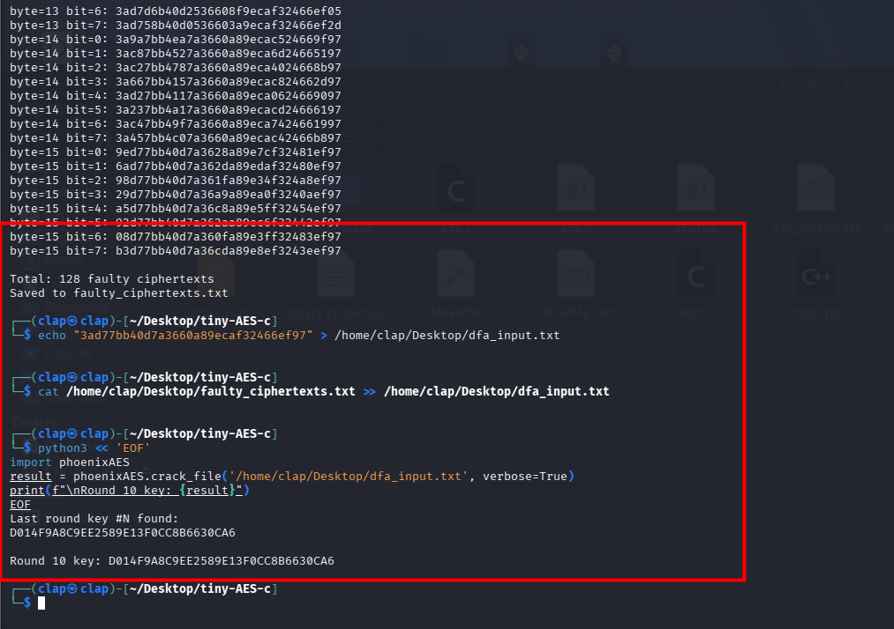

Kết quả thực nghiệm thu được:

```text
Last round key #N found:
D014F9A8C9EE2589E13F0CC8B6630CA6

Round 10 key: D014F9A8C9EE2589E13F0CC8B6630CA6
```

PhoenixAES đã khôi phục thành công khóa vòng cuối:

```text
D014F9A8C9EE2589E13F0CC8B6630CA6
```

Kết quả này cho thấy tập dữ liệu fault được sinh ra từ gem5 chứa đầy đủ thông tin cần thiết để thực hiện Differential Fault Analysis trên AES-128.

### 10.5. Thống kê quá trình Key Recovery

| Metric | Value |
|---------|------:|
| Correct ciphertext | 1 |
| Faulty ciphertexts | 128 |
| Fault model | Single-bit fault |
| Fault location | Before `SubBytes()` of Round 9 |
| Analysis tool | PhoenixAES |
| Recovery status | Success |
| Recovered Round 10 Key | D014F9A8C9EE2589E13F0CC8B6630CA6 |

PhoenixAES đã tìm được một khóa vòng cuối duy nhất phù hợp với toàn bộ tập dữ liệu.

Điều này chứng minh rằng các faulty ciphertexts thu được không phải là các sai khác ngẫu nhiên, mà vẫn duy trì mối quan hệ toán học với quá trình biến đổi của AES.

Đây là điều kiện quan trọng để DFA có thể thực hiện quá trình key recovery.

### 10.6. Kiểm chứng kết quả

Kết quả khôi phục:

```text
D014F9A8C9EE2589E13F0CC8B6630CA6
```

được sử dụng để xác nhận tính chính xác của toàn bộ pipeline fault injection.

Nếu fault được đưa vào:

- Sai round.
- Sai vị trí trong AES state.
- Sai thời điểm so với fault model.

các faulty ciphertexts sẽ không còn tuân theo quy luật lan truyền lỗi của AES.

Khi đó, PhoenixAES sẽ không thể loại bỏ toàn bộ khóa ứng viên và không thể tìm được một `Round 10 Key` duy nhất.

Ngược lại, việc PhoenixAES trả về:

```text
Last round key #N found
```

cho thấy:

- Fault được inject đúng tại boundary trước `SubBytes()` của Round 9.
- Faulty ciphertexts phù hợp với giả định của DFA.
- Dataset sinh ra từ gem5 có thể sử dụng để thực hiện AES key recovery.

### 10.7. Ý nghĩa của kết quả

Việc khôi phục thành công Round 10 Key là bước xác nhận quan trọng đối với toàn bộ nghiên cứu.

Kết quả này chứng minh pipeline:

```text
AES Implementation
        │
        ▼
Fault Hook Injection
        │
        ▼
gem5 Simulation
        │
        ▼
Faulty Ciphertext Collection
        │
        ▼
PhoenixAES DFA
        │
        ▼
Round 10 Key Recovery
```

đã hoạt động chính xác.

Cụ thể:

- Fault hook trong `Cipher()` tạo ra đúng single-bit fault model.
- gem5 mô phỏng thành công quá trình thực thi AES khi có lỗi.
- Các faulty ciphertext thu được vẫn giữ được cấu trúc lan truyền lỗi của AES.
- PhoenixAES có thể khai thác các sai khác này để khôi phục khóa vòng cuối.

Như vậy, thực nghiệm đã chứng minh rằng phương pháp fault injection trên gem5 có khả năng tái tạo một cuộc tấn công Differential Fault Analysis thực tế trên AES-128.

### 10.8. PhoenixAES hoạt động như thế nào?

AES-128 có một đặc điểm quan trọng là `Round 10 không còn thực hiện MixColumns`. Do đó, cấu trúc sai khác do fault tạo ra ở Round 9 vẫn được bảo toàn đến ciphertext cuối cùng.

Round 10 gồm:

```text
SubBytes
    ↓
ShiftRows
    ↓
AddRoundKey
```

Giả sử tại đầu Round 9 xuất hiện một lỗi:

```text
Statefault = Statecorrect ⊕ Δ
```

Sai khác này sẽ tiếp tục lan truyền qua:

```text
Round 9
SubBytes
    ↓
ShiftRows
    ↓
MixColumns
    ↓
AddRoundKey

↓

Round 10
SubBytes
    ↓
ShiftRows
    ↓
AddRoundKey

↓

Faulty Ciphertext
```

Ý tưởng của PhoenixAES là `đoán Round 10 Key`, sau đó đảo ngược các phép biến đổi của vòng cuối.

```text
Ciphertext
        │
        ▼
XOR Round10Key
        │
        ▼
InvShiftRows
        │
        ▼
InvSubBytes
```

Nếu khóa được đoán đúng, trạng thái thu được sẽ khớp với cấu trúc sai khác mà MixColumns của Round 9 tạo ra.

Nếu khóa được đoán sai, các quan hệ này sẽ không còn nhất quán trên toàn bộ tập faulty ciphertexts và candidate đó sẽ bị loại bỏ.

Về mặt toán học, PhoenixAES kiểm tra:

```text
InvShiftRows(InvSubBytes(CT ⊕ RK10))
⊕

InvShiftRows(InvSubBytes(CTfault ⊕ RK10))
```

để xác định xem sai khác thu được có phù hợp với mô hình lan truyền lỗi của AES hay không.

Đối với mỗi byte của Round 10 Key, PhoenixAES ban đầu phải xét toàn bộ:

```text
256 Candidate Keys
```

Sau khi kiểm tra trên nhiều faulty ciphertext:

```text
256
 │
 ▼
120
 │
 ▼
25
 │
 ▼
4
 │
 ▼
1 Candidate
```

Quá trình trên được thực hiện độc lập cho từng byte của Round 10 Key. Khi số lượng faulty ciphertext đủ lớn, các khóa ứng viên không thỏa mãn quan hệ DFA sẽ lần lượt bị loại bỏ cho đến khi chỉ còn một nghiệm duy nhất.

Trong thực nghiệm này, tập `128 faulty ciphertexts` đã cung cấp đủ thông tin để PhoenixAES khôi phục thành công toàn bộ `16 byte của Round 10 Key`.

---

## 11. Khôi phục Master Key

Trong giai đoạn trước, Differential Fault Analysis (DFA) đã được thực hiện trên AES-128 bằng cách inject fault trong quá trình thực thi trên môi trường gem5.

Tập dữ liệu thu được bao gồm:

- Một `correct ciphertext`.
- 128 `faulty ciphertexts` được sinh ra từ các lần fault injection khác nhau.

Các ciphertext này được đưa vào công cụ PhoenixAES để thực hiện DFA attack.

Kết quả PhoenixAES thu được:

```text
Round 10 Key:

D014F9A8C9EE2589E13F0CC8B6630CA6
```

Tuy nhiên, `Round 10 Key` không phải là khóa bí mật ban đầu mà AES sử dụng.

Trong AES-128, khóa được cung cấp ban đầu được gọi là:

```text
Master Key
```

Các round key sau đó được sinh ra thông qua thuật toán:

```text
AES Key Expansion
```

Do đó, mục tiêu tiếp theo là chứng minh rằng Round 10 Key đã recover có thể được sử dụng để xác định lại Master Key ban đầu.

### 11.1. Tổng quan Key Expansion của AES-128

AES-128 sử dụng khóa đầu vào có kích thước:

```text
128 bits = 16 bytes
```

Thuật toán AES-128 thực hiện tổng cộng **10 round** mã hóa. Ngoài các round này, trước khi bước vào Round 1 còn có một bước **Initial AddRoundKey**, vì vậy quá trình mã hóa cần tổng cộng:

```text
11 round keys
```

Mỗi round key có kích thước đúng bằng kích thước block AES:

```text
128 bits = 16 bytes
= 4 words
```

Do đó, toàn bộ key schedule cần sinh ra:

```text
11 round keys

×

4 words

=

44 words
```

hay tương đương:

```text
44 words

×

4 bytes

=

176 bytes
```

Quá trình AES Key Expansion sẽ mở rộng Master Key thành toàn bộ 44 words này.

Cấu trúc key schedule:

```text
                Master Key

              w[0] - w[3]


                    |
                    |
                    v


             AES Key Expansion


                    |
                    |
                    v


            Round 10 Key

            w[40] - w[43]
```

Trong đó:

| Thành phần | Vai trò |
|---|---|
| w[0]-w[3] | AES-128 Master Key |
| w[4]-w[39] | Intermediate Round Keys |
| w[40]-w[43] | Round 10 Key |

PhoenixAES chỉ cần recover 4 words cuối:

```text
w[40], w[41], w[42], w[43]
```

Sau đó có thể kiểm tra lại quan hệ giữa Round 10 Key và Master Key thông qua AES Key Expansion.

### 11.2. Reverse AES Key Schedule

AES Key Expansion sử dụng công thức:

```text
w[i] = w[i-4] XOR temp
```

Trong đó:

```text
temp = w[i-1]

nếu i mod 4 != 0
```

và:

```text
temp =
SubWord(
    RotWord(w[i-1])
)
XOR Rcon

nếu i mod 4 == 0
```

Do phép XOR có tính chất khả nghịch:

```text
A XOR B = C

=> A = C XOR B
```

nên có thể suy ra:

```text
w[i-4] = w[i] XOR temp
```

Vì vậy, Round 10 Key có thể được sử dụng để tính ngược về Master Key.

### 11.3. Kiểm chứng Master Key bằng phương pháp độc lập

Việc khôi phục `Round 10 Key` từ PhoenixAES mới chỉ chứng minh rằng thuật toán DFA có thể suy ra được khóa vòng cuối. Tuy nhiên, để đảm bảo kết quả không phụ thuộc vào chính công cụ tấn công, một bước kiểm chứng độc lập được thực hiện.

Trong bước này, `Master Key` được sử dụng để sinh lại toàn bộ các round key của AES-128 bằng thuật toán `AES Key Expansion`. Sau đó, `Round 10 Key` được trích xuất từ `w[40]...w[43]` và so sánh trực tiếp với giá trị mà PhoenixAES đã khôi phục.

Nếu hai giá trị trùng khớp, điều này chứng minh rằng:

- `Round 10 Key` được PhoenixAES tìm ra là chính xác.
- Thuật toán `AES Key Expansion` hoạt động đúng với Master Key đã khôi phục.
- Kết quả DFA không phải là một giá trị ngẫu nhiên hoặc false positive.

Tiếp theo, `Master Key` tiếp tục được sử dụng để mã hóa lại plaintext của AES Known Answer Test (KAT). Ciphertext sinh ra được so sánh với giá trị chuẩn trong FIPS-197 nhằm xác nhận toàn bộ quá trình khôi phục khóa.

### 11.4. Code confirm

```python
cat > /home/clap/Desktop/verify_key.py << 'EOF'
from Crypto.Cipher import AES

def sub_word(w):
    sbox = [
        0x63,0x7c,0x77,0x7b,0xf2,0x6b,0x6f,0xc5,
        0x30,0x01,0x67,0x2b,0xfe,0xd7,0xab,0x76,
        0xca,0x82,0xc9,0x7d,0xfa,0x59,0x47,0xf0,
        0xad,0xd4,0xa2,0xaf,0x9c,0xa4,0x72,0xc0,
        0xb7,0xfd,0x93,0x26,0x36,0x3f,0xf7,0xcc,
        0x34,0xa5,0xe5,0xf1,0x71,0xd8,0x31,0x15,
        0x04,0xc7,0x23,0xc3,0x18,0x96,0x05,0x9a,
        0x07,0x12,0x80,0xe2,0xeb,0x27,0xb2,0x75,
        0x09,0x83,0x2c,0x1a,0x1b,0x6e,0x5a,0xa0,
        0x52,0x3b,0xd6,0xb3,0x29,0xe3,0x2f,0x84,
        0x53,0xd1,0x00,0xed,0x20,0xfc,0xb1,0x5b,
        0x6a,0xcb,0xbe,0x39,0x4a,0x4c,0x58,0xcf,
        0xd0,0xef,0xaa,0xfb,0x43,0x4d,0x33,0x85,
        0x45,0xf9,0x02,0x7f,0x50,0x3c,0x9f,0xa8,
        0x51,0xa3,0x40,0x8f,0x92,0x9d,0x38,0xf5,
        0xbc,0xb6,0xda,0x21,0x10,0xff,0xf3,0xd2,
        0xcd,0x0c,0x13,0xec,0x5f,0x97,0x44,0x17,
        0xc4,0xa7,0x7e,0x3d,0x64,0x5d,0x19,0x73,
        0x60,0x81,0x4f,0xdc,0x22,0x2a,0x90,0x88,
        0x46,0xee,0xb8,0x14,0xde,0x5e,0x0b,0xdb,
        0xe0,0x32,0x3a,0x0a,0x49,0x06,0x24,0x5c,
        0xc2,0xd3,0xac,0x62,0x91,0x95,0xe4,0x79,
        0xe7,0xc8,0x37,0x6d,0x8d,0xd5,0x4e,0xa9,
        0x6c,0x56,0xf4,0xea,0x65,0x7a,0xae,0x08,
        0xba,0x78,0x25,0x2e,0x1c,0xa6,0xb4,0xc6,
        0xe8,0xdd,0x74,0x1f,0x4b,0xbd,0x8b,0x8a,
        0x70,0x3e,0xb5,0x66,0x48,0x03,0xf6,0x0e,
        0x61,0x35,0x57,0xb9,0x86,0xc1,0x1d,0x9e,
        0xe1,0xf8,0x98,0x11,0x69,0xd9,0x8e,0x94,
        0x9b,0x1e,0x87,0xe9,0xce,0x55,0x28,0xdf,
        0x8c,0xa1,0x89,0x0d,0xbf,0xe6,0x42,0x68,
        0x41,0x99,0x2d,0x0f,0xb0,0x54,0xbb,0x16
    ]

    return [sbox[b] for b in w]


def rot_word(w):
    return w[1:] + w[:1]


def xor_w(a, b):
    return [x ^ y for x, y in zip(a, b)]


rcon = [
    0x01,0x02,0x04,0x08,0x10,
    0x20,0x40,0x80,0x1b,0x36
]


def expand_key(master):

    w = [
        list(master[i:i+4])
        for i in range(0,16,4)
    ]

    for i in range(4,44):

        temp = w[i-1][:]

        if i % 4 == 0:
            temp = xor_w(
                sub_word(rot_word(temp)),
                [rcon[i//4-1],0,0,0]
            )

        w.append(
            xor_w(
                w[i-4],
                temp
            )
        )

    return w


# AES-128 Master Key recovered
master = bytes.fromhex(
    '2B7E151628AED2A6ABF7158809CF4F3C'
)


# Expand key and extract Round 10 Key
w = expand_key(master)

r10 = bytes(
    b
    for word in w[40:44]
    for b in word
)


print(
    f"Round 10 key from master: {r10.hex().upper()}"
)


print(
    "PhoenixAES recovered:     "
    "D014F9A8C9EE2589E13F0CC8B6630CA6"
)


print(
    f"Match: {r10.hex().upper() == 'D014F9A8C9EE2589E13F0CC8B6630CA6'}"
)


# AES Encryption verification

cipher = AES.new(
    master,
    AES.MODE_ECB
)


plaintext = bytes.fromhex(
    '6bc1bee22e409f96e93d7e117393172a'
)


ciphertext = cipher.encrypt(
    plaintext
)


print(
    f"\nEncrypt verify: {ciphertext.hex()}"
)


print(
    "Expected:       "
    "3ad77bb40d7a3660a89ecaf32466ef97"
)

EOF
```

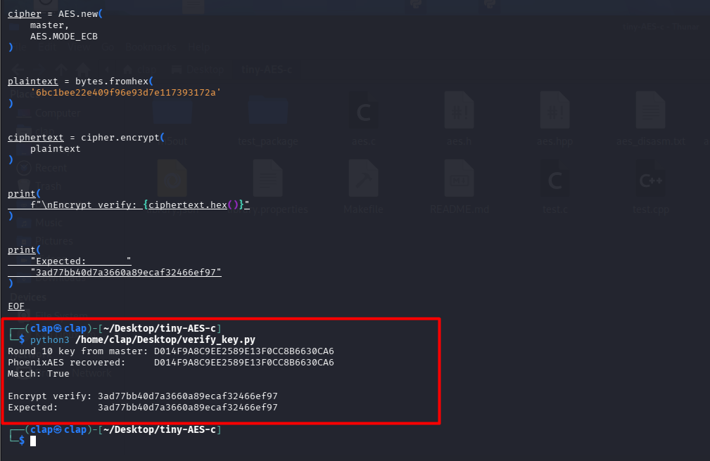

Kết quả `Match: True` xác nhận rằng `Round 10 Key` được PhoenixAES khôi phục hoàn toàn trùng khớp với khóa được sinh ra từ `Master Key` thông qua quá trình `AES Key Expansion`.

Ngoài ra, ciphertext thu được sau khi mã hóa lại bằng `Master Key` cũng hoàn toàn trùng khớp với ciphertext chuẩn của AES-128 Known Answer Test:

```text
3ad77bb40d7a3660a89ecaf32466ef97
```

Điều này chứng minh rằng `Master Key` đã được khôi phục chính xác và có thể được sử dụng để thực hiện lại toàn bộ quá trình mã hóa AES-128 mà không có sai khác so với thuật toán gốc.

Toàn bộ quy trình được xác thực theo chuỗi sau:

```text
Fault Injection
        |
        v
Faulty Ciphertexts
        |
        v
PhoenixAES DFA
        |
        v
Round 10 Key Recovery
        |
        v
Master Key Recovery
        |
        v
Forward Key Expansion Verification
        |
        v
AES Encryption Verification
```

Như vậy, quá trình Differential Fault Analysis không chỉ khôi phục thành công `Round 10 Key` mà còn xác định chính xác `Master Key`, đồng thời được kiểm chứng độc lập thông qua cả `AES Key Expansion` và phép mã hóa AES-128 tiêu chuẩn.

### 11.5. Triển khai Lockstep Defense

Sau khi hoàn thành DFA attack và khôi phục thành công AES-128 Master Key, bước tiếp theo là đánh giá một cơ chế phòng thủ nhằm phát hiện fault injection.

Một trong những phương pháp phổ biến trong hardware security là:

```text
Lockstep Execution
```

Ý tưởng của Lockstep là thực hiện cùng một phép tính trên hai execution path khác nhau và so sánh kết quả đầu ra.

Trong thực nghiệm này, Lockstep được mô phỏng ở mức software execution trên gem5 thay vì triển khai dual-core hardware lockstep thực tế. Mục tiêu là đánh giá khả năng phát hiện sự sai khác do fault injection trong môi trường controlled experiment.

Cơ chế hoạt động:

- Một execution path được phép chịu ảnh hưởng của fault injection.
- Một execution path đóng vai trò reference execution và chạy trong trạng thái sạch.
- Sau khi hoàn thành AES encryption, hai ciphertext được đưa vào comparator.
- Nếu output khác nhau, hệ thống từ chối ciphertext và abort execution.

Kiến trúc:

```text
                         Input

                           |
                           |

                  Duplicate Execution

                           |
          ---------------------------------

             AES Execution A        AES Execution B

             (fault injected)       (reference)

          ---------------------------------

                           |

                      Comparator

                           |

              ----------------------------

              Match:

              Return ciphertext


              Mismatch:

              Abort execution

              ----------------------------
```

### 11.6. Triển khai AES với Lockstep

Cơ chế Lockstep được triển khai trong file:

```text
aes_lockstep.c
```

Chương trình thực hiện AES encryption hai lần với cùng một input.

Execution A sử dụng trạng thái fault hiện tại:

```c
AES_init_ctx(&ctx_a, key);

memcpy(
    buf_a,
    plaintext,
    16
);

AES_ECB_encrypt(
    &ctx_a,
    buf_a
);
```

Execution B được sử dụng làm reference execution bằng cách vô hiệu hóa fault:

```c
fault_byte = -1;

AES_init_ctx(&ctx_b, key);

memcpy(
    buf_b,
    plaintext,
    16
);

AES_ECB_encrypt(
    &ctx_b,
    buf_b
);
```

Sau đó, comparator thực hiện kiểm tra sự khác biệt giữa hai ciphertext:

```c
if (memcmp(buf_a, buf_b, 16) != 0)
{
    printf(
        "[LOCKSTEP] FAULT DETECTED\n"
    );

    printf(
        "[LOCKSTEP] Execution ABORTED\n"
    );

    return 1;
}
```

Full code:

```python
cat > ~/Desktop/tiny-AES-c/aes_lockstep.c << 'EOF'
#include <stdio.h>
#include <string.h>
#include <stdlib.h>
#include "aes.h"

int fault_byte = -1;
int fault_bit  = 0;

int main() {
    uint8_t key[16] = {
        0x2b, 0x7e, 0x15, 0x16, 0x28, 0xae, 0xd2, 0xa6,
        0xab, 0xf7, 0x15, 0x88, 0x09, 0xcf, 0x4f, 0x3c
    };
    uint8_t plaintext[16] = {
        0x6b, 0xc1, 0xbe, 0xe2, 0x2e, 0x40, 0x9f, 0x96,
        0xe9, 0x3d, 0x7e, 0x11, 0x73, 0x93, 0x17, 0x2a
    };

    char `fb = getenv("FAULT_BYTE");
    char `fi = getenv("FAULT_BIT");
    if (fb) fault_byte = atoi(fb);
    if (fi) fault_bit  = atoi(fi);

    // CPU A: chạy với fault có thể xảy ra
    struct AES_ctx ctx_a;
    AES_init_ctx(&ctx_a, key);
    uint8_t buf_a[16];
    memcpy(buf_a, plaintext, 16);
    AES_ECB_encrypt(&ctx_a, buf_a);

    // CPU B: chạy clean (fault_byte = -1)
    int saved_fb = fault_byte;
    fault_byte = -1;
    struct AES_ctx ctx_b;
    AES_init_ctx(&ctx_b, key);
    uint8_t buf_b[16];
    memcpy(buf_b, plaintext, 16);
    AES_ECB_encrypt(&ctx_b, buf_b);
    fault_byte = saved_fb;

    // Lockstep comparator
    if (memcmp(buf_a, buf_b, 16) != 0) {
        printf("[LOCKSTEP] FAULT DETECTED — outputs diverged!\n");
        printf("[LOCKSTEP] CPU A: ");
        for (int i = 0; i < 16; i++) printf("%02x", buf_a[i]);
        printf("\n[LOCKSTEP] CPU B: ");
        for (int i = 0; i < 16; i++) printf("%02x", buf_b[i]);
        printf("\n[LOCKSTEP] Execution ABORTED — no ciphertext output\n");
        return 1;
    }

    printf("Ciphertext: ");
    for (int i = 0; i < 16; i++) printf("%02x", buf_a[i]);
    printf("\n");
    return 0;
}
EOF
```

### 11.7. Build Lockstep AES Binary
Sau khi hoàn thành việc triển khai cơ chế Lockstep trong `aes_lockstep.c`, chương trình cần được biên dịch thành binary cho kiến trúc ``RISC-V`` để có thể thực thi trên trình giả lập gem5.

Quá trình biên dịch sử dụng trình biên dịch `riscv64-linux-gnu-gcc` với các tùy chọn `-static`, `-O0` và `-g` nhằm tạo binary độc lập, giữ nguyên cấu trúc chương trình và hỗ trợ việc quan sát quá trình thực thi trong gem5.

Thực hiện biên dịch bằng lệnh:

```bash
cd ~/Desktop/tiny-AES-c
riscv64-linux-gnu-gcc -O0 -g -static -o aes_lockstep aes_lockstep.c aes.c -I.
```

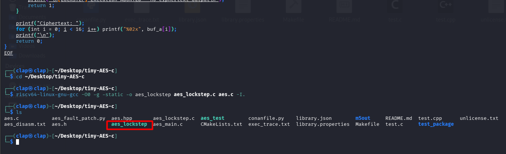

Kết quả cho thấy quá trình biên dịch diễn ra thành công và sinh ra binary `aes_lockstep`.

Binary này sẽ được sử dụng làm workload trong gem5 để đánh giá khả năng phát hiện fault injection của cơ chế Lockstep ở các kịch bản thực nghiệm tiếp theo.

### 11.8. Cấu hình gem5 Execution Script

Để đánh giá cơ chế Lockstep trên gem5, một Python script được xây dựng nhằm khởi tạo hệ thống mô phỏng và truyền tham số fault vào chương trình AES thông qua các biến môi trường `FAULT_BYTE` và `FAULT_BIT`.

Script này chịu trách nhiệm:

- Khởi tạo hệ thống gem5.
- Nạp binary `aes_lockstep`.
- Truyền vị trí fault cần inject.
- Thực thi chương trình trên CPU RISC-V.

Tạo file:

```python
cat > ~/Desktop/run_lockstep.py << 'EOF'
import m5
from m5.objects import `
import sys

fault_byte = sys.argv[1] if len(sys.argv) > 1 else "-1"
fault_bit  = sys.argv[2] if len(sys.argv) > 2 else "0"

system = System()
system.clk_domain = SrcClockDomain()
system.clk_domain.clock = '1GHz'
system.clk_domain.voltage_domain = VoltageDomain()
system.mem_mode = 'timing'
system.mem_ranges = [AddrRange('512MB')]
system.cpu = RiscvTimingSimpleCPU()
system.membus = SystemXBar()
system.cpu.icache_port = system.membus.cpu_side_ports
system.cpu.dcache_port = system.membus.cpu_side_ports
system.cpu.createInterruptController()
system.mem_ctrl = MemCtrl()
system.mem_ctrl.dram = DDR3_1600_8x8()
system.mem_ctrl.dram.range = system.mem_ranges[0]
system.mem_ctrl.port = system.membus.mem_side_ports
system.system_port = system.membus.cpu_side_ports

binary = '/home/clap/Desktop/tiny-AES-c/aes_lockstep'
system.workload = SEWorkload.init_compatible(binary)
process = Process()
process.cmd = [binary]
process.env = [f'FAULT_BYTE={fault_byte}', f'FAULT_BIT={fault_bit}']
system.cpu.workload = process
system.cpu.createThreads()

root = Root(full_system=False, system=system)
m5.instantiate()
m5.simulate()
EOF
```

Sau khi tạo xong script, gem5 đã sẵn sàng để thực hiện các kịch bản đánh giá Lockstep.

### 11.9. Đánh giá Lockstep trên gem5

Sau khi hoàn tất việc biên dịch binary và cấu hình môi trường gem5, ba kịch bản được thực hiện nhằm đánh giá khả năng phát hiện fault của cơ chế Lockstep.

Các trường hợp bao gồm:

1. Không thực hiện fault injection.
2. Fault injection tại byte 0, bit 0.
3. Fault injection tại byte 5, bit 3.

Để thuận tiện cho việc đánh giá, ba kịch bản được thực thi liên tiếp bằng đoạn script sau:

```bash
cd ~/Desktop/gem5

echo "=== Scenario 1: No fault ==="
./build/RISCV/gem5.opt ~/Desktop/run_lockstep.py -- -1 0 2>/dev/null | grep -E "Ciphertext|LOCKSTEP"

echo "=== Scenario 2: Fault injected (byte=0 bit=0) ==="
./build/RISCV/gem5.opt ~/Desktop/run_lockstep.py -- 0 0 2>/dev/null | grep -E "Ciphertext|LOCKSTEP"

echo "=== Scenario 3: Fault injected (byte=5 bit=3) ==="
./build/RISCV/gem5.opt ~/Desktop/run_lockstep.py -- 5 3 2>/dev/null | grep -E "Ciphertext|LOCKSTEP"
```

Kết quả của từng kịch bản được trình bày dưới đây.

> Scenario 1: Normal Execution

Trong trường hợp bình thường, không có fault injection được thực hiện. Hai execution path sử dụng cùng input và tạo ra cùng một ciphertext.

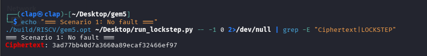

Kết quả cho thấy khi không có fault injection, hai execution path tạo ra cùng một output và ciphertext hợp lệ được trả về.

> Scenario 2: Inject Fault (byte=0, bit=0)

Fault được inject vào execution path A.

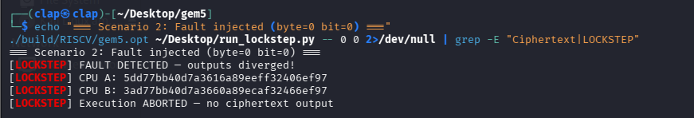

Kết quả cho thấy ciphertext của execution path bị fault khác với reference execution.

Comparator phát hiện sự sai khác giữa hai execution path và kích hoạt cơ chế abort trước khi ciphertext lỗi được xuất ra.

> Scenario 3: Inject Fault (byte=5, bit=3)

Một vị trí fault khác tiếp tục được đánh giá.

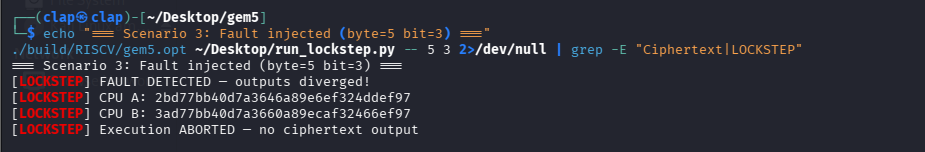

Mặc dù vị trí fault thay đổi, Lockstep vẫn phát hiện được sự sai khác giữa execution path bị lỗi và execution path tham chiếu.

Lockstep có thể phát hiện sự sai khác giữa execution path bị lỗi và execution path tham chiếu trước khi ciphertext bị lỗi được xuất ra ngoài hệ thống.

### 11.10. Final Experiment Summary

Toàn bộ quá trình thực nghiệm được chia thành hai phần chính:

- ``Attack Evaluation:`` đánh giá khả năng khai thác fault injection bằng Differential Fault Analysis (DFA) để khôi phục khóa AES-128.
- ``Defense Evaluation:`` đánh giá khả năng phát hiện fault injection bằng cơ chế Lockstep Execution.

#### 11.10.1. Attack Evaluation

Quy trình tấn công được tổng hợp như sau:

```text
                Plaintext

                    |

                    v

              AES-128 gem5


                    |

                    v


        Fault Injection before Round 9 SubBytes


                    |

                    v


          128 Faulty Ciphertexts


                    |

                    v


              PhoenixAES DFA


                    |

                    v


          Recover Round 10 Key


                    |

                    v


          Reverse AES Key Schedule


                    |

                    v


          Recover Master Key


                    |

                    v


          AES Key Expansion Verification


                    |

                    v


          AES Encryption Verification
```

Kết quả cho thấy fault injection trong quá trình thực thi AES-128 có thể tạo ra tập ciphertext lỗi đủ để thực hiện Differential Fault Analysis.

PhoenixAES sử dụng các faulty ciphertexts này để khôi phục thành công Round 10 Key:

```text
D014F9A8C9EE2589E13F0CC8B6630CA6
```

Sau đó, thông qua quá trình reverse AES Key Schedule, Master Key ban đầu được xác định:

```text
2B7E151628AED2A6ABF7158809CF4F3C
```

Khóa sau khi khôi phục được xác thực độc lập bằng hai phương pháp:

- Forward AES Key Expansion Verification.
- AES-128 Known Answer Test Encryption Verification.

#### 11.10.2. Defense Evaluation

Sau khi đánh giá khả năng tấn công, cơ chế Lockstep Execution được triển khai nhằm phát hiện sự sai lệch do fault injection.

Kiến trúc Lockstep:

```text
              AES Input

                  |

                  v


          Duplicate Execution


                  |

        ---------------------

        |                   |

        v                   v


     AES Core A          AES Core B

 (fault injected)       (reference)


        |                   |

        ---------------------

                  |

                  v


             Comparator


                  |

        ---------------------

        |                   |

        v                   v


      Match             Mismatch


        |                   |

        v                   v


 Output Ciphertext    Abort Execution
```

Kết quả thực nghiệm cho thấy:

- Khi không có fault injection, hai execution path tạo ra cùng ciphertext hợp lệ.
- Khi fault được inject tại các vị trí khác nhau, ciphertext của execution path bị lỗi khác với execution path tham chiếu.
- Comparator phát hiện sự sai khác và kích hoạt cơ chế abort trước khi ciphertext lỗi được trả về.

### 11.11. Kết luận

| Thành phần | Kết quả |
|---|---|
| Simulation Environment | gem5 + RISC-V |
| AES Implementation | tiny-AES-c |
| Correct Ciphertext | `3ad77bb40d7a3660a89ecaf32466ef97` |
| Faulty Ciphertexts | 128 |
| DFA Tool | PhoenixAES |
| Round 10 Key | `D014F9A8C9EE2589E13F0CC8B6630CA6` |
| Master Key | `2B7E151628AED2A6ABF7158809CF4F3C` |
| Key Expansion Verification | ✓ |
| AES Encryption Verification | ✓ |
| Lockstep Fault Detection | ✓ |

Kết quả thực nghiệm chứng minh rằng:

- Fault injection trong quá trình thực thi AES-128 có thể tạo ra các ciphertext lỗi đủ để thực hiện Differential Fault Analysis.
- PhoenixAES có thể sử dụng các ciphertext lỗi để khôi phục Round 10 Key và xác định lại AES-128 Master Key.
- Master Key sau khi khôi phục được xác thực độc lập thông qua AES Key Expansion và AES Encryption Verification.
- Cơ chế Lockstep có khả năng phát hiện sự sai lệch giữa execution path bị fault và execution path tham chiếu, từ đó ngăn chặn ciphertext lỗi được trả về.

Như vậy, thực nghiệm đã đánh giá được cả hai khía cạnh:

```text
Attack:

DFA
 |
 v
Key Recovery


Defense:

Lockstep
 |
 v
Fault Detection
```

trong môi trường AES-128 chạy trên gem5.

## 12. Lockstep Defense - Design and Analysis

Chương 11 đã trình bày quá trình cài đặt và đánh giá thực nghiệm cơ chế Lockstep trên môi trường gem5. Phần này tập trung phân tích nguyên lý hoạt động của Lockstep, lý do cơ chế này có thể ngăn chặn chuỗi Differential Fault Analysis (DFA) và những giới hạn còn tồn tại.

### 12.1. Nguyên lý Lockstep

Lockstep là một cơ chế được sử dụng rộng rãi trong các hệ thống yêu cầu độ tin cậy cao nhằm phát hiện lỗi trong quá trình thực thi.

Ý tưởng của Lockstep là thực hiện cùng một phép tính trên hai execution lane độc lập với cùng đầu vào. Sau khi hoàn thành, kết quả của hai lane được so sánh bởi một comparator.

- Nếu hai kết quả giống nhau, hệ thống tiếp tục sử dụng kết quả.
- Nếu hai kết quả khác nhau, hệ thống kết luận đã xảy ra lỗi và hủy bỏ kết quả.

```text
              Plaintext
                  │
         ┌────────┴────────┐
         ▼                 ▼

      Lane A           Lane B

         │                 │

         └────────┬────────┘
                  ▼

            Comparator

        Same ?      Different ?
          │               │
          ▼               ▼

   Output Ciphertext    Abort
```

Trong các hệ thống phần cứng, hai lane thường được triển khai trên hai execution unit hoặc hai CPU core độc lập. Comparator có thể kiểm tra architectural state hoặc kết quả cuối cùng tùy theo kiến trúc hệ thống.

### 12.2. Thiết kế Lockstep trong nghiên cứu này

Mục tiêu của nghiên cứu không phải xây dựng một kiến trúc Lockstep hoàn chỉnh trong gem5 mà là đánh giá khả năng của cơ chế so sánh kép trong việc ngăn chặn chuỗi Differential Fault Analysis.

Vì vậy, Lockstep được mô phỏng bằng hai lần thực thi AES-128 trong cùng một chương trình:

- ``Lane A`` thực hiện mã hóa với khả năng xuất hiện fault tại Round 9 thông qua fault hook.
- ``Lane B`` thực hiện cùng phép mã hóa nhưng không bật fault hook và đóng vai trò lane tham chiếu.

Sau khi cả hai lane hoàn thành, hai ciphertext được so sánh bằng hàm `memcmp()`. Chỉ khi hai kết quả hoàn toàn giống nhau thì ciphertext mới được phép trả về cho người dùng.

Cách tiếp cận này không mô phỏng đầy đủ một kiến trúc Lockstep phần cứng, nhưng vẫn phản ánh đúng nguyên lý phát hiện fault dựa trên sự khác biệt giữa hai execution path.

### 12.3. Comparator Logic

Comparator được cài đặt bằng cách so sánh trực tiếp hai ciphertext sau khi quá trình mã hóa kết thúc.

```c
if (memcmp(buf_a, buf_b, 16) != 0) {
    printf("[LOCKSTEP] FAULT DETECTED\n");
    return 1;
}
```

Nếu hai ciphertext khác nhau, chương trình dừng ngay và không trả ciphertext ra ngoài.

Ngược lại, nếu hai ciphertext giống nhau, chương trình tiếp tục và trả về ciphertext hợp lệ.

### 12.4. Phân tích kết quả thực nghiệm

Kết quả thực nghiệm tại Mục ``11.7`` cho thấy hành vi của Lockstep hoàn toàn phù hợp với nguyên lý thiết kế.

Trong trường hợp không xảy ra fault injection, cả hai execution lane đều tạo ra cùng một ciphertext và comparator cho phép chương trình tiếp tục thực thi.

Ngược lại, khi fault được đưa vào execution path, ciphertext của Lane A khác với Lane B. Comparator phát hiện sự sai khác và dừng chương trình trước khi ciphertext lỗi được trả về.

Quan trọng hơn, trong cả hai trường hợp fault được đánh giá, attacker không còn thu được faulty ciphertext để sử dụng làm đầu vào cho PhoenixAES.

Điều này làm gián đoạn chuỗi Differential Fault Analysis ngay từ bước đầu tiên.

```text
Fault Injection
        │
        ▼
Lockstep Comparator
        │
        ├── Match
        │      │
        │      ▼
        │  Correct Ciphertext
        │
        └── Mismatch
               │
               ▼
            Abort
```

Khác với nhiều cơ chế phòng thủ cố gắng ngăn cản fault xảy ra, Lockstep cho phép fault xuất hiện nhưng loại bỏ giá trị đầu ra bị lỗi trước khi attacker có thể thu thập và sử dụng cho quá trình khôi phục khóa.

### 12.5. Hạn chế

Kết quả đạt được được đánh giá trong phạm vi fault model và kiến trúc của nghiên cứu. Một số trường hợp chưa được xem xét bao gồm:

> Coordinated Double-Fault

Nếu attacker có khả năng tạo cùng một fault trên cả hai execution lane tại cùng thời điểm và cùng vị trí, comparator có thể không phát hiện được sự sai khác vì cả hai lane đều sinh ra cùng một kết quả sai.

Trong thực tế, đây là kịch bản khó thực hiện hơn đáng kể do yêu cầu đồng bộ hóa fault trên nhiều execution unit.

> Comparator Fault

Lockstep giả định comparator luôn hoạt động chính xác.

Nếu comparator cũng trở thành mục tiêu của fault injection thì bản thân cơ chế phát hiện lỗi có thể bị ảnh hưởng. Trong các hệ thống thực tế, comparator thường được bảo vệ hoặc nhân bản nhằm tránh trở thành điểm lỗi đơn lẻ.

> Side-channel Attacks

Lockstep chỉ hướng tới việc phát hiện fault trong quá trình thực thi.

Các kỹ thuật như Power Analysis, Electromagnetic Analysis hoặc Cache Side-channel nằm ngoài phạm vi bảo vệ của cơ chế này.

> Performance Overhead

Việc thực hiện cùng một phép tính trên hai execution lane làm tăng chi phí tính toán cũng như năng lượng tiêu thụ so với thực thi thông thường.

Đây là đánh đổi phổ biến giữa hiệu năng và khả năng chống fault injection.

> Software Lockstep

Implementation trong nghiên cứu sử dụng hai lần thực thi AES trong cùng một chương trình nhằm mô phỏng nguyên lý Lockstep.

Cách tiếp cận này phù hợp để đánh giá hiệu quả phát hiện fault nhưng chưa phản ánh đầy đủ các đặc điểm của một kiến trúc Lockstep phần cứng với hai execution lane độc lập.

---

## 13. Kết luận

### 13.1. Tổng hợp kết quả

Toàn bộ chuỗi thực nghiệm đã được hoàn thành từ fault injection đến cơ chế phòng vệ.

| Thành phần | Kết quả |
|------------|----------|
| gem5 Platform | gem5 v25.1.0.1 (RISC-V, SE Mode) |
| AES Implementation | tiny-AES-c (Static Binary) |
| Correct Ciphertext | `3ad77bb40d7a3660a89ecaf32466ef97` |
| Fault Injection Point | Before Round 9 SubBytes |
| Fault Window | Tick `10,812,745,000` |
| Fault Dataset | 128 Faulty Ciphertexts |
| PhoenixAES | Recover thành công Round 10 Key |
| Master Key Recovery | Thành công |
| Key Expansion Verification | ✓ |
| AES Encryption Verification | ✓ |
| Lockstep Defense | Phát hiện fault và hủy ciphertext lỗi |

### 13.2. Bài học rút ra

Quá trình thực nghiệm cho thấy một số điểm quan trọng khi nghiên cứu Differential Fault Analysis trên AES-128.

- Việc xác định đúng fault window quan trọng hơn bản thân cơ chế inject fault.
- Fault cần được đưa vào đúng boundary của Round 9 để tạo ra faulty ciphertext phù hợp với mô hình DFA.
- Việc xác minh Master Key bằng cả Key Expansion và AES Encryption giúp tăng độ tin cậy của kết quả.
- Thay vì cố gắng ngăn cản fault xảy ra, việc ngăn attacker thu thập faulty ciphertext có thể vô hiệu hóa toàn bộ chuỗi Differential Fault Analysis.

### 13.3. Hướng phát triển

Một số hướng nghiên cứu có thể được mở rộng trong tương lai bao gồm:

> Attack

- Multi-Fault Differential Fault Analysis.
- AES-192 và AES-256.
- Fault Injection trên các thuật toán mật mã khác như SHA hoặc HMAC.

> Defense

- Hardware Lockstep với hai CPU core thực trong gem5.
- Triple Modular Redundancy (TMR).
- Temporal Redundancy.
- Kết hợp Lockstep với các kỹ thuật Masking nhằm chống đồng thời Fault Analysis và Side-channel Analysis.

> Simulation Framework

- Fault injection trực tiếp trong gem5 thay vì fault hook trong chương trình.
- Hỗ trợ nhiều fault model hơn như register fault, instruction fault hoặc timing fault.
- Tự động hóa quá trình sinh fault dataset và đánh giá các countermeasure.

### 13.4. Nhận xét cuối

Nghiên cứu đã xây dựng thành công một quy trình thực nghiệm hoàn chỉnh cho Differential Fault Analysis trên AES-128 trong môi trường gem5.

Thông qua fault injection tại Round 9, nghiên cứu tạo ra tập faulty ciphertext đủ điều kiện để PhoenixAES khôi phục Round 10 Key, từ đó xác định lại Master Key và xác minh độc lập bằng AES Key Expansion cũng như AES Encryption.

Bên cạnh đó, nghiên cứu cũng cho thấy Lockstep có thể phát hiện sự sai lệch giữa hai execution path và ngăn không cho faulty ciphertext được trả ra ngoài. Điều này làm gián đoạn chuỗi Differential Fault Analysis ngay từ bước thu thập dữ liệu, qua đó minh họa hiệu quả của Lockstep như một cơ chế phòng vệ đối với fault injection trong phạm vi fault model được xem xét.

---

# REFERENCE
[1]. https://www.thoughtworks.com/insights/blog/privacy/illustrated-guide-advanced-encryption-standard

[2]. https://eprint.iacr.org/2009/575.pdf

[3]. https://en.wikipedia.org/wiki/Differential_fault_analysis

[4]. https://www.gem5.org/

[5]. https://github.com/gem5/gem5

[6]. https://github.com/SideChannelMarvels/JeanGrey

[7]. https://pypi.org/project/phoenixAES/

[8]. https://eprint.iacr.org/2023/1769

[9]. https://ieeexplore.ieee.org/document/11015333

[10]. https://docs.riscv.org/reference/isa/v20260120/index.html

[11]. https://github.com/riscv/riscv-isa-manual

[12]. https://nvlpubs.nist.gov/nistpubs/fips/nist.fips.197.pdf

[13]. https://www.researchgate.net/publication/345197936_Fault_Detection_in_Cryptographic_Systems

[14]. https://dl.acm.org/doi/10.1145/3744640