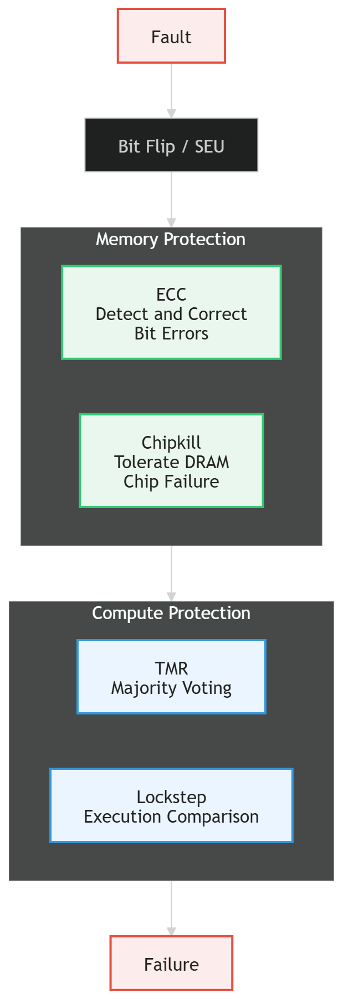
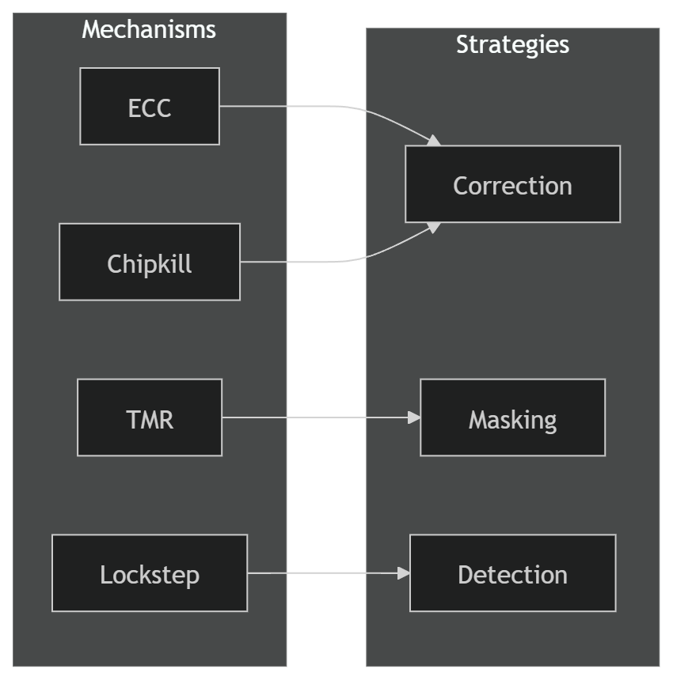
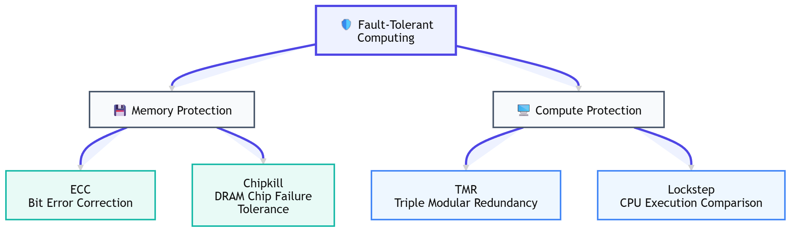

Khi nhắc đến các cuộc tấn công vào hệ thống máy tính, chúng ta thường nghĩ đến malware, buffer overflow, SQL injection hay các kỹ thuật khai thác lỗ hổng phần mềm. Tuy nhiên, không phải mọi sự cố đều bắt nguồn từ một dòng code lỗi hoặc một attacker ngồi phía bên kia màn hình.

> 📌 Đây là Phần 1 trong chuỗi bài viết về Fault Injection và Hardware Security:
>
> * **Phần 1 – Nền tảng:** Bit Flip, Soft Error, ECC, TMR và Lockstep
> * **Phần 2 – Tấn công I:** Differential Fault Analysis (DFA) trên AES-128 trong gem5
>
> Bài viết này tập trung vào các khái niệm nền tảng giúp giải thích tại sao các cuộc tấn công Fault Injection có thể hoạt động và vì sao những cơ chế như ECC, TMR hay Lockstep lại trở nên quan trọng trong các hệ thống hiện đại.

Ít ai biết rằng đôi khi nguyên nhân có thể đến từ một thứ rất xa xôi: các hạt năng lượng cao xuất phát từ ngoài không gian.

Bầu khí quyển Trái Đất đóng vai trò như một lớp lá chắn tự nhiên trước bức xạ vũ trụ, nhưng một số hạt năng lượng đủ cao vẫn xuyên xuống tới mặt đất. Khi một hạt như vậy đi qua vùng bán dẫn bên trong chip nhớ hoặc bộ xử lý, nó có thể tạo ra một lượng điện tích nhỏ làm thay đổi trạng thái của một transistor đang lưu dữ liệu.

Hãy tưởng tượng bộ nhớ máy tính đang lưu trữ hàng tỷ bit dữ liệu dưới dạng các giá trị 0 và 1. Nếu chỉ một bit duy nhất bị thay đổi từ 0 thành 1 hoặc ngược lại, dữ liệu có thể bị sai lệch. Hiện tượng này được gọi là bit flip. Trong phần cứng, đây là một dạng lỗi mềm (soft error) vì bản thân linh kiện không bị hư hỏng vật lý; dữ liệu chỉ bị thay đổi tạm thời do tác động của môi trường.

Nghe có vẻ khó tin, nhưng các lỗi kiểu này hoàn toàn có thật và đã được ghi nhận trong nhiều hệ thống từ máy chủ dữ liệu, thiết bị hàng không cho đến vệ tinh ngoài không gian. Khi kích thước transistor ngày càng thu nhỏ, lượng điện tích cần thiết để làm thay đổi trạng thái của một bit cũng giảm theo, khiến các hệ thống hiện đại trở nên nhạy cảm hơn với hiện tượng này.

Đó cũng chính là lý do các cơ chế như ECC Memory, Chipkill, Triple Modular Redundancy (TMR) hay Lockstep Execution được phát triển. Thay vì cố gắng ngăn chặn hoàn toàn các tác động từ môi trường  - điều gần như bất khả thi  - các kiến trúc này được thiết kế để phát hiện, sửa chữa hoặc chịu đựng lỗi khi chúng xảy ra, qua đó đảm bảo hệ thống vẫn hoạt động chính xác và đáng tin cậy.

## 1. Một Vài Khái Niệm Cần Biết Trước Khi Bắt Đầu

### 1.1. Fault, Error và Failure

Trong lĩnh vực hệ thống chịu lỗi (*Fault-Tolerant Systems*), ba thuật ngữ **Fault**, **Error** và **Failure** mô tả ba giai đoạn khác nhau của một sự cố.

* **Fault** là nguyên nhân gốc rễ gây ra lỗi.
* **Error** là trạng thái sai lệch xuất hiện bên trong hệ thống.
* **Failure** là thời điểm hệ thống tạo ra kết quả không còn đúng với đặc tả thiết kế.

Ví dụ:

1. Một hạt năng lượng cao đi xuyên qua chip nhớ (**Fault**).
2. Một bit trong bộ nhớ bị đảo từ `0` thành `1` (**Error**).
3. Chương trình sử dụng dữ liệu sai và đưa ra kết quả không chính xác (**Failure**).

Chuỗi này có thể được mô tả như sau:

```text
Fault
  ↓
Error
  ↓
Failure
```

Điều quan trọng là không phải mọi *Fault* đều dẫn tới *Failure*. Nhiều cơ chế chịu lỗi hiện đại được thiết kế để phát hiện và xử lý lỗi trước khi chúng ảnh hưởng đến kết quả cuối cùng của hệ thống.

### 1.2. Soft Error và Hard Error

Không phải mọi lỗi phần cứng đều giống nhau.

**Hard Error** là các hư hỏng vật lý của linh kiện, chẳng hạn như transistor bị hỏng, đường tín hiệu bị đứt hoặc chip bị lỗi vĩnh viễn. Những lỗi này thường yêu cầu sửa chữa hoặc thay thế phần cứng.

Ngược lại, **Soft Error** không làm hỏng phần cứng  - nó chỉ làm thay đổi tạm thời trạng thái logic đang được lưu trữ hoặc xử lý bên trong hệ thống. Sau khi dữ liệu được ghi lại hoặc hệ thống được khởi động lại, lỗi có thể hoàn toàn biến mất.

Trong các hệ thống điện toán hiện đại, Soft Error là mối quan tâm đặc biệt vì nó có thể xảy ra ngay cả khi phần cứng vẫn hoạt động hoàn toàn bình thường.

Các cơ chế như ECC, Chipkill, TMR hay Lockstep Execution được phát triển chủ yếu để phát hiện, sửa chữa hoặc chịu đựng loại lỗi này.

---

## 2. Khi Một Bit Bị Lật

Trong phần trước, chúng ta đã biết rằng một *Fault* có thể dẫn đến *Error* và cuối cùng là *Failure*. Tuy nhiên, một câu hỏi thú vị hơn là:

> Fault đó đến từ đâu?

Khi nghĩ đến lỗi phần cứng, nhiều người thường hình dung đến chip bị cháy, nguồn điện không ổn định hoặc linh kiện xuống cấp theo thời gian. Nhưng trên thực tế, một trong những nguyên nhân phổ biến nhất của *Soft Error* lại đến từ một thứ nằm ngoài Trái Đất: bức xạ vũ trụ (*Cosmic Radiation*).

Nghe có vẻ giống khoa học viễn tưởng, nhưng đây là một hiện tượng hoàn toàn có thật. Các hạt năng lượng cao được tạo ra từ những sự kiện trong vũ trụ như solar flare hoặc các vụ nổ supernova. Khi đi vào khí quyển Trái Đất, chúng va chạm với các phân tử trong không khí và tạo ra nhiều hạt thứ cấp khác nhau. Trong số đó, neutron năng lượng cao là một trong những tác nhân chính gây ra lỗi cho các hệ thống điện tử hiện đại.

### 2.1. Single Event Upset (SEU) là gì?

Một trong những dạng lỗi phổ biến nhất do bức xạ gây ra được gọi là **Single Event Upset (SEU)**.

SEU là hiện tượng trạng thái logic của một phần tử lưu trữ bị thay đổi bởi một sự kiện vật lý đơn lẻ. Nói đơn giản hơn, một bit đang mang giá trị `0` có thể trở thành `1`, hoặc ngược lại, mà không hề có bất kỳ lệnh ghi dữ liệu nào từ CPU.

Điều quan trọng là SEU không làm hỏng phần cứng. Sau khi dữ liệu được ghi lại hoặc hệ thống được khởi động lại, thiết bị vẫn có thể hoạt động bình thường. Chính vì vậy, SEU được xem là một dạng *Soft Error*.

Tuy nhiên, hậu quả của nó không hề nhỏ nếu bit bị thay đổi nằm trong dữ liệu quan trọng, thanh ghi điều khiển hoặc các cấu trúc lưu trữ quan trọng của hệ thống.

### 2.2. Tia vũ trụ tác động tới transistor như thế nào?

Để hiểu SEU xảy ra như thế nào, chúng ta cần nhìn vào thế giới bên trong chip bán dẫn.

Khi một hạt năng lượng cao đi xuyên qua transistor hoặc ô nhớ SRAM/DRAM, nó có thể tạo ra một lượng điện tích nhỏ trên đường đi. Trong hầu hết các trường hợp, lượng điện tích này không đủ để gây ảnh hưởng. Tuy nhiên, nếu điện tích sinh ra vượt quá ngưỡng ổn định của phần tử lưu trữ, trạng thái logic đang được lưu sẽ bị thay đổi.

Quá trình này có thể được mô tả đơn giản như sau:

```text
Cosmic Radiation
        │
        ▼
 High-Energy Particle
        │
        ▼
 Charge Generation
        │
        ▼
    Bit Flip
```

Nói cách khác, một hiện tượng vật lý ở cấp độ nguyên tử có thể trực tiếp làm thay đổi dữ liệu mà phần mềm đang sử dụng.

Điều đáng chú ý là hiện tượng này không chỉ xảy ra trong vệ tinh hoặc tàu vũ trụ. Các nghiên cứu đã chỉ ra rằng soft error do bức xạ vẫn có thể xuất hiện ngay tại mặt đất, đặc biệt trong các hệ thống máy chủ có dung lượng bộ nhớ lớn và hoạt động liên tục.

### 2.3. Vì sao transistor càng nhỏ càng dễ gặp Soft Error?

Trực giác thông thường có thể khiến chúng ta nghĩ rằng công nghệ càng hiện đại thì càng đáng tin cậy hơn. Tuy nhiên, thực tế lại phức tạp hơn.

Khi tiến trình bán dẫn liên tục thu nhỏ, transistor ngày càng nhỏ hơn, điện áp hoạt động thấp hơn và lượng điện tích dùng để lưu trữ dữ liệu cũng giảm theo.

Điều này mang lại nhiều lợi ích:

* Tiêu thụ điện năng thấp hơn.
* Mật độ transistor cao hơn.
* Hiệu năng tốt hơn.

Tuy nhiên, nó cũng khiến các phần tử lưu trữ trở nên nhạy cảm hơn với các tác động từ môi trường. Một lượng điện tích nhỏ vốn không đủ gây lỗi ở các thế hệ công nghệ cũ giờ đây có thể làm thay đổi trạng thái của một bit.

Nói cách khác:

> Các transistor hiện đại nhanh hơn và tiết kiệm điện hơn, nhưng đồng thời cũng dễ bị ảnh hưởng bởi hiện tượng bit flip hơn trước.

### 2.4. Single-Bit Upset và Multiple-Bit Upset

Trong các thế hệ phần cứng trước đây, một sự kiện bức xạ thường chỉ ảnh hưởng đến một ô nhớ duy nhất.

Kết quả là xuất hiện **Single-Bit Upset (SBU)**:

```text
00000000
    │
    ▼
00001000
```

Chỉ một bit bị thay đổi.

Đây cũng chính là loại lỗi mà các cơ chế ECC truyền thống được thiết kế để phát hiện và sửa chữa.

Tuy nhiên, khi mật độ transistor ngày càng cao, các ô nhớ được đặt gần nhau hơn rất nhiều. Một hạt năng lượng cao giờ đây có thể ảnh hưởng đồng thời đến nhiều ô nhớ lân cận.

Kết quả là xuất hiện **Multiple-Bit Upset (MBU)**:

```text
00000000
    │
    ▼
00111000
```

Nhiều bit bị thay đổi trong cùng một sự kiện.

MBU là một thách thức lớn đối với các cơ chế ECC truyền thống và cũng là một trong những lý do thúc đẩy sự ra đời của các kỹ thuật bảo vệ nâng cao như Chipkill.

---

## 3. Điều Gì Xảy Ra Sau Một Bit Flip?

Ở phần trước, chúng ta đã thấy rằng một hạt năng lượng cao có thể làm thay đổi trạng thái của một bit trong bộ nhớ hoặc bên trong logic của bộ xử lý. Tuy nhiên, bản thân việc một bit bị đảo không phải lúc nào cũng dẫn đến sự cố.

Điều thực sự quan trọng không phải là:

> "Bit có bị lật hay không?"

mà là:

> "Sau khi bit bị lật, chuyện gì sẽ xảy ra tiếp theo?"

Trong Reliability Engineering, đây chính là giai đoạn mà một *Error* có thể bị phát hiện, được sửa chữa hoặc tiếp tục lan truyền cho đến khi trở thành *Failure*.

### 3.1. Silent Data Corruption (SDC)

Một trong những kịch bản nguy hiểm nhất được gọi là **Silent Data Corruption (SDC)**.

Đây là trường hợp dữ liệu đã bị sai lệch nhưng hệ thống không phát hiện được lỗi.

Ví dụ:

```text
Giá trị đúng:
Balance = 1000

Bit Flip

Giá trị sau lỗi:
Balance = 1008
```

Nếu không có cơ chế kiểm tra nào phát hiện sự thay đổi này, chương trình sẽ tiếp tục sử dụng giá trị mới như thể nó hoàn toàn hợp lệ.

Điều khiến SDC trở nên nguy hiểm là hệ thống:

* Không báo lỗi.
* Không ghi log bất thường.
* Không kích hoạt cơ chế khôi phục.

Kết quả cuối cùng có thể sai, nhưng không ai biết rằng lỗi đã từng xảy ra.

Trong nhiều trường hợp, SDC còn nguy hiểm hơn cả việc hệ thống dừng hoạt động vì dữ liệu sai vẫn tiếp tục được sử dụng và lan truyền sang các thành phần khác.

### 3.2. Detected Unrecoverable Error (DUE)

Ngược lại với SDC là **Detected Unrecoverable Error (DUE)**.

Trong trường hợp này, hệ thống biết rằng lỗi đã xảy ra nhưng không thể tự sửa chữa.

Ví dụ:

```text
ECC phát hiện lỗi
        │
        ▼
Khả năng sửa lỗi bị vượt quá
        │
        ▼
Dữ liệu không còn đáng tin cậy
```

Khi đó hệ thống có thể:

* Dừng tiến trình.
* Hủy thao tác đang thực hiện.
* Khởi động lại thành phần liên quan.
* Chuyển sang chế độ an toàn.

Mặc dù gây gián đoạn hoạt động, DUE vẫn thường được xem là tốt hơn SDC vì ít nhất hệ thống biết rằng dữ liệu đã bị lỗi.

### 3.3. Error Propagation

Một bit flip ban đầu thường không đứng yên.

Nếu dữ liệu bị lỗi được sử dụng trong các phép tính tiếp theo, lỗi có thể tiếp tục lan truyền qua nhiều tầng của hệ thống.

```text
Bit Flip
    ↓
Corrupted Data
    ↓
Wrong Computation
    ↓
Corrupted Output
    ↓
Failure
```

Ví dụ, một bit bị lật trong bộ nhớ có thể làm sai tham số đầu vào của một thuật toán. Thuật toán đó tiếp tục tạo ra kết quả sai, sau đó kết quả lại được lưu trữ hoặc sử dụng bởi các thành phần khác.

Quá trình này được gọi là **Error Propagation**.

Điều đáng chú ý là chi phí xử lý lỗi tăng lên rất nhanh theo thời gian. Một lỗi được sửa ngay tại bộ nhớ thường chỉ mất vài chu kỳ xử lý. Nhưng nếu lỗi đã lan tới hệ điều hành, cơ sở dữ liệu hoặc ứng dụng, hậu quả có thể nghiêm trọng hơn rất nhiều.

Vì lý do đó, các kiến trúc chịu lỗi hiện đại luôn cố gắng phát hiện và xử lý lỗi càng gần nguồn phát sinh càng tốt.

### 3.4. Nhìn Toàn Cảnh: Mỗi Cơ Chế Bảo Vệ Một Tầng Khác Nhau

Ở các phần trước, chúng ta đã thấy rằng một **bit flip** không nhất thiết sẽ trở thành *Failure*. Sau khi xuất hiện, lỗi có thể bị phát hiện, được sửa chữa hoặc tiếp tục lan truyền qua nhiều tầng của hệ thống trước khi ảnh hưởng đến kết quả cuối cùng.

Điều đó cũng dẫn đến một câu hỏi rất tự nhiên:

> **Nếu lỗi có thể xuất hiện ở nhiều tầng khác nhau, vậy hệ thống sẽ bảo vệ ở đâu?**

Câu trả lời là:

> **Không có một cơ chế đơn lẻ nào có thể bảo vệ toàn bộ hệ thống.**

Thay vào đó, các kiến trúc **Fault-Tolerant Computing** được xây dựng theo tư tưởng **phòng vệ nhiều tầng (Layered Fault Tolerance)**. Mỗi cơ chế được triển khai tại một vị trí khác nhau trong hệ thống và chịu trách nhiệm ngăn chặn lỗi ngay tại tầng mà nó có khả năng xảy ra.

Nói cách khác, thay vì đợi lỗi lan truyền đến ứng dụng rồi mới xử lý, hệ thống cố gắng phát hiện hoặc cô lập lỗi càng sớm càng tốt.

---

#### Kiến trúc tổng quan


Hình trên cho thấy vị trí triển khai của bốn cơ chế chịu lỗi trong chuỗi lan truyền từ Fault đến Failure. Thay vì tập trung tại một điểm duy nhất, các cơ chế được phân bố ở nhiều lớp khác nhau của hệ thống nhằm chặn lỗi càng sớm càng tốt.

Có thể thấy rằng chúng **không phải là bốn phiên bản khác nhau của cùng một kỹ thuật**, cũng **không hoạt động theo kiểu thay thế lẫn nhau**. Thay vào đó, mỗi cơ chế được triển khai tại một vị trí hoặc cấp độ khác nhau trong hệ thống nhằm ngăn lỗi lan truyền ngay tại nơi nó có khả năng xuất hiện.

| Đối tượng được bảo vệ | Cơ chế bảo vệ |
|-------------------|---------------|
| Bit trong bộ nhớ | ECC |
| Chip DRAM | Chipkill |
| Logic tính toán | TMR |
| Luồng thực thi CPU | Lockstep |

Nếu ví toàn bộ hệ thống như một tòa nhà nhiều tầng thì mỗi cơ chế giống như một lớp phòng vệ được bố trí ở một vị trí khác nhau.

- **ECC** đứng ngay tại bộ nhớ và trả lời câu hỏi: *"Bit nào bị lỗi và có thể sửa lại được không?"*
- **Chipkill** tiếp tục bảo vệ tầng bộ nhớ nhưng ở mức nghiêm trọng hơn: *"Nếu cả một chip DRAM bị hỏng thì sao?"*
- **TMR** chuyển sang tầng tính toán và trả lời: *"Nếu nhiều khối logic cho các kết quả khác nhau thì đâu mới là kết quả đúng?"*
- **Lockstep** đứng ở tầng cao nhất của phần cứng và liên tục kiểm tra: *"Hai CPU dự phòng có còn thực thi giống hệt nhau hay không?"*

---

#### Khác biệt giữa các cơ chế không chỉ nằm ở vị trí triển khai mà còn ở cách chúng phản ứng khi phát hiện lỗi.

Bốn cơ chế trên đều hướng tới mục tiêu nâng cao độ tin cậy của hệ thống, nhưng chúng phản ứng với lỗi theo những cách hoàn toàn khác nhau.



Trong đó:

- **Correction** là phát hiện và sửa lỗi trước khi dữ liệu được sử dụng.
- **Masking** là che giấu lỗi bằng cách sử dụng nhiều bản sao và chọn kết quả theo cơ chế bỏ phiếu.
- **Detection** chỉ phát hiện sai lệch; việc khôi phục sẽ do các cơ chế khác của hệ thống đảm nhiệm.

---

#### Phân loại theo thành phần được bảo vệ

Một cách nhìn khác là phân loại theo thành phần mà chúng bảo vệ.



Có thể thấy:

- **ECC** và **Chipkill** tập trung bảo vệ **dữ liệu lưu trữ trong bộ nhớ**.
- **TMR** và **Lockstep** tập trung đảm bảo **tính đúng đắn của quá trình tính toán và thực thi**.

Đây cũng là lý do bốn cơ chế này thường xuất hiện cùng nhau trong các hệ thống yêu cầu độ tin cậy cao như máy chủ, trung tâm dữ liệu, hàng không, ô tô hay thiết bị không gian. Chúng không cạnh tranh hay thay thế lẫn nhau mà phối hợp để tạo thành nhiều lớp phòng vệ, ngăn lỗi lan truyền từ **Fault** đến **Failure**.

Với bức tranh tổng quan này, các phần tiếp theo sẽ lần lượt đi sâu vào từng cơ chế, bắt đầu từ các kỹ thuật bảo vệ bộ nhớ (ECC, Chipkill), sau đó đến các kỹ thuật bảo vệ quá trình tính toán (TMR, Lockstep).

---

## 4. ECC: Phát Hiện Và Sửa Lỗi Bằng Toán Học

Ở phần trước, chúng ta đã thấy rằng một bit flip không nhất thiết dẫn đến Failure ngay lập tức. Tuy nhiên, điều đó đặt ra một câu hỏi quan trọng:

> Làm thế nào hệ thống biết rằng một bit đã bị thay đổi?

Nếu chỉ đơn giản ghi dữ liệu xuống bộ nhớ rồi đọc lại, CPU không có cách nào phân biệt giữa dữ liệu đúng và dữ liệu đã bị lỗi.

Đây chính là lý do các hệ thống hiện đại sử dụng **Error Correcting Code (ECC)**.

Thay vì chỉ lưu dữ liệu, ECC bổ sung thêm một lượng thông tin dư thừa (*redundancy*) được tính toán từ dữ liệu gốc. Khi đọc lại, hệ thống dùng thông tin này để:

* Phát hiện lỗi
* Xác định vị trí lỗi
* Và trong một số trường hợp, tự động sửa lỗi

Toàn bộ cơ chế này được xây dựng dựa trên nền tảng toán học.

---

### 4.1. Tại Sao Chỉ Lưu Dữ Liệu Là Chưa Đủ?

Giả sử ta lưu một byte:

```text
10110010
```

Sau một bit flip, dữ liệu có thể trở thành:

```text
10100010
```

Nếu không có thông tin bổ sung, hai chuỗi này đều hoàn toàn hợp lệ về mặt biểu diễn nhị phân. Hệ thống không có cách nào biết dữ liệu đã bị thay đổi.

Vì vậy, cần thêm thông tin để kiểm tra tính toàn vẹn dữ liệu. Đó chính là ý tưởng cốt lõi của ECC.

---

### 4.2. Parity Bit: Cơ Chế Phát Hiện Lỗi Đơn Giản Nhất

Cách đơn giản nhất là **Parity Bit**.

Ví dụ:

```text
10110010 | 0
```

Nếu một bit bị đảo:

```text
10100010 | 0
```

số lượng bit `1` thay đổi, và hệ thống có thể phát hiện có lỗi.

Tuy nhiên, parity chỉ trả lời được một câu hỏi:

> Có lỗi hay không?

chứ không biết:

> Lỗi nằm ở đâu?

Vì vậy, parity chỉ là cơ chế **Error Detection**, không phải Error Correction.

---

### 4.3. Hamming Distance: Nền Tảng Của ECC

Để đi xa hơn, ta cần khái niệm **Hamming Distance**  - số bit khác nhau giữa hai chuỗi nhị phân.

Ví dụ:

```text
10110010
10100010
```

→ Hamming Distance = 1

```text
10110010
00100110
```

→ Hamming Distance = 3

Khoảng cách càng lớn, khả năng phát hiện và sửa lỗi càng mạnh.

Đây là nền tảng toán học của mọi hệ thống ECC.

---

### 4.4. Syndrome Decoding: Xác Định Bit Bị Lỗi

Ý tưởng của ECC không chỉ là phát hiện lỗi, mà còn xác định chính xác vị trí lỗi.

Để làm điều đó, dữ liệu được đi kèm với các parity bit được thiết kế theo cấu trúc đặc biệt.

Khi đọc dữ liệu:

1. Hệ thống tính lại các parity
2. So sánh với giá trị ban đầu
3. Tạo ra một vector gọi là **Syndrome**

Syndrome đóng vai trò như “chữ ký của lỗi”.

Ví dụ:

```text
Syndrome = 0101
```

→ ánh xạ tới một vị trí bit cụ thể bị lỗi

Sau đó hệ thống chỉ cần đảo bit đó để khôi phục dữ liệu gốc.

Toàn bộ quá trình này diễn ra ở phần cứng và gần như không ảnh hưởng đến CPU hay phần mềm.

---

### 4.5. SECDED: Chuẩn ECC Trong Bộ Nhớ Hiện Đại

Trong thực tế, phổ biến nhất là **SECDED (Single Error Correction, Double Error Detection)**.

SECDED có khả năng:

* Sửa 1 bit lỗi
* Phát hiện 2 bit lỗi

nhưng không thể sửa lỗi khi có nhiều hơn 1 bit bị sai.

Đây là sự đánh đổi giữa:

* Độ tin cậy
* Chi phí phần cứng
* Độ trễ truy cập bộ nhớ

---

### 4.6. Từ 64-bit Thành 72-bit

Một hệ thống ECC điển hình không chỉ lưu dữ liệu gốc.

Khi CPU ghi 64-bit dữ liệu:

```text
64 data bits
```

Memory Controller sẽ tính thêm:

```text
8 ECC bits
```

tạo thành một codeword 72-bit:

```text
┌───────────────┬─────────┐
│ 64 Data Bits │ ECC Bits│
└───────────────┴─────────┘
```

Chính 8 bit dư này cho phép phát hiện và sửa lỗi khi đọc dữ liệu.

---

### 4.7. ECC Không Nằm Trong DRAM

Một điểm quan trọng: ECC thường **không nằm trong chip DRAM**.

Thay vào đó, nó được xử lý bởi **Memory Controller**:

Ghi dữ liệu:

```text
CPU → Memory Controller → ECC Encode → DRAM
```

Đọc dữ liệu:

```text
DRAM → Memory Controller → ECC Decode → CPU
```

Quá trình phát hiện và sửa lỗi xảy ra hoàn toàn trước khi dữ liệu đến CPU.

---

### 4.8. Khi ECC Không Đủ

ECC hoạt động tốt khi lỗi chỉ ảnh hưởng một bit. Nhưng khi nhiều bit bị lỗi đồng thời, hệ thống bắt đầu gặp giới hạn.

#### Multi-bit Error

```text
10110010 → 10000010
```

ECC có thể phát hiện lỗi nhưng không thể xác định chính xác bit nào cần sửa. Khi đó hệ thống sẽ báo:

**Detected Unrecoverable Error (DUE)**

---

#### Burst Error

```text
11111111 → 11000011
```

Đây là dạng lỗi nhiều bit liền kề, thường do:

* nhiễu đường truyền
* vùng nhớ bị ảnh hưởng cục bộ
* hoặc sự kiện bức xạ tác động rộng hơn

Khi mật độ transistor ngày càng cao, dạng lỗi này trở nên phổ biến hơn.

---

ECC vì vậy không phải là giới hạn cuối cùng của khả năng chịu lỗi. Khi số bit lỗi vượt quá khả năng sửa của SECDED, cần đến các cơ chế mạnh hơn  - và đó chính là lý do xuất hiện **Chipkill**, chủ đề của phần tiếp theo.

---

## 5. Chipkill: Khi Lỗi Không Còn Chỉ Là Một Bit

Ở phần trước, chúng ta đã thấy ECC có thể phát hiện và sửa lỗi rất hiệu quả khi chỉ có một bit bị đảo.

Nhưng giả định đó dần không còn đúng trong các hệ thống hiện đại.

Khi mật độ DRAM tăng lên và dung lượng bộ nhớ mở rộng lên hàng chục, thậm chí hàng trăm GB, lỗi không còn xuất hiện đơn lẻ nữa. Một sự kiện vật lý như nhiễu điện hoặc bức xạ có thể ảnh hưởng đồng thời nhiều bit, đặc biệt là khi các ô nhớ nằm gần nhau trong cùng một chip.

Lúc này, vấn đề không còn là:

> “Sửa một bit bị lỗi”

mà trở thành:

> “Xử lý thế nào khi một phần đáng kể của bộ nhớ hoặc thậm chí cả một chip DRAM gặp sự cố”

Đó là giới hạn mà ECC truyền thống bắt đầu gặp phải.

---

### 5.1. Vì Sao ECC Không Còn Đủ?

SECDED hoạt động tốt khi lỗi mang tính cục bộ:

```text
00000000
    ↓
00001000
```

Nhưng khi nhiều bit bị ảnh hưởng cùng lúc:

```text
00000000
    ↓
00111000
```

ECC chỉ có thể kết luận rằng:

> “Có lỗi xảy ra”

nhưng không đủ thông tin để xác định chính xác vị trí cần sửa.

Vấn đề nghiêm trọng hơn là lỗi trong DRAM thường không phân bố ngẫu nhiên, mà có xu hướng theo cụm (*clustered errors*):

* Một chip DRAM bị lỗi hoàn toàn
* Một vùng nhớ bị ảnh hưởng cục bộ
* Một đường truyền dữ liệu gặp sự cố

Trong các trường hợp này, số lượng bit lỗi có thể vượt quá khả năng sửa của ECC.

---

### 5.2. Ý Tưởng Cốt Lõi Của Chipkill

Chipkill được thiết kế với một mục tiêu rõ ràng:

> Hệ thống vẫn hoạt động ngay cả khi một chip DRAM hoàn toàn bị lỗi.

Điểm khác biệt quan trọng là Chipkill không xem bộ nhớ như một dãy bit liên tục nữa, mà xem mỗi chip như một đơn vị có thể thất bại.

Thay vì lưu toàn bộ dữ liệu trong một chip, dữ liệu được **phân tán trên nhiều chip khác nhau**.

---

### 5.3. Data Striping Trên DRAM

Trong ECC truyền thống, một khối dữ liệu có thể nằm gần như trọn vẹn trong một vùng nhớ.

Chipkill thì làm ngược lại: nó trải dữ liệu ra nhiều chip.

```text
Data Word
 ├─ Part A → Chip 0
 ├─ Part B → Chip 1
 ├─ Part C → Chip 2
 ├─ Part D → Chip 3
 ├─ Part E → Chip 4
 ├─ Part F → Chip 5
 ├─ Part G → Chip 6
 └─ Part H → Chip 7
```

Điều này tạo ra một tính chất quan trọng:

> Một chip hỏng không đồng nghĩa với mất toàn bộ một codeword.

Thay vào đó, mỗi codeword chỉ mất một phần nhỏ dữ liệu.

---

### 5.4. Từ Bit-Level Sang Symbol-Level

ECC truyền thống (như Hamming Code) hoạt động ở mức **bit**.

Chipkill nâng cấp cách tiếp cận lên mức **symbol**.

Một symbol thường là:

```text
4-bit hoặc 8-bit group
```

Điều này phản ánh thực tế tốt hơn, vì lỗi DRAM thường không chỉ ảnh hưởng một bit đơn lẻ mà có thể ảnh hưởng cả nhóm bit liền kề.

Thay vì hỏi:

> Bit nào bị lỗi?

Chipkill đặt câu hỏi:

> Symbol nào bị lỗi?

---

### 5.5. Reed-Solomon: Nền Tảng Toán Học Của Chipkill

Để xử lý lỗi ở mức symbol, Chipkill thường dựa trên **Reed-Solomon Code**.

Khác với Hamming Code:

* Hamming Code → hoạt động trên bit
* Reed-Solomon → hoạt động trên symbol

Ý tưởng cốt lõi là thêm các symbol dư thừa để có thể khôi phục dữ liệu ngay cả khi một phần codeword bị mất.

---

### 5.6. Symbol Reconstruction

Giả sử dữ liệu được chia thành các symbol:

```text
S1 S2 S3 S4 S5 S6 S7 S8
```

Nếu một phần bị mất:

```text
S1 S2 ?? S4 S5 S6 S7 S8
```

Reed-Solomon sử dụng các symbol còn lại để tái tạo lại phần bị thiếu.

Về mặt toán học, đây là bài toán giải hệ phương trình trên trường hữu hạn. Nhưng ở mức hệ thống, ý nghĩa đơn giản là:

> Dữ liệu vẫn có thể được khôi phục ngay cả khi một phần bộ nhớ không còn khả dụng.

---

### 5.7. Khi Một DRAM Chip Bị Lỗi Hoàn Toàn

Điểm quan trọng nhất của Chipkill là khả năng chịu lỗi ở cấp chip.

```text
Chip 0  ✓
Chip 1  ✓
Chip 2  ✓
Chip 3  ✗
Chip 4  ✓
Chip 5  ✓
Chip 6  ✓
Chip 7  ✓
```

Trong ECC thông thường, lỗi kiểu này gần như phá hủy toàn bộ codeword.

Nhưng với Chipkill:

1. Hệ thống phát hiện chip bị lỗi
2. Xác định các symbol bị mất
3. Reed-Solomon tái tạo dữ liệu
4. Dữ liệu được phục hồi trước khi CPU sử dụng

Từ góc nhìn của ứng dụng:

```text
Chip Failure
     ↓
Reconstructed Data
     ↓
No Visible Corruption
```

---

### 5.8. Vì Sao Chipkill Quan Trọng Trong Datacenter?

Ở quy mô nhỏ (ví dụ một máy tính cá nhân), lỗi DRAM là hiếm.

Nhưng ở quy mô datacenter:

* hàng chục nghìn máy chủ
* hàng trăm nghìn DIMM
* hàng triệu chip DRAM hoạt động liên tục

thì những sự kiện “hiếm” trở thành chuyện xảy ra thường xuyên.

Một lỗi có xác suất rất nhỏ trên một chip đơn lẻ sẽ trở nên đáng kể khi nhân lên hàng triệu thành phần.

Vì vậy, trong hệ thống quy mô lớn, câu hỏi không còn là:

> “Có lỗi không?”

mà là:

> “Hôm nay sẽ có bao nhiêu lỗi xảy ra?”

Trong bối cảnh đó, Chipkill đóng vai trò như một lớp bảo vệ để đảm bảo rằng lỗi phần cứng không biến thành mất dữ liệu hoặc Silent Data Corruption ở quy mô lớn.

---

### 5.9. Sang Hướng Khác: Từ Bộ Nhớ Đến Bộ Xử Lý

Chipkill giải quyết bài toán lỗi trong **bộ nhớ**.

Nhưng nếu lỗi xảy ra bên trong **logic xử lý**, ví dụ trong ALU hoặc pipeline của CPU, thì ECC và Chipkill không còn đủ.

Lúc này, hệ thống cần một cách tiếp cận khác: **nhân bản và so sánh kết quả thay vì sửa dữ liệu**.

Đó chính là nền tảng của **Triple Modular Redundancy (TMR)**.

---

## 6. Triple Modular Redundancy (TMR): Đánh Đổi Tài Nguyên Để Lấy Độ Tin Cậy

Cho đến thời điểm này, chúng ta đã tập trung chủ yếu vào bộ nhớ.

ECC bảo vệ dữ liệu khỏi bit flip.

Chipkill mở rộng khả năng chịu lỗi khi lỗi lan rộng hoặc khi một DRAM chip gặp sự cố.

Nhưng khi lỗi xảy ra trong chính **logic xử lý**, ví dụ bên trong ALU hoặc pipeline của CPU, các cơ chế dựa trên kiểm tra dữ liệu như ECC không còn tác dụng.

Ví dụ:

```text
A = 5, B = 3
Expected: 8
Actual:   12
```

Dữ liệu trong bộ nhớ vẫn đúng, nhưng phép tính đã sai.

Đây là bài toán mà ECC không thể giải quyết.

Thay vào đó, các hệ thống yêu cầu độ tin cậy rất cao như vệ tinh, hàng không hay hệ thống điều khiển an toàn thường sử dụng một chiến lược khác:

> Không giả định phần cứng đúng. Giả định rằng lỗi chắc chắn sẽ xảy ra  - và hệ thống phải tự bảo vệ mình.

Đó chính là ý tưởng của **Triple Modular Redundancy (TMR)**.

---

### 6.1. Ý Tưởng Cốt Lõi: Nhân Ba Và So Sánh

TMR không cố gắng sửa lỗi. Nó **che giấu lỗi bằng sự đồng thuận**.

Thay vì một module xử lý:

```text
Input → Module → Output
```

TMR sử dụng ba module chạy song song:

```text
Input → Module A ┐
Input → Module B ├→ Majority Voter → Output
Input → Module C ┘
```

Ba module thực hiện cùng một phép tính trên cùng một đầu vào. Kết quả cuối cùng được quyết định bởi **Majority Voter**.

Nếu một module bị lỗi:

```text
A = 42
B = 42
C = 99
```

hệ thống vẫn chọn:

```text
Output = 42
```

TMR hoạt động dựa trên một nguyên tắc đơn giản:

> Kết quả đúng là kết quả được đa số đồng thuận.

---

### 6.2. Majority Voter: Logic Cốt Lõi

Với tín hiệu 1-bit, bộ voter có thể được biểu diễn bằng:

```text
Y = AB + AC + BC
```

Điều này có nghĩa là:

* Nếu ít nhất 2 đầu vào là `1` → output = `1`
* Nếu ít nhất 2 đầu vào là `0` → output = `0`

Về mặt phần cứng, đây là một mạch logic đơn giản. Nhưng về mặt hệ thống, nó tạo ra một tính chất quan trọng:

> Một lỗi đơn lẻ không đủ để làm sai đầu ra.

---

### 6.3. Độ Tin Cậy Của TMR

TMR không loại bỏ lỗi  - nó giảm xác suất lỗi ảnh hưởng đến đầu ra.

Nếu gọi:

* `Rm`: độ tin cậy của một module
* `Rv`: độ tin cậy của voter

thì độ tin cậy hệ thống:

```text
R_TMR = Rv × (3×Rm² - 2×Rm³)
```

Có thể hiểu như sau:

* Hệ thống vẫn đúng nếu cả 3 module đúng
* Hoặc chỉ 1 module bị lỗi

Ví dụ:

```text
Rm = 0.99
→ RTMR ≈ 0.9997
```

TMR biến lỗi hiếm thành cực kỳ hiếm  - nhưng không miễn nhiễm hoàn toàn.

---

### 6.4. Khi Nhiều Module Cùng Sai

TMR dựa trên một giả định quan trọng:

> Lỗi xảy ra độc lập giữa các module.

Nếu giả định này bị phá vỡ, TMR mất hiệu lực.

Ví dụ:

```text
A = 99
B = 99
C = 99
```

Nếu cả ba module cùng sai theo cùng một cách, voter sẽ chọn sai kết quả một cách “hợp lệ”.

Đây gọi là **Common-Mode Failure**.

Nguyên nhân có thể đến từ:

* lỗi thiết kế RTL
* bug trong compiler/toolchain
* nhiễu nguồn chung
* hoặc cùng một điều kiện môi trường ảnh hưởng đồng thời

---

### 6.5. Vấn Đề Thực Sự: Không Phải “Có 3 Bản Sao”

Một hiểu lầm phổ biến là:

> Nhân bản phần cứng = an toàn hơn

Nhưng nếu cả ba module được xây dựng từ cùng một thiết kế, chúng cũng có thể chia sẻ cùng một lỗi.

```text
Design Bug
   ↓
A = wrong
B = wrong
C = wrong
```

Đây là lý do một số hệ thống an toàn cao sử dụng thêm **design diversity**, tức là các implementation khác nhau để giảm xác suất lỗi chung.

---

### 6.6. Voter: Điểm Yếu Của TMR

TMR chỉ hiệu quả nếu voter đáng tin cậy.

Nếu voter sai:

```text
A = correct
B = correct
C = correct
Voter = faulty → wrong output
```

Toàn bộ hệ thống sụp đổ.

Vì vậy trong thực tế:

* voter thường được harden chống lỗi
* hoặc cũng được nhân bản
* hoặc được thiết kế đơn giản tối đa để giảm xác suất lỗi

---

### 6.7. Ý Nghĩa Cốt Lõi Của TMR

TMR không phải là một kỹ thuật sửa lỗi.

Nó là một kỹ thuật **ẩn lỗi bằng redundancy**.

* ECC: sửa lỗi trong dữ liệu
* Chipkill: chịu lỗi trong bộ nhớ
* TMR: chịu lỗi trong tính toán

Nhưng cả ba đều chia sẻ cùng một triết lý:

> Lỗi là điều chắc chắn xảy ra. Thiết kế tốt là thiết kế không để lỗi trở thành failure.

Tuy nhiên, TMR vẫn chỉ giải quyết bài toán “tiếp tục đúng khi lỗi xảy ra”.

Còn một hướng khác: thay vì che giấu lỗi, hệ thống có thể chạy song song và kiểm tra đối chiếu từng bước để phát hiện sai lệch ngay lập tức.

Đó chính là **Lockstep Execution**.

---

## 7. Lockstep Execution: Runtime Integrity Verification Trong Phần Cứng

Cho đến thời điểm này, chúng ta đã đi qua hai cách tiếp cận chính trong thiết kế hệ thống chịu lỗi:

* ECC và Chipkill: sửa lỗi trong bộ nhớ
* TMR: che giấu lỗi bằng cách lấy đa số

Cả hai đều dựa trên một giả định chung:

> Hệ thống có thể tiếp tục vận hành, miễn là lỗi được xử lý hoặc bị che giấu kịp thời.

Nhưng giả định này không phải lúc nào cũng đúng.

Trong các hệ thống an toàn cao (*safety-critical systems*), đôi khi vấn đề không phải là sửa lỗi hay tiếp tục chạy, mà là:

> Làm sao để biết hệ thống có còn đang hoạt động đúng hay không  - càng sớm càng tốt.

Đó là nền tảng của **Lockstep Execution**.

---

### 7.1. Detection Thay Vì Correction

Khác với ECC (sửa dữ liệu) hay TMR (bỏ phiếu kết quả), Lockstep không cố gắng khôi phục trạng thái đúng.

Nó trả lời một câu hỏi đơn giản hơn:

> Hai bản sao của hệ thống có còn đồng nhất hay không?

Ý tưởng cơ bản là chạy hai CPU gần như giống hệt nhau:

```text
CPU A
CPU B
```

Cùng nhận input
Cùng thực thi instruction stream
Cùng sinh output

Sau đó hệ thống so sánh trạng thái nội bộ theo thời gian thực.

Nếu đồng nhất:

```text
CPU A == CPU B
```

Nếu có sai lệch:

```text
CPU A != CPU B
```

→ hệ thống coi đây là dấu hiệu của fault.

Lockstep không cần xác định CPU nào bị lỗi. Nó chỉ cần phát hiện rằng kết quả của hai CPU không còn khớp nhau.

---

### 7.2. Dual-Core Lockstep

Cấu hình phổ biến nhất là **Dual-Core Lockstep (DCLS)**:

```text
        Input
          │
     ┌────┴────┐
     ▼         ▼
   CPU A     CPU B
     │         │
     └────┬────┘
          ▼
     Comparator
          │
          ▼
        Output
```

Trong điều kiện bình thường, hai core tiến hành từng chu kỳ giống hệt nhau:

```text
Cycle 100:
A: ADD R1, R2
B: ADD R1, R2

Cycle 101:
A: MOV R3, R4
B: MOV R3, R4
```

Nếu một SEU xảy ra và làm sai lệch trạng thái:

```text
CPU A: R5 = 0x1000
CPU B: R5 = 0x1008
```

Comparator phát hiện mismatch ngay lập tức.

---

### 7.3. Delayed Lockstep

Trong thực tế, nhiều hệ thống sử dụng biến thể **Delayed Lockstep** thay vì đồng bộ tuyệt đối.

```text
CPU A  → executes first
CPU B  → executes after N cycles
```

Cách này tạo ra một độ lệch thời gian có kiểm soát giữa hai execution stream.

Lợi ích chính:

> Giảm xác suất cả hai CPU bị ảnh hưởng bởi cùng một sự kiện vật lý tại cùng thời điểm.

Ví dụ:

```text
Radiation event occurs
      │
      ▼
CPU A affected
CPU B not yet at same execution point
```

Điều này làm tăng khả năng phát hiện lỗi do SEU hoặc transient fault.

---

### 7.4. Comparator: Điểm Quan Trọng Nhất

Trái tim của Lockstep là **Comparator**, không phải CPU.

Comparator theo dõi và so sánh trạng thái hệ thống, bao gồm:

* Program Counter (PC)
* Register file
* Memory transaction
* Control signals
* Interrupt state

Ví dụ:

```text
A: PC = 0x80401000
B: PC = 0x80401000  → OK

A: PC = 0x80401000
B: PC = 0x80401004  → MISMATCH
```

Khi mismatch xảy ra, comparator sinh ra fault signal.

Quan trọng hơn: quá trình này diễn ra ở **hardware level**, độc lập với software.

---

### 7.5. Bài Toán Đồng Bộ Hóa (Synchronization)
Trong kiến trúc Lockstep, việc đảm bảo hai CPU cùng vận hành trên một không gian tính toán nhất quán (computation space) là yêu cầu cốt lõi tối thượng. Để đạt được trạng thái này, hệ thống bắt buộc phải thỏa mãn đồng thời bốn điều kiện tiên quyết sau:

*Thực thi định tính (Deterministic Execution): Đảm bảo với cùng một đầu vào, cả hai CPU luôn cho ra một kết quả duy nhất.
*Đồng bộ xung nhịp (Synchronized Clocking): Giữ cho chu kỳ xung nhịp của hai vi xử lý hoàn toàn trùng khớp theo thời gian thực.
*Nhất quán luồng dữ liệu vào (Identical Input Streams): Đảm bảo mọi dữ liệu đầu vào được cấp phát đồng thời và giống hệt nhau cho cả hai phía.
*Kiểm soát phân phối ngắt (Controlled Interrupt Delivery): Định tuyến và xử lý các tín hiệu ngắt tại cùng một thời điểm chính xác trên cả hai lõi.

→ Hệ quả nguy hiểm: Chỉ cần một trong các điều kiện trên bị vi phạm, hiện tượng bất đồng bộ (divergence) sẽ xảy ra ngay lập tức. Khi đó, cơ chế đối chiếu mất đi nền tảng cốt lõi, khiến toàn bộ hệ thống Lockstep trở nên vô hiệu.

---

### 7.6. Fault Detection Trong Thời Gian Thực

Điểm khác biệt lớn nhất của Lockstep so với ECC và TMR nằm ở thời điểm phát hiện lỗi:

* ECC: phát hiện khi đọc dữ liệu
* TMR: phát hiện khi voting
* Lockstep: phát hiện **trong khi CPU đang chạy**

```text
Fault → Divergence → Immediate Detection → Alarm
```

Với độ trễ phát hiện (Detection Latency) thường chỉ gói gọn trong vài chu kỳ xung nhịp (clock cycles), Lockstep mang lại khả năng phản ứng gần như tức thời. Đặc tính này là điều kiện tiên quyết trong các hệ thống an toàn trọng yếu (Safety-critical systems) như:

* Automotive: Hệ thống điều khiển ô tô (Tuân thủ nghiêm ngặt tiêu chuẩn ISO 26262).
* Aerospace: Ngành hàng không vũ trụ.
* Industrial Control: Hệ thống điều khiển tự động hóa công nghiệp.

→ Triết lý vận hành: Trong các môi trường nhúng đặc thù này, việc nhận biết lỗi ngay lập tức để đưa hệ thống về trạng thái an toàn (Safe state) mang ý nghĩa sống còn, vượt trội hơn hẳn so với việc cố gắng duy trì vận hành trên một nền tảng đã bị sai lệch dữ liệu.

---

### 7.7. Chiến Lược Xử Lý Sau Khi Phát Hiện Lỗi (Fault Mitigation Strategies)

Cần lưu ý rằng, bản thân kiến trúc Lockstep **không tích hợp cơ chế tự sửa lỗi (Fault Correction)** - vai trò của nó hoàn toàn giới hạn ở việc phát hiện sai biệt (*Fault Detection*). 

Sau khi một biến cố sai biệt (*divergence*) được ghi nhận và kích hoạt tín hiệu cảnh báo, quyền quyết định sẽ được chuyển giao cho tầng quản lý hạ tầng để thực hiện một trong ba chiến lược ứng phó sau:

* 1. Khởi động lại hệ thống (System Reset)
Thường áp dụng cho các lỗi tạm thời (*transient faults*) do nhiễu điện từ. Hệ thống sẽ thực hiện reset cứng để xóa bỏ trạng thái lỗi và khởi động lại từ đầu.

$$\text{Fault} \longrightarrow \text{Reset} \longrightarrow \text{Restart}$$

* 2. Chuyển mạch sang lõi dự phòng (Fail-Over to Backup Core)
Hệ thống lập tức cô lập cặp CPU xảy ra lỗi và chuyển quyền điều khiển sang một lõi dự phòng hoặc một cụm Lockstep thứ hai đang ở trạng thái sẵn sàng (*hot/warm spare*).

$$\text{Fault} \longrightarrow \text{Activate Spare Processor}$$

* 3. Chuyển về trạng thái an toàn (Enter Safe State)
Đối với các lỗi phần cứng vĩnh viễn (*permanent faults*), hệ thống sẽ chủ động thực hiện quy trình tắt máy có kiểm soát (*controlled shutdown*) để đưa toàn bộ thiết bị về một trạng thái an toàn tuyệt đối đã được định nghĩa trước.

$$\text{Fault} \longrightarrow \text{Controlled Shutdown} \longrightarrow \text{Safe State}$$

---

### 7.8. Safe State Transition

Trong hệ thống safety-critical, mục tiêu không phải là “luôn chạy đúng”, mà là:

> Không bao giờ tạo ra hành vi nguy hiểm khi lỗi xảy ra.

```text
Fault
 ↓
Detected
 ↓
Controlled response
 ↓
Safe state
```

Điều này làm Lockstep khác với TMR:

* TMR: che giấu lỗi để tiếp tục vận hành
* Lockstep: phát hiện lỗi để dừng hoặc chuyển trạng thái an toàn

---

### 7.9. Tổng Kết Vai Trò

Lockstep không thay thế ECC hay TMR.

Nó nằm ở một lớp khác:

* ECC: bảo vệ dữ liệu
* TMR: bảo vệ kết quả
* Lockstep: bảo vệ **tính đúng đắn của toàn bộ execution flow**

Sau khi đi qua ECC, Chipkill, TMR và Lockstep, có thể thấy mỗi cơ chế không cạnh tranh trực tiếp với nhau mà giải quyết các tầng lỗi khác nhau trong hệ thống.

Câu hỏi cuối cùng là:

> Khi đặt tất cả các cơ chế này cạnh nhau, chúng khác nhau như thế nào về phạm vi bảo vệ, chi phí và mức độ tin cậy?

Đó sẽ là nội dung của phần so sánh tổng kết.

---

## 8. Architectural Trade-Off Analysis

Sau khi phân tích toàn diện các giải pháp bao gồm ECC, Chipkill, Triple Modular Redundancy (TMR) và Lockstep Execution, có thể khẳng định rằng các cơ chế này không hề cạnh tranh trực tiếp với nhau. Thay vào đó, chúng đóng vai trò là các lớp phòng thủ bổ trợ, được thiết kế chuyên biệt để giải quyết những loại lỗi khác nhau tại các thành phần riêng biệt trong hệ thống.

Trong kiến trúc chịu lỗi (**Fault-Tolerant Architecture**), câu hỏi mang tính chiến lược không phải là *"Cơ chế nào mạnh nhất?"*, mà là: 

> *"Cơ chế nào cung cấp mức độ bảo vệ phù hợp nhất với một mức chi phí tài nguyên chấp nhận được?"*

Bất kỳ một lớp bảo vệ bổ sung nào cũng đều đòi hỏi hệ thống phải đánh đổi một phần tài nguyên (**Overhead**) trên các phương diện cốt lõi sau:
* **Diện tích vi mạch (Area):** Không gian silicon cần thiết để triển khai thêm các cổng logic, bộ nhớ đệm hoặc lõi CPU phụ trợ.
* **Công suất tiêu thụ (Power):** Năng lượng tiêu hao tăng thêm do vận hành các khối phần cứng dự phòng.
* **Độ trễ xử lý (Latency):** Thời gian trễ phát sinh từ quá trình mã hóa/giải mã (ECC), bỏ phiếu (TMR voting) hoặc đối chiếu dữ liệu (Lockstep comparison).
* **Độ phức tạp thiết kế (Design Complexity):** Rủi ro phát sinh lỗi thiết kế (systematic faults) tăng cao khi kiến trúc trở nên tinh vi hơn.
* **Chi phí phần cứng (Hardware Cost):** Giá thành linh kiện và sản xuất tăng trưởng theo quy mô dự phòng.

---

### 8.1. Evaluation Criteria (Tiêu Chí Đánh Giá Thực Tế)

Để chọn đúng giải pháp cho hệ thống, dân kiến trúc phần cứng và nhúng thường đặt các cơ chế lên bàn cân dựa trên 5 tiêu chí thực tế sau:

---

#### 1. Fault Coverage (Khả năng "bắt" lỗi)
* **Hiểu đơn giản:** Cơ chế đó quét sạch được bao nhiêu loại lỗi, có bị sót ca nào không?
* **Thực tế:** Coverage càng cao thì hệ thống càng "lì", ít bị chết bất đắc kỳ tử do lỗi lọt lưới (Undetected Fault). Nhưng muốn bắt được nhiều loại lỗi dị thì bắt buộc phải thêm mạch logic để kiểm tra, thiết kế sẽ phức tạp hơn.

---

#### 2. Reliability Improvement (Độ tin cậy thực tế)
* **Hiểu đơn giản:** Khả năng hệ thống sống sót và chạy đúng trong suốt ca làm việc.
* **Thực tế:** Một cơ chế ngon không chỉ dừng lại ở việc báo lỗi rồi "sập", mà nó phải giúp hệ thống chạy mượt hơn. 
* **Lưu ý với TMR (Dự phòng gấp 3):** Về mặt kỹ thuật, việc nhân bản phần cứng lên 3 lần để bỏ phiếu số đông chỉ có tác dụng khi bản thân linh kiện gốc đã có chất lượng tốt. Nếu dùng linh kiện quá lởm, việc nhân bản chỉ làm hệ thống nhanh hỏng hơn do có quá nhiều điểm dễ lỗi (Points of Failure).

---

#### 3. Area Overhead (Tốn bao nhiêu đất trên Chip)
* **Hiểu đơn giản:** Cơ chế này ngốn thêm bao nhiêu diện tích silicon (Silicon Area) của vi mạch.
* **Thực tế:** * **ECC:** Tốn thêm cực ít (chỉ cần vài bit parity để check).
  * **Chipkill:** Tốn ở mức vừa phải (cần thêm chip nhớ DRAM vật lý).
  * **Lockstep:** Tốn nặng (bắt buộc phải nhân đôi lõi CPU, tức là $+100\%$ diện tích CPU).
  * **TMR:** Tốn khủng khiếp (nhân ba toàn bộ khối logic cộng thêm mạch bỏ phiếu, $>200\%$ diện tích).
* **Chốt:** Dân làm chip nhúng hoặc thiết bị IoT cực kỳ nhạy cảm với tiêu chí này vì diện tích chip tăng đồng nghĩa với giá thành sản xuất (BOM cost) tăng vọt.

---

#### 4. Power Overhead (Ngốn bao nhiêu điện)
* **Hiểu đơn giản:** Hệ thống có bị nóng và hao pin hơn không?
* **Thực tế:** Thêm transistor là thêm hao dòng rò (Leakage) và tốn điện động. Đặc biệt là mấy ông thần như **TMR** và **Lockstep**, vì phải bắt các lõi phần cứng chạy song song $24/7$ để đối chiếu kết quả. Hệ quả là chip sẽ nóng hơn, tốn pin hơn và đòi hỏi tản nhiệt ngon hơn.

---

#### 5. Performance Impact (Gây chậm hệ thống bao nhiêu %)
* **Hiểu đơn giản:** Đánh đổi độ an toàn lấy tốc độ xử lý (Latency).
* **Thực tế:** Cái gì cũng có giá của nó:
  * **ECC:** Gây trễ nhẹ vì mất thời gian mã hóa khi ghi và giải mã khi đọc dữ liệu.
  * **Chipkill:** Thuật toán ma trận phức tạp hơn nên đọc/ghi sẽ chậm hơn ECC thông thường.
  * **Lockstep:** Phải tốn vài clock cycles để đồng bộ trạng thái và so khớp kết quả giữa các lõi trước khi nhả dữ liệu ra ngoài.

> **Góc Engineer:** Trong thế giới làm sản phẩm, không có cơ chế nào là "vua". Thiết kế hệ thống Fault-Tolerant bản chất là một bài toán tối ưu hóa: Khéo léo chọn cơ chế sao cho vừa đủ an toàn mà không làm sập nguồn, chậm máy hay vượt quá ngân sách phần cứng.

---

### 8.2. ECC và Chipkill

ECC là lớp bảo vệ cơ bản nhất đối với bộ nhớ.

Mục tiêu của ECC là xử lý các lỗi bit đơn lẻ xuất hiện trong DRAM hoặc SRAM.

Đối với phần lớn các Soft Error thông thường, cơ chế SECDED (Single Error Correction Double Error Detection) là đủ để đảm bảo tính toàn vẹn dữ liệu.

Ưu điểm của ECC:

* Area overhead thấp.
* Power overhead thấp.
* Latency nhỏ.
* Triển khai đơn giản.

Tuy nhiên ECC có giới hạn rõ ràng.

Nó được thiết kế cho fault model dạng:

```text
Single-Bit Error
```

Khi nhiều bit bị lỗi đồng thời hoặc một DRAM chip gặp sự cố hoàn toàn, ECC truyền thống có thể không còn khả năng phục hồi dữ liệu.

Đó là lý do Chipkill được phát triển.

Thay vì chỉ bảo vệ từng bit riêng lẻ, Chipkill phân phối dữ liệu và mã sửa lỗi trên nhiều DRAM chip khác nhau.

Kết quả là hệ thống vẫn có thể khôi phục dữ liệu ngay cả khi một DRAM chip bị hỏng hoàn toàn.

Đổi lại:

* Nhiều bit dự phòng hơn.
* Logic sửa lỗi phức tạp hơn.
* Chi phí phần cứng cao hơn.

Chipkill vì vậy thường xuất hiện trong:

* Enterprise Server.
* Datacenter.
* High Availability Computing.

thay vì các hệ thống phổ thông.

---

### 8.3. TMR và Lockstep

Khác với ECC và Chipkill, TMR và Lockstep không tập trung vào lỗi bộ nhớ.

Chúng được thiết kế để xử lý lỗi xảy ra bên trong logic xử lý hoặc lõi CPU.

---

#### Triple Modular Redundancy

TMR sử dụng ba bản sao giống hệt nhau của cùng một module.

Kết quả đầu ra được xác định thông qua majority voting.

Mạch voter có thể được biểu diễn bằng:

```text
Y = AB + AC + BC
```

Nếu một module bị lỗi tạm thời do Single Event Upset, hai module còn lại vẫn có thể tạo ra kết quả đúng.

Ưu điểm của TMR:

* Fault masking trực tiếp.
* Không làm gián đoạn hoạt động hệ thống.
* Khả năng chịu lỗi cao.

Tuy nhiên chi phí rất lớn.

Một hệ thống TMR yêu cầu:

```text
3 × Logic Module
+
1 × Majority Voter
```

Điều này làm tăng đáng kể:

* Silicon area.
* Power consumption.
* Manufacturing cost.

TMR thường chỉ xuất hiện trong:

* Spacecraft Electronics.
* Satellite Computing.
* Nuclear Control Systems.
* Mission-Critical Hardware.

---

#### Lockstep Execution

Lockstep sử dụng hai hoặc nhiều lõi xử lý thực thi cùng một chương trình theo cùng trình tự.

Tại mỗi chu kỳ, trạng thái thực thi được so sánh thông qua comparator.

Nếu phát hiện sai lệch:

```text
Fault
  ↓
Detect
  ↓
Exception
  ↓
Safe State
```

hệ thống sẽ kích hoạt cơ chế bảo vệ.

Khác với TMR, Lockstep không cố gắng che giấu lỗi.

Nó tập trung vào việc phát hiện lỗi càng sớm càng tốt.

Ưu điểm:

* Phát hiện lỗi nhanh.
* Coverage cao đối với CPU fault.
* Chi phí thấp hơn TMR.

Nhược điểm:

* Không tự sửa lỗi.
* Cần cơ chế recovery bổ sung.

Đây là lý do Lockstep được sử dụng rộng rãi trong các hệ thống Safety-Critical như ô tô, hàng không và điều khiển công nghiệp.

---

### 8.4. Comparative Analysis (Bảng So Sánh Tổng Quan)

Để dễ dàng lựa chọn giải pháp khi thiết kế hệ thống, dưới đây là bảng tổng hợp các thông số đánh đổi thực tế của từng cơ chế:

| Cơ chế (Mechanism) | Lỗi mục tiêu (Target Fault) | Phát hiện (Detection) | Khả năng tự sửa (Recovery) | Tốn đất chip (Area) | Tốn điện (Power) | Chậm máy (Performance) |
| :--- | :--- | :--- | :--- | :--- | :--- | :--- |
| **ECC** | Lỗi 1 bit trên RAM | Cao (High) | Cao (Tự sửa 1 bit) | Thấp (Low) | Thấp (Low) | Thấp (Low) |
| **Chipkill** | Lỗi nhiều bit, chết 1 chip RAM | Cao (High) | Cao (Tự khôi phục dữ liệu) | Vừa (Medium) | Vừa (Medium) | Vừa (Medium) |
| **TMR** | Lỗi logic/CPU tạm thời | Cao (High) | Tuyệt vời (Tự che lỗi - Masking) | Rất cao (Very High) | Rất cao (Very High) | Thấp (Low) |
| **Lockstep** | Lỗi thực thi của CPU | Cực cao (Very High) | Bị động (Cần mạch ngoài cứu) | Cao (High) | Cao (High) | Thấp (Low) |

→ **Đúc kết:** Nhìn vào bảng trên, rõ ràng không có một cơ chế nào là "vạn năng" hay vượt trội hoàn toàn. Mỗi giải pháp sinh ra là để trị một loại bệnh cụ thể (Fault Model) với một mức chi phí tài nguyên tương ứng. Việc chọn bài nào hoàn toàn phụ thuộc vào túi tiền và yêu cầu độ an toàn của hệ thống bạn đang làm.

---

### 8.5. Layered Fault-Tolerant Design

Trong các hệ thống hiện đại, các cơ chế chịu lỗi thường được triển khai đồng thời thay vì thay thế lẫn nhau.

Ví dụ:

```text
ECC Memory
     +
Chipkill
     +
Lockstep CPU
```

hoặc:

```text
ECC Memory
     +
TMR Control Logic
```

Cách tiếp cận nhiều lớp giúp mở rộng phạm vi bảo vệ từ bộ nhớ đến logic xử lý.

Một lỗi đơn lẻ xuất hiện ở bất kỳ tầng nào của hệ thống đều phải vượt qua nhiều cơ chế kiểm tra trước khi có thể phát triển thành Failure.

Vì vậy, khả năng chịu lỗi của hệ thống hiện đại không đến từ một kỹ thuật đơn lẻ mà đến từ sự kết hợp của nhiều lớp bảo vệ với các mức chi phí và hiệu quả khác nhau. Mục tiêu cuối cùng của Fault-Tolerant Architecture không phải là loại bỏ hoàn toàn lỗi, mà là đảm bảo rằng lỗi không thể dễ dàng chuyển hóa thành sự cố hệ thống.

---

## 9. When Reliability Becomes Security: Từ SEU Đến Fault Injection

Trong suốt bài viết đến thời điểm này, chúng ta đã xem xét lỗi phần cứng dưới góc nhìn của Reliability Engineering.

Các hiện tượng như:

* Single Event Upset (SEU)
* Multi-Bit Upset (MBU)
* DRAM Failure
* Logic Transient Fault

được xem là những sự kiện ngẫu nhiên phát sinh từ môi trường vật lý.

Một hạt neutron từ tia vũ trụ có thể làm thay đổi trạng thái của một transistor.

Một điện tích tích lũy bất thường có thể làm lật một bit trong ô nhớ.

Một lỗi tạm thời có thể xuất hiện trong logic xử lý của CPU.

Từ góc nhìn của kỹ sư hệ thống, đây là các **Natural Faults** cần được phát hiện hoặc khắc phục bằng ECC, Chipkill, TMR hoặc Lockstep.

Tuy nhiên, từ góc nhìn của một attacker, những hiện tượng này lại dẫn tới một câu hỏi thú vị hơn:

> Nếu một bit flip có thể xảy ra ngẫu nhiên, liệu chúng ta có thể chủ động tạo ra nó hay không?

Câu trả lời là có.

Ý tưởng đó chính là nền tảng của lĩnh vực **Fault Injection Attack**.

---

### 9.1. Reliability Assumptions và Security Assumptions

Một điểm thú vị trong Hardware Security là phần lớn các cơ chế chịu lỗi đều được xây dựng dựa trên một số giả định nhất định.

Ví dụ:

ECC giả định rằng lỗi xuất hiện ngẫu nhiên và thường chỉ ảnh hưởng tới một số lượng nhỏ bit dữ liệu.

```text
Random Fault
      ↓
Single-Bit Error
```

TMR giả định rằng các module hoạt động độc lập và lỗi chỉ xuất hiện trên một module tại một thời điểm.

```text
Independent Faults
```

Lockstep giả định rằng lỗi xuất hiện trên một lõi xử lý riêng lẻ và sẽ tạo ra sai lệch trạng thái thực thi.

```text
CPU A ≠ CPU B
```

Trong khi đó, attacker lại cố tình phá vỡ các giả định này.

Thay vì tạo ra lỗi ngẫu nhiên, attacker cố gắng tạo ra lỗi đúng vị trí, đúng thời điểm và đúng mục tiêu.

```text
ECC
    ↓
Multi-Bit Fault

TMR
    ↓
Common-Mode Fault

Lockstep
    ↓
Synchronized Fault
```

Từ góc nhìn này, nhiều cuộc tấn công phần cứng thực chất là quá trình khai thác những giả định nền tảng của Reliability Engineering.

---

### 9.2. Fault Injection: Chủ Động Tạo Lỗi Trong Phần Cứng

Fault Injection là nhóm kỹ thuật chủ động tạo ra lỗi vật lý bên trong hệ thống nhằm làm thay đổi trạng thái thực thi của phần cứng.

Mục tiêu không phải phá hủy chip.

Mục tiêu là tạo ra một lỗi tạm thời đủ nhỏ để hệ thống vẫn tiếp tục hoạt động nhưng tạo ra hành vi ngoài dự kiến.

Mô hình tổng quát của một Fault Injection Attack có thể được mô tả như sau:

```text
Injected Fault
        ↓
Corrupted State
        ↓
Unexpected Execution
        ↓
Security Impact
```

Từ góc nhìn của CPU, một fault do attacker tạo ra đôi khi không khác biệt đáng kể so với một SEU tự nhiên.

Điều này khiến ranh giới giữa Reliability và Security trở nên rất mờ nhạt.

---

### 9.3. Common Fault Injection Techniques

#### Voltage Glitching

Voltage Glitching là kỹ thuật làm gián đoạn nguồn cấp trong một khoảng thời gian rất ngắn.

```text
Nominal Voltage
       ↓
Voltage Drop
       ↓
Timing Violation
       ↓
Fault
```

Khi điện áp giảm đột ngột, một số transistor có thể không hoàn thành quá trình chuyển trạng thái trước khi dữ liệu được chốt.

Kết quả là hệ thống có thể xuất hiện:

* Sai lệch dữ liệu trong thanh ghi.
* Sai lệch tín hiệu điều khiển.
* Sai lệch luồng thực thi.

---

#### Clock Glitching

Clock Glitching tác động trực tiếp vào tín hiệu đồng hồ của bộ xử lý.

```text
Normal Clock
        ↓
Abnormal Pulse
        ↓
Pipeline Timing Error
```

Do CPU phụ thuộc hoàn toàn vào clock để đồng bộ hoạt động giữa các pipeline stage, việc chèn thêm hoặc rút ngắn chu kỳ clock có thể tạo ra lỗi thực thi tạm thời.

---

#### Electromagnetic Fault Injection (EMFI)

EMFI sử dụng các xung điện từ năng lượng cao để gây nhiễu lên vùng silicon mục tiêu.

```text
EM Pulse
      ↓
Transient Current
      ↓
Logic Fault
```

Ưu điểm của EMFI là không yêu cầu tiếp xúc trực tiếp với vi mạch và có thể tạo lỗi với độ chính xác tương đối cao.

Hiện nay đây là một trong những kỹ thuật được sử dụng rộng rãi trong nghiên cứu Hardware Security.

---

#### Laser Fault Injection

Laser Fault Injection sử dụng tia laser để tạo điện tích trực tiếp bên trong silicon.

```text
Laser
   ↓
Charge Injection
   ↓
Bit Flip
```

Sau khi lớp vỏ bảo vệ của chip bị loại bỏ, attacker có thể nhắm tới những vùng logic hoặc thanh ghi cụ thể.

Kỹ thuật này cho phép nghiên cứu chính xác tác động của lỗi trên từng thành phần vi kiến trúc.

---

### 9.4. Fault Injection và Kiến Trúc Bộ Xử Lý

Ở cấp độ vi kiến trúc, Fault Injection không chỉ làm thay đổi dữ liệu mà còn có thể tác động tới trạng thái thực thi của CPU.

Một số mục tiêu phổ biến bao gồm:

* Program Counter (PC)
* General Purpose Registers
* Condition Flags
* Pipeline Control Logic
* Branch Prediction State

Một lỗi xuất hiện đúng thời điểm có thể làm thay đổi luồng điều khiển của chương trình.

```text
Instruction N
Instruction N+1
Instruction N+2
```

Nếu Instruction N+1 bị bỏ qua:

```text
Instruction N
Instruction N+2
```

hệ thống có thể thực thi theo một nhánh hoàn toàn khác với thiết kế ban đầu.

Hiện tượng này thường được gọi là Instruction Skip Attack.

---

### 9.5. Differential Fault Analysis

Một trong những ứng dụng nguy hiểm nhất của Fault Injection xuất hiện trong lĩnh vực mật mã học.

Nhiều thuật toán mã hóa giả định rằng toàn bộ quá trình tính toán diễn ra chính xác.

Nếu attacker tạo ra một lỗi có kiểm soát trong quá trình mã hóa hoặc giải mã, kết quả sai lệch có thể tiết lộ thông tin về khóa bí mật.

Mô hình tổng quát:

```text
Correct Output
        +
Faulty Output
        ↓
Differential Analysis
        ↓
Secret Key Recovery
```

Kỹ thuật này được gọi là Differential Fault Analysis (DFA).

Nhiều nghiên cứu đã chứng minh khả năng trích xuất khóa AES hoặc RSA chỉ từ một số lượng nhỏ kết quả bị lỗi.

Điều này cho thấy cùng một hiện tượng vật lý có thể được xem là vấn đề Reliability hoặc Security tùy theo bối cảnh sử dụng.

---

### 9.6. Rowhammer: Khi Reliability Trở Thành Vulnerability

Một trong những ví dụ nổi tiếng nhất về sự giao thoa giữa Reliability và Security là Rowhammer.

Ban đầu, Rowhammer được xem là một hiện tượng độ tin cậy của DRAM.

Việc kích hoạt liên tục một hàng nhớ có thể tạo ra nhiễu điện tích trên các hàng lân cận.

```text
Repeated Row Activation
          ↓
Charge Leakage
          ↓
Bit Flip
```

Tuy nhiên, các nghiên cứu sau đó chỉ ra rằng hiện tượng này có thể bị khai thác để thay đổi dữ liệu nằm ngoài vùng nhớ được cấp quyền.

```text
Bit Flip
     ↓
Memory Corruption
     ↓
Privilege Escalation
```

Rowhammer là minh chứng rõ ràng cho việc một vấn đề Reliability hoàn toàn có thể phát triển thành một lỗ hổng Security nghiêm trọng.

---

### 9.7. Fault-Tolerant Architectures Under Adversarial Faults

Một câu hỏi quan trọng là liệu các cơ chế chịu lỗi đã trình bày trước đó có giúp chống lại Fault Injection hay không.

Câu trả lời là có, nhưng với những giới hạn nhất định.

ECC hoạt động hiệu quả trước các lỗi bộ nhớ ngẫu nhiên nhưng có thể gặp khó khăn khi attacker tạo ra nhiều lỗi đồng thời hoặc nhắm vào logic xử lý.

TMR có khả năng che giấu lỗi đơn lẻ thông qua majority voting.

Tuy nhiên nếu nhiều module cùng bị ảnh hưởng bởi một Common-Mode Fault, giả định độc lập của TMR sẽ không còn đúng.

Lockstep thường có khả năng phát hiện Fault Injection tốt hơn vì nó liên tục so sánh trạng thái thực thi giữa các lõi xử lý.

Tuy nhiên Lockstep cũng có thể thất bại nếu cùng một lỗi xuất hiện đồng thời trên tất cả các lõi đang được giám sát.

Điều này cho thấy không tồn tại cơ chế chịu lỗi tuyệt đối. Mọi kiến trúc đều được xây dựng dựa trên một tập giả định nhất định về mô hình lỗi.

---

### 9.8. Reliability and Security Are Two Sides of the Same Problem

Từ góc nhìn truyền thống, Reliability Engineering và Security Engineering thường được xem là hai lĩnh vực độc lập.

Tuy nhiên Fault Injection cho thấy ranh giới giữa chúng thực chất rất mong manh.

Một bit flip do tia vũ trụ tạo ra và một bit flip do attacker tạo ra có thể dẫn tới cùng một hậu quả ở cấp độ vi kiến trúc.

Sự khác biệt duy nhất nằm ở chủ thể tạo ra lỗi.

Điều này lý giải vì sao các cơ chế như ECC, Chipkill, TMR và Lockstep không chỉ quan trọng đối với độ tin cậy của hệ thống mà còn đóng vai trò ngày càng lớn trong việc bảo vệ phần cứng trước các cuộc tấn công chủ động.

Theo một nghĩa nào đó, Hardware Security hiện đại chính là sự mở rộng tự nhiên của Reliability Engineering trong môi trường có đối thủ chủ động.

---

## 11. Kết Luận

Khi bắt đầu bài viết này, chúng ta chỉ nói về một hiện tượng rất đơn giản:

Một bit thay đổi trạng thái.

```text
0 → 1

hoặc

1 → 0
```

Trong những hệ thống đầu tiên, một bit flip có thể chỉ dẫn tới một lỗi tính toán nhỏ hoặc một chương trình bị crash.

Tuy nhiên, khi mật độ transistor tiếp tục tăng và máy tính ngày càng trở thành hạ tầng của xã hội hiện đại, tác động của những lỗi tưởng chừng rất nhỏ này đã thay đổi hoàn toàn.

Một bit flip xuất hiện trong:

* Bộ nhớ DRAM.
* Cache.
* Register File.
* Logic xử lý của CPU.

đều có thể trở thành điểm khởi đầu của một chuỗi sự kiện dẫn tới sai lệch trạng thái hệ thống.

```text
Bit Flip
    ↓
Error
    ↓
State Corruption
    ↓
Incorrect Computation
    ↓
System Failure
```

Đây chính là lý do các kiến trúc chịu lỗi ra đời.

Thay vì giả định phần cứng luôn hoạt động hoàn hảo, Fault-Tolerant Architecture xuất phát từ một quan điểm thực tế hơn:

> Lỗi là điều không thể tránh khỏi.

Do đó nhiệm vụ của hệ thống không phải là loại bỏ hoàn toàn lỗi, mà là phát hiện, cô lập và kiểm soát hậu quả của lỗi trước khi chúng phát triển thành failure.

---

Trong bài viết, chúng ta đã khảo sát bốn cơ chế chịu lỗi quan trọng đang được sử dụng rộng rãi trong các hệ thống hiện đại.

ECC bổ sung khả năng phát hiện và sửa lỗi trực tiếp trong bộ nhớ.

Chipkill mở rộng phạm vi bảo vệ từ lỗi bit đơn lẻ sang lỗi ở cấp DRAM chip.

TMR sử dụng nhân bản phần cứng và majority voting để che giấu lỗi trong logic xử lý.

Lockstep liên tục giám sát tính nhất quán của trạng thái thực thi nhằm phát hiện sai lệch ở cấp CPU.

Mặc dù hoạt động ở các tầng khác nhau của hệ thống, tất cả các cơ chế này đều hướng tới cùng một mục tiêu:

```text
Fault
  ↓
Detect
  ↓
Contain
  ↓
Recover
```

Thay vì để một fault đơn lẻ phát triển thành failure của toàn hệ thống.

---

Tuy nhiên, có lẽ kết luận thú vị nhất không nằm ở Reliability Engineering.

Nó nằm ở giao điểm giữa Reliability và Security.

Trong nhiều thập kỷ, các hiện tượng như SEU, soft error hay transient fault được xem là những vấn đề thuần túy về độ tin cậy.

Nhưng khi các kỹ thuật như:

* Voltage Glitching
* Clock Glitching
* Electromagnetic Fault Injection
* Laser Fault Injection

xuất hiện, cộng đồng nghiên cứu nhận ra rằng những hiện tượng vật lý tương tự hoàn toàn có thể được tạo ra một cách có chủ đích.

Một bit flip không còn chỉ là hậu quả của tia vũ trụ.

Nó có thể trở thành công cụ tấn công.

```text
Natural Fault
        ↓
Reliability Problem

Injected Fault
        ↓
Security Problem
```

Từ góc nhìn của phần cứng, hai hiện tượng này đôi khi gần như không thể phân biệt.

Điều đó khiến ranh giới giữa Reliability Engineering và Hardware Security ngày càng mờ đi.

---

Có thể nói rằng phần lớn các cơ chế được trình bày trong bài viết đều được thiết kế để chống lại lỗi ngẫu nhiên.

Tuy nhiên, chính các cơ chế đó ngày nay cũng đang đóng vai trò quan trọng trong việc phát hiện hoặc giảm thiểu các cuộc tấn công Fault Injection.

ECC, Chipkill, TMR và Lockstep không chỉ giúp hệ thống đáng tin cậy hơn.

Chúng còn giúp hệ thống khó bị khai thác hơn.

Đó là một ví dụ điển hình cho việc các nghiên cứu về Reliability cuối cùng lại trở thành nền tảng của Hardware Security hiện đại.

---

Cuối cùng, có lẽ bài học quan trọng nhất là:

> Trong các hệ thống hiện đại, câu hỏi không còn là liệu lỗi có xảy ra hay không, mà là hệ thống sẽ phản ứng như thế nào khi lỗi xảy ra.

Một kiến trúc tốt không phải là kiến trúc không bao giờ gặp lỗi.

Một kiến trúc tốt là kiến trúc có thể tiếp tục hoạt động an toàn, đáng tin cậy và có thể kiểm soát được ngay cả khi lỗi xuất hiện.

Và đôi khi, toàn bộ câu chuyện đó bắt đầu chỉ từ một bit bị lật.
